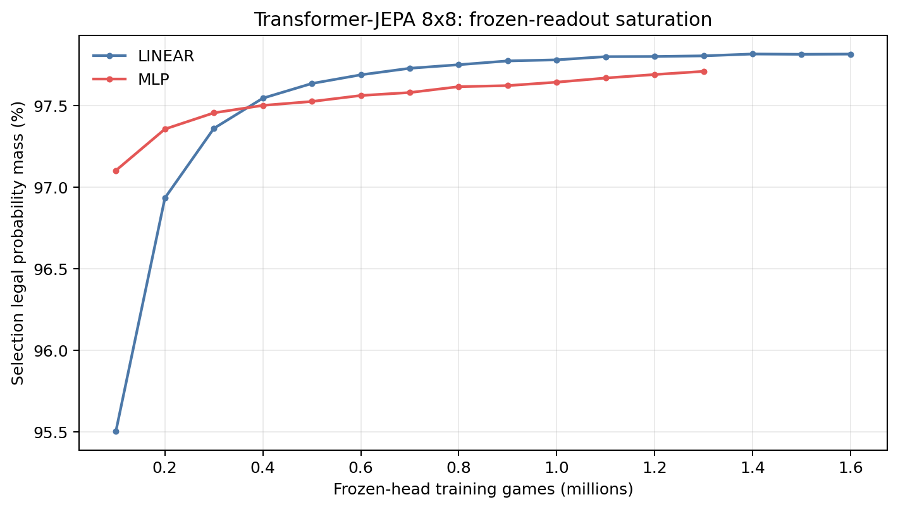
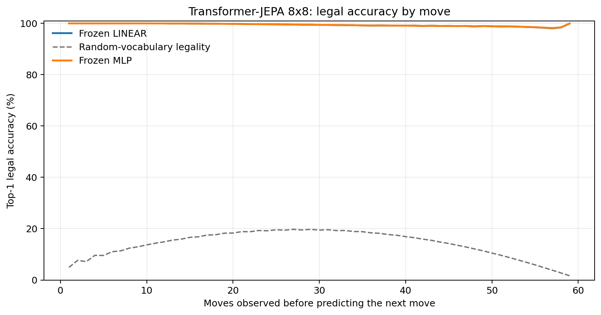
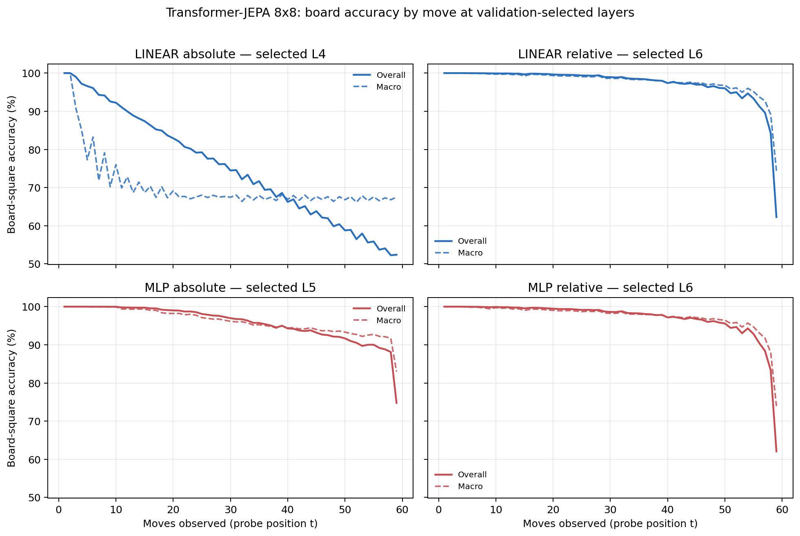

# Proposal evaluation: Transformer-JEPA 8x8

- **Suite:** `thesis_eval_suite_v1` over `unified_eval_v4`
- **Run:** `jepa_v5_infonce_b8_run_001_hd_allpos_bf16`
- **Checkpoint:** `final.pt` (`0c4eda770574ddd8577a7bf7ca0422a659e374232226e8b8ea7359c7d3447001`)
- **Training budget:** `19,999,840` games / `200` shards
- **Next-move readout:** frozen bf16 encoder with common fp32 Linear/MLP readouts
- **Exact continuation:** intentionally excluded because corpus continuations are stochastic legal choices

## 1. Functional legality

| Readout | Top-1 legal | Top-3 legal fraction | Top-5 legal fraction | Legal probability mass |
|---|---:|---:|---:|---:|
| Frozen LINEAR | 99.42% | 96.55% | 92.26% | 97.76% |
| Frozen MLP | 99.42% | 96.53% | 92.23% | 97.58% |

### Statistical context

| Readout | Normalized legal lift | 95% CI for top-1 legal |
|---|---:|---:|
| Frozen LINEAR | 99.32% | 99.40%–99.43% |
| Frozen MLP | 99.32% | 99.40%–99.43% |

### Frozen-head saturation

There is no minimum shard count. Training stops under the pre-registered selection legal-mass patience rule and restores the best checkpoint.

### Legal accuracy by move

### Legality by normalized game phase

| Readout | Phase | Tokens | Mean legal moves | Top-1 legal | Legal mass |
|---|---:|---:|---:|---:|---:|
| Frozen LINEAR | 0.00–0.25 | 749,909 | 7.22 | 99.99% | 98.77% |
| Frozen LINEAR | 0.25–0.50 | 699,679 | 11.44 | 99.71% | 98.34% |
| Frozen LINEAR | 0.50–0.75 | 749,593 | 10.84 | 99.20% | 97.24% |
| Frozen LINEAR | 0.75–1.00 | 749,129 | 5.15 | 98.78% | 96.73% |
| Frozen MLP | 0.00–0.25 | 749,909 | 7.22 | 99.99% | 98.98% |
| Frozen MLP | 0.25–0.50 | 699,679 | 11.44 | 99.70% | 98.28% |
| Frozen MLP | 0.50–0.75 | 749,593 | 10.84 | 99.18% | 96.84% |
| Frozen MLP | 0.75–1.00 | 749,129 | 5.15 | 98.82% | 96.28% |

## 2. Board-state representations

Layer selection uses only the selection split. Headline test values are macro-balanced accuracy, so changing empty-square prevalence across board sizes cannot dominate the comparison.

**Macro accuracy** is the unweighted mean of the three per-class recalls. Absolute labels use empty/black/white and relative labels use empty/mine/opponent. Each class therefore contributes one third even when empty squares are much more common. Overall accuracy instead weights every square equally and can be dominated by the empty class.

| Probe | Labels | Best layer | Normalized depth | Test macro | Overall | Occupied | Empty |
|---|---|---:|---:|---:|---:|---:|---:|
| LINEAR | absolute | L4 | 0.500 | 69.02% | 75.69% | 53.58% | 100.00% |
| LINEAR | relative | L6 | 0.750 | 96.72% | 97.45% | 95.15% | 99.99% |
| MLP | absolute | L5 | 0.625 | 94.83% | 95.94% | 92.25% | 100.00% |
| MLP | relative | L6 | 0.750 | 96.41% | 97.22% | 94.72% | 99.97% |

### Probe accuracy by layer

These are the untouched test-split tables in the same format as the 8x8 unified JEPA notebook. `Selected` marks the layer chosen using the separate selection split, never the test results.

#### LINEAR board-state probe

| Layer | Absolute accuracy | Absolute macro | Relative accuracy | Relative macro | Selected |
|---:|---:|---:|---:|---:|:---|
| L0 | 62.70% | 55.78% | 64.81% | 58.17% |  |
| L1 | 75.09% | 68.39% | 87.25% | 83.74% |  |
| L2 | 75.68% | 69.02% | 91.54% | 89.13% |  |
| L3 | 75.69% | 69.03% | 94.04% | 92.35% |  |
| L4 | 75.69% | 69.02% | 95.99% | 94.85% | absolute |
| L5 | 75.68% | 69.01% | 97.17% | 96.37% |  |
| L6 | 75.55% | 68.85% | 97.45% | 96.72% | relative |
| L7 | 75.21% | 68.50% | 96.97% | 96.16% |  |
| L8 | 75.03% | 68.34% | 96.60% | 95.72% |  |

#### MLP board-state probe

| Layer | Absolute accuracy | Absolute macro | Relative accuracy | Relative macro | Selected |
|---:|---:|---:|---:|---:|:---|
| L0 | 65.12% | 58.78% | 65.24% | 58.63% |  |
| L1 | 84.18% | 80.06% | 86.50% | 82.85% |  |
| L2 | 88.56% | 85.43% | 91.24% | 88.74% |  |
| L3 | 91.73% | 89.47% | 93.82% | 92.07% |  |
| L4 | 94.07% | 92.45% | 95.81% | 94.62% |  |
| L5 | 95.94% | 94.83% | 97.03% | 96.18% | absolute |
| L6 | 94.64% | 93.19% | 97.22% | 96.41% | relative |
| L7 | 92.52% | 90.61% | 96.48% | 95.55% |  |
| L8 | 89.53% | 86.89% | 95.97% | 94.97% |  |

### Board accuracy by move at each selected layer

### Selected board probes by game phase

| Probe | Labels | Phase | Macro accuracy | Occupied | Empty |
|---|---|---:|---:|---:|---:|
| LINEAR | absolute | 1/4 | 97.03% | 96.53% | 100.00% |
| LINEAR | absolute | 2/4 | 81.06% | 73.49% | 100.00% |
| LINEAR | absolute | 11/4 | 67.88% | 51.86% | 100.00% |
| LINEAR | absolute | 12/4 | 67.77% | 51.65% | 100.00% |
| LINEAR | absolute | 13/4 | 68.06% | 52.17% | 100.00% |
| LINEAR | absolute | 14/4 | 67.69% | 51.53% | 100.00% |
| LINEAR | absolute | 15/4 | 67.72% | 51.58% | 100.00% |
| LINEAR | absolute | 16/4 | 67.47% | 51.21% | 100.00% |
| LINEAR | absolute | 3/4 | 75.60% | 64.56% | 100.00% |
| LINEAR | absolute | 4/4 | 72.32% | 58.56% | 100.00% |
| LINEAR | absolute | 5/4 | 70.65% | 56.28% | 100.00% |
| LINEAR | absolute | 6/4 | 69.13% | 53.84% | 100.00% |
| LINEAR | absolute | 7/4 | 68.53% | 53.21% | 100.00% |
| LINEAR | absolute | 8/4 | 68.65% | 53.04% | 100.00% |
| LINEAR | absolute | 9/4 | 68.32% | 52.52% | 100.00% |
| LINEAR | absolute | 10/4 | 67.86% | 51.82% | 100.00% |
| LINEAR | relative | 1/4 | 100.00% | 100.00% | 100.00% |
| LINEAR | relative | 2/4 | 99.94% | 99.92% | 100.00% |
| LINEAR | relative | 11/4 | 97.89% | 96.89% | 99.97% |
| LINEAR | relative | 12/4 | 97.58% | 96.42% | 99.95% |
| LINEAR | relative | 13/4 | 97.20% | 95.85% | 99.99% |
| LINEAR | relative | 14/4 | 96.67% | 95.08% | 99.96% |
| LINEAR | relative | 15/4 | 95.56% | 93.43% | 99.98% |
| LINEAR | relative | 16/4 | 87.46% | 81.26% | 100.00% |
| LINEAR | relative | 3/4 | 99.76% | 99.67% | 100.00% |
| LINEAR | relative | 4/4 | 99.67% | 99.52% | 100.00% |
| LINEAR | relative | 5/4 | 99.53% | 99.30% | 100.00% |
| LINEAR | relative | 6/4 | 99.33% | 99.03% | 99.99% |
| LINEAR | relative | 7/4 | 99.17% | 98.80% | 99.98% |
| LINEAR | relative | 8/4 | 98.96% | 98.48% | 99.99% |
| LINEAR | relative | 9/4 | 98.59% | 97.93% | 99.97% |
| LINEAR | relative | 10/4 | 98.31% | 97.52% | 99.96% |
| MLP | absolute | 1/4 | 100.00% | 100.00% | 100.00% |
| MLP | absolute | 2/4 | 99.98% | 99.97% | 100.00% |
| MLP | absolute | 11/4 | 94.73% | 92.09% | 100.00% |
| MLP | absolute | 12/4 | 94.36% | 91.55% | 100.00% |
| MLP | absolute | 13/4 | 93.86% | 90.79% | 99.99% |
| MLP | absolute | 14/4 | 93.40% | 90.11% | 100.00% |
| MLP | absolute | 15/4 | 92.63% | 88.95% | 99.98% |
| MLP | absolute | 16/4 | 89.76% | 84.66% | 99.96% |
| MLP | absolute | 3/4 | 99.79% | 99.69% | 100.00% |
| MLP | absolute | 4/4 | 99.38% | 99.06% | 100.00% |
| MLP | absolute | 5/4 | 98.99% | 98.48% | 100.00% |
| MLP | absolute | 6/4 | 98.19% | 97.28% | 100.00% |
| MLP | absolute | 7/4 | 97.64% | 96.47% | 100.00% |
| MLP | absolute | 8/4 | 96.75% | 95.13% | 100.00% |
| MLP | absolute | 9/4 | 96.03% | 94.04% | 100.00% |
| MLP | absolute | 10/4 | 95.22% | 92.83% | 100.00% |
| MLP | relative | 1/4 | 100.00% | 100.00% | 100.00% |
| MLP | relative | 2/4 | 99.89% | 99.85% | 100.00% |
| MLP | relative | 11/4 | 97.68% | 96.60% | 99.91% |
| MLP | relative | 12/4 | 97.28% | 96.02% | 99.89% |
| MLP | relative | 13/4 | 96.91% | 95.47% | 99.89% |
| MLP | relative | 14/4 | 96.37% | 94.67% | 99.89% |
| MLP | relative | 15/4 | 95.22% | 93.01% | 99.83% |
| MLP | relative | 16/4 | 86.70% | 80.46% | 99.45% |
| MLP | relative | 3/4 | 99.61% | 99.48% | 100.00% |
| MLP | relative | 4/4 | 99.48% | 99.25% | 99.99% |
| MLP | relative | 5/4 | 99.23% | 98.90% | 99.99% |
| MLP | relative | 6/4 | 99.00% | 98.57% | 99.98% |
| MLP | relative | 7/4 | 98.85% | 98.35% | 99.96% |
| MLP | relative | 8/4 | 98.65% | 98.05% | 99.97% |
| MLP | relative | 9/4 | 98.27% | 97.48% | 99.94% |
| MLP | relative | 10/4 | 98.00% | 97.08% | 99.94% |

## 3. Nanda-style causal intervention

- Readout: `frozen_mlp`
- Selected intervention scale: `4`
- Interpretation scope: JEPA encoder plus post-hoc frozen MLP readout

| Control | Target top-1 legal | Target legal mass | Top-N FP+FN |
|---|---:|---:|---:|
| Null | 90.90% | 88.84% | 2.416 |
| Magnitude-matched random | 92.20% | 88.65% | 2.420 |
| Relative-board direction | 95.40% | 93.30% | 0.598 |

For AR this edits the native prediction path. For JEPA it establishes causal steerability of the composed JEPA encoder plus its post-hoc frozen MLP readout; it is not evidence of a native JEPA action head.

## 4. Architecture-matched random-encoder control

### Frozen next-move readouts

| Readout | Trained top-1 legal | Random top-1 legal | Trained legal mass | Random legal mass |
|---|---:|---:|---:|---:|
| LINEAR | 99.42% | 62.13% | 97.76% | 36.09% |
| MLP | 99.42% | 74.04% | 97.58% | 50.50% |

### Board-state probes

The lift compares independently selection-chosen trained and random layers under the same probe protocol and position manifest.

| Probe | Labels | Trained macro | Random macro | Trained − random |
|---|---|---:|---:|---:|
| LINEAR | absolute | 69.02% | 63.84% | 5.18% |
| LINEAR | relative | 96.72% | 65.87% | 30.85% |
| MLP | absolute | 94.83% | 64.70% | 30.13% |
| MLP | relative | 96.41% | 65.71% | 30.70% |

## 5. Efficiency and reproducibility

- Encoder parameters: `25,312,768`
- Total parameters: `50,888,192`
- Checkpoint bytes: `408,306,487`
- Evaluation GPU: `NVIDIA L4`
- Training hardware: `unreported`
- Training precision: `bf16`
- Python / PyTorch / CUDA: `3.12.13` / `2.11.0+cu128` / `12.8`
- Median training chunk: `24.83 s`
- Estimated training loop: `1.38 h`
- Median games/s: `4027.27`
- Median supervision units/s: `233478.65`
- Timing scope: dt_seconds excludes normal checkpoint/Drive-sync time; validation is included only in observed_train_plus_validation_loop_hours

## 6. Interpretation boundary

- Board probes establish decodability, not by themselves causal use.
- Legal behavior measures rule compatibility, not strategic playing strength.
- Bootstrap legality intervals quantify test-game sampling only; they do not replace independent pretraining seeds.
- Board-probe point estimates use one deterministic probe seed; the random-encoder control is not a substitute for model-seed replication.
- Cross-board results compare separately trained scaling conditions, not zero-shot transfer.

## Artifact index

- Unified JSON: `/content/drive/MyDrive/Master_Thesis_Artifacts/runs/jepa_v5_infonce_b8_run_001_hd_allpos_bf16/thesis_eval/final/results__unified_eval_v4.json`
- Unified summary: `/content/drive/MyDrive/Master_Thesis_Artifacts/runs/jepa_v5_infonce_b8_run_001_hd_allpos_bf16/thesis_eval/final/summary__unified_eval_v4.md`
- Position manifest: `/content/drive/MyDrive/Master_Thesis_Artifacts/runs/jepa_v5_infonce_b8_run_001_hd_allpos_bf16/thesis_eval/final/position_manifest__unified_eval_v4.json`
- Legal-by-move figure: `/content/drive/MyDrive/Master_Thesis_Artifacts/runs/jepa_v5_infonce_b8_run_001_hd_allpos_bf16/thesis_eval/final/legal_accuracy_by_move__thesis_eval_suite_v1.png`
- Board-by-move figure: `/content/drive/MyDrive/Master_Thesis_Artifacts/runs/jepa_v5_infonce_b8_run_001_hd_allpos_bf16/thesis_eval/final/board_accuracy_by_move__thesis_eval_suite_v1.png`
- Random-control JSON: `/content/drive/MyDrive/Master_Thesis_Artifacts/runs/jepa_v5_infonce_b8_run_001_hd_allpos_bf16/thesis_eval/final/random_encoder_control/results__unified_eval_v4.json`
- Causal-intervention JSON: `/content/drive/MyDrive/Master_Thesis_Artifacts/runs/jepa_v5_infonce_b8_run_001_hd_allpos_bf16/thesis_eval/final/results__unified_eval_v4.json` (`causal_intervention` key)
