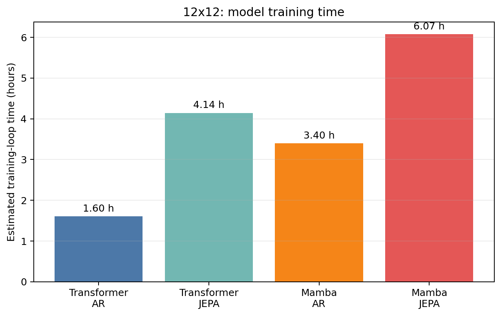

# Thesis 2×2 factorial comparison — 12x12

- **Suite:** `thesis_eval_suite_v1` / `unified_eval_v3`
- **Split:** `0ef44a8ff8095d9eb17b6bd95af4ebac29288521851bdfc9edbfb580bd185e4e`
- **Training precision:** `transformer_ar=bf16`, `transformer_jepa=bf16`, `mamba_ar=bf16`, `mamba_jepa=bf16`

| Metric | Transformer AR | Transformer JEPA | Mamba AR | Mamba JEPA | Architecture effect | Objective effect | Interaction |
|---|---:|---:|---:|---:|---:|---:|---:|
| linear_board_absolute | 67.30% | 67.23% | 66.77% | 67.07% | -0.35% | 0.11% | 0.37% |
| linear_board_relative | 89.17% | 88.48% | 91.37% | 92.86% | 3.29% | 0.40% | 2.18% |
| linear_legal_lift | 99.34% | 98.32% | 99.45% | 98.86% | 0.32% | -0.80% | 0.43% |
| linear_legal_mass | 93.13% | 93.30% | 95.41% | 95.47% | 2.23% | 0.12% | -0.11% |
| linear_legal_top1 | 99.42% | 98.52% | 99.51% | 98.99% | 0.28% | -0.70% | 0.37% |
| mlp_board_absolute | 72.59% | 75.84% | 66.68% | 67.80% | -6.98% | 2.18% | -2.12% |
| mlp_board_relative | 88.01% | 87.40% | 90.06% | 91.85% | 3.25% | 0.59% | 2.39% |
| mlp_legal_lift | 99.34% | 97.44% | 99.45% | 98.02% | 0.34% | -1.66% | 0.47% |
| mlp_legal_mass | 93.13% | 92.78% | 95.41% | 95.55% | 2.53% | -0.10% | 0.50% |
| mlp_legal_top1 | 99.42% | 97.75% | 99.51% | 98.25% | 0.30% | -1.46% | 0.41% |

For legal-move rows, each AR value is its single native-head result; the Linear and MLP rows compare that same AR result against the corresponding frozen JEPA readout.

Interaction is `(Mamba-JEPA − Mamba-AR) − (Transformer-JEPA − Transformer-AR)`. Positive values mean JEPA gains more (or loses less) under Mamba for that metric.

**Comparability gate: PASS.** All four checkpoints report the same training precision.

## Training efficiency

Times use the chunk-level training logs and exclude checkpoint/Drive synchronization unless it was included inside the recorded chunk time.

Machine-readable results: `/content/drive/MyDrive/Master_Thesis_Artifacts/reports/thesis_eval/b12/factorial_2x2_b12.json`
