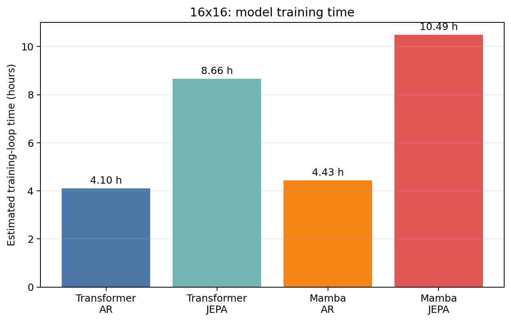

# Thesis 2×2 factorial comparison — 16x16

- **Suite:** `thesis_eval_suite_v1` / `unified_eval_v4`
- **Split:** `20dc4d4e6c57313038b202fb3f6f762a18beae2fe62617601bf77765f68a124e`
- **Training precision:** `transformer_ar=bf16`, `transformer_jepa=bf16`, `mamba_ar=bf16`, `mamba_jepa=bf16`

| Metric | Transformer AR | Transformer JEPA | Mamba AR | Mamba JEPA | Architecture effect | Objective effect | Interaction |
|---|---:|---:|---:|---:|---:|---:|---:|
| linear_board_absolute | 66.81% | 66.26% | 66.58% | 66.18% | -0.15% | -0.47% | 0.14% |
| linear_board_relative | 82.88% | 78.37% | 83.35% | 83.77% | 2.93% | -2.04% | 4.92% |
| linear_legal_lift | 98.87% | 97.26% | 98.94% | 98.23% | 0.52% | -1.16% | 0.91% |
| linear_legal_mass | 88.78% | 87.93% | 90.73% | 90.42% | 2.22% | -0.58% | 0.54% |
| linear_legal_top1 | 98.99% | 97.54% | 99.05% | 98.41% | 0.47% | -1.04% | 0.82% |
| mlp_board_absolute | 67.03% | 65.70% | 66.26% | 65.66% | -0.41% | -0.97% | 0.73% |
| mlp_board_relative | 80.49% | 75.99% | 81.41% | 81.26% | 3.10% | -2.32% | 4.35% |
| mlp_legal_lift | 98.87% | 96.81% | 98.94% | 98.04% | 0.65% | -1.48% | 1.16% |
| mlp_legal_mass | 88.78% | 87.61% | 90.73% | 90.12% | 2.23% | -0.89% | 0.55% |
| mlp_legal_top1 | 98.99% | 97.14% | 99.05% | 98.24% | 0.58% | -1.33% | 1.04% |

For legal-move rows, each AR value is its single native-head result; the Linear and MLP rows compare that same AR result against the corresponding frozen JEPA readout.

Interaction is `(Mamba-JEPA − Mamba-AR) − (Transformer-JEPA − Transformer-AR)`. Positive values mean JEPA gains more (or loses less) under Mamba for that metric.

**Comparability gate: PASS.** All four checkpoints report the same training precision.

## Training efficiency

Times use the chunk-level training logs and exclude checkpoint/Drive synchronization unless it was included inside the recorded chunk time.

Machine-readable results: `/content/drive/MyDrive/Master_Thesis_Artifacts/reports/thesis_eval/b16/factorial_2x2_b16.json`
