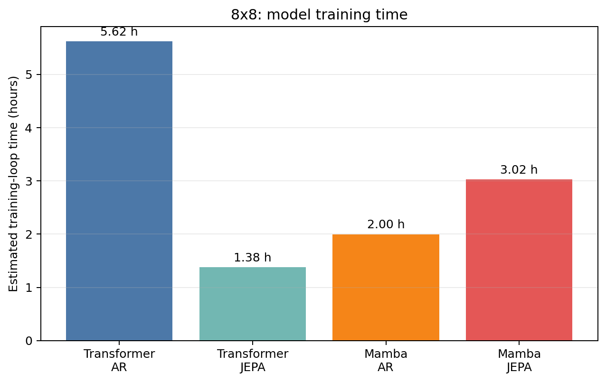

# Thesis 2×2 factorial comparison — 8x8

- **Suite:** `thesis_eval_suite_v1` / `unified_eval_v4`
- **Split:** `9b203eaa68ee72bda13dbeae13566df1869b618995743b21c52397aaf9b5146f`
- **Training precision:** `transformer_ar=unreported`, `transformer_jepa=bf16`, `mamba_ar=fp16`, `mamba_jepa=bf16`

| Metric | Transformer AR | Transformer JEPA | Mamba AR | Mamba JEPA | Architecture effect | Objective effect | Interaction |
|---|---:|---:|---:|---:|---:|---:|---:|
| linear_board_absolute | 68.90% | 69.02% | 68.73% | 68.92% | -0.14% | 0.16% | 0.07% |
| linear_board_relative | 96.83% | 96.72% | 97.94% | 98.04% | 1.21% | -0.00% | 0.20% |
| linear_legal_lift | 99.68% | 99.32% | 99.81% | 99.67% | 0.25% | -0.25% | 0.22% |
| linear_legal_mass | 98.43% | 97.76% | 99.34% | 98.61% | 0.88% | -0.70% | -0.07% |
| linear_legal_top1 | 99.72% | 99.42% | 99.84% | 99.72% | 0.21% | -0.21% | 0.19% |
| mlp_board_absolute | 93.94% | 94.83% | 91.82% | 89.31% | -3.82% | -0.81% | -3.40% |
| mlp_board_relative | 96.52% | 96.41% | 97.74% | 97.82% | 1.31% | -0.02% | 0.18% |
| mlp_legal_lift | 99.68% | 99.32% | 99.81% | 99.67% | 0.24% | -0.25% | 0.21% |
| mlp_legal_mass | 98.43% | 97.58% | 99.34% | 98.90% | 1.12% | -0.64% | 0.40% |
| mlp_legal_top1 | 99.72% | 99.42% | 99.84% | 99.72% | 0.21% | -0.21% | 0.18% |

For legal-move rows, each AR value is its single native-head result; the Linear and MLP rows compare that same AR result against the corresponding frozen JEPA readout.

Interaction is `(Mamba-JEPA − Mamba-AR) − (Transformer-JEPA − Transformer-AR)`. Positive values mean JEPA gains more (or loses less) under Mamba for that metric.

**Comparability gate: WARNING.** Training precision is mixed or unreported. Treat the 2x2 effects as provisional until all four headline checkpoints use the same reported precision.

## Training efficiency

Times use the chunk-level training logs and exclude checkpoint/Drive synchronization unless it was included inside the recorded chunk time.

Machine-readable results: `/content/drive/MyDrive/Master_Thesis_Artifacts/reports/thesis_eval/b8/factorial_2x2_b8.json`
