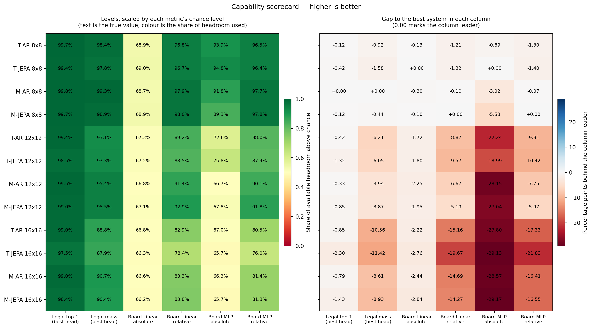
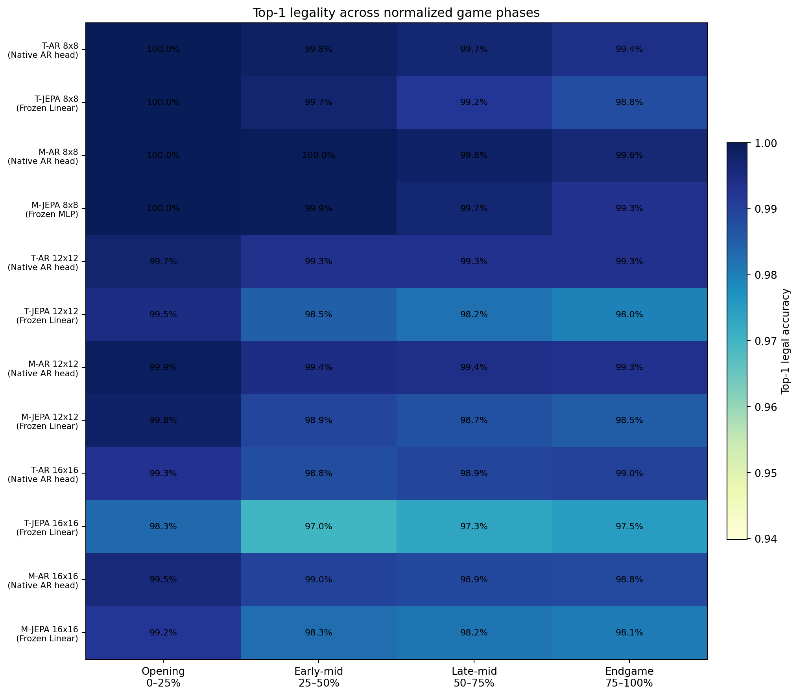
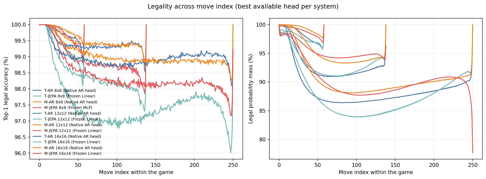
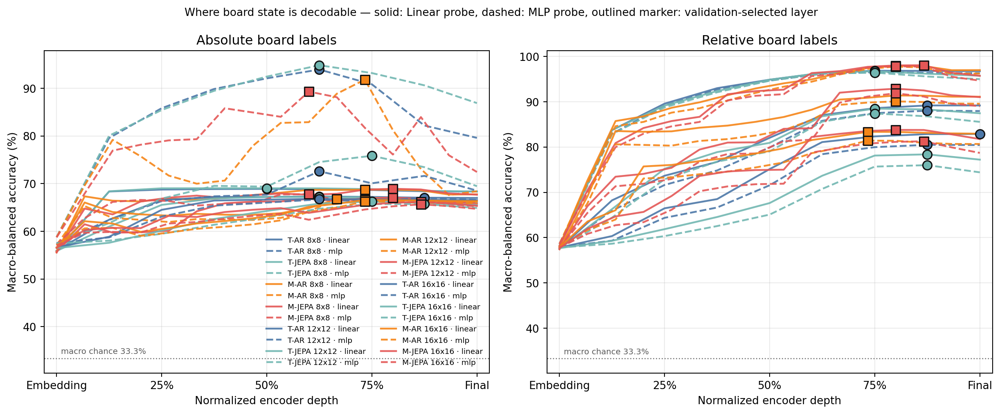
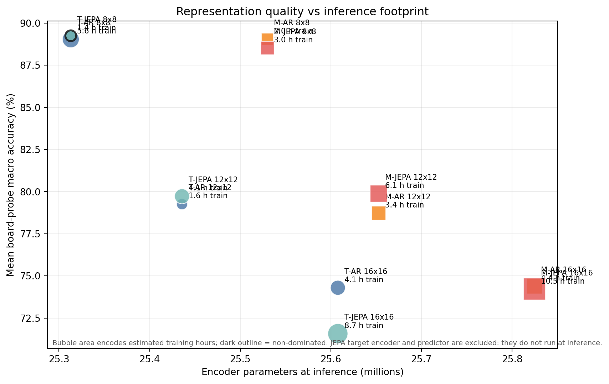
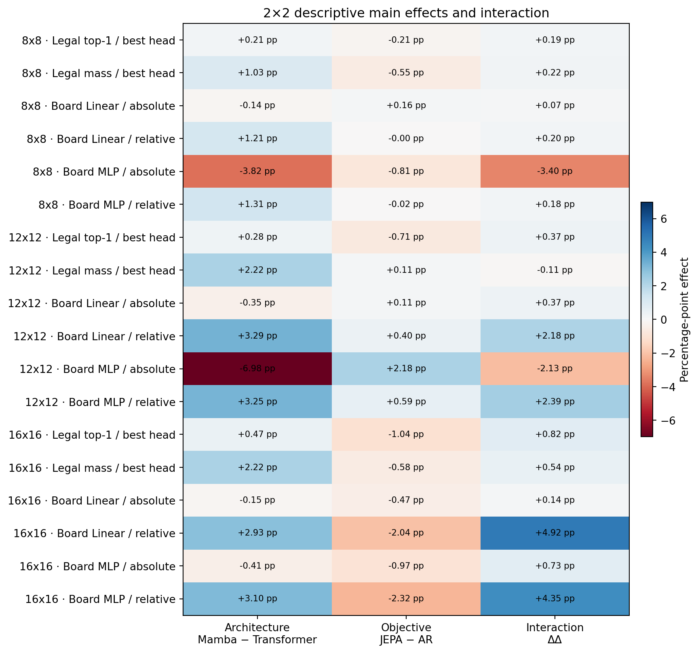
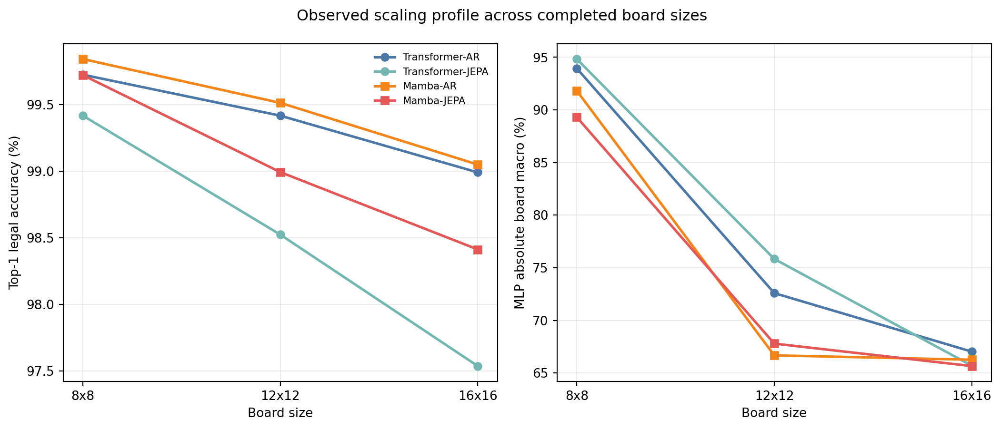

# Thesis Common Evaluation — Comparative Report

- **Selection:** Transformer + Mamba | AR + JEPA | 8x8 + 12x12 + 16x16
- **Mode:** Comparative analysis
- **Coverage:** 12/12 selected canonical cells ready
- **Protocol:** `unified_eval_v4`
- **Report schema:** `thesis_comparison_v2`
- **Generated (UTC):** `2026-08-05T08:02:54+00:00`
- **Legality test set:** 50,000 games, 2,948,310, 6,945,382, 12,540,965 scored positions
- **Encoder depth:** Mamba top layer index 15, Transformer top layer index 8 — compare normalized depth, not raw layer numbers

## Executive view

- **Top-1 legality, best available head** is led by **Mamba-AR 8x8** (99.84%), ahead of Transformer-JEPA 16x16 (97.54%); the 2.30 pp spread is a candidate finding, and the game-level bootstrap intervals do not overlap, so the gap is not test-set sampling noise -- but those intervals say nothing about seed variance, and each cell here has one seed. Head provenance: AR rows use native heads over an encoder trained for this task, and JEPA rows use frozen readouts over an encoder that was not, so this contrast is a system-level capability comparison rather than an encoder-matched one.
- **Legal probability mass, best available head** is led by **Mamba-AR 8x8** (99.34%), ahead of Transformer-JEPA 16x16 (87.93%); the 11.42 pp spread is a candidate finding, and the game-level bootstrap intervals do not overlap, so the gap is not test-set sampling noise -- but those intervals say nothing about seed variance, and each cell here has one seed. Head provenance: AR rows use native heads over an encoder trained for this task, and JEPA rows use frozen readouts over an encoder that was not, so this contrast is a system-level capability comparison rather than an encoder-matched one.
- **Mean board-state macro accuracy** is led by **Transformer-JEPA 8x8** (89.25%), ahead of Transformer-JEPA 16x16 (71.58%); the 17.67 pp spread is a candidate finding.
- Inference footprint is matched by design (25.31M–25.82M encoder parameters, 2.0% spread), so no system wins on size; the real cost difference is training time (Transformer-JEPA 8x8 1.38 h vs Mamba-JEPA 16x16 10.49 h).

## Comparability gates

| Gate | Status | Evidence / interpretation |
| --- | --- | --- |
| Evaluation protocol | PASS | unified_eval_v4 |
| Within-board test split | PASS | One split manifest per represented board size. |
| Training precision covariate | WARNING | 8x8: bf16, fp16, unreported |
| Cross-board interpretation | CAUTION | Board probes use a fixed position budget; legal metrics still reflect different action spaces and game lengths. |
| Next-move head asymmetry | BY DESIGN | AR reports its native head, whose encoder was optimized for exactly this task. JEPA reports a frozen-encoder readout, fitted on an encoder that was never trained for next-move prediction. That difference is the research question, not a confound: it asks what next-move capability each objective delivers. The board probes below are the encoder-matched comparison. |
| Frozen-head selection | PASS | Headline frozen head chosen on validation legal probability mass. The test split was not used to choose a head. Every frozen head stopped early under its patience rule before exhausting its shard allowance, so the readouts are converged rather than budget-limited. |
| Readout training data | NOTE | No readout touched the selection or test split, so no reported number is leaked. Shards consumed (total, of which encoder-pretraining): Mamba-JEPA 12x12/linear 11, 0; Mamba-JEPA 12x12/mlp 13, 0; Mamba-JEPA 16x16/linear 11, 0; Mamba-JEPA 16x16/mlp 13, 0; Mamba-JEPA 8x8/linear 16, 0; Mamba-JEPA 8x8/mlp 30, 10; Transformer-JEPA 12x12/linear 14, 0; Transformer-JEPA 12x12/mlp 10, 0; Transformer-JEPA 16x16/linear 13, 0; Transformer-JEPA 16x16/mlp 14, 0; Transformer-JEPA 8x8/linear 16, 0; Transformer-JEPA 8x8/mlp 13, 0. Readouts differ in how much encoder-pretraining data they saw, because early stopping let them run to different lengths over a shard sequence that continues past the declared downstream split. Training a readout on pretraining data is defensible -- a low-capacity probe measures decodability, not probe generalization -- but the candidates compared on validation did not see identical data, and the written split table should state the sequence the trainer actually follows. |
| Encoder depth | CAUTION | Compared encoders expose different layer counts (top layer index 8, 15). Only normalized depth is comparable across architectures; raw layer numbers are not. |

## Run coverage and provenance

| Cell | Status | Run | Split manifest | Source / reason |
| --- | --- | --- | --- | --- |
| Transformer-AR 8x8 | READY | run_001 | `9b203eaa68ee…` | `runs/run_001/thesis_eval/final/results__unified_eval_v4.json` |
| Transformer-JEPA 8x8 | READY | jepa_v5_infonce_b8_run_001_hd_allpos_bf16 | `9b203eaa68ee…` | `runs/Transformer-JEPA/jepa_v5_infonce_b8_run_001_hd_allpos_bf16/thesis_eval/final/results__unified_eval_v4.json` |
| Mamba-AR 8x8 | READY | mamba_ar_8x8 | `9b203eaa68ee…` | `runs/Mamba-AR/mamba_ar_8x8/thesis_eval/final/results__unified_eval_v4.json` |
| Mamba-JEPA 8x8 | READY | mamba_jepa_v5_hd_infonce_allpos_b8 | `9b203eaa68ee…` | `runs/Mamba-JEPA/mamba_jepa_v5_hd_infonce_allpos_b8/thesis_eval/final/results__unified_eval_v4.json` |
| Transformer-AR 12x12 | READY | transformer_ar_b12 | `0ef44a8ff809…` | `runs/Transformer-AR/transformer_ar_b12/thesis_eval/final/results__unified_eval_v4.json` |
| Transformer-JEPA 12x12 | READY | transformer_jepa_v5_hd_infonce_allpos_b12 | `0ef44a8ff809…` | `runs/Transformer-JEPA/transformer_jepa_v5_hd_infonce_allpos_b12/thesis_eval/final/results__unified_eval_v4.json` |
| Mamba-AR 12x12 | READY | mamba_ar_b12 | `0ef44a8ff809…` | `runs/Mamba-AR/mamba_ar_b12/thesis_eval/final/results__unified_eval_v4.json` |
| Mamba-JEPA 12x12 | READY | mamba_jepa_v5_hd_infonce_allpos_b12 | `0ef44a8ff809…` | `runs/Mamba-JEPA/mamba_jepa_v5_hd_infonce_allpos_b12/thesis_eval/final/results__unified_eval_v4.json` |
| Transformer-AR 16x16 | READY | transformer_ar_b16 | `20dc4d4e6c57…` | `runs/Transformer-AR/transformer_ar_b16/thesis_eval/final/results__unified_eval_v4.json` |
| Transformer-JEPA 16x16 | READY | transformer_jepa_v5_hd_infonce_allpos_b16 | `20dc4d4e6c57…` | `runs/Transformer-JEPA/transformer_jepa_v5_hd_infonce_allpos_b16/thesis_eval/final/results__unified_eval_v4.json` |
| Mamba-AR 16x16 | READY | mamba_ar_b16 | `20dc4d4e6c57…` | `runs/Mamba-AR/mamba_ar_b16/thesis_eval/final/results__unified_eval_v4.json` |
| Mamba-JEPA 16x16 | READY | mamba_jepa_v5_hd_infonce_allpos_b16 | `20dc4d4e6c57…` | `runs/Mamba-JEPA/mamba_jepa_v5_hd_infonce_allpos_b16/thesis_eval/final/results__unified_eval_v4.json` |

## Metric definitions

Every quantity below is computed by the unified evaluator (`othello_research/evaluation/legal_moves.py` and `position_probe.py`). Levels are reported in percent; differences between levels are reported in percentage points (pp).

| Metric | Definition | Chance level | How to read it |
| --- | --- | --- | --- |
| Top-1 legal | Share of scored positions where the `argmax` of the predicted move distribution is a legal move, averaged per token. | ≈ mean legal moves / vocabulary | How often greedy play would propose a rule-consistent move. |
| Legal probability mass | Sum of predicted probability over the legal move set, `Σ p(m) for m legal`, averaged per token. | ≈ mean legal moves / vocabulary | How much of the *whole* distribution respects the rules. High top-1 with low mass means a correct peak over a diffuse tail. |
| Legal precision@k | Mean **fraction of the top-k tokens that are legal**, `\|top-k ∩ legal\| / k`. This is precision@k, **not** "a legal move appears somewhere in the top k". | ≈ mean legal moves / vocabulary | Decreases monotonically with k by construction; a small drop means legality persists deeper into the ranking. |
| Normalized lift | `(top1 − baseline) / (1 − baseline)`. | 0 | Share of the available headroom above chance that was captured. |
| Random legal baseline | `mean(#legal moves / vocab_size)` over scored positions. | — | The chance level for every legality metric on this board size. |
| Board macro-balanced accuracy | Unweighted mean of the three per-class recalls, `(recall_empty + recall_class1 + recall_class2) / 3`, on the untouched test split at the validation-selected layer. | 33.3% | Prevents the far more frequent `empty` class from dominating. The majority-class baseline is reported beside it. |
| Absolute vs relative labels | Absolute = black / white / empty. Relative = mine / theirs / empty, from the side to move. | 33.3% | A large relative-over-absolute gap means the encoder represents relative ownership rather than absolute colour. |
| Selected layer / normalized depth | The layer with the best validation score; depth is `layer / n_layers`. | — | **Only normalized depth is comparable across architectures** — the compared encoders do not expose the same number of layers. |
| 95% CI | Game-level bootstrap over per-game means (1000 resamples, fixed seed). | — | Covers test-set sampling noise **only**. It does not cover training-seed variance; each cell here has one seed. |
| Encoder vs total parameters | Encoder = what runs at inference. Total additionally counts the JEPA EMA target encoder and predictor, which exist only during training. | — | Use encoder parameters for any footprint or efficiency claim. |
| Next-move head | AR reports its native language-model head. JEPA reports a frozen-encoder readout (Linear or MLP) trained under the common protocol with early stopping, with the headline row chosen on validation. | — | A system-level capability comparison: what next-move ability each objective ultimately delivers. |

## Next-move head selection

AR has one head: the native action head it was pretrained with. JEPA has two frozen-encoder readouts, each trained with early stopping and a shard allowance it did not exhaust, and the headline row is whichever scored higher on the validation selection metric recorded during head training. The test split is never used to choose a head. `Best / completed shards` reports where each head was checkpointed and how far it ran before early stopping.

| Run | Head kind | Headline head | Validation selection score | Best / completed shards | Selected on |
| --- | --- | --- | --- | --- | --- |
| Transformer-AR 8x8 | native | Native AR head | — | — | single native head; nothing to select |
| Transformer-JEPA 8x8 | frozen | Frozen Linear | linear=97.80%, mlp=97.62% | linear=11/16, mlp=8/13 | validation legal probability mass |
| Mamba-AR 8x8 | native | Native AR head | — | — | single native head; nothing to select |
| Mamba-JEPA 8x8 | frozen | Frozen MLP | linear=98.62%, mlp=98.91% | linear=11/16, mlp=25/30 | validation legal probability mass |
| Transformer-AR 12x12 | native | Native AR head | — | — | single native head; nothing to select |
| Transformer-JEPA 12x12 | frozen | Frozen Linear | linear=93.31%, mlp=92.96% | linear=9/14, mlp=5/10 | validation legal probability mass |
| Mamba-AR 12x12 | native | Native AR head | — | — | single native head; nothing to select |
| Mamba-JEPA 12x12 | frozen | Frozen Linear | linear=95.50%, mlp=95.21% | linear=6/11, mlp=8/13 | validation legal probability mass |
| Transformer-AR 16x16 | native | Native AR head | — | — | single native head; nothing to select |
| Transformer-JEPA 16x16 | frozen | Frozen Linear | linear=87.88%, mlp=87.57% | linear=8/13, mlp=9/14 | validation legal probability mass |
| Mamba-AR 16x16 | native | Native AR head | — | — | single native head; nothing to select |
| Mamba-JEPA 16x16 | frozen | Frozen Linear | linear=90.39%, mlp=90.10% | linear=6/11, mlp=8/13 | validation legal probability mass |

## Legal-move compatibility

Every available head is listed; ★ marks the headline row used by the figures and the factorial decomposition. `Prec@k` is the mean fraction of the top-k tokens that are legal, so it decreases with k by construction. The confidence interval is a game-level bootstrap over test games and does not represent model-seed uncertainty.

| Run | Head | Top-1 legal | 95% CI | Legal mass | Random baseline | Normalized lift | Prec@3 | Prec@5 |
| --- | --- | ---: | --- | ---: | ---: | ---: | ---: | ---: |
| Transformer-AR 8x8 | Native AR head ★ | 99.72% | [99.71%, 99.73%] | 98.43% | 14.13% | 99.68% | 96.78% | 92.44% |
| Transformer-JEPA 8x8 | Frozen Linear ★ | 99.42% | [99.40%, 99.43%] | 97.76% | 14.13% | 99.32% | 96.55% | 92.26% |
| Transformer-JEPA 8x8 | Frozen MLP | 99.42% | [99.40%, 99.43%] | 97.58% | 14.13% | 99.32% | 96.53% | 92.23% |
| Mamba-AR 8x8 | Native AR head ★ | 99.84% | [99.83%, 99.85%] | 99.34% | 14.13% | 99.81% | 96.90% | 92.57% |
| Mamba-JEPA 8x8 | Frozen Linear | 99.72% | [99.71%, 99.73%] | 98.61% | 14.13% | 99.67% | 96.81% | 92.50% |
| Mamba-JEPA 8x8 | Frozen MLP ★ | 99.72% | [99.71%, 99.73%] | 98.90% | 14.13% | 99.67% | 96.80% | 92.49% |
| Transformer-AR 12x12 | Native AR head ★ | 99.42% | [99.41%, 99.42%] | 93.13% | 11.86% | 99.34% | 98.12% | 96.34% |
| Transformer-JEPA 12x12 | Frozen Linear ★ | 98.52% | [98.51%, 98.54%] | 93.30% | 11.86% | 98.32% | 97.27% | 95.54% |
| Transformer-JEPA 12x12 | Frozen MLP | 98.38% | [98.37%, 98.40%] | 92.94% | 11.86% | 98.17% | 97.12% | 95.38% |
| Mamba-AR 12x12 | Native AR head ★ | 99.51% | [99.50%, 99.52%] | 95.41% | 11.86% | 99.45% | 98.27% | 96.53% |
| Mamba-JEPA 12x12 | Frozen Linear ★ | 98.99% | [98.98%, 99.00%] | 95.47% | 11.86% | 98.86% | 97.81% | 96.13% |
| Mamba-JEPA 12x12 | Frozen MLP | 98.89% | [98.87%, 98.90%] | 95.17% | 11.86% | 98.74% | 97.71% | 96.03% |
| Transformer-AR 16x16 | Native AR head ★ | 98.99% | [98.98%, 99.00%] | 88.78% | 10.29% | 98.87% | 98.12% | 97.01% |
| Transformer-JEPA 16x16 | Frozen Linear ★ | 97.54% | [97.53%, 97.55%] | 87.93% | 10.29% | 97.26% | 96.49% | 95.30% |
| Transformer-JEPA 16x16 | Frozen MLP | 97.14% | [97.13%, 97.16%] | 87.61% | 10.29% | 96.81% | 96.09% | 94.91% |
| Mamba-AR 16x16 | Native AR head ★ | 99.05% | [99.04%, 99.06%] | 90.73% | 10.29% | 98.94% | 98.24% | 97.17% |
| Mamba-JEPA 16x16 | Frozen Linear ★ | 98.41% | [98.40%, 98.42%] | 90.42% | 10.29% | 98.23% | 97.58% | 96.55% |
| Mamba-JEPA 16x16 | Frozen MLP | 98.24% | [98.23%, 98.26%] | 90.12% | 10.29% | 98.04% | 97.41% | 96.38% |

## Board-state decodability

This is the encoder-matched comparison: an identical frozen-encoder protocol for all four systems. Macro accuracy is the unweighted mean of the three per-class recalls against a 33.3% chance level. Layers were selected on validation; the table reports untouched test results and gives normalized depth beside each raw layer index.

| Run | Probe | Absolute macro | Layer / depth | Relative macro | Layer / depth | Two-mode mean | Majority baseline |
| --- | --- | ---: | --- | ---: | --- | ---: | ---: |
| Transformer-AR 8x8 | LINEAR | 68.90% | L4 / 50% | 96.83% | L6 / 75% | 82.86% | 47.62% |
| Transformer-AR 8x8 | MLP | 93.94% | L5 / 62% | 96.52% | L6 / 75% | 95.23% | 47.62% |
| Transformer-JEPA 8x8 | LINEAR | 69.02% | L4 / 50% | 96.72% | L6 / 75% | 82.87% | 47.62% |
| Transformer-JEPA 8x8 | MLP | 94.83% | L5 / 62% | 96.41% | L6 / 75% | 95.62% | 47.62% |
| Mamba-AR 8x8 | LINEAR | 68.73% | L11 / 73% | 97.94% | L12 / 80% | 83.33% | 47.62% |
| Mamba-AR 8x8 | MLP | 91.82% | L11 / 73% | 97.74% | L12 / 80% | 94.78% | 47.62% |
| Mamba-JEPA 8x8 | LINEAR | 68.92% | L12 / 80% | 98.04% | L13 / 87% | 83.48% | 47.62% |
| Mamba-JEPA 8x8 | MLP | 89.31% | L9 / 60% | 97.82% | L12 / 80% | 93.56% | 47.62% |
| Transformer-AR 12x12 | LINEAR | 67.30% | L5 / 62% | 89.17% | L7 / 88% | 78.24% | 48.94% |
| Transformer-AR 12x12 | MLP | 72.59% | L5 / 62% | 88.01% | L7 / 88% | 80.30% | 48.94% |
| Transformer-JEPA 12x12 | LINEAR | 67.23% | L5 / 62% | 88.48% | L6 / 75% | 77.85% | 48.94% |
| Transformer-JEPA 12x12 | MLP | 75.84% | L6 / 75% | 87.40% | L6 / 75% | 81.62% | 48.94% |
| Mamba-AR 12x12 | LINEAR | 66.77% | L10 / 67% | 91.37% | L12 / 80% | 79.07% | 48.94% |
| Mamba-AR 12x12 | MLP | 66.68% | L11 / 73% | 90.06% | L12 / 80% | 78.37% | 48.94% |
| Mamba-JEPA 12x12 | LINEAR | 67.07% | L12 / 80% | 92.85% | L12 / 80% | 79.96% | 48.94% |
| Mamba-JEPA 12x12 | MLP | 67.79% | L9 / 60% | 91.85% | L12 / 80% | 79.82% | 48.94% |
| Transformer-AR 16x16 | LINEAR | 66.81% | L5 / 62% | 82.88% | L8 / 100% | 74.84% | 49.39% |
| Transformer-AR 16x16 | MLP | 67.03% | L7 / 88% | 80.49% | L7 / 88% | 73.76% | 49.39% |
| Transformer-JEPA 16x16 | LINEAR | 66.26% | L6 / 75% | 78.37% | L7 / 88% | 72.32% | 49.39% |
| Transformer-JEPA 16x16 | MLP | 65.70% | L7 / 88% | 75.99% | L7 / 88% | 70.85% | 49.39% |
| Mamba-AR 16x16 | LINEAR | 66.58% | L11 / 73% | 83.35% | L11 / 73% | 74.97% | 49.39% |
| Mamba-AR 16x16 | MLP | 66.26% | L11 / 73% | 81.41% | L11 / 73% | 73.83% | 49.39% |
| Mamba-JEPA 16x16 | LINEAR | 66.18% | L13 / 87% | 83.77% | L12 / 80% | 74.97% | 49.39% |
| Mamba-JEPA 16x16 | MLP | 65.66% | L13 / 87% | 81.26% | L13 / 87% | 73.46% | 49.39% |

## Efficiency and footprint

Encoder parameters are what run at inference. Total parameters additionally count the JEPA EMA target encoder and predictor, which exist only during training — use the encoder column for any footprint claim.

| Run | Encoder params | Total params | Checkpoint | Train h | Eval h | Median games/s | Train precision |
| --- | ---: | ---: | ---: | ---: | ---: | ---: | --- |
| Transformer-AR 8x8 | 25.31M | 25.31M | 289.9 MiB | 5.62 | 0.41 | 988.7 | unreported |
| Transformer-JEPA 8x8 | 25.31M | 50.89M | 389.4 MiB | 1.38 | 0.97 | 4,027.3 | bf16 |
| Mamba-AR 8x8 | 25.53M | 25.53M | 292.4 MiB | 2.00 | 0.45 | 2,780.9 | fp16 |
| Mamba-JEPA 8x8 | 25.53M | 51.32M | 392.6 MiB | 3.02 | 1.58 | 1,837.0 | bf16 |
| Transformer-AR 12x12 | 25.44M | 25.44M | 291.8 MiB | 1.60 | 1.72 | 3,462.4 | bf16 |
| Transformer-JEPA 12x12 | 25.44M | 51.13M | 391.9 MiB | 4.14 | 4.04 | 1,340.7 | bf16 |
| Mamba-AR 12x12 | 25.65M | 25.65M | 293.8 MiB | 3.40 | 1.77 | 1,634.3 | bf16 |
| Mamba-JEPA 12x12 | 25.65M | 51.57M | 394.2 MiB | 6.07 | 4.36 | 914.6 | bf16 |
| Transformer-AR 16x16 | 25.61M | 25.61M | 295.1 MiB | 4.10 | 5.18 | 1,355.9 | bf16 |
| Transformer-JEPA 16x16 | 25.61M | 51.48M | 396.8 MiB | 8.66 | 12.13 | 641.8 | bf16 |
| Mamba-AR 16x16 | 25.82M | 25.82M | 295.7 MiB | 4.43 | 5.22 | 1,253.7 | bf16 |
| Mamba-JEPA 16x16 | 25.82M | 51.91M | 396.3 MiB | 10.49 | 12.06 | 529.9 | bf16 |

## 2×2 factorial decomposition

Effects are descriptive percentage-point contrasts. Architecture is `Mamba − Transformer`; objective is `JEPA − AR`; interaction is `(Mamba-JEPA − Mamba-AR) − (Transformer-JEPA − Transformer-AR)`.

### 8x8

| Metric | Architecture effect | Objective effect | Interaction |
| --- | ---: | ---: | ---: |
| Legal top-1 / best head | +0.21 pp | -0.21 pp | +0.19 pp |
| Legal mass / best head | +1.03 pp | -0.55 pp | +0.22 pp |
| Board Linear / absolute | -0.14 pp | +0.16 pp | +0.07 pp |
| Board Linear / relative | +1.21 pp | -0.00 pp | +0.20 pp |
| Board MLP / absolute | -3.82 pp | -0.81 pp | -3.40 pp |
| Board MLP / relative | +1.31 pp | -0.02 pp | +0.18 pp |

### 12x12

| Metric | Architecture effect | Objective effect | Interaction |
| --- | ---: | ---: | ---: |
| Legal top-1 / best head | +0.28 pp | -0.71 pp | +0.37 pp |
| Legal mass / best head | +2.22 pp | +0.11 pp | -0.11 pp |
| Board Linear / absolute | -0.35 pp | +0.11 pp | +0.37 pp |
| Board Linear / relative | +3.29 pp | +0.40 pp | +2.18 pp |
| Board MLP / absolute | -6.98 pp | +2.18 pp | -2.13 pp |
| Board MLP / relative | +3.25 pp | +0.59 pp | +2.39 pp |

### 16x16

| Metric | Architecture effect | Objective effect | Interaction |
| --- | ---: | ---: | ---: |
| Legal top-1 / best head | +0.47 pp | -1.04 pp | +0.82 pp |
| Legal mass / best head | +2.22 pp | -0.58 pp | +0.54 pp |
| Board Linear / absolute | -0.15 pp | -0.47 pp | +0.14 pp |
| Board Linear / relative | +2.93 pp | -2.04 pp | +4.92 pp |
| Board MLP / absolute | -0.41 pp | -0.97 pp | +0.73 pp |
| Board MLP / relative | +3.10 pp | -2.32 pp | +4.35 pp |

## Visual analysis

### Capability scorecard

**What it shows.** The left panel scales each metric by its own chance level so the legal and board families are not judged against one arbitrary floor; the right panel shows the gap to the column leader in percentage points.

**What the data says.**

- Legality is close to saturated: every loaded system sits far above the 12.09% random baseline, and the whole field spans 2.30 pp on top-1, which is a candidate finding. On this axis the panel is better read as a check that all systems learned the rules than as a ranking (Mamba-AR 8x8 leads).
- Board decodability spans 17.67 pp between Transformer-JEPA 8x8 and Transformer-JEPA 16x16, against a 33.3% macro chance level — a wider spread than legality, so this is the axis that actually separates the systems. The right-hand panel is where these differences become visible; on the left every cell already sits high in its headroom range.
- Relative labels are decoded +22.50 pp more accurately than absolute ones on average across the loaded cells, which points at representations of "whose piece is this" rather than of absolute colour.

### Game-phase robustness

**What it shows.** Top-1 legality across normalized game phases, using the bin edges recorded in each result rather than assumed quartiles.

**What the data says.**

- From the opening bin to the endgame bin, top-1 legality moves by -1.49 pp for **Transformer-JEPA 12x12** and -0.27 pp for **Transformer-AR 16x16**. Phase bins are normalized, so this compares game stages rather than absolute move numbers.
- The systems differ most in phase bin 2 (2.97 pp between best and worst), so any overall legality gap is concentrated there rather than spread evenly across the game.
- Rows use each system's best available head, so this panel inherits the same provenance note: AR rows use native heads over an encoder trained for this task, and JEPA rows use frozen readouts over an encoder that was not, so this contrast is a system-level capability comparison rather than an encoder-matched one.

### Legality by move index

**What it shows.** The same quantity at full move resolution, which shows where inside a game legality is actually lost.

**What the data says.**

- **Transformer-AR 8x8** is weakest around move 57 (98.73% top-1 legal).
- **Transformer-JEPA 8x8** is weakest around move 56 (98.08% top-1 legal).
- **Mamba-AR 8x8** is weakest around move 57 (99.36% top-1 legal).
- **Mamba-JEPA 8x8** is weakest around move 57 (98.92% top-1 legal).
- **Transformer-AR 12x12** is weakest around move 136 (98.54% top-1 legal).
- **Transformer-JEPA 12x12** is weakest around move 136 (97.31% top-1 legal).
- **Mamba-AR 12x12** is weakest around move 137 (98.70% top-1 legal).
- **Mamba-JEPA 12x12** is weakest around move 136 (97.85% top-1 legal).
- **Transformer-AR 16x16** is weakest around move 249 (98.08% top-1 legal).
- **Transformer-JEPA 16x16** is weakest around move 247 (96.01% top-1 legal).
- **Mamba-AR 16x16** is weakest around move 249 (98.25% top-1 legal).
- **Mamba-JEPA 16x16** is weakest around move 247 (97.16% top-1 legal).
- The opening and the forced endgame are easier because the legal set is small there; move-index resolution shows whether a legality gap is a broad difference or a localized failure the phase bins average away.

### Board decodability by depth

**What it shows.** Layerwise macro accuracy against normalized encoder depth, with the validation-selected layer marked. Normalized depth is the only depth axis comparable across architectures.

**What the data says.**

- Averaged over the four probe/label combinations, the validation-selected layer sits at normalized depth 66% for **Transformer-AR 8x8** — the shallowest — and 85% for **Mamba-JEPA 16x16** — the deepest. Raw layer indices are not comparable here, since the encoders expose different layer counts, which is why the x-axis is normalized.
- The non-linear probe buys the most in **Transformer-JEPA 8x8** (+12.75 pp over Linear) and the least in **Mamba-JEPA 16x16** (-1.51 pp). A large MLP gain means the board information is present but not linearly separable, which is a weaker claim than linear decodability.
- For relative board decodability, on 8x8 the architecture contrast (+1.21 pp) outweighs the objective contrast (-0.00 pp); on 12x12 the architecture contrast (+3.29 pp) outweighs the objective contrast (+0.40 pp).
- For relative board decodability, the +2.18 pp interaction on 12x12 is driven by **Mamba-JEPA 12x12**, the cell furthest from the four-cell mean (92.85% vs 90.47%).
- For absolute board decodability under the MLP probe, on 8x8 the architecture contrast (-3.82 pp) outweighs the objective contrast (-0.81 pp); on 12x12 the architecture contrast (-6.98 pp) outweighs the objective contrast (+2.18 pp); on 16x16 the objective contrast (-0.97 pp) outweighs the architecture contrast (-0.41 pp).
- For absolute board decodability under the MLP probe, the -3.40 pp interaction on 8x8 is driven by **Mamba-JEPA 8x8**, the cell furthest from the four-cell mean (89.31% vs 92.47%).

### Quality–footprint frontier

**What it shows.** Board decodability against inference-time encoder parameters, with training hours encoded as bubble area.

**What the data says.**

- The encoders span 25.31M–25.82M inference parameters, a 2.0% spread: footprint is matched by design, so the horizontal axis carries almost no signal and the frontier is effectively a ranking on the vertical axis.
- Training cost is where the conditions actually differ: **Mamba-JEPA 16x16** took 10.49 h against **Transformer-JEPA 8x8** at 1.38 h, a 7.6x span at equal inference size. Bubble area encodes this.

### Factorial effects

**What it shows.** Diverging effect cells expose architecture, objective, and interaction patterns instead of hiding them in one ranking.

**What the data says.**

- On 8x8, averaged over the four board-probe metrics, moving from Transformer to Mamba is worth -0.36 pp and moving from AR to JEPA is worth -0.17 pp. Those four share a scale and a chance level; the legality rows do not and are quoted separately rather than averaged in.
- The largest single effect on 8x8 appears in **Board MLP / absolute** (architecture -3.82 pp, objective -0.81 pp, interaction -3.40 pp).
- The legality rows contrast a native AR head against a frozen JEPA readout. That is the intended system-level question, but it means the objective effect there is not a statement about how much move information the JEPA encoder holds. The board rows are the encoder-matched contrast.
- On 12x12, averaged over the four board-probe metrics, moving from Transformer to Mamba is worth -0.20 pp and moving from AR to JEPA is worth +0.82 pp. Those four share a scale and a chance level; the legality rows do not and are quoted separately rather than averaged in.
- The largest single effect on 12x12 appears in **Board MLP / absolute** (architecture -6.98 pp, objective +2.18 pp, interaction -2.13 pp).
- The legality rows contrast a native AR head against a frozen JEPA readout. That is the intended system-level question, but it means the objective effect there is not a statement about how much move information the JEPA encoder holds. The board rows are the encoder-matched contrast.
- On 16x16, averaged over the four board-probe metrics, moving from Transformer to Mamba is worth +1.37 pp and moving from AR to JEPA is worth -1.45 pp. Those four share a scale and a chance level; the legality rows do not and are quoted separately rather than averaged in.
- The largest single effect on 16x16 appears in **Board Linear / relative** (architecture +2.93 pp, objective -2.04 pp, interaction +4.92 pp).
- The legality rows contrast a native AR head against a frozen JEPA readout. That is the intended system-level question, but it means the objective effect there is not a statement about how much move information the JEPA encoder holds. The board rows are the encoder-matched contrast.
- All three columns are descriptive point estimates from one seed per cell. They order the conditions; they do not establish that the ordering would survive re-training.

### Scaling profile

**What it shows.** Completed cells across board sizes are connected as observed scaling trajectories; missing cells are not imputed.

**What the data says.**

- Trajectories connect separately trained runs at 8x8, 12x12, 16x16. Larger boards have larger action spaces and longer games, so the legality panel is not a fixed-difficulty comparison; the board panel uses a fixed position budget and is the more comparable of the two.

## Interpretation boundaries

- Legal compatibility measures rule-consistent action proposals, not strategic playing strength.
- The next-move comparison is system-level: AR uses a head over an encoder trained for exactly this task, JEPA a frozen readout over an encoder that was not. That is the question being asked, but it means the legality contrast is not a statement about representation content.
- Board probes are the encoder-matched comparison, but they measure decodability; they do not by themselves establish causal use of the decoded representation.
- Rankings and factorial effects are descriptive point estimates from the available runs. Independent training seeds are required for inferential architecture/objective claims.
- Cross-board comparisons describe scaling across separately trained conditions; they are not zero-shot transfer or equal-action-space tests.
- Missing cells are reported as pending and are never filled, interpolated, or borrowed from legacy protocols.

## Reproduction

- Artifact root: `/content/drive/MyDrive/Master_Thesis_Artifacts`
- Registry-driven selection: `both_architectures__both_objectives__all_boards`
- Markdown report: `/content/drive/MyDrive/Master_Thesis_Artifacts/reports/thesis_eval/comparisons_v2/unified_eval_v4/both_architectures__both_objectives__all_boards/comparison_report.md`
- CSV export: `/content/drive/MyDrive/Master_Thesis_Artifacts/reports/thesis_eval/comparisons_v2/unified_eval_v4/both_architectures__both_objectives__all_boards/metrics.csv`
- LATEX export: `/content/drive/MyDrive/Master_Thesis_Artifacts/reports/thesis_eval/comparisons_v2/unified_eval_v4/both_architectures__both_objectives__all_boards/tables.tex`
