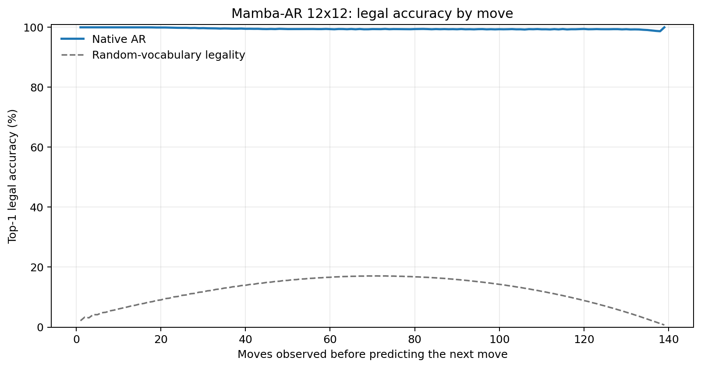
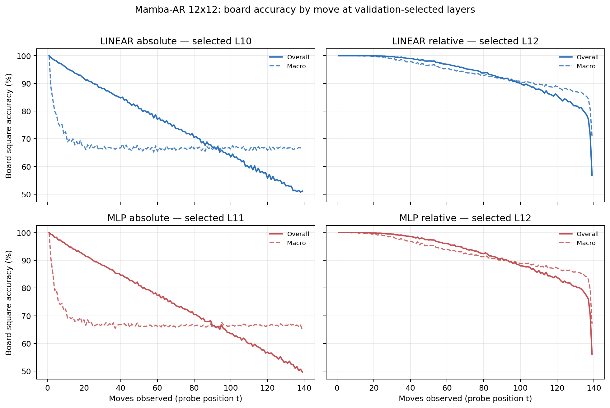

# Proposal evaluation: Mamba-AR 12x12

- **Suite:** `thesis_eval_suite_v1` over `unified_eval_v3`
- **Run:** `mamba_ar_b12`
- **Checkpoint:** `final.pt` (`3acd7992e6f7777a8c49d3c3acdcb331175731b3ffd0b60a711ce462618965f7`)
- **Training budget:** `20,000,000` games / `200` shards
- **Next-move readout:** native pretrained AR head
- **Exact continuation:** intentionally excluded because corpus continuations are stochastic legal choices

## 1. Functional legality

| Readout | Top-1 legal | Top-3 legal fraction | Top-5 legal fraction | Legal probability mass |
|---|---:|---:|---:|---:|
| Native AR | 99.51% | 98.27% | 96.53% | 95.41% |

### Statistical context

| Readout | Normalized legal lift | 95% CI for top-1 legal |
|---|---:|---:|
| Native AR | 99.45% | 99.50%–99.52% |

### Legal accuracy by move

### Legality by normalized game phase

| Readout | Phase | Tokens | Mean legal moves | Top-1 legal | Legal mass |
|---|---:|---:|---:|---:|---:|
| Native AR | 0.00–0.25 | 1,749,230 | 11.70 | 99.89% | 99.22% |
| Native AR | 0.25–0.50 | 1,698,776 | 22.05 | 99.45% | 94.84% |
| Native AR | 0.50–0.75 | 1,748,740 | 22.37 | 99.39% | 93.39% |
| Native AR | 0.75–1.00 | 1,748,636 | 10.89 | 99.32% | 94.17% |

## 2. Board-state representations

Layer selection uses only the selection split. Headline test values are macro-balanced accuracy, so changing empty-square prevalence across board sizes cannot dominate the comparison.

**Macro accuracy** is the unweighted mean of the three per-class recalls. Absolute labels use empty/black/white and relative labels use empty/mine/opponent. Each class therefore contributes one third even when empty squares are much more common. Overall accuracy instead weights every square equally and can be dominated by the empty class.

| Probe | Labels | Best layer | Normalized depth | Test macro | Overall | Occupied | Empty |
|---|---|---:|---:|---:|---:|---:|---:|
| LINEAR | absolute | L10 | 0.667 | 66.77% | 74.55% | 50.16% | 100.00% |
| LINEAR | relative | L12 | 0.800 | 91.37% | 93.41% | 87.13% | 99.97% |
| MLP | absolute | L11 | 0.733 | 66.68% | 74.48% | 50.03% | 99.98% |
| MLP | relative | L12 | 0.800 | 90.06% | 92.42% | 85.26% | 99.90% |

### Probe accuracy by layer

These are the untouched test-split tables in the same format as the 8x8 unified JEPA notebook. `Selected` marks the layer chosen using the separate selection split, never the test results.

#### LINEAR board-state probe

| Layer | Absolute accuracy | Absolute macro | Relative accuracy | Relative macro | Selected |
|---:|---:|---:|---:|---:|:---|
| L0 | 63.70% | 55.80% | 65.02% | 57.46% |  |
| L1 | 73.78% | 66.04% | 76.21% | 69.13% |  |
| L2 | 71.90% | 64.04% | 86.89% | 83.52% |  |
| L3 | 71.46% | 63.55% | 86.68% | 83.36% |  |
| L4 | 71.20% | 63.28% | 86.70% | 83.45% |  |
| L5 | 71.58% | 63.67% | 87.40% | 84.26% |  |
| L6 | 71.42% | 63.48% | 87.74% | 84.72% |  |
| L7 | 71.40% | 63.46% | 88.38% | 85.55% |  |
| L8 | 71.74% | 63.80% | 89.27% | 86.62% |  |
| L9 | 72.74% | 64.86% | 90.68% | 88.23% |  |
| L10 | 74.55% | 66.77% | 92.72% | 90.46% | absolute |
| L11 | 74.53% | 66.74% | 93.03% | 90.87% |  |
| L12 | 74.47% | 66.67% | 93.41% | 91.37% | relative |
| L13 | 74.44% | 66.63% | 93.38% | 91.32% |  |
| L14 | 74.28% | 66.43% | 93.20% | 91.11% |  |
| L15 | 74.26% | 66.40% | 93.19% | 91.09% |  |

#### MLP board-state probe

| Layer | Absolute accuracy | Absolute macro | Relative accuracy | Relative macro | Selected |
|---:|---:|---:|---:|---:|:---|
| L0 | 64.79% | 57.14% | 65.31% | 57.74% |  |
| L1 | 73.03% | 65.29% | 74.91% | 67.60% |  |
| L2 | 70.69% | 62.80% | 84.15% | 80.59% |  |
| L3 | 70.30% | 62.41% | 83.90% | 80.46% |  |
| L4 | 69.86% | 61.95% | 83.71% | 80.30% |  |
| L5 | 70.50% | 62.57% | 84.68% | 81.34% |  |
| L6 | 70.43% | 62.48% | 84.99% | 81.74% |  |
| L7 | 70.34% | 62.37% | 85.59% | 82.53% |  |
| L8 | 70.76% | 62.82% | 86.56% | 83.69% |  |
| L9 | 72.10% | 64.21% | 88.67% | 85.98% |  |
| L10 | 74.49% | 66.69% | 91.82% | 89.30% |  |
| L11 | 74.48% | 66.68% | 92.22% | 89.80% | absolute |
| L12 | 74.39% | 66.57% | 92.42% | 90.06% | relative |
| L13 | 74.30% | 66.45% | 92.31% | 89.92% |  |
| L14 | 74.08% | 66.18% | 92.06% | 89.59% |  |
| L15 | 74.05% | 66.14% | 92.01% | 89.54% |  |

### Board accuracy by move at each selected layer

### Selected board probes by game phase

| Probe | Labels | Phase | Macro accuracy | Occupied | Empty |
|---|---|---:|---:|---:|---:|
| LINEAR | absolute | 1/4 | 79.73% | 70.51% | 100.00% |
| LINEAR | absolute | 2/4 | 69.58% | 54.67% | 100.00% |
| LINEAR | absolute | 11/4 | 66.64% | 49.97% | 99.99% |
| LINEAR | absolute | 12/4 | 66.81% | 50.22% | 99.99% |
| LINEAR | absolute | 13/4 | 66.46% | 49.69% | 99.98% |
| LINEAR | absolute | 14/4 | 66.70% | 50.06% | 99.99% |
| LINEAR | absolute | 15/4 | 66.59% | 49.90% | 99.97% |
| LINEAR | absolute | 16/4 | 66.65% | 50.01% | 99.96% |
| LINEAR | absolute | 3/4 | 67.37% | 51.07% | 100.00% |
| LINEAR | absolute | 4/4 | 66.80% | 50.21% | 100.00% |
| LINEAR | absolute | 5/4 | 66.93% | 50.40% | 100.00% |
| LINEAR | absolute | 6/4 | 66.41% | 49.62% | 100.00% |
| LINEAR | absolute | 7/4 | 66.41% | 49.61% | 100.00% |
| LINEAR | absolute | 8/4 | 66.56% | 49.84% | 100.00% |
| LINEAR | absolute | 9/4 | 66.45% | 49.68% | 100.00% |
| LINEAR | absolute | 10/4 | 66.49% | 49.74% | 99.99% |
| LINEAR | relative | 1/4 | 100.00% | 100.00% | 100.00% |
| LINEAR | relative | 2/4 | 99.95% | 99.93% | 100.00% |
| LINEAR | relative | 11/4 | 91.69% | 87.63% | 99.93% |
| LINEAR | relative | 12/4 | 90.75% | 86.23% | 99.88% |
| LINEAR | relative | 13/4 | 89.85% | 84.90% | 99.86% |
| LINEAR | relative | 14/4 | 88.84% | 83.39% | 99.86% |
| LINEAR | relative | 15/4 | 87.63% | 81.57% | 99.82% |
| LINEAR | relative | 16/4 | 83.83% | 75.83% | 99.90% |
| LINEAR | relative | 3/4 | 99.64% | 99.48% | 100.00% |
| LINEAR | relative | 4/4 | 98.82% | 98.28% | 100.00% |
| LINEAR | relative | 5/4 | 97.81% | 96.78% | 99.99% |
| LINEAR | relative | 6/4 | 96.77% | 95.23% | 99.99% |
| LINEAR | relative | 7/4 | 95.73% | 93.70% | 99.97% |
| LINEAR | relative | 8/4 | 94.64% | 92.04% | 99.97% |
| LINEAR | relative | 9/4 | 93.61% | 90.49% | 99.95% |
| LINEAR | relative | 10/4 | 92.65% | 89.07% | 99.94% |
| MLP | absolute | 1/4 | 79.30% | 71.17% | 100.00% |
| MLP | absolute | 2/4 | 69.51% | 54.95% | 100.00% |
| MLP | absolute | 11/4 | 66.34% | 49.55% | 99.95% |
| MLP | absolute | 12/4 | 66.46% | 49.72% | 99.90% |
| MLP | absolute | 13/4 | 66.44% | 49.72% | 99.87% |
| MLP | absolute | 14/4 | 66.55% | 49.90% | 99.86% |
| MLP | absolute | 15/4 | 66.58% | 49.96% | 99.82% |
| MLP | absolute | 16/4 | 66.56% | 49.90% | 99.84% |
| MLP | absolute | 3/4 | 67.47% | 51.29% | 100.00% |
| MLP | absolute | 4/4 | 66.95% | 50.53% | 100.00% |
| MLP | absolute | 5/4 | 66.71% | 50.13% | 100.00% |
| MLP | absolute | 6/4 | 66.50% | 49.69% | 100.00% |
| MLP | absolute | 7/4 | 66.32% | 49.44% | 100.00% |
| MLP | absolute | 8/4 | 66.37% | 49.57% | 99.99% |
| MLP | absolute | 9/4 | 66.36% | 49.51% | 99.98% |
| MLP | absolute | 10/4 | 66.39% | 49.58% | 99.96% |
| MLP | relative | 1/4 | 99.97% | 99.96% | 100.00% |
| MLP | relative | 2/4 | 99.83% | 99.77% | 100.00% |
| MLP | relative | 11/4 | 90.05% | 85.31% | 99.72% |
| MLP | relative | 12/4 | 89.04% | 83.85% | 99.58% |
| MLP | relative | 13/4 | 88.18% | 82.63% | 99.47% |
| MLP | relative | 14/4 | 87.33% | 81.40% | 99.37% |
| MLP | relative | 15/4 | 86.23% | 79.79% | 99.22% |
| MLP | relative | 16/4 | 82.58% | 74.59% | 98.75% |
| MLP | relative | 3/4 | 99.25% | 98.94% | 100.00% |
| MLP | relative | 4/4 | 98.17% | 97.36% | 100.00% |
| MLP | relative | 5/4 | 96.89% | 95.45% | 99.99% |
| MLP | relative | 6/4 | 95.66% | 93.62% | 99.98% |
| MLP | relative | 7/4 | 94.37% | 91.74% | 99.95% |
| MLP | relative | 8/4 | 93.20% | 89.96% | 99.92% |
| MLP | relative | 9/4 | 92.01% | 88.21% | 99.83% |
| MLP | relative | 10/4 | 91.03% | 86.76% | 99.80% |

## 3. Efficiency and reproducibility

- Encoder parameters: `25,652,736`
- Total parameters: `25,652,736`
- Checkpoint bytes: `308,039,453`
- Evaluation GPU: `NVIDIA L4`
- Training hardware: `unreported`
- Training precision: `bf16`
- Python / PyTorch / CUDA: `3.12.13` / `2.11.0+cu128` / `12.8`
- Median training chunk: `61.19 s`
- Estimated training loop: `3.40 h`
- Median games/s: `1634.27`
- Median supervision units/s: `227017.80`
- Timing scope: dt_seconds excludes normal checkpoint/Drive-sync time; validation is included only in observed_train_plus_validation_loop_hours

## 4. Interpretation boundary

- Board probes establish decodability, not by themselves causal use.
- Legal behavior measures rule compatibility, not strategic playing strength.
- Bootstrap legality intervals quantify test-game sampling only; they do not replace independent pretraining seeds.
- Board-probe point estimates use one deterministic probe seed; the random-encoder control is not a substitute for model-seed replication.
- Cross-board results compare separately trained scaling conditions, not zero-shot transfer.

## Artifact index

- Unified JSON: `/content/drive/MyDrive/Master_Thesis_Artifacts/runs/Mamba-AR/mamba_ar_b12/thesis_eval/final/results__unified_eval_v3.json`
- Unified summary: `/content/drive/MyDrive/Master_Thesis_Artifacts/runs/Mamba-AR/mamba_ar_b12/thesis_eval/final/summary__unified_eval_v3.md`
- Position manifest: `/content/drive/MyDrive/Master_Thesis_Artifacts/runs/Mamba-AR/mamba_ar_b12/thesis_eval/final/position_manifest__unified_eval_v3.json`
- Legal-by-move figure: `/content/drive/MyDrive/Master_Thesis_Artifacts/runs/Mamba-AR/mamba_ar_b12/thesis_eval/final/legal_accuracy_by_move__thesis_eval_suite_v1.png`
- Board-by-move figure: `/content/drive/MyDrive/Master_Thesis_Artifacts/runs/Mamba-AR/mamba_ar_b12/thesis_eval/final/board_accuracy_by_move__thesis_eval_suite_v1.png`
