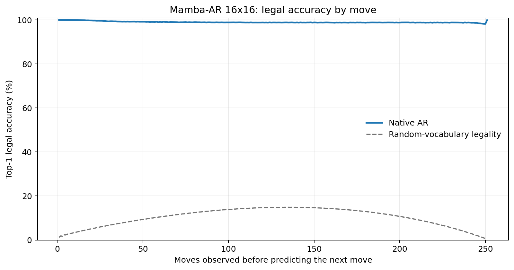
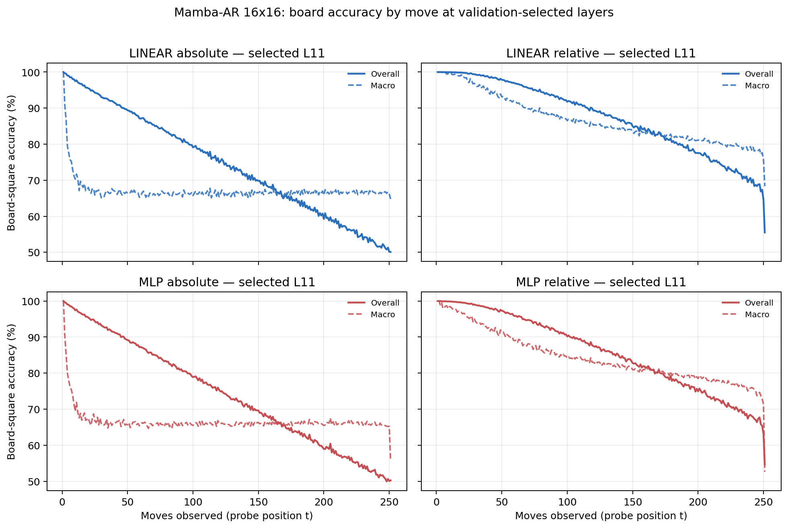

# Proposal evaluation: Mamba-AR 16x16

- **Suite:** `thesis_eval_suite_v1` over `unified_eval_v4`
- **Run:** `mamba_ar_b16`
- **Checkpoint:** `final.pt` (`86b7b3c19c1f85fb348a36b756849495aa535427abe9834cbe6ddebe7e52f184`)
- **Training budget:** `20,000,000` games / `200` shards
- **Next-move readout:** native pretrained AR head
- **Exact continuation:** intentionally excluded because corpus continuations are stochastic legal choices

## 1. Functional legality

| Readout | Top-1 legal | Top-3 legal fraction | Top-5 legal fraction | Legal probability mass |
|---|---:|---:|---:|---:|
| Native AR | 99.05% | 98.24% | 97.17% | 90.73% |

### Statistical context

| Readout | Normalized legal lift | 95% CI for top-1 legal |
|---|---:|---:|
| Native AR | 98.94% | 99.04%–99.06% |

### Legal accuracy by move

### Legality by normalized game phase

| Readout | Phase | Tokens | Mean legal moves | Top-1 legal | Legal mass |
|---|---:|---:|---:|---:|---:|
| Native AR | 0.00–0.25 | 3,148,134 | 16.93 | 99.53% | 94.68% |
| Native AR | 0.25–0.50 | 3,097,644 | 33.66 | 98.95% | 88.33% |
| Native AR | 0.50–0.75 | 3,147,606 | 35.65 | 98.87% | 89.17% |
| Native AR | 0.75–1.00 | 3,147,581 | 18.01 | 98.84% | 90.71% |

## 2. Board-state representations

Layer selection uses only the selection split. Headline test values are macro-balanced accuracy, so changing empty-square prevalence across board sizes cannot dominate the comparison.

**Macro accuracy** is the unweighted mean of the three per-class recalls. Absolute labels use empty/black/white and relative labels use empty/mine/opponent. Each class therefore contributes one third even when empty squares are much more common. Overall accuracy instead weights every square equally and can be dominated by the empty class.

| Probe | Labels | Best layer | Normalized depth | Test macro | Overall | Occupied | Empty |
|---|---|---:|---:|---:|---:|---:|---:|
| LINEAR | absolute | L11 | 0.733 | 66.58% | 74.62% | 49.88% | 99.98% |
| LINEAR | relative | L11 | 0.733 | 83.35% | 87.37% | 75.10% | 99.95% |
| MLP | absolute | L11 | 0.733 | 66.26% | 74.33% | 49.49% | 99.79% |
| MLP | relative | L11 | 0.733 | 81.41% | 85.80% | 72.49% | 99.43% |

### Probe accuracy by layer

These are the untouched test-split tables in the same format as the 8x8 unified JEPA notebook. `Selected` marks the layer chosen using the separate selection split, never the test results.

#### LINEAR board-state probe

| Layer | Absolute accuracy | Absolute macro | Relative accuracy | Relative macro | Selected |
|---:|---:|---:|---:|---:|:---|
| L0 | 64.75% | 56.63% | 65.67% | 57.84% |  |
| L1 | 70.24% | 62.12% | 71.37% | 63.56% |  |
| L2 | 69.65% | 61.63% | 72.98% | 66.04% |  |
| L3 | 67.96% | 59.89% | 80.04% | 75.71% |  |
| L4 | 68.76% | 60.70% | 80.41% | 76.04% |  |
| L5 | 69.69% | 61.64% | 81.24% | 76.89% |  |
| L6 | 70.20% | 62.15% | 81.87% | 77.57% |  |
| L7 | 70.81% | 62.73% | 82.77% | 78.56% |  |
| L8 | 71.58% | 63.52% | 83.82% | 79.71% |  |
| L9 | 73.20% | 65.15% | 85.60% | 81.53% |  |
| L10 | 73.80% | 65.76% | 86.44% | 82.41% |  |
| L11 | 74.62% | 66.58% | 87.37% | 83.35% | absolute + relative |
| L12 | 74.59% | 66.53% | 87.37% | 83.33% |  |
| L13 | 74.53% | 66.45% | 87.22% | 83.14% |  |
| L14 | 74.44% | 66.35% | 87.11% | 82.99% |  |
| L15 | 74.42% | 66.32% | 87.06% | 82.93% |  |

#### MLP board-state probe

| Layer | Absolute accuracy | Absolute macro | Relative accuracy | Relative macro | Selected |
|---:|---:|---:|---:|---:|:---|
| L0 | 65.23% | 57.07% | 65.83% | 57.90% |  |
| L1 | 68.65% | 60.62% | 69.53% | 61.67% |  |
| L2 | 68.67% | 60.73% | 71.16% | 63.99% |  |
| L3 | 67.12% | 59.04% | 77.62% | 73.05% |  |
| L4 | 67.78% | 59.72% | 77.90% | 73.30% |  |
| L5 | 68.61% | 60.53% | 78.61% | 73.99% |  |
| L6 | 69.03% | 60.95% | 79.12% | 74.56% |  |
| L7 | 69.54% | 61.45% | 79.96% | 75.48% |  |
| L8 | 70.35% | 62.30% | 81.00% | 76.59% |  |
| L9 | 72.12% | 64.06% | 83.01% | 78.63% |  |
| L10 | 73.06% | 64.98% | 84.27% | 79.89% |  |
| L11 | 74.33% | 66.26% | 85.80% | 81.41% | absolute + relative |
| L12 | 74.33% | 66.23% | 85.82% | 81.37% |  |
| L13 | 74.18% | 66.02% | 85.51% | 80.94% |  |
| L14 | 74.09% | 65.91% | 85.30% | 80.67% |  |
| L15 | 74.10% | 65.92% | 85.29% | 80.66% |  |

### Board accuracy by move at each selected layer

### Selected board probes by game phase

| Probe | Labels | Phase | Macro accuracy | Occupied | Empty |
|---|---|---:|---:|---:|---:|
| LINEAR | absolute | 1/4 | 73.81% | 62.15% | 100.00% |
| LINEAR | absolute | 2/4 | 66.92% | 50.52% | 100.00% |
| LINEAR | absolute | 11/4 | 66.43% | 49.66% | 99.95% |
| LINEAR | absolute | 12/4 | 66.61% | 49.94% | 99.94% |
| LINEAR | absolute | 13/4 | 66.64% | 50.02% | 99.87% |
| LINEAR | absolute | 14/4 | 66.58% | 49.92% | 99.91% |
| LINEAR | absolute | 15/4 | 66.62% | 50.02% | 99.79% |
| LINEAR | absolute | 16/4 | 66.53% | 50.09% | 99.40% |
| LINEAR | absolute | 3/4 | 66.70% | 50.07% | 100.00% |
| LINEAR | absolute | 4/4 | 66.50% | 49.74% | 100.00% |
| LINEAR | absolute | 5/4 | 66.18% | 49.27% | 100.00% |
| LINEAR | absolute | 6/4 | 66.26% | 49.39% | 100.00% |
| LINEAR | absolute | 7/4 | 66.36% | 49.54% | 99.99% |
| LINEAR | absolute | 8/4 | 66.41% | 49.62% | 99.98% |
| LINEAR | absolute | 9/4 | 66.29% | 49.44% | 99.98% |
| LINEAR | absolute | 10/4 | 66.43% | 49.66% | 99.97% |
| LINEAR | relative | 1/4 | 99.59% | 99.41% | 100.00% |
| LINEAR | relative | 2/4 | 97.74% | 96.68% | 100.00% |
| LINEAR | relative | 11/4 | 83.12% | 74.78% | 99.88% |
| LINEAR | relative | 12/4 | 82.21% | 73.44% | 99.82% |
| LINEAR | relative | 13/4 | 81.32% | 72.14% | 99.75% |
| LINEAR | relative | 14/4 | 80.58% | 71.06% | 99.71% |
| LINEAR | relative | 15/4 | 79.53% | 69.55% | 99.57% |
| LINEAR | relative | 16/4 | 77.65% | 66.84% | 99.36% |
| LINEAR | relative | 3/4 | 94.90% | 92.43% | 100.00% |
| LINEAR | relative | 4/4 | 92.34% | 88.57% | 100.00% |
| LINEAR | relative | 5/4 | 89.92% | 84.96% | 99.99% |
| LINEAR | relative | 6/4 | 88.28% | 82.48% | 99.98% |
| LINEAR | relative | 7/4 | 86.79% | 80.27% | 99.98% |
| LINEAR | relative | 8/4 | 85.69% | 78.63% | 99.94% |
| LINEAR | relative | 9/4 | 84.62% | 77.02% | 99.92% |
| LINEAR | relative | 10/4 | 83.71% | 75.67% | 99.89% |
| MLP | absolute | 1/4 | 73.48% | 61.24% | 100.00% |
| MLP | absolute | 2/4 | 66.92% | 50.43% | 100.00% |
| MLP | absolute | 11/4 | 66.03% | 49.29% | 99.49% |
| MLP | absolute | 12/4 | 66.08% | 49.45% | 99.32% |
| MLP | absolute | 13/4 | 66.08% | 49.56% | 99.10% |
| MLP | absolute | 14/4 | 66.13% | 49.75% | 98.87% |
| MLP | absolute | 15/4 | 66.09% | 49.89% | 98.49% |
| MLP | absolute | 16/4 | 65.59% | 49.95% | 96.88% |
| MLP | absolute | 3/4 | 66.25% | 49.36% | 99.99% |
| MLP | absolute | 4/4 | 65.92% | 48.90% | 99.98% |
| MLP | absolute | 5/4 | 65.74% | 48.64% | 99.94% |
| MLP | absolute | 6/4 | 65.80% | 48.74% | 99.90% |
| MLP | absolute | 7/4 | 65.93% | 48.94% | 99.85% |
| MLP | absolute | 8/4 | 66.01% | 49.11% | 99.77% |
| MLP | absolute | 9/4 | 65.80% | 48.84% | 99.69% |
| MLP | absolute | 10/4 | 66.02% | 49.24% | 99.58% |
| MLP | relative | 1/4 | 98.26% | 97.72% | 100.00% |
| MLP | relative | 2/4 | 95.61% | 93.75% | 100.00% |
| MLP | relative | 11/4 | 80.69% | 71.81% | 98.60% |
| MLP | relative | 12/4 | 79.71% | 70.55% | 98.13% |
| MLP | relative | 13/4 | 79.01% | 69.81% | 97.52% |
| MLP | relative | 14/4 | 78.06% | 68.69% | 96.90% |
| MLP | relative | 15/4 | 76.94% | 67.59% | 95.75% |
| MLP | relative | 16/4 | 74.39% | 65.34% | 92.58% |
| MLP | relative | 3/4 | 92.56% | 89.12% | 99.98% |
| MLP | relative | 4/4 | 90.12% | 85.44% | 99.92% |
| MLP | relative | 5/4 | 87.75% | 81.93% | 99.85% |
| MLP | relative | 6/4 | 85.90% | 79.18% | 99.72% |
| MLP | relative | 7/4 | 84.41% | 77.00% | 99.57% |
| MLP | relative | 8/4 | 83.34% | 75.49% | 99.35% |
| MLP | relative | 9/4 | 82.24% | 73.90% | 99.15% |
| MLP | relative | 10/4 | 81.31% | 72.62% | 98.88% |

## 3. Efficiency and reproducibility

- Encoder parameters: `25,824,768`
- Total parameters: `25,824,768`
- Checkpoint bytes: `310,103,837`
- Evaluation GPU: `NVIDIA RTX PRO 6000 Blackwell Server Edition`
- Training hardware: `unreported`
- Training precision: `bf16`
- Python / PyTorch / CUDA: `3.13.15` / `2.11.0+cu128` / `12.8`
- Median training chunk: `79.76 s`
- Estimated training loop: `4.43 h`
- Median games/s: `1253.69`
- Median supervision units/s: `314471.34`
- Timing scope: dt_seconds excludes normal checkpoint/Drive-sync time; validation is included only in observed_train_plus_validation_loop_hours

## 4. Interpretation boundary

- Board probes establish decodability, not by themselves causal use.
- Legal behavior measures rule compatibility, not strategic playing strength.
- Bootstrap legality intervals quantify test-game sampling only; they do not replace independent pretraining seeds.
- Board-probe point estimates use one deterministic probe seed; the random-encoder control is not a substitute for model-seed replication.
- Cross-board results compare separately trained scaling conditions, not zero-shot transfer.

## Artifact index

- Unified JSON: `/content/drive/MyDrive/Master_Thesis_Artifacts/runs/Mamba-AR/mamba_ar_b16/thesis_eval/final/results__unified_eval_v4.json`
- Unified summary: `/content/drive/MyDrive/Master_Thesis_Artifacts/runs/Mamba-AR/mamba_ar_b16/thesis_eval/final/summary__unified_eval_v4.md`
- Position manifest: `/content/drive/MyDrive/Master_Thesis_Artifacts/runs/Mamba-AR/mamba_ar_b16/thesis_eval/final/position_manifest__unified_eval_v4.json`
- Legal-by-move figure: `/content/drive/MyDrive/Master_Thesis_Artifacts/runs/Mamba-AR/mamba_ar_b16/thesis_eval/final/legal_accuracy_by_move__thesis_eval_suite_v1.png`
- Board-by-move figure: `/content/drive/MyDrive/Master_Thesis_Artifacts/runs/Mamba-AR/mamba_ar_b16/thesis_eval/final/board_accuracy_by_move__thesis_eval_suite_v1.png`
