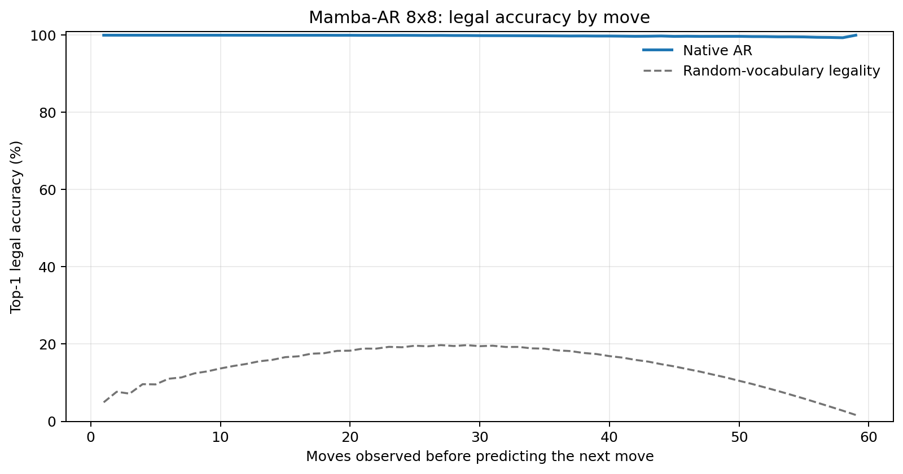
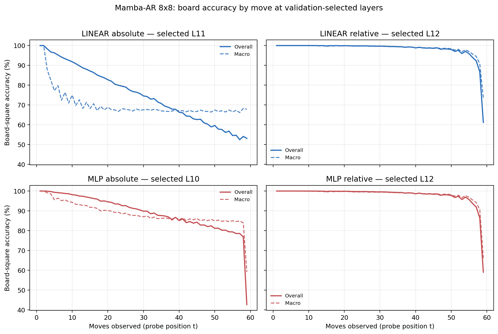

# Proposal evaluation: Mamba-AR 8x8

- **Suite:** `thesis_eval_suite_v1` over `unified_eval_v4`
- **Run:** `mamba_ar_8x8_bf16`
- **Checkpoint:** `final.pt` (`84968ae53eb2344db59aa9f1ee647fbdffdce86bb3010e4a70c361b4104c2b4d`)
- **Training budget:** `19,999,840` games / `200` shards
- **Next-move readout:** native pretrained AR head
- **Exact continuation:** intentionally excluded because corpus continuations are stochastic legal choices

## 1. Functional legality

| Readout | Top-1 legal | Top-3 legal fraction | Top-5 legal fraction | Legal probability mass |
|---|---:|---:|---:|---:|
| Native AR | 99.85% | 96.90% | 92.57% | 99.34% |

### Statistical context

| Readout | Normalized legal lift | 95% CI for top-1 legal |
|---|---:|---:|
| Native AR | 99.82% | 99.84%–99.85% |

### Legal accuracy by move

### Legality by normalized game phase

| Readout | Phase | Tokens | Mean legal moves | Top-1 legal | Legal mass |
|---|---:|---:|---:|---:|---:|
| Native AR | 0.00–0.25 | 749,909 | 7.22 | 100.00% | 99.97% |
| Native AR | 0.25–0.50 | 699,679 | 11.44 | 99.96% | 99.83% |
| Native AR | 0.50–0.75 | 749,593 | 10.84 | 99.81% | 99.23% |
| Native AR | 0.75–1.00 | 749,129 | 5.15 | 99.63% | 98.37% |

## 2. Board-state representations

Layer selection uses only the selection split. Headline test values are macro-balanced accuracy, so changing empty-square prevalence across board sizes cannot dominate the comparison.

**Macro accuracy** is the unweighted mean of the three per-class recalls. Absolute labels use empty/black/white and relative labels use empty/mine/opponent. Each class therefore contributes one third even when empty squares are much more common. Overall accuracy instead weights every square equally and can be dominated by the empty class.

| Probe | Labels | Best layer | Normalized depth | Test macro | Overall | Occupied | Empty |
|---|---|---:|---:|---:|---:|---:|---:|
| LINEAR | absolute | L11 | 0.733 | 68.78% | 75.50% | 53.22% | 100.00% |
| LINEAR | relative | L12 | 0.800 | 97.85% | 98.32% | 96.81% | 99.99% |
| MLP | absolute | L10 | 0.667 | 86.55% | 89.43% | 79.85% | 99.98% |
| MLP | relative | L12 | 0.800 | 97.62% | 98.16% | 96.52% | 99.97% |

### Probe accuracy by layer

These are the untouched test-split tables in the same format as the 8x8 unified JEPA notebook. `Selected` marks the layer chosen using the separate selection split, never the test results.

#### LINEAR board-state probe

| Layer | Absolute accuracy | Absolute macro | Relative accuracy | Relative macro | Selected |
|---:|---:|---:|---:|---:|:---|
| L0 | 62.59% | 55.55% | 64.78% | 58.15% |  |
| L1 | 73.42% | 66.59% | 77.85% | 72.00% |  |
| L2 | 72.21% | 65.37% | 85.95% | 82.76% |  |
| L3 | 71.99% | 65.14% | 88.12% | 85.53% |  |
| L4 | 73.51% | 66.61% | 90.71% | 88.38% |  |
| L5 | 73.50% | 66.57% | 91.62% | 89.54% |  |
| L6 | 73.92% | 67.02% | 92.95% | 91.17% |  |
| L7 | 74.07% | 67.17% | 93.88% | 92.33% |  |
| L8 | 74.58% | 67.73% | 94.78% | 93.39% |  |
| L9 | 75.41% | 68.67% | 95.98% | 94.85% |  |
| L10 | 75.44% | 68.70% | 97.13% | 96.34% |  |
| L11 | 75.50% | 68.78% | 98.09% | 97.55% | absolute |
| L12 | 75.45% | 68.72% | 98.32% | 97.85% | relative |
| L13 | 75.25% | 68.47% | 98.29% | 97.81% |  |
| L14 | 74.41% | 67.51% | 97.49% | 96.85% |  |
| L15 | 74.44% | 67.54% | 97.50% | 96.86% |  |

#### MLP board-state probe

| Layer | Absolute accuracy | Absolute macro | Relative accuracy | Relative macro | Selected |
|---:|---:|---:|---:|---:|:---|
| L0 | 65.06% | 58.72% | 65.25% | 58.63% |  |
| L1 | 75.08% | 68.80% | 77.19% | 71.33% |  |
| L2 | 81.86% | 77.95% | 84.80% | 81.48% |  |
| L3 | 82.95% | 79.43% | 86.82% | 84.13% |  |
| L4 | 82.58% | 78.33% | 89.66% | 87.19% |  |
| L5 | 79.62% | 74.47% | 90.54% | 88.29% |  |
| L6 | 81.15% | 76.33% | 91.87% | 89.87% |  |
| L7 | 81.62% | 76.87% | 92.94% | 91.19% |  |
| L8 | 85.34% | 81.50% | 93.92% | 92.34% |  |
| L9 | 86.02% | 82.21% | 95.48% | 94.19% |  |
| L10 | 89.43% | 86.55% | 96.84% | 95.94% | absolute |
| L11 | 84.42% | 80.16% | 97.98% | 97.39% |  |
| L12 | 78.34% | 72.42% | 98.16% | 97.62% | relative |
| L13 | 76.09% | 69.54% | 98.01% | 97.43% |  |
| L14 | 74.22% | 67.26% | 96.91% | 96.11% |  |
| L15 | 74.26% | 67.31% | 96.89% | 96.08% |  |

### Board accuracy by move at each selected layer

### Selected board probes by game phase

| Probe | Labels | Phase | Macro accuracy | Occupied | Empty |
|---|---|---:|---:|---:|---:|
| LINEAR | absolute | 1/4 | 95.79% | 94.19% | 100.00% |
| LINEAR | absolute | 2/4 | 79.29% | 70.63% | 100.00% |
| LINEAR | absolute | 11/4 | 67.59% | 51.41% | 100.00% |
| LINEAR | absolute | 12/4 | 67.39% | 51.09% | 99.99% |
| LINEAR | absolute | 13/4 | 67.62% | 51.50% | 99.99% |
| LINEAR | absolute | 14/4 | 67.44% | 51.16% | 99.99% |
| LINEAR | absolute | 15/4 | 67.55% | 51.34% | 99.98% |
| LINEAR | absolute | 16/4 | 67.77% | 51.69% | 99.92% |
| LINEAR | absolute | 3/4 | 74.43% | 62.85% | 100.00% |
| LINEAR | absolute | 4/4 | 71.89% | 57.98% | 100.00% |
| LINEAR | absolute | 5/4 | 70.17% | 55.64% | 100.00% |
| LINEAR | absolute | 6/4 | 68.92% | 53.52% | 100.00% |
| LINEAR | absolute | 7/4 | 68.47% | 53.11% | 100.00% |
| LINEAR | absolute | 8/4 | 68.36% | 52.58% | 100.00% |
| LINEAR | absolute | 9/4 | 68.42% | 52.65% | 100.00% |
| LINEAR | absolute | 10/4 | 67.77% | 51.70% | 100.00% |
| LINEAR | relative | 1/4 | 100.00% | 100.00% | 100.00% |
| LINEAR | relative | 2/4 | 100.00% | 100.00% | 100.00% |
| LINEAR | relative | 11/4 | 99.12% | 98.69% | 99.99% |
| LINEAR | relative | 12/4 | 98.94% | 98.44% | 99.95% |
| LINEAR | relative | 13/4 | 98.71% | 98.14% | 99.94% |
| LINEAR | relative | 14/4 | 98.32% | 97.53% | 99.96% |
| LINEAR | relative | 15/4 | 97.46% | 96.25% | 99.98% |
| LINEAR | relative | 16/4 | 88.63% | 83.03% | 99.88% |
| LINEAR | relative | 3/4 | 99.98% | 99.98% | 100.00% |
| LINEAR | relative | 4/4 | 99.90% | 99.85% | 100.00% |
| LINEAR | relative | 5/4 | 99.79% | 99.70% | 100.00% |
| LINEAR | relative | 6/4 | 99.81% | 99.73% | 100.00% |
| LINEAR | relative | 7/4 | 99.71% | 99.60% | 99.99% |
| LINEAR | relative | 8/4 | 99.67% | 99.52% | 99.99% |
| LINEAR | relative | 9/4 | 99.55% | 99.35% | 99.98% |
| LINEAR | relative | 10/4 | 99.39% | 99.12% | 99.97% |
| MLP | absolute | 1/4 | 99.72% | 99.70% | 100.00% |
| MLP | absolute | 2/4 | 96.82% | 95.44% | 100.00% |
| MLP | absolute | 11/4 | 86.08% | 79.15% | 99.93% |
| MLP | absolute | 12/4 | 85.84% | 78.79% | 99.93% |
| MLP | absolute | 13/4 | 85.75% | 78.70% | 99.89% |
| MLP | absolute | 14/4 | 85.41% | 78.16% | 99.91% |
| MLP | absolute | 15/4 | 84.99% | 77.54% | 99.91% |
| MLP | absolute | 16/4 | 78.49% | 68.01% | 99.45% |
| MLP | absolute | 3/4 | 94.82% | 92.37% | 100.00% |
| MLP | absolute | 4/4 | 93.18% | 89.76% | 100.00% |
| MLP | absolute | 5/4 | 91.53% | 87.34% | 100.00% |
| MLP | absolute | 6/4 | 90.12% | 85.20% | 100.00% |
| MLP | absolute | 7/4 | 89.10% | 83.73% | 99.99% |
| MLP | absolute | 8/4 | 87.96% | 81.95% | 99.99% |
| MLP | absolute | 9/4 | 87.13% | 80.72% | 99.96% |
| MLP | absolute | 10/4 | 86.40% | 79.63% | 99.97% |
| MLP | relative | 1/4 | 100.00% | 100.00% | 100.00% |
| MLP | relative | 2/4 | 100.00% | 100.00% | 100.00% |
| MLP | relative | 11/4 | 98.90% | 98.41% | 99.93% |
| MLP | relative | 12/4 | 98.75% | 98.20% | 99.87% |
| MLP | relative | 13/4 | 98.46% | 97.78% | 99.88% |
| MLP | relative | 14/4 | 98.10% | 97.24% | 99.91% |
| MLP | relative | 15/4 | 97.26% | 96.02% | 99.86% |
| MLP | relative | 16/4 | 87.41% | 82.31% | 98.06% |
| MLP | relative | 3/4 | 99.95% | 99.93% | 100.00% |
| MLP | relative | 4/4 | 99.84% | 99.78% | 100.00% |
| MLP | relative | 5/4 | 99.68% | 99.55% | 100.00% |
| MLP | relative | 6/4 | 99.71% | 99.60% | 100.00% |
| MLP | relative | 7/4 | 99.54% | 99.35% | 99.99% |
| MLP | relative | 8/4 | 99.48% | 99.26% | 99.98% |
| MLP | relative | 9/4 | 99.38% | 99.12% | 99.96% |
| MLP | relative | 10/4 | 99.18% | 98.83% | 99.96% |

## 3. Nanda-style causal intervention

- Readout: `native_ar`
- Selected intervention scale: `4`
- Interpretation scope: native model behavior

| Control | Target top-1 legal | Target legal mass | Top-N FP+FN |
|---|---:|---:|---:|
| Null | 92.70% | 90.27% | 2.262 |
| Magnitude-matched random | 91.40% | 90.25% | 2.258 |
| Relative-board direction | 95.70% | 94.35% | 0.726 |

For AR this edits the native prediction path. For JEPA it establishes causal steerability of the composed JEPA encoder plus its post-hoc frozen MLP readout; it is not evidence of a native JEPA action head.

## 4. Efficiency and reproducibility

- Encoder parameters: `25,529,856`
- Total parameters: `25,529,856`
- Checkpoint bytes: `306,566,813`
- Evaluation GPU: `NVIDIA L4`
- Training hardware: `unreported`
- Training precision: `bf16`
- Python / PyTorch / CUDA: `3.13.15` / `2.11.0+cu128` / `12.8`
- Median training chunk: `36.00 s`
- Estimated training loop: `2.00 h`
- Median games/s: `2777.36`
- Median supervision units/s: `163778.76`
- Timing scope: dt_seconds excludes normal checkpoint/Drive-sync time; validation is included only in observed_train_plus_validation_loop_hours

## 5. Interpretation boundary

- Board probes establish decodability, not by themselves causal use.
- Legal behavior measures rule compatibility, not strategic playing strength.
- Bootstrap legality intervals quantify test-game sampling only; they do not replace independent pretraining seeds.
- Board-probe point estimates use one deterministic probe seed; the random-encoder control is not a substitute for model-seed replication.
- Cross-board results compare separately trained scaling conditions, not zero-shot transfer.

## Artifact index

- Unified JSON: `/content/drive/MyDrive/Master_Thesis_Artifacts/runs/Mamba-AR/mamba_ar_8x8_bf16/thesis_eval/final/results__unified_eval_v4.json`
- Unified summary: `/content/drive/MyDrive/Master_Thesis_Artifacts/runs/Mamba-AR/mamba_ar_8x8_bf16/thesis_eval/final/summary__unified_eval_v4.md`
- Position manifest: `/content/drive/MyDrive/Master_Thesis_Artifacts/runs/Mamba-AR/mamba_ar_8x8_bf16/thesis_eval/final/position_manifest__unified_eval_v4.json`
- Legal-by-move figure: `/content/drive/MyDrive/Master_Thesis_Artifacts/runs/Mamba-AR/mamba_ar_8x8_bf16/thesis_eval/final/legal_accuracy_by_move__thesis_eval_suite_v1.png`
- Board-by-move figure: `/content/drive/MyDrive/Master_Thesis_Artifacts/runs/Mamba-AR/mamba_ar_8x8_bf16/thesis_eval/final/board_accuracy_by_move__thesis_eval_suite_v1.png`
- Causal-intervention JSON: `/content/drive/MyDrive/Master_Thesis_Artifacts/runs/Mamba-AR/mamba_ar_8x8_bf16/thesis_eval/final/results__unified_eval_v4.json` (`causal_intervention` key)
