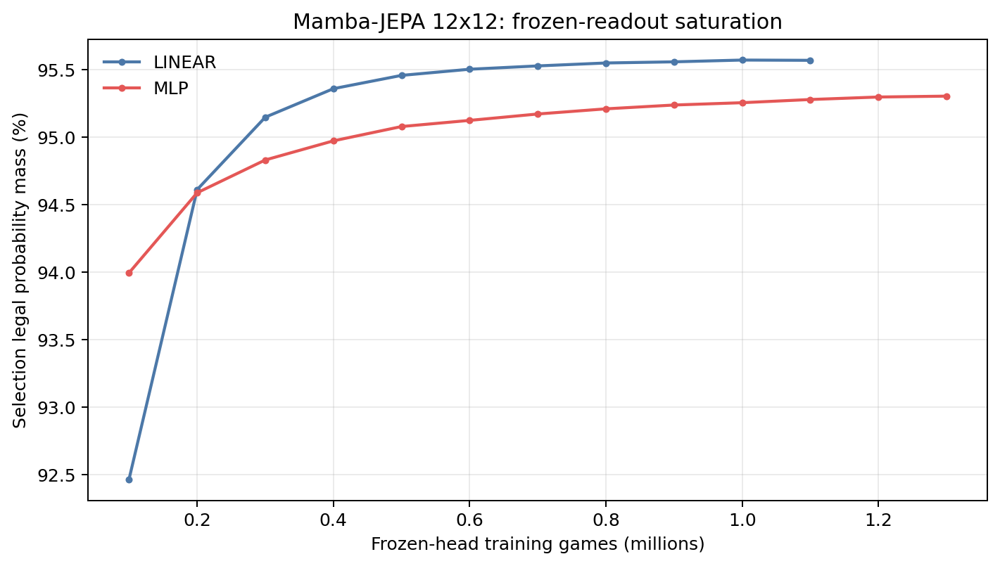
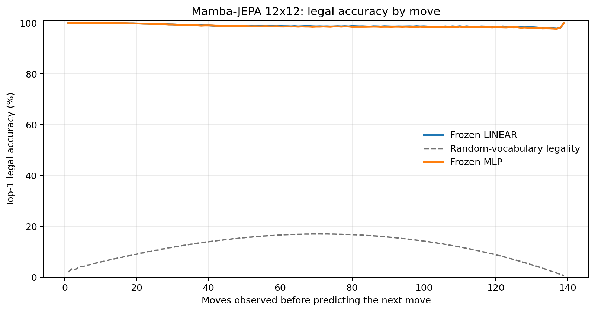
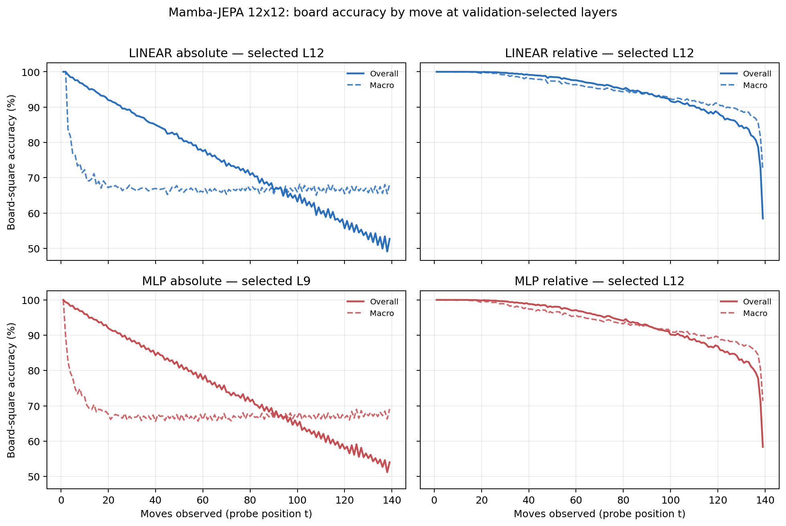

# Proposal evaluation: Mamba-JEPA 12x12

- **Suite:** `thesis_eval_suite_v1` over `unified_eval_v4`
- **Run:** `mamba_jepa_v5_hd_infonce_allpos_b12`
- **Checkpoint:** `final.pt` (`1641cdb2a8f662034caaa027e93338f66e650aa227d1b84910353a41caab6466`)
- **Training budget:** `20,000,000` games / `200` shards
- **Next-move readout:** frozen bf16 encoder with common fp32 Linear/MLP readouts
- **Exact continuation:** intentionally excluded because corpus continuations are stochastic legal choices

## 1. Functional legality

| Readout | Top-1 legal | Top-3 legal fraction | Top-5 legal fraction | Legal probability mass |
|---|---:|---:|---:|---:|
| Frozen LINEAR | 98.99% | 97.81% | 96.13% | 95.47% |
| Frozen MLP | 98.89% | 97.71% | 96.03% | 95.17% |

### Statistical context

| Readout | Normalized legal lift | 95% CI for top-1 legal |
|---|---:|---:|
| Frozen LINEAR | 98.86% | 98.98%–99.00% |
| Frozen MLP | 98.74% | 98.87%–98.90% |

### Frozen-head saturation

There is no minimum shard count. Training stops under the pre-registered selection legal-mass patience rule and restores the best checkpoint.

### Legal accuracy by move

### Legality by normalized game phase

| Readout | Phase | Tokens | Mean legal moves | Top-1 legal | Legal mass |
|---|---:|---:|---:|---:|---:|
| Frozen LINEAR | 0.00–0.25 | 1,749,230 | 11.70 | 99.79% | 97.90% |
| Frozen LINEAR | 0.25–0.50 | 1,698,776 | 22.05 | 98.91% | 94.95% |
| Frozen LINEAR | 0.50–0.75 | 1,748,740 | 22.37 | 98.73% | 94.30% |
| Frozen LINEAR | 0.75–1.00 | 1,748,636 | 10.89 | 98.54% | 94.71% |
| Frozen MLP | 0.00–0.25 | 1,749,230 | 11.70 | 99.79% | 97.81% |
| Frozen MLP | 0.25–0.50 | 1,698,776 | 22.05 | 98.83% | 94.61% |
| Frozen MLP | 0.50–0.75 | 1,748,740 | 22.37 | 98.57% | 93.85% |
| Frozen MLP | 0.75–1.00 | 1,748,636 | 10.89 | 98.36% | 94.41% |

## 2. Board-state representations

Layer selection uses only the selection split. Headline test values are macro-balanced accuracy, so changing empty-square prevalence across board sizes cannot dominate the comparison.

**Macro accuracy** is the unweighted mean of the three per-class recalls. Absolute labels use empty/black/white and relative labels use empty/mine/opponent. Each class therefore contributes one third even when empty squares are much more common. Overall accuracy instead weights every square equally and can be dominated by the empty class.

| Probe | Labels | Best layer | Normalized depth | Test macro | Overall | Occupied | Empty |
|---|---|---:|---:|---:|---:|---:|---:|
| LINEAR | absolute | L12 | 0.800 | 67.07% | 74.78% | 50.60% | 100.00% |
| LINEAR | relative | L12 | 0.800 | 92.85% | 94.54% | 89.33% | 99.98% |
| MLP | absolute | L9 | 0.600 | 67.79% | 75.24% | 51.89% | 99.60% |
| MLP | relative | L12 | 0.800 | 91.85% | 93.77% | 87.90% | 99.88% |

### Probe accuracy by layer

These are the untouched test-split tables in the same format as the 8x8 unified JEPA notebook. `Selected` marks the layer chosen using the separate selection split, never the test results.

#### LINEAR board-state probe

| Layer | Absolute accuracy | Absolute macro | Relative accuracy | Relative macro | Selected |
|---:|---:|---:|---:|---:|:---|
| L0 | 63.65% | 55.76% | 65.00% | 57.43% |  |
| L1 | 69.17% | 61.48% | 73.36% | 66.94% |  |
| L2 | 67.40% | 59.72% | 77.86% | 73.44% |  |
| L3 | 67.51% | 59.80% | 78.31% | 74.06% |  |
| L4 | 67.85% | 60.11% | 79.39% | 75.41% |  |
| L5 | 72.04% | 64.19% | 83.65% | 79.44% |  |
| L6 | 73.68% | 65.88% | 85.24% | 80.97% |  |
| L7 | 74.03% | 66.23% | 85.37% | 81.02% |  |
| L8 | 74.06% | 66.26% | 87.66% | 84.01% |  |
| L9 | 74.53% | 66.80% | 87.82% | 84.14% |  |
| L10 | 74.16% | 66.36% | 93.83% | 91.98% |  |
| L11 | 74.67% | 66.94% | 94.26% | 92.50% |  |
| L12 | 74.78% | 67.07% | 94.54% | 92.85% | absolute + relative |
| L13 | 74.57% | 66.80% | 94.24% | 92.48% |  |
| L14 | 74.00% | 66.12% | 93.37% | 91.40% |  |
| L15 | 73.74% | 65.83% | 93.03% | 91.01% |  |

#### MLP board-state probe

| Layer | Absolute accuracy | Absolute macro | Relative accuracy | Relative macro | Selected |
|---:|---:|---:|---:|---:|:---|
| L0 | 64.87% | 57.28% | 65.26% | 57.70% |  |
| L1 | 69.94% | 62.76% | 72.08% | 65.48% |  |
| L2 | 72.06% | 66.17% | 76.03% | 71.33% |  |
| L3 | 72.33% | 66.58% | 76.38% | 71.89% |  |
| L4 | 72.20% | 66.35% | 77.15% | 72.94% |  |
| L5 | 72.71% | 65.39% | 81.24% | 76.76% |  |
| L6 | 73.46% | 65.77% | 83.09% | 78.45% |  |
| L7 | 73.62% | 65.84% | 83.34% | 78.57% |  |
| L8 | 75.08% | 67.73% | 85.40% | 81.26% |  |
| L9 | 75.24% | 67.79% | 85.82% | 81.62% | absolute |
| L10 | 74.16% | 66.52% | 91.91% | 89.79% |  |
| L11 | 74.41% | 66.64% | 93.15% | 91.12% |  |
| L12 | 74.64% | 66.89% | 93.77% | 91.85% | relative |
| L13 | 74.33% | 66.51% | 93.19% | 91.13% |  |
| L14 | 73.60% | 65.64% | 91.89% | 89.56% |  |
| L15 | 73.20% | 65.22% | 91.41% | 89.02% |  |

### Board accuracy by move at each selected layer

### Selected board probes by game phase

| Probe | Labels | Phase | Macro accuracy | Occupied | Empty |
|---|---|---:|---:|---:|---:|
| LINEAR | absolute | 1/4 | 82.57% | 74.52% | 100.00% |
| LINEAR | absolute | 2/4 | 71.61% | 57.66% | 100.00% |
| LINEAR | absolute | 11/4 | 66.78% | 50.18% | 99.99% |
| LINEAR | absolute | 12/4 | 66.87% | 50.32% | 99.98% |
| LINEAR | absolute | 13/4 | 66.74% | 50.12% | 99.99% |
| LINEAR | absolute | 14/4 | 66.99% | 50.50% | 99.96% |
| LINEAR | absolute | 15/4 | 66.69% | 50.06% | 99.95% |
| LINEAR | absolute | 16/4 | 66.93% | 50.40% | 100.00% |
| LINEAR | absolute | 3/4 | 68.43% | 52.64% | 100.00% |
| LINEAR | absolute | 4/4 | 67.59% | 51.41% | 100.00% |
| LINEAR | absolute | 5/4 | 67.20% | 50.82% | 100.00% |
| LINEAR | absolute | 6/4 | 66.93% | 50.40% | 100.00% |
| LINEAR | absolute | 7/4 | 66.70% | 50.05% | 100.00% |
| LINEAR | absolute | 8/4 | 66.52% | 49.78% | 100.00% |
| LINEAR | absolute | 9/4 | 66.62% | 49.93% | 100.00% |
| LINEAR | absolute | 10/4 | 66.88% | 50.33% | 100.00% |
| LINEAR | relative | 1/4 | 99.99% | 99.99% | 100.00% |
| LINEAR | relative | 2/4 | 99.96% | 99.95% | 100.00% |
| LINEAR | relative | 11/4 | 93.60% | 90.45% | 99.95% |
| LINEAR | relative | 12/4 | 92.61% | 88.98% | 99.92% |
| LINEAR | relative | 13/4 | 91.83% | 87.85% | 99.87% |
| LINEAR | relative | 14/4 | 90.87% | 86.44% | 99.81% |
| LINEAR | relative | 15/4 | 89.63% | 84.60% | 99.72% |
| LINEAR | relative | 16/4 | 85.22% | 77.90% | 99.90% |
| LINEAR | relative | 3/4 | 99.68% | 99.54% | 100.00% |
| LINEAR | relative | 4/4 | 99.02% | 98.56% | 100.00% |
| LINEAR | relative | 5/4 | 98.21% | 97.35% | 100.00% |
| LINEAR | relative | 6/4 | 97.48% | 96.26% | 100.00% |
| LINEAR | relative | 7/4 | 96.66% | 95.04% | 99.99% |
| LINEAR | relative | 8/4 | 95.71% | 93.61% | 99.99% |
| LINEAR | relative | 9/4 | 95.04% | 92.60% | 99.98% |
| LINEAR | relative | 10/4 | 94.33% | 91.55% | 99.97% |
| MLP | absolute | 1/4 | 79.99% | 71.83% | 100.00% |
| MLP | absolute | 2/4 | 71.17% | 57.41% | 100.00% |
| MLP | absolute | 11/4 | 67.53% | 51.86% | 98.90% |
| MLP | absolute | 12/4 | 67.29% | 51.62% | 98.63% |
| MLP | absolute | 13/4 | 67.16% | 51.50% | 98.47% |
| MLP | absolute | 14/4 | 67.31% | 51.86% | 98.22% |
| MLP | absolute | 15/4 | 67.60% | 52.31% | 98.22% |
| MLP | absolute | 16/4 | 67.90% | 52.44% | 98.79% |
| MLP | absolute | 3/4 | 68.13% | 52.25% | 99.98% |
| MLP | absolute | 4/4 | 67.64% | 51.57% | 99.94% |
| MLP | absolute | 5/4 | 67.45% | 51.31% | 99.86% |
| MLP | absolute | 6/4 | 67.18% | 50.87% | 99.76% |
| MLP | absolute | 7/4 | 67.18% | 50.95% | 99.59% |
| MLP | absolute | 8/4 | 67.17% | 51.03% | 99.46% |
| MLP | absolute | 9/4 | 66.98% | 50.82% | 99.26% |
| MLP | absolute | 10/4 | 67.38% | 51.52% | 99.09% |
| MLP | relative | 1/4 | 99.97% | 99.96% | 100.00% |
| MLP | relative | 2/4 | 99.89% | 99.86% | 100.00% |
| MLP | relative | 11/4 | 92.33% | 88.71% | 99.69% |
| MLP | relative | 12/4 | 91.30% | 87.24% | 99.54% |
| MLP | relative | 13/4 | 90.46% | 86.11% | 99.29% |
| MLP | relative | 14/4 | 89.40% | 84.68% | 98.99% |
| MLP | relative | 15/4 | 88.17% | 83.00% | 98.58% |
| MLP | relative | 16/4 | 84.02% | 76.71% | 98.77% |
| MLP | relative | 3/4 | 99.45% | 99.21% | 100.00% |
| MLP | relative | 4/4 | 98.58% | 97.96% | 99.99% |
| MLP | relative | 5/4 | 97.55% | 96.42% | 99.99% |
| MLP | relative | 6/4 | 96.74% | 95.21% | 99.99% |
| MLP | relative | 7/4 | 95.81% | 93.84% | 99.97% |
| MLP | relative | 8/4 | 94.77% | 92.26% | 99.94% |
| MLP | relative | 9/4 | 93.95% | 91.06% | 99.88% |
| MLP | relative | 10/4 | 93.20% | 89.96% | 99.85% |

## 3. Efficiency and reproducibility

- Encoder parameters: `25,652,736`
- Total parameters: `51,568,128`
- Checkpoint bytes: `413,301,038`
- Evaluation GPU: `NVIDIA L4`
- Training hardware: `unreported`
- Training precision: `bf16`
- Python / PyTorch / CUDA: `3.12.13` / `2.11.0+cu128` / `12.8`
- Median training chunk: `109.33 s`
- Estimated training loop: `6.07 h`
- Median games/s: `914.65`
- Median supervision units/s: `126142.16`
- Timing scope: dt_seconds excludes normal checkpoint/Drive-sync time; validation is included only in observed_train_plus_validation_loop_hours

## 4. Interpretation boundary

- Board probes establish decodability, not by themselves causal use.
- Legal behavior measures rule compatibility, not strategic playing strength.
- Bootstrap legality intervals quantify test-game sampling only; they do not replace independent pretraining seeds.
- Board-probe point estimates use one deterministic probe seed; the random-encoder control is not a substitute for model-seed replication.
- Cross-board results compare separately trained scaling conditions, not zero-shot transfer.

## Artifact index

- Unified JSON: `/content/drive/MyDrive/Master_Thesis_Artifacts/runs/Mamba-JEPA/mamba_jepa_v5_hd_infonce_allpos_b12/thesis_eval/final/results__unified_eval_v4.json`
- Unified summary: `/content/drive/MyDrive/Master_Thesis_Artifacts/runs/Mamba-JEPA/mamba_jepa_v5_hd_infonce_allpos_b12/thesis_eval/final/summary__unified_eval_v4.md`
- Position manifest: `/content/drive/MyDrive/Master_Thesis_Artifacts/runs/Mamba-JEPA/mamba_jepa_v5_hd_infonce_allpos_b12/thesis_eval/final/position_manifest__unified_eval_v4.json`
- Legal-by-move figure: `/content/drive/MyDrive/Master_Thesis_Artifacts/runs/Mamba-JEPA/mamba_jepa_v5_hd_infonce_allpos_b12/thesis_eval/final/legal_accuracy_by_move__thesis_eval_suite_v1.png`
- Board-by-move figure: `/content/drive/MyDrive/Master_Thesis_Artifacts/runs/Mamba-JEPA/mamba_jepa_v5_hd_infonce_allpos_b12/thesis_eval/final/board_accuracy_by_move__thesis_eval_suite_v1.png`
