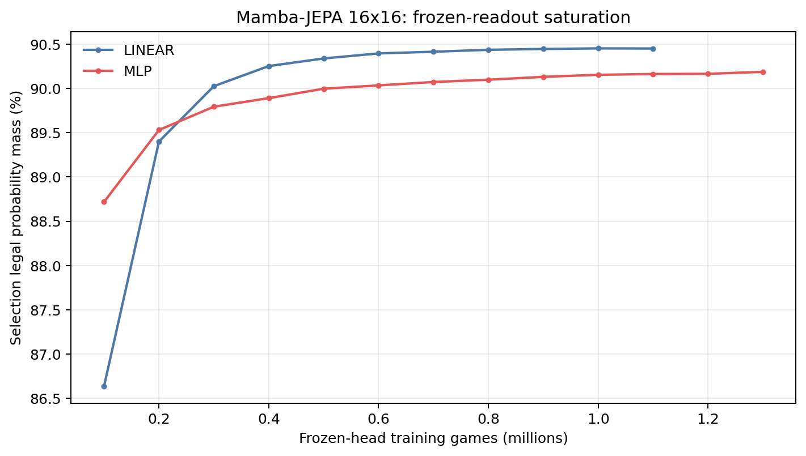
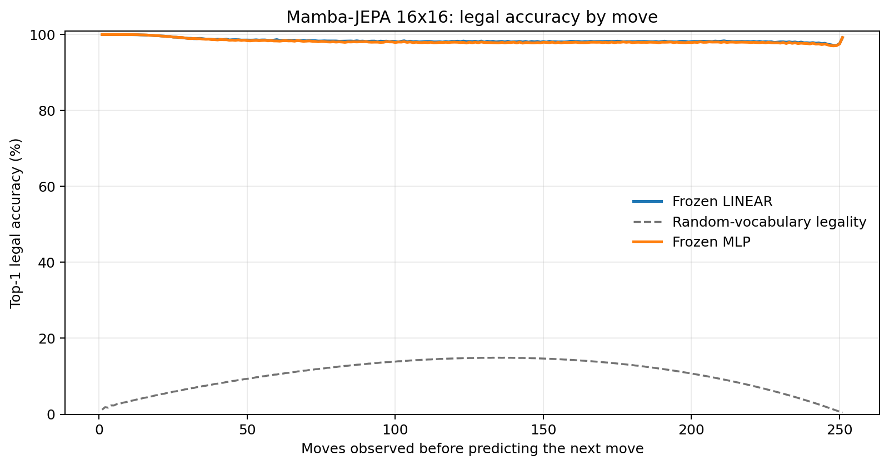
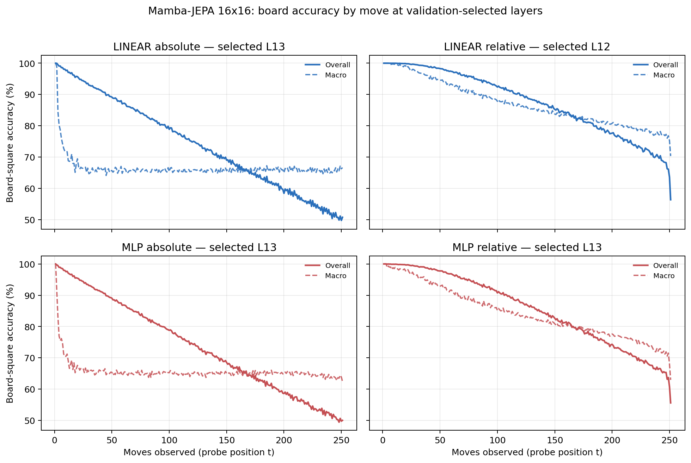

# Proposal evaluation: Mamba-JEPA 16x16

- **Suite:** `thesis_eval_suite_v1` over `unified_eval_v4`
- **Run:** `mamba_jepa_v5_hd_infonce_allpos_b16`
- **Checkpoint:** `final.pt` (`93fdf9560afd7bc712ac2c2fdf32c682a59a89176fcdff697c62695ac3fa05cc`)
- **Training budget:** `20,000,000` games / `200` shards
- **Next-move readout:** frozen bf16 encoder with common fp32 Linear/MLP readouts
- **Exact continuation:** intentionally excluded because corpus continuations are stochastic legal choices

## 1. Functional legality

| Readout | Top-1 legal | Top-3 legal fraction | Top-5 legal fraction | Legal probability mass |
|---|---:|---:|---:|---:|
| Frozen LINEAR | 98.41% | 97.58% | 96.55% | 90.42% |
| Frozen MLP | 98.24% | 97.41% | 96.38% | 90.12% |

### Statistical context

| Readout | Normalized legal lift | 95% CI for top-1 legal |
|---|---:|---:|
| Frozen LINEAR | 98.23% | 98.40%–98.42% |
| Frozen MLP | 98.04% | 98.23%–98.26% |

### Frozen-head saturation

There is no minimum shard count. Training stops under the pre-registered selection legal-mass patience rule and restores the best checkpoint.

### Legal accuracy by move

### Legality by normalized game phase

| Readout | Phase | Tokens | Mean legal moves | Top-1 legal | Legal mass |
|---|---:|---:|---:|---:|---:|
| Frozen LINEAR | 0.00–0.25 | 3,148,134 | 16.93 | 99.18% | 94.56% |
| Frozen LINEAR | 0.25–0.50 | 3,097,644 | 33.66 | 98.26% | 88.14% |
| Frozen LINEAR | 0.50–0.75 | 3,147,606 | 35.65 | 98.15% | 88.89% |
| Frozen LINEAR | 0.75–1.00 | 3,147,581 | 18.01 | 98.05% | 90.04% |
| Frozen MLP | 0.00–0.25 | 3,148,134 | 16.93 | 99.13% | 94.05% |
| Frozen MLP | 0.25–0.50 | 3,097,644 | 33.66 | 98.06% | 87.77% |
| Frozen MLP | 0.50–0.75 | 3,147,606 | 35.65 | 97.93% | 88.52% |
| Frozen MLP | 0.75–1.00 | 3,147,581 | 18.01 | 97.85% | 90.09% |

## 2. Board-state representations

Layer selection uses only the selection split. Headline test values are macro-balanced accuracy, so changing empty-square prevalence across board sizes cannot dominate the comparison.

**Macro accuracy** is the unweighted mean of the three per-class recalls. Absolute labels use empty/black/white and relative labels use empty/mine/opponent. Each class therefore contributes one third even when empty squares are much more common. Overall accuracy instead weights every square equally and can be dominated by the empty class.

| Probe | Labels | Best layer | Normalized depth | Test macro | Overall | Occupied | Empty |
|---|---|---:|---:|---:|---:|---:|---:|
| LINEAR | absolute | L13 | 0.867 | 66.18% | 74.28% | 49.36% | 99.81% |
| LINEAR | relative | L12 | 0.800 | 83.77% | 87.56% | 76.04% | 99.37% |
| MLP | absolute | L13 | 0.867 | 65.66% | 73.82% | 48.70% | 99.57% |
| MLP | relative | L13 | 0.867 | 81.26% | 85.58% | 72.46% | 99.03% |

### Probe accuracy by layer

These are the untouched test-split tables in the same format as the 8x8 unified JEPA notebook. `Selected` marks the layer chosen using the separate selection split, never the test results.

#### LINEAR board-state probe

| Layer | Absolute accuracy | Absolute macro | Relative accuracy | Relative macro | Selected |
|---:|---:|---:|---:|---:|:---|
| L0 | 64.66% | 56.51% | 65.55% | 57.67% |  |
| L1 | 68.38% | 60.26% | 69.66% | 61.93% |  |
| L2 | 68.83% | 60.73% | 71.79% | 64.68% |  |
| L3 | 68.78% | 60.66% | 72.51% | 65.67% |  |
| L4 | 71.36% | 63.24% | 75.84% | 69.19% |  |
| L5 | 71.11% | 63.00% | 79.05% | 73.61% |  |
| L6 | 72.13% | 64.04% | 80.08% | 74.60% |  |
| L7 | 72.60% | 64.52% | 80.44% | 74.91% |  |
| L8 | 72.94% | 64.86% | 80.59% | 74.99% |  |
| L9 | 72.00% | 63.87% | 85.94% | 82.22% |  |
| L10 | 72.82% | 64.72% | 86.62% | 82.91% |  |
| L11 | 73.64% | 65.55% | 87.27% | 83.53% |  |
| L12 | 74.06% | 65.98% | 87.56% | 83.77% | relative |
| L13 | 74.28% | 66.18% | 87.62% | 83.75% | absolute |
| L14 | 74.00% | 65.84% | 86.85% | 82.78% |  |
| L15 | 73.55% | 65.35% | 85.96% | 81.75% |  |

#### MLP board-state probe

| Layer | Absolute accuracy | Absolute macro | Relative accuracy | Relative macro | Selected |
|---:|---:|---:|---:|---:|:---|
| L0 | 65.19% | 57.01% | 65.79% | 57.82% |  |
| L1 | 67.77% | 59.71% | 68.65% | 60.83% |  |
| L2 | 67.87% | 59.87% | 70.04% | 62.74% |  |
| L3 | 67.71% | 59.73% | 70.45% | 63.40% |  |
| L4 | 69.66% | 61.63% | 73.07% | 66.14% |  |
| L5 | 69.87% | 61.95% | 75.96% | 70.24% |  |
| L6 | 70.68% | 62.64% | 77.10% | 71.30% |  |
| L7 | 71.30% | 63.22% | 77.70% | 71.79% |  |
| L8 | 71.77% | 63.68% | 77.95% | 71.90% |  |
| L9 | 70.57% | 62.42% | 82.80% | 78.77% |  |
| L10 | 71.63% | 63.51% | 83.82% | 79.83% |  |
| L11 | 72.71% | 64.58% | 84.82% | 80.75% |  |
| L12 | 73.39% | 65.24% | 85.34% | 81.13% |  |
| L13 | 73.82% | 65.66% | 85.58% | 81.26% | absolute + relative |
| L14 | 73.50% | 65.27% | 84.53% | 79.91% |  |
| L15 | 72.98% | 64.70% | 83.51% | 78.70% |  |

### Board accuracy by move at each selected layer

### Selected board probes by game phase

| Probe | Labels | Phase | Macro accuracy | Occupied | Empty |
|---|---|---:|---:|---:|---:|
| LINEAR | absolute | 1/4 | 75.05% | 63.75% | 100.00% |
| LINEAR | absolute | 2/4 | 66.72% | 50.16% | 100.00% |
| LINEAR | absolute | 11/4 | 65.78% | 48.89% | 99.55% |
| LINEAR | absolute | 12/4 | 66.02% | 49.43% | 99.21% |
| LINEAR | absolute | 13/4 | 66.09% | 49.69% | 98.88% |
| LINEAR | absolute | 14/4 | 65.92% | 49.69% | 98.39% |
| LINEAR | absolute | 15/4 | 65.76% | 49.86% | 97.54% |
| LINEAR | absolute | 16/4 | 65.64% | 49.96% | 97.00% |
| LINEAR | absolute | 3/4 | 66.03% | 49.05% | 100.00% |
| LINEAR | absolute | 4/4 | 65.85% | 48.77% | 99.99% |
| LINEAR | absolute | 5/4 | 65.73% | 48.61% | 99.99% |
| LINEAR | absolute | 6/4 | 65.62% | 48.44% | 99.97% |
| LINEAR | absolute | 7/4 | 65.88% | 48.85% | 99.94% |
| LINEAR | absolute | 8/4 | 65.73% | 48.65% | 99.90% |
| LINEAR | absolute | 9/4 | 65.65% | 48.56% | 99.82% |
| LINEAR | absolute | 10/4 | 65.81% | 48.85% | 99.73% |
| LINEAR | relative | 1/4 | 99.66% | 99.57% | 100.00% |
| LINEAR | relative | 2/4 | 98.19% | 97.40% | 99.99% |
| LINEAR | relative | 11/4 | 83.10% | 75.53% | 98.37% |
| LINEAR | relative | 12/4 | 82.02% | 74.10% | 97.96% |
| LINEAR | relative | 13/4 | 80.89% | 72.70% | 97.35% |
| LINEAR | relative | 14/4 | 79.89% | 71.41% | 96.95% |
| LINEAR | relative | 15/4 | 78.62% | 70.00% | 95.98% |
| LINEAR | relative | 16/4 | 76.33% | 66.85% | 95.38% |
| LINEAR | relative | 3/4 | 95.86% | 93.96% | 99.96% |
| LINEAR | relative | 4/4 | 93.74% | 90.79% | 99.88% |
| LINEAR | relative | 5/4 | 91.58% | 87.60% | 99.79% |
| LINEAR | relative | 6/4 | 89.78% | 84.94% | 99.65% |
| LINEAR | relative | 7/4 | 87.95% | 82.31% | 99.44% |
| LINEAR | relative | 8/4 | 86.48% | 80.20% | 99.22% |
| LINEAR | relative | 9/4 | 85.15% | 78.30% | 99.00% |
| LINEAR | relative | 10/4 | 84.05% | 76.79% | 98.68% |
| MLP | absolute | 1/4 | 73.39% | 61.16% | 100.00% |
| MLP | absolute | 2/4 | 66.44% | 49.74% | 100.00% |
| MLP | absolute | 11/4 | 65.15% | 48.21% | 99.02% |
| MLP | absolute | 12/4 | 65.26% | 48.70% | 98.38% |
| MLP | absolute | 13/4 | 65.24% | 49.03% | 97.65% |
| MLP | absolute | 14/4 | 65.07% | 49.32% | 96.58% |
| MLP | absolute | 15/4 | 64.59% | 49.49% | 94.78% |
| MLP | absolute | 16/4 | 63.77% | 49.79% | 91.73% |
| MLP | absolute | 3/4 | 65.69% | 48.53% | 100.00% |
| MLP | absolute | 4/4 | 65.17% | 47.77% | 99.98% |
| MLP | absolute | 5/4 | 65.04% | 47.58% | 99.97% |
| MLP | absolute | 6/4 | 64.91% | 47.40% | 99.92% |
| MLP | absolute | 7/4 | 65.23% | 47.90% | 99.86% |
| MLP | absolute | 8/4 | 65.02% | 47.65% | 99.74% |
| MLP | absolute | 9/4 | 64.92% | 47.60% | 99.55% |
| MLP | absolute | 10/4 | 65.04% | 47.91% | 99.33% |
| MLP | relative | 1/4 | 98.74% | 98.37% | 100.00% |
| MLP | relative | 2/4 | 97.16% | 95.98% | 100.00% |
| MLP | relative | 11/4 | 80.07% | 71.37% | 97.61% |
| MLP | relative | 12/4 | 78.91% | 70.14% | 96.56% |
| MLP | relative | 13/4 | 77.65% | 68.89% | 95.24% |
| MLP | relative | 14/4 | 76.43% | 67.79% | 93.79% |
| MLP | relative | 15/4 | 74.60% | 66.46% | 90.96% |
| MLP | relative | 16/4 | 71.33% | 63.97% | 86.10% |
| MLP | relative | 3/4 | 94.57% | 92.12% | 99.97% |
| MLP | relative | 4/4 | 92.02% | 88.31% | 99.91% |
| MLP | relative | 5/4 | 89.46% | 84.50% | 99.82% |
| MLP | relative | 6/4 | 87.41% | 81.45% | 99.66% |
| MLP | relative | 7/4 | 85.53% | 78.74% | 99.44% |
| MLP | relative | 8/4 | 83.76% | 76.23% | 99.12% |
| MLP | relative | 9/4 | 82.32% | 74.22% | 98.77% |
| MLP | relative | 10/4 | 81.01% | 72.53% | 98.13% |

## 3. Efficiency and reproducibility

- Encoder parameters: `25,824,768`
- Total parameters: `51,912,192`
- Checkpoint bytes: `415,594,798`
- Evaluation GPU: `NVIDIA L4`
- Training hardware: `unreported`
- Training precision: `bf16`
- Python / PyTorch / CUDA: `3.13.15` / `2.11.0+cu128` / `12.8`
- Median training chunk: `188.73 s`
- Estimated training loop: `10.49 h`
- Median games/s: `529.85`
- Median supervision units/s: `132366.44`
- Timing scope: dt_seconds excludes normal checkpoint/Drive-sync time; validation is included only in observed_train_plus_validation_loop_hours

## 4. Interpretation boundary

- Board probes establish decodability, not by themselves causal use.
- Legal behavior measures rule compatibility, not strategic playing strength.
- Bootstrap legality intervals quantify test-game sampling only; they do not replace independent pretraining seeds.
- Board-probe point estimates use one deterministic probe seed; the random-encoder control is not a substitute for model-seed replication.
- Cross-board results compare separately trained scaling conditions, not zero-shot transfer.

## Artifact index

- Unified JSON: `/content/drive/MyDrive/Master_Thesis_Artifacts/runs/Mamba-JEPA/mamba_jepa_v5_hd_infonce_allpos_b16/thesis_eval/final/results__unified_eval_v4.json`
- Unified summary: `/content/drive/MyDrive/Master_Thesis_Artifacts/runs/Mamba-JEPA/mamba_jepa_v5_hd_infonce_allpos_b16/thesis_eval/final/summary__unified_eval_v4.md`
- Position manifest: `/content/drive/MyDrive/Master_Thesis_Artifacts/runs/Mamba-JEPA/mamba_jepa_v5_hd_infonce_allpos_b16/thesis_eval/final/position_manifest__unified_eval_v4.json`
- Legal-by-move figure: `/content/drive/MyDrive/Master_Thesis_Artifacts/runs/Mamba-JEPA/mamba_jepa_v5_hd_infonce_allpos_b16/thesis_eval/final/legal_accuracy_by_move__thesis_eval_suite_v1.png`
- Board-by-move figure: `/content/drive/MyDrive/Master_Thesis_Artifacts/runs/Mamba-JEPA/mamba_jepa_v5_hd_infonce_allpos_b16/thesis_eval/final/board_accuracy_by_move__thesis_eval_suite_v1.png`
