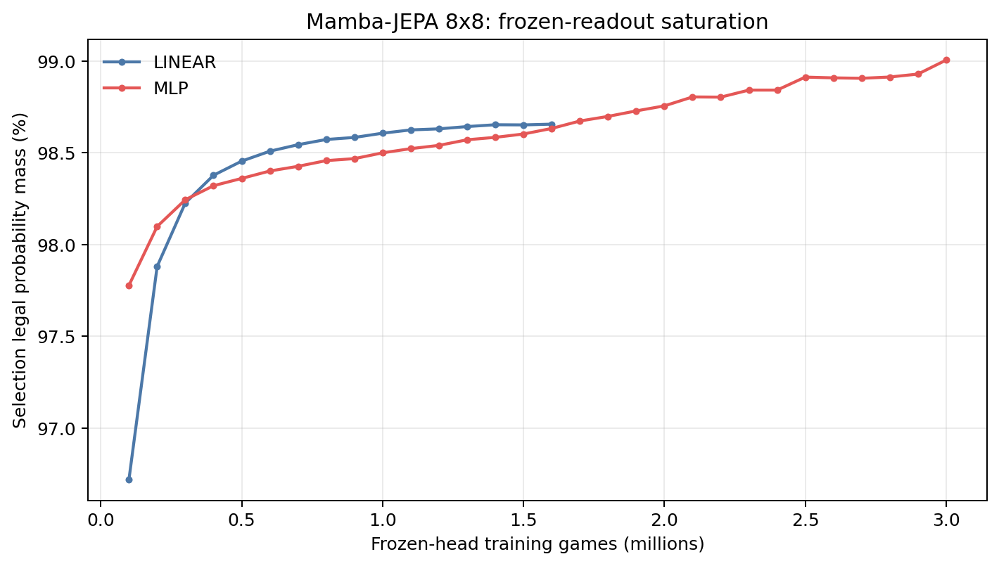
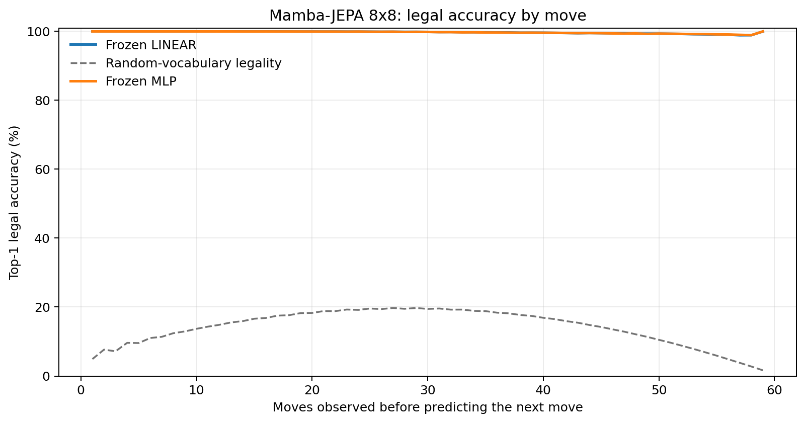
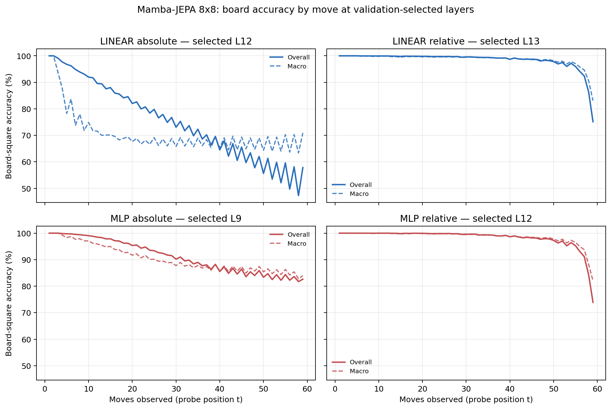

# Proposal evaluation: Mamba-JEPA 8x8

- **Suite:** `thesis_eval_suite_v1` over `unified_eval_v4`
- **Run:** `mamba_jepa_v5_hd_infonce_allpos_b8`
- **Checkpoint:** `final.pt` (`6fb692303ad514c5122cb1e500f30b5f7576125ce81317e3a6f0a428612c351f`)
- **Training budget:** `19,999,840` games / `200` shards
- **Next-move readout:** frozen bf16 encoder with common fp32 Linear/MLP readouts
- **Exact continuation:** intentionally excluded because corpus continuations are stochastic legal choices

## 1. Functional legality

| Readout | Top-1 legal | Top-3 legal fraction | Top-5 legal fraction | Legal probability mass |
|---|---:|---:|---:|---:|
| Frozen LINEAR | 99.72% | 96.81% | 92.50% | 98.61% |
| Frozen MLP | 99.72% | 96.80% | 92.49% | 98.90% |

### Statistical context

| Readout | Normalized legal lift | 95% CI for top-1 legal |
|---|---:|---:|
| Frozen LINEAR | 99.67% | 99.71%–99.73% |
| Frozen MLP | 99.67% | 99.71%–99.73% |

### Frozen-head saturation

There is no minimum shard count. Training stops under the pre-registered selection legal-mass patience rule and restores the best checkpoint.

### Legal accuracy by move

### Legality by normalized game phase

| Readout | Phase | Tokens | Mean legal moves | Top-1 legal | Legal mass |
|---|---:|---:|---:|---:|---:|
| Frozen LINEAR | 0.00–0.25 | 749,909 | 7.22 | 100.00% | 99.25% |
| Frozen LINEAR | 0.25–0.50 | 699,679 | 11.44 | 99.94% | 98.70% |
| Frozen LINEAR | 0.50–0.75 | 749,593 | 10.84 | 99.68% | 98.33% |
| Frozen LINEAR | 0.75–1.00 | 749,129 | 5.15 | 99.28% | 98.18% |
| Frozen MLP | 0.00–0.25 | 749,909 | 7.22 | 100.00% | 99.70% |
| Frozen MLP | 0.25–0.50 | 699,679 | 11.44 | 99.93% | 99.38% |
| Frozen MLP | 0.50–0.75 | 749,593 | 10.84 | 99.66% | 98.72% |
| Frozen MLP | 0.75–1.00 | 749,129 | 5.15 | 99.30% | 97.84% |

## 2. Board-state representations

Layer selection uses only the selection split. Headline test values are macro-balanced accuracy, so changing empty-square prevalence across board sizes cannot dominate the comparison.

**Macro accuracy** is the unweighted mean of the three per-class recalls. Absolute labels use empty/black/white and relative labels use empty/mine/opponent. Each class therefore contributes one third even when empty squares are much more common. Overall accuracy instead weights every square equally and can be dominated by the empty class.

| Probe | Labels | Best layer | Normalized depth | Test macro | Overall | Occupied | Empty |
|---|---|---:|---:|---:|---:|---:|---:|
| LINEAR | absolute | L12 | 0.800 | 68.92% | 75.60% | 53.42% | 100.00% |
| LINEAR | relative | L13 | 0.867 | 98.04% | 98.48% | 97.12% | 99.97% |
| MLP | absolute | L9 | 0.600 | 89.31% | 91.41% | 84.40% | 99.12% |
| MLP | relative | L12 | 0.800 | 97.82% | 98.30% | 96.77% | 99.99% |

### Probe accuracy by layer

These are the untouched test-split tables in the same format as the 8x8 unified JEPA notebook. `Selected` marks the layer chosen using the separate selection split, never the test results.

#### LINEAR board-state probe

| Layer | Absolute accuracy | Absolute macro | Relative accuracy | Relative macro | Selected |
|---:|---:|---:|---:|---:|:---|
| L0 | 62.61% | 55.55% | 64.82% | 58.16% |  |
| L1 | 71.50% | 64.77% | 76.13% | 70.45% |  |
| L2 | 70.22% | 63.55% | 83.90% | 80.87% |  |
| L3 | 73.05% | 66.24% | 87.22% | 84.19% |  |
| L4 | 73.91% | 67.06% | 88.63% | 85.72% |  |
| L5 | 74.35% | 67.49% | 89.46% | 86.66% |  |
| L6 | 73.92% | 66.99% | 93.36% | 91.64% |  |
| L7 | 74.46% | 67.60% | 93.94% | 92.33% |  |
| L8 | 74.75% | 67.93% | 94.19% | 92.65% |  |
| L9 | 74.49% | 67.66% | 97.09% | 96.32% |  |
| L10 | 74.68% | 67.88% | 97.41% | 96.74% |  |
| L11 | 75.45% | 68.73% | 98.20% | 97.69% |  |
| L12 | 75.60% | 68.92% | 98.44% | 98.00% | absolute |
| L13 | 75.49% | 68.77% | 98.48% | 98.04% | relative |
| L14 | 74.76% | 67.95% | 97.10% | 96.37% |  |
| L15 | 74.51% | 67.68% | 96.54% | 95.70% |  |

#### MLP board-state probe

| Layer | Absolute accuracy | Absolute macro | Relative accuracy | Relative macro | Selected |
|---:|---:|---:|---:|---:|:---|
| L0 | 65.08% | 58.73% | 65.26% | 58.67% |  |
| L1 | 73.84% | 67.91% | 75.62% | 69.92% |  |
| L2 | 80.42% | 76.93% | 82.96% | 79.95% |  |
| L3 | 82.23% | 78.16% | 86.11% | 82.94% |  |
| L4 | 83.22% | 79.07% | 87.62% | 84.56% |  |
| L5 | 83.57% | 79.32% | 88.53% | 85.53% |  |
| L6 | 88.53% | 85.80% | 92.20% | 90.29% |  |
| L7 | 87.98% | 84.92% | 93.07% | 91.30% |  |
| L8 | 87.32% | 84.01% | 93.39% | 91.65% |  |
| L9 | 91.41% | 89.31% | 96.51% | 95.64% | absolute |
| L10 | 90.51% | 88.12% | 96.89% | 96.12% |  |
| L11 | 85.62% | 81.71% | 98.06% | 97.51% |  |
| L12 | 81.24% | 76.10% | 98.30% | 97.82% | relative |
| L13 | 87.39% | 83.96% | 98.23% | 97.72% |  |
| L14 | 81.00% | 75.95% | 96.39% | 95.50% |  |
| L15 | 78.21% | 72.44% | 95.66% | 94.64% |  |

### Board accuracy by move at each selected layer

### Selected board probes by game phase

| Probe | Labels | Phase | Macro accuracy | Occupied | Empty |
|---|---|---:|---:|---:|---:|
| LINEAR | absolute | 1/4 | 97.84% | 96.92% | 100.00% |
| LINEAR | absolute | 2/4 | 82.78% | 75.83% | 100.00% |
| LINEAR | absolute | 11/4 | 67.65% | 51.50% | 100.00% |
| LINEAR | absolute | 12/4 | 67.28% | 50.92% | 100.00% |
| LINEAR | absolute | 13/4 | 68.28% | 52.48% | 99.99% |
| LINEAR | absolute | 14/4 | 67.46% | 51.18% | 100.00% |
| LINEAR | absolute | 15/4 | 67.59% | 51.39% | 100.00% |
| LINEAR | absolute | 16/4 | 67.58% | 51.38% | 100.00% |
| LINEAR | absolute | 3/4 | 76.29% | 65.35% | 100.00% |
| LINEAR | absolute | 4/4 | 72.01% | 58.10% | 100.00% |
| LINEAR | absolute | 5/4 | 70.56% | 56.19% | 100.00% |
| LINEAR | absolute | 6/4 | 69.04% | 53.69% | 100.00% |
| LINEAR | absolute | 7/4 | 68.73% | 53.47% | 100.00% |
| LINEAR | absolute | 8/4 | 68.24% | 52.40% | 100.00% |
| LINEAR | absolute | 9/4 | 68.00% | 52.02% | 100.00% |
| LINEAR | absolute | 10/4 | 67.41% | 51.15% | 100.00% |
| LINEAR | relative | 1/4 | 100.00% | 100.00% | 100.00% |
| LINEAR | relative | 2/4 | 99.92% | 99.89% | 100.00% |
| LINEAR | relative | 11/4 | 99.04% | 98.64% | 99.87% |
| LINEAR | relative | 12/4 | 98.93% | 98.47% | 99.89% |
| LINEAR | relative | 13/4 | 98.62% | 98.03% | 99.87% |
| LINEAR | relative | 14/4 | 98.22% | 97.43% | 99.86% |
| LINEAR | relative | 15/4 | 97.43% | 96.27% | 99.86% |
| LINEAR | relative | 16/4 | 91.00% | 86.59% | 100.00% |
| LINEAR | relative | 3/4 | 99.83% | 99.78% | 100.00% |
| LINEAR | relative | 4/4 | 99.74% | 99.64% | 100.00% |
| LINEAR | relative | 5/4 | 99.64% | 99.50% | 99.99% |
| LINEAR | relative | 6/4 | 99.63% | 99.49% | 99.98% |
| LINEAR | relative | 7/4 | 99.57% | 99.39% | 99.99% |
| LINEAR | relative | 8/4 | 99.51% | 99.31% | 99.98% |
| LINEAR | relative | 9/4 | 99.43% | 99.19% | 99.95% |
| LINEAR | relative | 10/4 | 99.29% | 98.98% | 99.93% |
| MLP | absolute | 1/4 | 100.00% | 100.00% | 100.00% |
| MLP | absolute | 2/4 | 98.66% | 98.10% | 100.00% |
| MLP | absolute | 11/4 | 87.08% | 81.78% | 97.67% |
| MLP | absolute | 12/4 | 86.72% | 81.76% | 96.62% |
| MLP | absolute | 13/4 | 86.62% | 82.32% | 95.25% |
| MLP | absolute | 14/4 | 86.47% | 82.60% | 94.22% |
| MLP | absolute | 15/4 | 85.64% | 82.41% | 92.11% |
| MLP | absolute | 16/4 | 84.42% | 82.34% | 88.59% |
| MLP | absolute | 3/4 | 97.25% | 95.95% | 100.00% |
| MLP | absolute | 4/4 | 95.56% | 93.34% | 99.99% |
| MLP | absolute | 5/4 | 94.01% | 91.06% | 99.94% |
| MLP | absolute | 6/4 | 92.04% | 88.15% | 99.82% |
| MLP | absolute | 7/4 | 90.84% | 86.48% | 99.67% |
| MLP | absolute | 8/4 | 89.45% | 84.45% | 99.47% |
| MLP | absolute | 9/4 | 88.36% | 83.07% | 98.95% |
| MLP | absolute | 10/4 | 87.41% | 81.98% | 98.31% |
| MLP | relative | 1/4 | 100.00% | 100.00% | 100.00% |
| MLP | relative | 2/4 | 99.97% | 99.96% | 100.00% |
| MLP | relative | 11/4 | 98.93% | 98.42% | 99.98% |
| MLP | relative | 12/4 | 98.66% | 98.03% | 99.96% |
| MLP | relative | 13/4 | 98.30% | 97.49% | 99.95% |
| MLP | relative | 14/4 | 97.87% | 96.84% | 99.97% |
| MLP | relative | 15/4 | 96.95% | 95.54% | 99.88% |
| MLP | relative | 16/4 | 89.83% | 85.19% | 99.29% |
| MLP | relative | 3/4 | 99.94% | 99.93% | 100.00% |
| MLP | relative | 4/4 | 99.91% | 99.88% | 100.00% |
| MLP | relative | 5/4 | 99.82% | 99.74% | 100.00% |
| MLP | relative | 6/4 | 99.82% | 99.75% | 100.00% |
| MLP | relative | 7/4 | 99.76% | 99.65% | 100.00% |
| MLP | relative | 8/4 | 99.64% | 99.48% | 100.00% |
| MLP | relative | 9/4 | 99.43% | 99.17% | 100.00% |
| MLP | relative | 10/4 | 99.26% | 98.92% | 99.98% |

## 3. Nanda-style causal intervention

- Readout: `frozen_mlp`
- Selected intervention scale: `4`
- Interpretation scope: JEPA encoder plus post-hoc frozen MLP readout

| Control | Target top-1 legal | Target legal mass | Top-N FP+FN |
|---|---:|---:|---:|
| Null | 91.50% | 90.06% | 2.392 |
| Magnitude-matched random | 92.20% | 89.89% | 2.358 |
| Relative-board direction | 97.00% | 93.26% | 0.832 |

For AR this edits the native prediction path. For JEPA it establishes causal steerability of the composed JEPA encoder plus its post-hoc frozen MLP readout; it is not evidence of a native JEPA action head.

## 4. Architecture-matched random-encoder control

### Frozen next-move readouts

| Readout | Trained top-1 legal | Random top-1 legal | Trained legal mass | Random legal mass |
|---|---:|---:|---:|---:|
| LINEAR | 99.72% | 40.56% | 98.61% | 22.42% |
| MLP | 99.72% | 50.17% | 98.90% | 28.62% |

### Board-state probes

The lift compares independently selection-chosen trained and random layers under the same probe protocol and position manifest.

| Probe | Labels | Trained macro | Random macro | Trained − random |
|---|---|---:|---:|---:|
| LINEAR | absolute | 68.92% | 55.86% | 13.06% |
| LINEAR | relative | 98.04% | 58.28% | 39.76% |
| MLP | absolute | 89.31% | 58.16% | 31.14% |
| MLP | relative | 97.82% | 58.67% | 39.15% |

## 5. Efficiency and reproducibility

- Encoder parameters: `25,529,856`
- Total parameters: `51,322,368`
- Checkpoint bytes: `411,662,574`
- Evaluation GPU: `NVIDIA L4`
- Training hardware: `unreported`
- Training precision: `bf16`
- Python / PyTorch / CUDA: `3.12.13` / `2.11.0+cu128` / `12.8`
- Median training chunk: `54.44 s`
- Estimated training loop: `3.02 h`
- Median games/s: `1836.96`
- Median supervision units/s: `106496.07`
- Timing scope: dt_seconds excludes normal checkpoint/Drive-sync time; validation is included only in observed_train_plus_validation_loop_hours

## 6. Interpretation boundary

- Board probes establish decodability, not by themselves causal use.
- Legal behavior measures rule compatibility, not strategic playing strength.
- Bootstrap legality intervals quantify test-game sampling only; they do not replace independent pretraining seeds.
- Board-probe point estimates use one deterministic probe seed; the random-encoder control is not a substitute for model-seed replication.
- Cross-board results compare separately trained scaling conditions, not zero-shot transfer.

## Artifact index

- Unified JSON: `/content/drive/MyDrive/Master_Thesis_Artifacts/runs/Mamba-JEPA/mamba_jepa_v5_hd_infonce_allpos_b8/thesis_eval/final/results__unified_eval_v4.json`
- Unified summary: `/content/drive/MyDrive/Master_Thesis_Artifacts/runs/Mamba-JEPA/mamba_jepa_v5_hd_infonce_allpos_b8/thesis_eval/final/summary__unified_eval_v4.md`
- Position manifest: `/content/drive/MyDrive/Master_Thesis_Artifacts/runs/Mamba-JEPA/mamba_jepa_v5_hd_infonce_allpos_b8/thesis_eval/final/position_manifest__unified_eval_v4.json`
- Legal-by-move figure: `/content/drive/MyDrive/Master_Thesis_Artifacts/runs/Mamba-JEPA/mamba_jepa_v5_hd_infonce_allpos_b8/thesis_eval/final/legal_accuracy_by_move__thesis_eval_suite_v1.png`
- Board-by-move figure: `/content/drive/MyDrive/Master_Thesis_Artifacts/runs/Mamba-JEPA/mamba_jepa_v5_hd_infonce_allpos_b8/thesis_eval/final/board_accuracy_by_move__thesis_eval_suite_v1.png`
- Random-control JSON: `/content/drive/MyDrive/Master_Thesis_Artifacts/runs/Mamba-JEPA/mamba_jepa_v5_hd_infonce_allpos_b8/thesis_eval/final/random_encoder_control/results__unified_eval_v4.json`
- Causal-intervention JSON: `/content/drive/MyDrive/Master_Thesis_Artifacts/runs/Mamba-JEPA/mamba_jepa_v5_hd_infonce_allpos_b8/thesis_eval/final/results__unified_eval_v4.json` (`causal_intervention` key)
