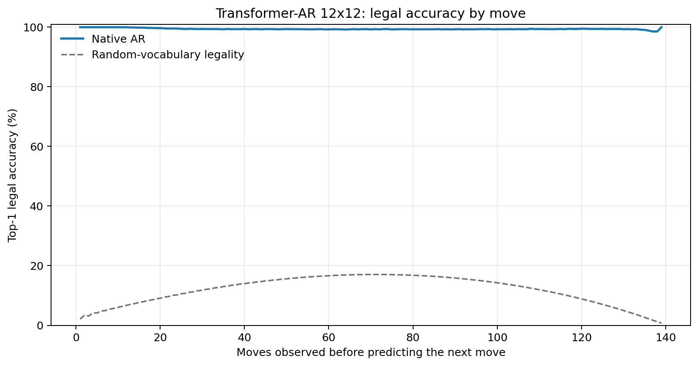
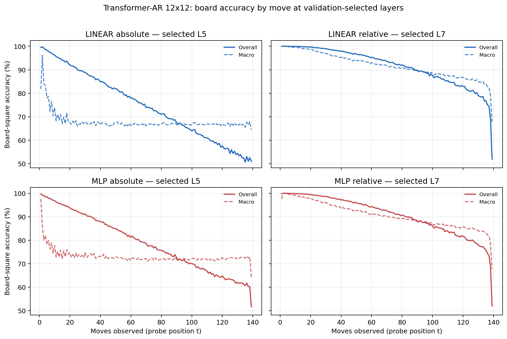

# Proposal evaluation: Transformer-AR 12x12

- **Suite:** `thesis_eval_suite_v1` over `unified_eval_v3`
- **Run:** `transformer_ar_b12`
- **Checkpoint:** `final.pt` (`cc3270ad1e75d9198b247c3228fe1999f491816c151d49285a12e2f0d942f175`)
- **Training budget:** `20,000,000` games / `200` shards
- **Next-move readout:** native pretrained AR head
- **Exact continuation:** intentionally excluded because corpus continuations are stochastic legal choices

## 1. Functional legality

| Readout | Top-1 legal | Top-3 legal fraction | Top-5 legal fraction | Legal probability mass |
|---|---:|---:|---:|---:|
| Native AR | 99.42% | 98.12% | 96.34% | 93.13% |

### Statistical context

| Readout | Normalized legal lift | 95% CI for top-1 legal |
|---|---:|---:|
| Native AR | 99.34% | 99.41%–99.42% |

### Legal accuracy by move

### Legality by normalized game phase

| Readout | Phase | Tokens | Mean legal moves | Top-1 legal | Legal mass |
|---|---:|---:|---:|---:|---:|
| Native AR | 0.00–0.25 | 1,749,230 | 11.70 | 99.71% | 97.25% |
| Native AR | 0.25–0.50 | 1,698,776 | 22.05 | 99.32% | 91.47% |
| Native AR | 0.50–0.75 | 1,748,740 | 22.37 | 99.31% | 91.21% |
| Native AR | 0.75–1.00 | 1,748,636 | 10.89 | 99.32% | 92.55% |

## 2. Board-state representations

Layer selection uses only the selection split. Headline test values are macro-balanced accuracy, so changing empty-square prevalence across board sizes cannot dominate the comparison.

**Macro accuracy** is the unweighted mean of the three per-class recalls. Absolute labels use empty/black/white and relative labels use empty/mine/opponent. Each class therefore contributes one third even when empty squares are much more common. Overall accuracy instead weights every square equally and can be dominated by the empty class.

| Probe | Labels | Best layer | Normalized depth | Test macro | Overall | Occupied | Empty |
|---|---|---:|---:|---:|---:|---:|---:|
| LINEAR | absolute | L5 | 0.625 | 67.30% | 74.96% | 50.96% | 99.99% |
| LINEAR | relative | L7 | 0.875 | 89.17% | 91.74% | 83.83% | 99.98% |
| MLP | absolute | L5 | 0.625 | 72.59% | 79.00% | 58.91% | 99.96% |
| MLP | relative | L7 | 0.875 | 88.01% | 90.86% | 82.15% | 99.94% |

### Probe accuracy by layer

These are the untouched test-split tables in the same format as the 8x8 unified JEPA notebook. `Selected` marks the layer chosen using the separate selection split, never the test results.

#### LINEAR board-state probe

| Layer | Absolute accuracy | Absolute macro | Relative accuracy | Relative macro | Selected |
|---:|---:|---:|---:|---:|:---|
| L0 | 63.75% | 55.94% | 65.03% | 57.56% |  |
| L1 | 70.20% | 62.45% | 74.63% | 68.23% |  |
| L2 | 74.28% | 66.54% | 79.75% | 73.65% |  |
| L3 | 74.86% | 67.19% | 82.20% | 76.71% |  |
| L4 | 74.88% | 67.21% | 86.28% | 82.03% |  |
| L5 | 74.96% | 67.30% | 90.12% | 87.04% | absolute |
| L6 | 74.89% | 67.21% | 91.29% | 88.57% |  |
| L7 | 74.76% | 67.04% | 91.74% | 89.17% | relative |
| L8 | 74.72% | 66.99% | 91.73% | 89.16% |  |

#### MLP board-state probe

| Layer | Absolute accuracy | Absolute macro | Relative accuracy | Relative macro | Selected |
|---:|---:|---:|---:|---:|:---|
| L0 | 65.02% | 57.47% | 65.27% | 57.72% |  |
| L1 | 69.86% | 62.40% | 72.59% | 65.95% |  |
| L2 | 74.01% | 66.34% | 78.07% | 71.62% |  |
| L3 | 74.94% | 67.33% | 80.73% | 74.82% |  |
| L4 | 75.24% | 67.70% | 84.66% | 79.89% |  |
| L5 | 79.00% | 72.59% | 89.16% | 85.79% | absolute |
| L6 | 77.08% | 70.07% | 90.45% | 87.46% |  |
| L7 | 78.26% | 71.62% | 90.86% | 88.01% | relative |
| L8 | 75.90% | 68.53% | 90.80% | 87.93% |  |

### Board accuracy by move at each selected layer

### Selected board probes by game phase

| Probe | Labels | Phase | Macro accuracy | Occupied | Empty |
|---|---|---:|---:|---:|---:|
| LINEAR | absolute | 1/4 | 81.96% | 73.74% | 100.00% |
| LINEAR | absolute | 2/4 | 71.48% | 57.52% | 100.00% |
| LINEAR | absolute | 11/4 | 67.12% | 50.69% | 99.98% |
| LINEAR | absolute | 12/4 | 67.00% | 50.52% | 99.97% |
| LINEAR | absolute | 13/4 | 66.98% | 50.49% | 99.96% |
| LINEAR | absolute | 14/4 | 66.94% | 50.45% | 99.94% |
| LINEAR | absolute | 15/4 | 66.94% | 50.46% | 99.90% |
| LINEAR | absolute | 16/4 | 66.91% | 50.57% | 99.64% |
| LINEAR | absolute | 3/4 | 68.66% | 52.98% | 100.00% |
| LINEAR | absolute | 4/4 | 68.05% | 52.09% | 100.00% |
| LINEAR | absolute | 5/4 | 67.74% | 51.62% | 100.00% |
| LINEAR | absolute | 6/4 | 67.23% | 50.87% | 100.00% |
| LINEAR | absolute | 7/4 | 67.10% | 50.66% | 100.00% |
| LINEAR | absolute | 8/4 | 67.12% | 50.68% | 100.00% |
| LINEAR | absolute | 9/4 | 66.92% | 50.38% | 99.99% |
| LINEAR | absolute | 10/4 | 67.08% | 50.62% | 99.99% |
| LINEAR | relative | 1/4 | 99.83% | 99.71% | 100.00% |
| LINEAR | relative | 2/4 | 99.29% | 98.93% | 100.00% |
| LINEAR | relative | 11/4 | 89.47% | 84.28% | 99.95% |
| LINEAR | relative | 12/4 | 88.42% | 82.70% | 99.96% |
| LINEAR | relative | 13/4 | 87.62% | 81.50% | 99.97% |
| LINEAR | relative | 14/4 | 86.79% | 80.27% | 99.95% |
| LINEAR | relative | 15/4 | 85.68% | 78.58% | 99.99% |
| LINEAR | relative | 16/4 | 81.62% | 72.52% | 99.98% |
| LINEAR | relative | 3/4 | 98.14% | 97.26% | 100.00% |
| LINEAR | relative | 4/4 | 96.73% | 95.16% | 99.99% |
| LINEAR | relative | 5/4 | 95.45% | 93.28% | 99.98% |
| LINEAR | relative | 6/4 | 94.16% | 91.35% | 99.97% |
| LINEAR | relative | 7/4 | 93.36% | 90.14% | 99.96% |
| LINEAR | relative | 8/4 | 92.20% | 88.38% | 99.97% |
| LINEAR | relative | 9/4 | 91.16% | 86.82% | 99.97% |
| LINEAR | relative | 10/4 | 90.45% | 85.75% | 99.94% |
| MLP | absolute | 1/4 | 82.15% | 74.76% | 100.00% |
| MLP | absolute | 2/4 | 75.98% | 64.53% | 100.00% |
| MLP | absolute | 11/4 | 71.99% | 58.05% | 99.90% |
| MLP | absolute | 12/4 | 72.08% | 58.20% | 99.84% |
| MLP | absolute | 13/4 | 72.00% | 58.10% | 99.78% |
| MLP | absolute | 14/4 | 72.00% | 58.16% | 99.68% |
| MLP | absolute | 15/4 | 72.48% | 58.96% | 99.54% |
| MLP | absolute | 16/4 | 72.16% | 58.81% | 98.83% |
| MLP | absolute | 3/4 | 74.74% | 62.15% | 100.00% |
| MLP | absolute | 4/4 | 74.28% | 61.48% | 100.00% |
| MLP | absolute | 5/4 | 73.66% | 60.53% | 100.00% |
| MLP | absolute | 6/4 | 73.05% | 59.58% | 99.99% |
| MLP | absolute | 7/4 | 72.44% | 58.66% | 99.99% |
| MLP | absolute | 8/4 | 72.32% | 58.51% | 99.97% |
| MLP | absolute | 9/4 | 72.00% | 58.00% | 99.95% |
| MLP | absolute | 10/4 | 72.21% | 58.33% | 99.94% |
| MLP | relative | 1/4 | 99.36% | 98.92% | 100.00% |
| MLP | relative | 2/4 | 98.63% | 97.98% | 99.99% |
| MLP | relative | 11/4 | 88.03% | 82.22% | 99.80% |
| MLP | relative | 12/4 | 87.15% | 80.89% | 99.82% |
| MLP | relative | 13/4 | 86.41% | 79.81% | 99.80% |
| MLP | relative | 14/4 | 85.63% | 78.70% | 99.71% |
| MLP | relative | 15/4 | 84.73% | 77.29% | 99.74% |
| MLP | relative | 16/4 | 81.03% | 71.78% | 99.74% |
| MLP | relative | 3/4 | 97.18% | 95.86% | 99.99% |
| MLP | relative | 4/4 | 95.67% | 93.62% | 99.99% |
| MLP | relative | 5/4 | 94.10% | 91.29% | 99.97% |
| MLP | relative | 6/4 | 92.88% | 89.48% | 99.95% |
| MLP | relative | 7/4 | 91.71% | 87.73% | 99.95% |
| MLP | relative | 8/4 | 90.68% | 86.15% | 99.93% |
| MLP | relative | 9/4 | 89.69% | 84.68% | 99.90% |
| MLP | relative | 10/4 | 89.03% | 83.69% | 99.88% |

## 3. Efficiency and reproducibility

- Encoder parameters: `25,435,648`
- Total parameters: `25,435,648`
- Checkpoint bytes: `305,971,689`
- Evaluation GPU: `NVIDIA L4`
- Training hardware: `unreported`
- Training precision: `bf16`
- Python / PyTorch / CUDA: `3.12.13` / `2.11.0+cu128` / `12.8`
- Median training chunk: `28.88 s`
- Estimated training loop: `1.60 h`
- Median games/s: `3462.37`
- Median supervision units/s: `480961.75`
- Timing scope: dt_seconds excludes normal checkpoint/Drive-sync time; validation is included only in observed_train_plus_validation_loop_hours

## 4. Interpretation boundary

- Board probes establish decodability, not by themselves causal use.
- Legal behavior measures rule compatibility, not strategic playing strength.
- Bootstrap legality intervals quantify test-game sampling only; they do not replace independent pretraining seeds.
- Board-probe point estimates use one deterministic probe seed; the random-encoder control is not a substitute for model-seed replication.
- Cross-board results compare separately trained scaling conditions, not zero-shot transfer.

## Artifact index

- Unified JSON: `/content/drive/MyDrive/Master_Thesis_Artifacts/runs/Transformer-AR/transformer_ar_b12/thesis_eval/final/results__unified_eval_v3.json`
- Unified summary: `/content/drive/MyDrive/Master_Thesis_Artifacts/runs/Transformer-AR/transformer_ar_b12/thesis_eval/final/summary__unified_eval_v3.md`
- Position manifest: `/content/drive/MyDrive/Master_Thesis_Artifacts/runs/Transformer-AR/transformer_ar_b12/thesis_eval/final/position_manifest__unified_eval_v3.json`
- Legal-by-move figure: `/content/drive/MyDrive/Master_Thesis_Artifacts/runs/Transformer-AR/transformer_ar_b12/thesis_eval/final/legal_accuracy_by_move__thesis_eval_suite_v1.png`
- Board-by-move figure: `/content/drive/MyDrive/Master_Thesis_Artifacts/runs/Transformer-AR/transformer_ar_b12/thesis_eval/final/board_accuracy_by_move__thesis_eval_suite_v1.png`
