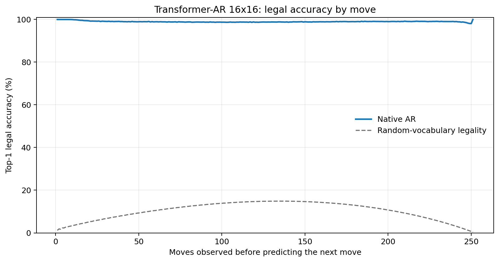
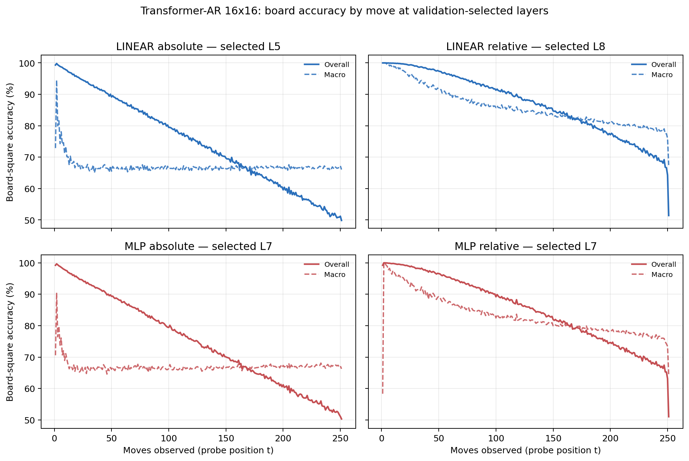

# Proposal evaluation: Transformer-AR 16x16

- **Suite:** `thesis_eval_suite_v1` over `unified_eval_v4`
- **Run:** `transformer_ar_b16`
- **Checkpoint:** `final.pt` (`39ba5994de998b615353189561ee7f104209a48c2e27ae654a2fb1c47beb0623`)
- **Training budget:** `20,000,000` games / `200` shards
- **Next-move readout:** native pretrained AR head
- **Exact continuation:** intentionally excluded because corpus continuations are stochastic legal choices

## 1. Functional legality

| Readout | Top-1 legal | Top-3 legal fraction | Top-5 legal fraction | Legal probability mass |
|---|---:|---:|---:|---:|
| Native AR | 98.99% | 98.12% | 97.01% | 88.78% |

### Statistical context

| Readout | Normalized legal lift | 95% CI for top-1 legal |
|---|---:|---:|
| Native AR | 98.87% | 98.98%–99.00% |

### Legal accuracy by move

### Legality by normalized game phase

| Readout | Phase | Tokens | Mean legal moves | Top-1 legal | Legal mass |
|---|---:|---:|---:|---:|---:|
| Native AR | 0.00–0.25 | 3,148,134 | 16.93 | 99.28% | 91.80% |
| Native AR | 0.25–0.50 | 3,097,644 | 33.66 | 98.77% | 86.53% |
| Native AR | 0.50–0.75 | 3,147,606 | 35.65 | 98.90% | 87.44% |
| Native AR | 0.75–1.00 | 3,147,581 | 18.01 | 99.00% | 89.31% |

## 2. Board-state representations

Layer selection uses only the selection split. Headline test values are macro-balanced accuracy, so changing empty-square prevalence across board sizes cannot dominate the comparison.

**Macro accuracy** is the unweighted mean of the three per-class recalls. Absolute labels use empty/black/white and relative labels use empty/mine/opponent. Each class therefore contributes one third even when empty squares are much more common. Overall accuracy instead weights every square equally and can be dominated by the empty class.

| Probe | Labels | Best layer | Normalized depth | Test macro | Overall | Occupied | Empty |
|---|---|---:|---:|---:|---:|---:|---:|
| LINEAR | absolute | L5 | 0.625 | 66.81% | 74.79% | 50.23% | 99.96% |
| LINEAR | relative | L8 | 1.000 | 82.88% | 87.02% | 74.39% | 99.97% |
| MLP | absolute | L7 | 0.875 | 67.03% | 74.94% | 50.60% | 99.89% |
| MLP | relative | L7 | 0.875 | 80.49% | 85.16% | 70.98% | 99.70% |

### Probe accuracy by layer

These are the untouched test-split tables in the same format as the 8x8 unified JEPA notebook. `Selected` marks the layer chosen using the separate selection split, never the test results.

#### LINEAR board-state probe

| Layer | Absolute accuracy | Absolute macro | Relative accuracy | Relative macro | Selected |
|---:|---:|---:|---:|---:|:---|
| L0 | 64.69% | 56.61% | 65.59% | 57.81% |  |
| L1 | 66.89% | 58.86% | 68.04% | 60.34% |  |
| L2 | 72.57% | 64.51% | 74.09% | 66.47% |  |
| L3 | 74.46% | 66.46% | 76.05% | 68.50% |  |
| L4 | 74.66% | 66.66% | 81.13% | 75.13% |  |
| L5 | 74.79% | 66.81% | 85.66% | 81.08% | absolute |
| L6 | 74.72% | 66.71% | 86.62% | 82.34% |  |
| L7 | 74.62% | 66.58% | 87.00% | 82.84% |  |
| L8 | 74.59% | 66.54% | 87.02% | 82.88% | relative |

#### MLP board-state probe

| Layer | Absolute accuracy | Absolute macro | Relative accuracy | Relative macro | Selected |
|---:|---:|---:|---:|---:|:---|
| L0 | 65.52% | 57.51% | 65.84% | 57.90% |  |
| L1 | 66.75% | 58.73% | 67.27% | 59.33% |  |
| L2 | 71.15% | 63.09% | 72.17% | 64.37% |  |
| L3 | 73.43% | 65.38% | 74.47% | 66.64% |  |
| L4 | 74.09% | 66.03% | 78.34% | 71.55% |  |
| L5 | 74.64% | 66.68% | 83.59% | 78.41% |  |
| L6 | 74.35% | 66.26% | 84.78% | 79.96% |  |
| L7 | 74.94% | 67.03% | 85.16% | 80.49% | absolute + relative |
| L8 | 74.59% | 66.57% | 85.12% | 80.43% |  |

### Board accuracy by move at each selected layer

### Selected board probes by game phase

| Probe | Labels | Phase | Macro accuracy | Occupied | Empty |
|---|---|---:|---:|---:|---:|
| LINEAR | absolute | 1/4 | 74.43% | 62.61% | 100.00% |
| LINEAR | absolute | 2/4 | 67.88% | 51.94% | 100.00% |
| LINEAR | absolute | 11/4 | 66.61% | 49.98% | 99.88% |
| LINEAR | absolute | 12/4 | 66.76% | 50.22% | 99.84% |
| LINEAR | absolute | 13/4 | 66.80% | 50.31% | 99.78% |
| LINEAR | absolute | 14/4 | 66.67% | 50.12% | 99.77% |
| LINEAR | absolute | 15/4 | 66.77% | 50.26% | 99.78% |
| LINEAR | absolute | 16/4 | 66.65% | 50.08% | 99.77% |
| LINEAR | absolute | 3/4 | 67.14% | 50.73% | 100.00% |
| LINEAR | absolute | 4/4 | 66.73% | 50.10% | 100.00% |
| LINEAR | absolute | 5/4 | 66.79% | 50.18% | 100.00% |
| LINEAR | absolute | 6/4 | 66.72% | 50.09% | 99.98% |
| LINEAR | absolute | 7/4 | 66.64% | 49.98% | 99.97% |
| LINEAR | absolute | 8/4 | 66.76% | 50.17% | 99.95% |
| LINEAR | absolute | 9/4 | 66.65% | 50.01% | 99.92% |
| LINEAR | absolute | 10/4 | 66.58% | 49.93% | 99.89% |
| LINEAR | relative | 1/4 | 99.03% | 98.55% | 100.00% |
| LINEAR | relative | 2/4 | 96.28% | 94.50% | 100.00% |
| LINEAR | relative | 11/4 | 82.72% | 74.18% | 99.91% |
| LINEAR | relative | 12/4 | 81.97% | 73.05% | 99.88% |
| LINEAR | relative | 13/4 | 81.12% | 71.81% | 99.85% |
| LINEAR | relative | 14/4 | 80.34% | 70.64% | 99.84% |
| LINEAR | relative | 15/4 | 79.55% | 69.45% | 99.83% |
| LINEAR | relative | 16/4 | 77.57% | 66.45% | 99.88% |
| LINEAR | relative | 3/4 | 93.06% | 89.73% | 100.00% |
| LINEAR | relative | 4/4 | 90.59% | 85.99% | 100.00% |
| LINEAR | relative | 5/4 | 88.61% | 83.03% | 99.99% |
| LINEAR | relative | 6/4 | 87.04% | 80.64% | 99.99% |
| LINEAR | relative | 7/4 | 86.00% | 79.09% | 99.98% |
| LINEAR | relative | 8/4 | 85.10% | 77.74% | 99.96% |
| LINEAR | relative | 9/4 | 84.31% | 76.54% | 99.95% |
| LINEAR | relative | 10/4 | 83.42% | 75.22% | 99.93% |
| MLP | absolute | 1/4 | 71.71% | 58.64% | 100.00% |
| MLP | absolute | 2/4 | 66.61% | 50.00% | 100.00% |
| MLP | absolute | 11/4 | 66.85% | 50.43% | 99.69% |
| MLP | absolute | 12/4 | 66.99% | 50.67% | 99.62% |
| MLP | absolute | 13/4 | 67.13% | 50.94% | 99.51% |
| MLP | absolute | 14/4 | 67.04% | 50.79% | 99.52% |
| MLP | absolute | 15/4 | 67.29% | 51.23% | 99.40% |
| MLP | absolute | 16/4 | 67.19% | 51.14% | 99.29% |
| MLP | absolute | 3/4 | 66.84% | 50.26% | 99.99% |
| MLP | absolute | 4/4 | 66.71% | 50.07% | 99.98% |
| MLP | absolute | 5/4 | 66.93% | 50.42% | 99.96% |
| MLP | absolute | 6/4 | 66.50% | 49.78% | 99.94% |
| MLP | absolute | 7/4 | 66.49% | 49.77% | 99.90% |
| MLP | absolute | 8/4 | 66.58% | 49.93% | 99.87% |
| MLP | absolute | 9/4 | 66.52% | 49.87% | 99.80% |
| MLP | absolute | 10/4 | 66.78% | 50.31% | 99.73% |
| MLP | relative | 1/4 | 96.25% | 94.55% | 100.00% |
| MLP | relative | 2/4 | 93.41% | 90.35% | 99.98% |
| MLP | relative | 11/4 | 79.83% | 70.19% | 99.29% |
| MLP | relative | 12/4 | 79.12% | 69.22% | 99.05% |
| MLP | relative | 13/4 | 78.54% | 68.48% | 98.79% |
| MLP | relative | 14/4 | 77.92% | 67.67% | 98.57% |
| MLP | relative | 15/4 | 77.15% | 66.87% | 97.83% |
| MLP | relative | 16/4 | 75.25% | 64.72% | 96.41% |
| MLP | relative | 3/4 | 90.33% | 85.79% | 99.97% |
| MLP | relative | 4/4 | 87.92% | 82.14% | 99.93% |
| MLP | relative | 5/4 | 85.83% | 79.03% | 99.88% |
| MLP | relative | 6/4 | 84.37% | 76.81% | 99.82% |
| MLP | relative | 7/4 | 82.99% | 74.75% | 99.77% |
| MLP | relative | 8/4 | 82.21% | 73.61% | 99.67% |
| MLP | relative | 9/4 | 81.40% | 72.46% | 99.53% |
| MLP | relative | 10/4 | 80.45% | 71.05% | 99.43% |

## 3. Efficiency and reproducibility

- Encoder parameters: `25,607,680`
- Total parameters: `25,607,680`
- Checkpoint bytes: `309,433,833`
- Evaluation GPU: `NVIDIA L4`
- Training hardware: `unreported`
- Training precision: `bf16`
- Python / PyTorch / CUDA: `3.13.15` / `2.11.0+cu128` / `12.8`
- Median training chunk: `73.75 s`
- Estimated training loop: `4.10 h`
- Median games/s: `1355.89`
- Median supervision units/s: `340066.67`
- Timing scope: dt_seconds excludes normal checkpoint/Drive-sync time; validation is included only in observed_train_plus_validation_loop_hours

## 4. Interpretation boundary

- Board probes establish decodability, not by themselves causal use.
- Legal behavior measures rule compatibility, not strategic playing strength.
- Bootstrap legality intervals quantify test-game sampling only; they do not replace independent pretraining seeds.
- Board-probe point estimates use one deterministic probe seed; the random-encoder control is not a substitute for model-seed replication.
- Cross-board results compare separately trained scaling conditions, not zero-shot transfer.

## Artifact index

- Unified JSON: `/content/drive/MyDrive/Master_Thesis_Artifacts/runs/Transformer-AR/transformer_ar_b16/thesis_eval/final/results__unified_eval_v4.json`
- Unified summary: `/content/drive/MyDrive/Master_Thesis_Artifacts/runs/Transformer-AR/transformer_ar_b16/thesis_eval/final/summary__unified_eval_v4.md`
- Position manifest: `/content/drive/MyDrive/Master_Thesis_Artifacts/runs/Transformer-AR/transformer_ar_b16/thesis_eval/final/position_manifest__unified_eval_v4.json`
- Legal-by-move figure: `/content/drive/MyDrive/Master_Thesis_Artifacts/runs/Transformer-AR/transformer_ar_b16/thesis_eval/final/legal_accuracy_by_move__thesis_eval_suite_v1.png`
- Board-by-move figure: `/content/drive/MyDrive/Master_Thesis_Artifacts/runs/Transformer-AR/transformer_ar_b16/thesis_eval/final/board_accuracy_by_move__thesis_eval_suite_v1.png`
