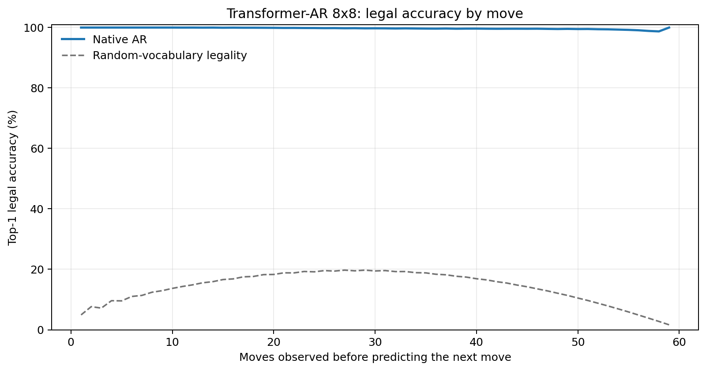
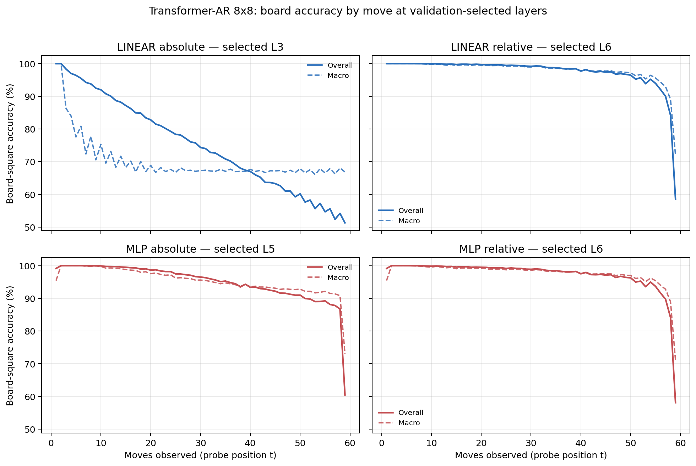

# Proposal evaluation: Transformer-AR 8x8

- **Suite:** `thesis_eval_suite_v1` over `unified_eval_v4`
- **Run:** `transformer_ar_b8_bf16`
- **Checkpoint:** `final.pt` (`a8372296a542876e0b4e5cee22a1e6940f9d3de6772e12835314e982a52b56d2`)
- **Training budget:** `19,999,840` games / `200` shards
- **Next-move readout:** native pretrained AR head
- **Exact continuation:** intentionally excluded because corpus continuations are stochastic legal choices

## 1. Functional legality

| Readout | Top-1 legal | Top-3 legal fraction | Top-5 legal fraction | Legal probability mass |
|---|---:|---:|---:|---:|
| Native AR | 99.73% | 96.78% | 92.45% | 98.48% |

### Statistical context

| Readout | Normalized legal lift | 95% CI for top-1 legal |
|---|---:|---:|
| Native AR | 99.68% | 99.72%–99.73% |

### Legal accuracy by move

### Legality by normalized game phase

| Readout | Phase | Tokens | Mean legal moves | Top-1 legal | Legal mass |
|---|---:|---:|---:|---:|---:|
| Native AR | 0.00–0.25 | 749,909 | 7.22 | 99.99% | 99.96% |
| Native AR | 0.25–0.50 | 699,679 | 11.44 | 99.86% | 99.30% |
| Native AR | 0.50–0.75 | 749,593 | 10.84 | 99.66% | 97.83% |
| Native AR | 0.75–1.00 | 749,129 | 5.15 | 99.40% | 96.87% |

## 2. Board-state representations

Layer selection uses only the selection split. Headline test values are macro-balanced accuracy, so changing empty-square prevalence across board sizes cannot dominate the comparison.

**Macro accuracy** is the unweighted mean of the three per-class recalls. Absolute labels use empty/black/white and relative labels use empty/mine/opponent. Each class therefore contributes one third even when empty squares are much more common. Overall accuracy instead weights every square equally and can be dominated by the empty class.

| Probe | Labels | Best layer | Normalized depth | Test macro | Overall | Occupied | Empty |
|---|---|---:|---:|---:|---:|---:|---:|
| LINEAR | absolute | L3 | 0.375 | 68.88% | 75.57% | 53.37% | 100.00% |
| LINEAR | relative | L6 | 0.750 | 96.91% | 97.59% | 95.41% | 99.99% |
| MLP | absolute | L5 | 0.625 | 93.88% | 95.20% | 90.83% | 100.00% |
| MLP | relative | L6 | 0.750 | 96.61% | 97.38% | 95.01% | 99.98% |

### Probe accuracy by layer

These are the untouched test-split tables in the same format as the 8x8 unified JEPA notebook. `Selected` marks the layer chosen using the separate selection split, never the test results.

#### LINEAR board-state probe

| Layer | Absolute accuracy | Absolute macro | Relative accuracy | Relative macro | Selected |
|---:|---:|---:|---:|---:|:---|
| L0 | 62.69% | 55.79% | 64.79% | 58.21% |  |
| L1 | 75.21% | 68.50% | 87.72% | 84.31% |  |
| L2 | 75.46% | 68.75% | 91.74% | 89.39% |  |
| L3 | 75.57% | 68.88% | 94.54% | 92.99% | absolute |
| L4 | 75.60% | 68.91% | 96.09% | 94.98% |  |
| L5 | 75.54% | 68.83% | 97.23% | 96.45% |  |
| L6 | 75.38% | 68.64% | 97.59% | 96.91% | relative |
| L7 | 75.19% | 68.41% | 97.54% | 96.86% |  |
| L8 | 75.17% | 68.39% | 97.51% | 96.82% |  |

#### MLP board-state probe

| Layer | Absolute accuracy | Absolute macro | Relative accuracy | Relative macro | Selected |
|---:|---:|---:|---:|---:|:---|
| L0 | 65.13% | 58.78% | 65.24% | 58.57% |  |
| L1 | 84.41% | 80.29% | 87.16% | 83.64% |  |
| L2 | 88.53% | 85.42% | 91.31% | 88.84% |  |
| L3 | 92.03% | 89.85% | 94.39% | 92.80% |  |
| L4 | 93.77% | 92.07% | 95.94% | 94.78% |  |
| L5 | 95.20% | 93.88% | 97.09% | 96.24% | absolute |
| L6 | 92.83% | 90.88% | 97.38% | 96.61% | relative |
| L7 | 87.01% | 83.48% | 97.22% | 96.44% |  |
| L8 | 85.57% | 81.65% | 97.17% | 96.38% |  |

### Board accuracy by move at each selected layer

### Selected board probes by game phase

| Probe | Labels | Phase | Macro accuracy | Occupied | Empty |
|---|---|---:|---:|---:|---:|
| LINEAR | absolute | 1/4 | 95.44% | 94.19% | 100.00% |
| LINEAR | absolute | 2/4 | 80.08% | 71.79% | 100.00% |
| LINEAR | absolute | 11/4 | 67.73% | 51.64% | 100.00% |
| LINEAR | absolute | 12/4 | 67.57% | 51.35% | 99.99% |
| LINEAR | absolute | 13/4 | 67.78% | 51.76% | 99.99% |
| LINEAR | absolute | 14/4 | 67.73% | 51.57% | 100.00% |
| LINEAR | absolute | 15/4 | 67.69% | 51.55% | 99.98% |
| LINEAR | absolute | 16/4 | 67.62% | 51.45% | 99.96% |
| LINEAR | absolute | 3/4 | 74.86% | 63.38% | 100.00% |
| LINEAR | absolute | 4/4 | 72.25% | 58.48% | 100.00% |
| LINEAR | absolute | 5/4 | 70.29% | 55.73% | 100.00% |
| LINEAR | absolute | 6/4 | 68.87% | 53.43% | 100.00% |
| LINEAR | absolute | 7/4 | 68.12% | 52.60% | 100.00% |
| LINEAR | absolute | 8/4 | 68.52% | 52.83% | 100.00% |
| LINEAR | absolute | 9/4 | 68.06% | 52.12% | 100.00% |
| LINEAR | absolute | 10/4 | 68.15% | 52.27% | 100.00% |
| LINEAR | relative | 1/4 | 100.00% | 100.00% | 100.00% |
| LINEAR | relative | 2/4 | 99.99% | 99.99% | 100.00% |
| LINEAR | relative | 11/4 | 98.21% | 97.35% | 99.98% |
| LINEAR | relative | 12/4 | 97.88% | 96.86% | 99.97% |
| LINEAR | relative | 13/4 | 97.61% | 96.45% | 99.99% |
| LINEAR | relative | 14/4 | 97.07% | 95.63% | 100.00% |
| LINEAR | relative | 15/4 | 96.00% | 94.07% | 99.98% |
| LINEAR | relative | 16/4 | 87.02% | 80.57% | 100.00% |
| LINEAR | relative | 3/4 | 99.82% | 99.74% | 100.00% |
| LINEAR | relative | 4/4 | 99.65% | 99.47% | 100.00% |
| LINEAR | relative | 5/4 | 99.51% | 99.26% | 100.00% |
| LINEAR | relative | 6/4 | 99.46% | 99.21% | 99.99% |
| LINEAR | relative | 7/4 | 99.31% | 98.97% | 99.99% |
| LINEAR | relative | 8/4 | 99.15% | 98.76% | 99.98% |
| LINEAR | relative | 9/4 | 98.93% | 98.43% | 99.98% |
| LINEAR | relative | 10/4 | 98.55% | 97.87% | 99.98% |
| MLP | absolute | 1/4 | 98.53% | 97.03% | 100.00% |
| MLP | absolute | 2/4 | 99.96% | 99.95% | 100.00% |
| MLP | absolute | 11/4 | 93.94% | 90.91% | 100.00% |
| MLP | absolute | 12/4 | 93.52% | 90.27% | 99.99% |
| MLP | absolute | 13/4 | 92.99% | 89.50% | 100.00% |
| MLP | absolute | 14/4 | 92.66% | 88.99% | 100.00% |
| MLP | absolute | 15/4 | 92.04% | 88.06% | 99.98% |
| MLP | absolute | 16/4 | 86.70% | 80.08% | 99.96% |
| MLP | absolute | 3/4 | 99.67% | 99.52% | 100.00% |
| MLP | absolute | 4/4 | 99.21% | 98.81% | 100.00% |
| MLP | absolute | 5/4 | 98.55% | 97.82% | 100.00% |
| MLP | absolute | 6/4 | 97.72% | 96.58% | 100.00% |
| MLP | absolute | 7/4 | 96.88% | 95.34% | 100.00% |
| MLP | absolute | 8/4 | 96.06% | 94.10% | 100.00% |
| MLP | absolute | 9/4 | 95.33% | 92.99% | 100.00% |
| MLP | absolute | 10/4 | 94.60% | 91.91% | 100.00% |
| MLP | relative | 1/4 | 98.53% | 97.03% | 100.00% |
| MLP | relative | 2/4 | 99.96% | 99.95% | 100.00% |
| MLP | relative | 11/4 | 97.98% | 97.03% | 99.94% |
| MLP | relative | 12/4 | 97.63% | 96.50% | 99.94% |
| MLP | relative | 13/4 | 97.32% | 96.07% | 99.91% |
| MLP | relative | 14/4 | 96.87% | 95.37% | 99.93% |
| MLP | relative | 15/4 | 95.76% | 93.74% | 99.95% |
| MLP | relative | 16/4 | 86.66% | 80.27% | 99.88% |
| MLP | relative | 3/4 | 99.71% | 99.58% | 100.00% |
| MLP | relative | 4/4 | 99.44% | 99.18% | 100.00% |
| MLP | relative | 5/4 | 99.18% | 98.80% | 99.99% |
| MLP | relative | 6/4 | 99.05% | 98.63% | 99.98% |
| MLP | relative | 7/4 | 98.89% | 98.39% | 99.98% |
| MLP | relative | 8/4 | 98.80% | 98.26% | 99.98% |
| MLP | relative | 9/4 | 98.59% | 97.92% | 99.97% |
| MLP | relative | 10/4 | 98.23% | 97.42% | 99.95% |

## 3. Nanda-style causal intervention

- Readout: `native_ar`
- Selected intervention scale: `2`
- Interpretation scope: native model behavior

| Control | Target top-1 legal | Target legal mass | Top-N FP+FN |
|---|---:|---:|---:|
| Null | 91.40% | 89.60% | 2.292 |
| Magnitude-matched random | 90.40% | 89.72% | 2.274 |
| Relative-board direction | 97.30% | 95.88% | 0.432 |

For AR this edits the native prediction path. For JEPA it establishes causal steerability of the composed JEPA encoder plus its post-hoc frozen MLP readout; it is not evidence of a native JEPA action head.

## 4. Efficiency and reproducibility

- Encoder parameters: `25,312,768`
- Total parameters: `25,312,768`
- Checkpoint bytes: `303,991,401`
- Evaluation GPU: `NVIDIA L4`
- Training hardware: `unreported`
- Training precision: `bf16`
- Python / PyTorch / CUDA: `3.13.15` / `2.11.0+cu128` / `12.8`
- Median training chunk: `11.00 s`
- Estimated training loop: `0.61 h`
- Median games/s: `9091.47`
- Median supervision units/s: `536113.74`
- Timing scope: dt_seconds excludes normal checkpoint/Drive-sync time; validation is included only in observed_train_plus_validation_loop_hours

## 5. Interpretation boundary

- Board probes establish decodability, not by themselves causal use.
- Legal behavior measures rule compatibility, not strategic playing strength.
- Bootstrap legality intervals quantify test-game sampling only; they do not replace independent pretraining seeds.
- Board-probe point estimates use one deterministic probe seed; the random-encoder control is not a substitute for model-seed replication.
- Cross-board results compare separately trained scaling conditions, not zero-shot transfer.

## Artifact index

- Unified JSON: `/content/drive/MyDrive/Master_Thesis_Artifacts/runs/Transformer-AR/transformer_ar_b8_bf16/thesis_eval/final/results__unified_eval_v4.json`
- Unified summary: `/content/drive/MyDrive/Master_Thesis_Artifacts/runs/Transformer-AR/transformer_ar_b8_bf16/thesis_eval/final/summary__unified_eval_v4.md`
- Position manifest: `/content/drive/MyDrive/Master_Thesis_Artifacts/runs/Transformer-AR/transformer_ar_b8_bf16/thesis_eval/final/position_manifest__unified_eval_v4.json`
- Legal-by-move figure: `/content/drive/MyDrive/Master_Thesis_Artifacts/runs/Transformer-AR/transformer_ar_b8_bf16/thesis_eval/final/legal_accuracy_by_move__thesis_eval_suite_v1.png`
- Board-by-move figure: `/content/drive/MyDrive/Master_Thesis_Artifacts/runs/Transformer-AR/transformer_ar_b8_bf16/thesis_eval/final/board_accuracy_by_move__thesis_eval_suite_v1.png`
- Causal-intervention JSON: `/content/drive/MyDrive/Master_Thesis_Artifacts/runs/Transformer-AR/transformer_ar_b8_bf16/thesis_eval/final/results__unified_eval_v4.json` (`causal_intervention` key)
