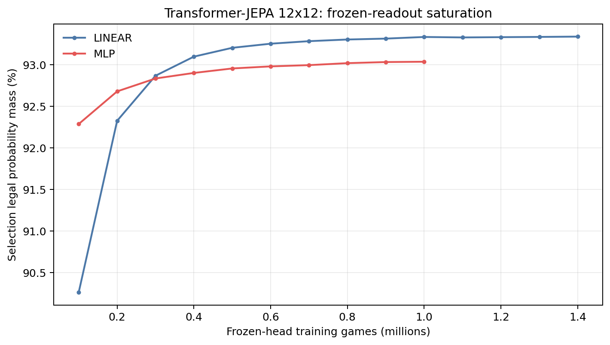
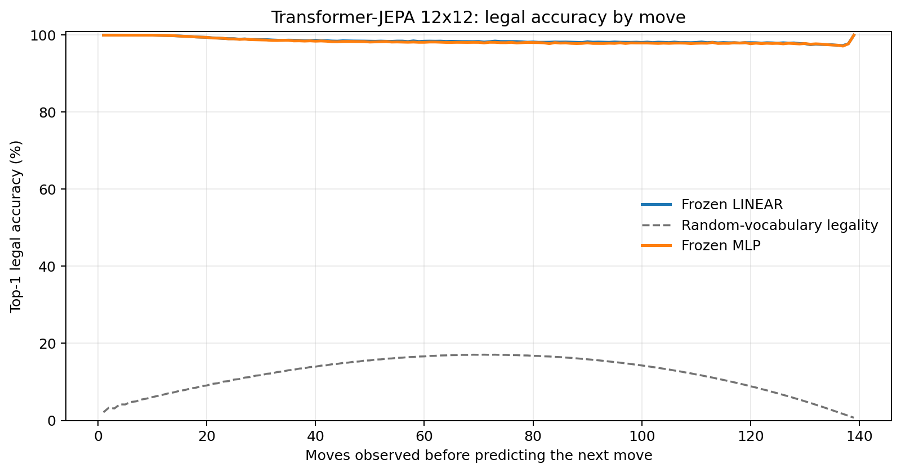
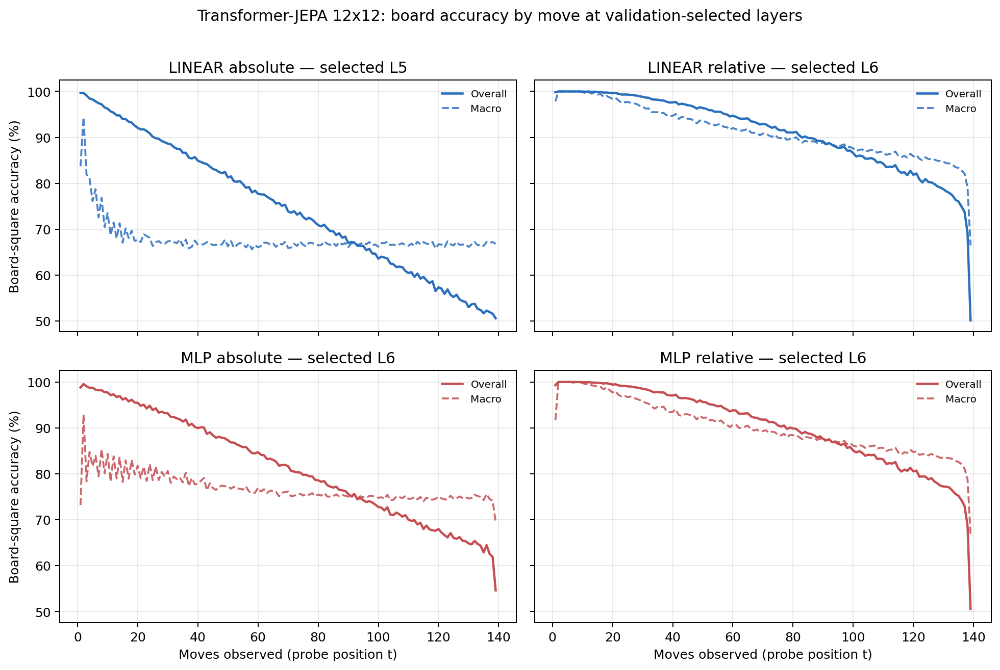

# Proposal evaluation: Transformer-JEPA 12x12

- **Suite:** `thesis_eval_suite_v1` over `unified_eval_v4`
- **Run:** `transformer_jepa_v5_hd_infonce_allpos_b12`
- **Checkpoint:** `final.pt` (`8cda977e9fd018c8b4943cd941885f673edd35df9ff45223b2f49aa0117c1462`)
- **Training budget:** `20,000,000` games / `200` shards
- **Next-move readout:** frozen bf16 encoder with common fp32 Linear/MLP readouts
- **Exact continuation:** intentionally excluded because corpus continuations are stochastic legal choices

## 1. Functional legality

| Readout | Top-1 legal | Top-3 legal fraction | Top-5 legal fraction | Legal probability mass |
|---|---:|---:|---:|---:|
| Frozen LINEAR | 98.52% | 97.27% | 95.54% | 93.30% |
| Frozen MLP | 98.38% | 97.12% | 95.38% | 92.94% |

### Statistical context

| Readout | Normalized legal lift | 95% CI for top-1 legal |
|---|---:|---:|
| Frozen LINEAR | 98.32% | 98.51%–98.54% |
| Frozen MLP | 98.17% | 98.37%–98.40% |

### Frozen-head saturation

There is no minimum shard count. Training stops under the pre-registered selection legal-mass patience rule and restores the best checkpoint.

### Legal accuracy by move

### Legality by normalized game phase

| Readout | Phase | Tokens | Mean legal moves | Top-1 legal | Legal mass |
|---|---:|---:|---:|---:|---:|
| Frozen LINEAR | 0.00–0.25 | 1,749,230 | 11.70 | 99.46% | 96.52% |
| Frozen LINEAR | 0.25–0.50 | 1,698,776 | 22.05 | 98.46% | 91.78% |
| Frozen LINEAR | 0.50–0.75 | 1,748,740 | 22.37 | 98.21% | 91.37% |
| Frozen LINEAR | 0.75–1.00 | 1,748,636 | 10.89 | 97.97% | 93.47% |
| Frozen MLP | 0.00–0.25 | 1,749,230 | 11.70 | 99.44% | 96.21% |
| Frozen MLP | 0.25–0.50 | 1,698,776 | 22.05 | 98.27% | 91.42% |
| Frozen MLP | 0.50–0.75 | 1,748,740 | 22.37 | 97.96% | 90.94% |
| Frozen MLP | 0.75–1.00 | 1,748,636 | 10.89 | 97.86% | 93.14% |

## 2. Board-state representations

Layer selection uses only the selection split. Headline test values are macro-balanced accuracy, so changing empty-square prevalence across board sizes cannot dominate the comparison.

**Macro accuracy** is the unweighted mean of the three per-class recalls. Absolute labels use empty/black/white and relative labels use empty/mine/opponent. Each class therefore contributes one third even when empty squares are much more common. Overall accuracy instead weights every square equally and can be dominated by the empty class.

| Probe | Labels | Best layer | Normalized depth | Test macro | Overall | Occupied | Empty |
|---|---|---:|---:|---:|---:|---:|---:|
| LINEAR | absolute | L5 | 0.625 | 67.23% | 74.90% | 50.84% | 100.00% |
| LINEAR | relative | L6 | 0.750 | 88.48% | 91.21% | 82.81% | 99.97% |
| MLP | absolute | L6 | 0.750 | 75.84% | 81.49% | 63.77% | 99.97% |
| MLP | relative | L6 | 0.750 | 87.40% | 90.38% | 81.24% | 99.92% |

### Probe accuracy by layer

These are the untouched test-split tables in the same format as the 8x8 unified JEPA notebook. `Selected` marks the layer chosen using the separate selection split, never the test results.

#### LINEAR board-state probe

| Layer | Absolute accuracy | Absolute macro | Relative accuracy | Relative macro | Selected |
|---:|---:|---:|---:|---:|:---|
| L0 | 63.70% | 55.88% | 65.00% | 57.53% |  |
| L1 | 68.66% | 60.99% | 72.73% | 66.29% |  |
| L2 | 73.29% | 65.54% | 80.69% | 75.20% |  |
| L3 | 74.60% | 66.89% | 83.83% | 78.87% |  |
| L4 | 74.89% | 67.21% | 85.44% | 80.91% |  |
| L5 | 74.90% | 67.23% | 89.92% | 86.77% | absolute |
| L6 | 74.81% | 67.12% | 91.21% | 88.48% | relative |
| L7 | 74.27% | 66.46% | 90.99% | 88.27% |  |
| L8 | 73.80% | 65.99% | 90.25% | 87.44% |  |

#### MLP board-state probe

| Layer | Absolute accuracy | Absolute macro | Relative accuracy | Relative macro | Selected |
|---:|---:|---:|---:|---:|:---|
| L0 | 65.00% | 57.44% | 65.27% | 57.69% |  |
| L1 | 69.00% | 61.74% | 71.10% | 64.41% |  |
| L2 | 74.10% | 66.86% | 78.67% | 72.89% |  |
| L3 | 76.53% | 69.53% | 82.10% | 76.76% |  |
| L4 | 76.52% | 69.37% | 83.98% | 79.03% |  |
| L5 | 80.48% | 74.53% | 89.00% | 85.59% |  |
| L6 | 81.49% | 75.84% | 90.38% | 87.40% | absolute + relative |
| L7 | 79.58% | 73.45% | 89.79% | 86.76% |  |
| L8 | 76.38% | 69.46% | 88.72% | 85.54% |  |

### Board accuracy by move at each selected layer

### Selected board probes by game phase

| Probe | Labels | Phase | Macro accuracy | Occupied | Empty |
|---|---|---:|---:|---:|---:|
| LINEAR | absolute | 1/4 | 81.83% | 73.59% | 100.00% |
| LINEAR | absolute | 2/4 | 71.54% | 57.61% | 100.00% |
| LINEAR | absolute | 11/4 | 67.00% | 50.51% | 99.99% |
| LINEAR | absolute | 12/4 | 66.99% | 50.49% | 99.98% |
| LINEAR | absolute | 13/4 | 66.86% | 50.30% | 99.97% |
| LINEAR | absolute | 14/4 | 67.04% | 50.56% | 99.98% |
| LINEAR | absolute | 15/4 | 66.83% | 50.26% | 99.98% |
| LINEAR | absolute | 16/4 | 67.04% | 50.58% | 100.00% |
| LINEAR | absolute | 3/4 | 68.65% | 52.98% | 100.00% |
| LINEAR | absolute | 4/4 | 67.95% | 51.94% | 100.00% |
| LINEAR | absolute | 5/4 | 67.29% | 50.96% | 100.00% |
| LINEAR | absolute | 6/4 | 67.18% | 50.79% | 100.00% |
| LINEAR | absolute | 7/4 | 66.86% | 50.29% | 100.00% |
| LINEAR | absolute | 8/4 | 67.07% | 50.60% | 100.00% |
| LINEAR | absolute | 9/4 | 66.84% | 50.26% | 100.00% |
| LINEAR | absolute | 10/4 | 66.98% | 50.47% | 99.99% |
| LINEAR | relative | 1/4 | 99.78% | 99.59% | 100.00% |
| LINEAR | relative | 2/4 | 99.56% | 99.38% | 100.00% |
| LINEAR | relative | 11/4 | 88.61% | 82.99% | 99.92% |
| LINEAR | relative | 12/4 | 87.63% | 81.52% | 99.92% |
| LINEAR | relative | 13/4 | 86.79% | 80.29% | 99.93% |
| LINEAR | relative | 14/4 | 86.11% | 79.30% | 99.91% |
| LINEAR | relative | 15/4 | 85.14% | 77.79% | 99.96% |
| LINEAR | relative | 16/4 | 81.20% | 71.93% | 99.96% |
| LINEAR | relative | 3/4 | 98.06% | 97.18% | 100.00% |
| LINEAR | relative | 4/4 | 96.43% | 94.72% | 99.99% |
| LINEAR | relative | 5/4 | 94.83% | 92.35% | 99.98% |
| LINEAR | relative | 6/4 | 93.62% | 90.53% | 99.98% |
| LINEAR | relative | 7/4 | 92.43% | 88.74% | 99.96% |
| LINEAR | relative | 8/4 | 91.27% | 86.99% | 99.94% |
| LINEAR | relative | 9/4 | 90.21% | 85.40% | 99.95% |
| LINEAR | relative | 10/4 | 89.40% | 84.18% | 99.94% |
| MLP | absolute | 1/4 | 84.19% | 77.76% | 100.00% |
| MLP | absolute | 2/4 | 82.27% | 73.88% | 100.00% |
| MLP | absolute | 11/4 | 75.18% | 62.80% | 99.94% |
| MLP | absolute | 12/4 | 74.99% | 62.53% | 99.89% |
| MLP | absolute | 13/4 | 74.92% | 62.44% | 99.89% |
| MLP | absolute | 14/4 | 74.71% | 62.14% | 99.84% |
| MLP | absolute | 15/4 | 74.82% | 62.32% | 99.85% |
| MLP | absolute | 16/4 | 74.38% | 61.60% | 99.92% |
| MLP | absolute | 3/4 | 81.15% | 71.77% | 100.00% |
| MLP | absolute | 4/4 | 79.77% | 69.71% | 100.00% |
| MLP | absolute | 5/4 | 78.57% | 67.91% | 99.99% |
| MLP | absolute | 6/4 | 77.45% | 66.16% | 99.99% |
| MLP | absolute | 7/4 | 76.80% | 65.19% | 99.98% |
| MLP | absolute | 8/4 | 76.19% | 64.31% | 99.98% |
| MLP | absolute | 9/4 | 75.65% | 63.49% | 99.96% |
| MLP | absolute | 10/4 | 75.45% | 63.19% | 99.94% |
| MLP | relative | 1/4 | 99.10% | 98.37% | 100.00% |
| MLP | relative | 2/4 | 99.24% | 98.93% | 100.00% |
| MLP | relative | 11/4 | 87.30% | 81.12% | 99.78% |
| MLP | relative | 12/4 | 86.34% | 79.71% | 99.72% |
| MLP | relative | 13/4 | 85.64% | 78.76% | 99.59% |
| MLP | relative | 14/4 | 84.88% | 77.69% | 99.44% |
| MLP | relative | 15/4 | 83.98% | 76.31% | 99.45% |
| MLP | relative | 16/4 | 80.55% | 71.24% | 99.32% |
| MLP | relative | 3/4 | 97.39% | 96.20% | 100.00% |
| MLP | relative | 4/4 | 95.49% | 93.35% | 99.99% |
| MLP | relative | 5/4 | 93.69% | 90.68% | 99.97% |
| MLP | relative | 6/4 | 92.41% | 88.76% | 99.97% |
| MLP | relative | 7/4 | 91.07% | 86.75% | 99.95% |
| MLP | relative | 8/4 | 89.93% | 85.03% | 99.92% |
| MLP | relative | 9/4 | 88.84% | 83.39% | 99.88% |
| MLP | relative | 10/4 | 88.10% | 82.32% | 99.83% |

## 3. Efficiency and reproducibility

- Encoder parameters: `25,435,648`
- Total parameters: `51,133,952`
- Checkpoint bytes: `410,957,495`
- Evaluation GPU: `NVIDIA L4`
- Training hardware: `unreported`
- Training precision: `bf16`
- Python / PyTorch / CUDA: `3.12.13` / `2.11.0+cu128` / `12.8`
- Median training chunk: `74.59 s`
- Estimated training loop: `4.14 h`
- Median games/s: `1340.69`
- Median supervision units/s: `184883.73`
- Timing scope: dt_seconds excludes normal checkpoint/Drive-sync time; validation is included only in observed_train_plus_validation_loop_hours

## 4. Interpretation boundary

- Board probes establish decodability, not by themselves causal use.
- Legal behavior measures rule compatibility, not strategic playing strength.
- Bootstrap legality intervals quantify test-game sampling only; they do not replace independent pretraining seeds.
- Board-probe point estimates use one deterministic probe seed; the random-encoder control is not a substitute for model-seed replication.
- Cross-board results compare separately trained scaling conditions, not zero-shot transfer.

## Artifact index

- Unified JSON: `/content/drive/MyDrive/Master_Thesis_Artifacts/runs/Transformer-JEPA/transformer_jepa_v5_hd_infonce_allpos_b12/thesis_eval/final/results__unified_eval_v4.json`
- Unified summary: `/content/drive/MyDrive/Master_Thesis_Artifacts/runs/Transformer-JEPA/transformer_jepa_v5_hd_infonce_allpos_b12/thesis_eval/final/summary__unified_eval_v4.md`
- Position manifest: `/content/drive/MyDrive/Master_Thesis_Artifacts/runs/Transformer-JEPA/transformer_jepa_v5_hd_infonce_allpos_b12/thesis_eval/final/position_manifest__unified_eval_v4.json`
- Legal-by-move figure: `/content/drive/MyDrive/Master_Thesis_Artifacts/runs/Transformer-JEPA/transformer_jepa_v5_hd_infonce_allpos_b12/thesis_eval/final/legal_accuracy_by_move__thesis_eval_suite_v1.png`
- Board-by-move figure: `/content/drive/MyDrive/Master_Thesis_Artifacts/runs/Transformer-JEPA/transformer_jepa_v5_hd_infonce_allpos_b12/thesis_eval/final/board_accuracy_by_move__thesis_eval_suite_v1.png`
