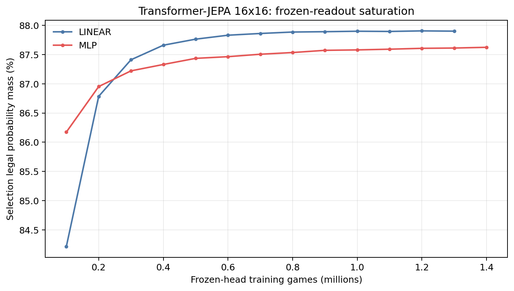
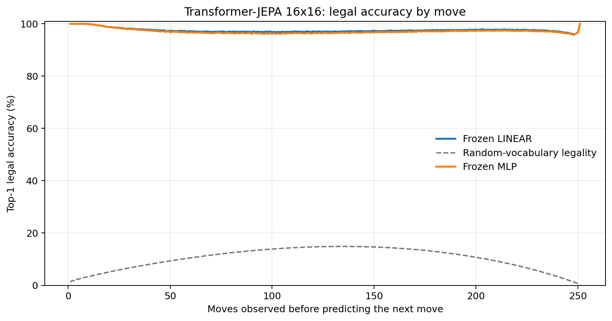
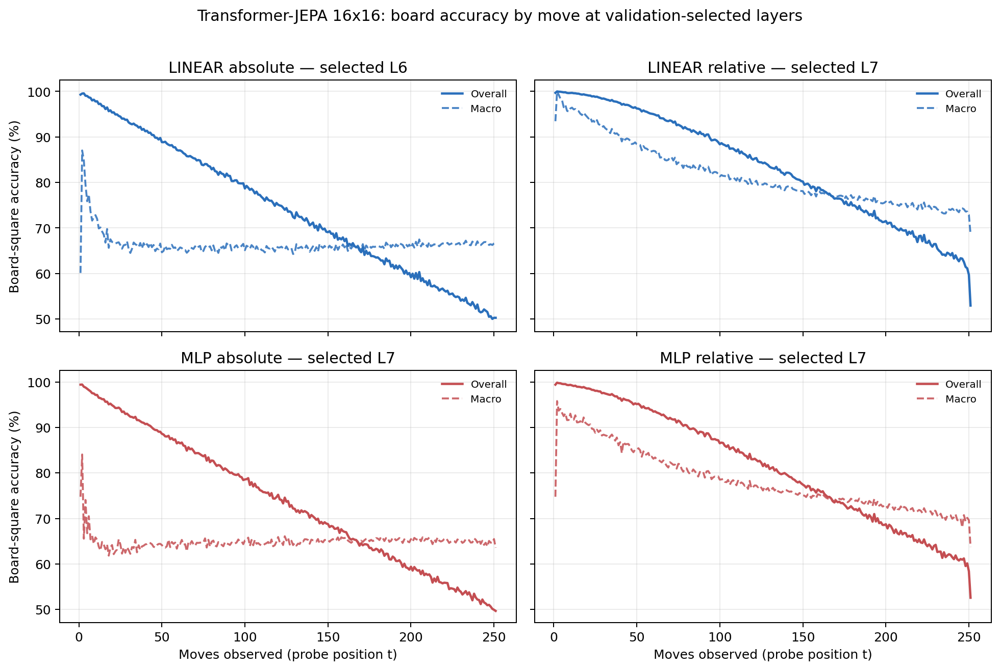

# Proposal evaluation: Transformer-JEPA 16x16

- **Suite:** `thesis_eval_suite_v1` over `unified_eval_v4`
- **Run:** `transformer_jepa_v5_hd_infonce_allpos_b16`
- **Checkpoint:** `final.pt` (`b11199e3483a8a0a2da0fb225d0a7aedcb33a67fd968356542c70a78e812a571`)
- **Training budget:** `20,000,000` games / `200` shards
- **Next-move readout:** frozen bf16 encoder with common fp32 Linear/MLP readouts
- **Exact continuation:** intentionally excluded because corpus continuations are stochastic legal choices

## 1. Functional legality

| Readout | Top-1 legal | Top-3 legal fraction | Top-5 legal fraction | Legal probability mass |
|---|---:|---:|---:|---:|
| Frozen LINEAR | 97.54% | 96.49% | 95.30% | 87.93% |
| Frozen MLP | 97.14% | 96.09% | 94.91% | 87.61% |

### Statistical context

| Readout | Normalized legal lift | 95% CI for top-1 legal |
|---|---:|---:|
| Frozen LINEAR | 97.26% | 97.53%–97.55% |
| Frozen MLP | 96.81% | 97.13%–97.16% |

### Frozen-head saturation

There is no minimum shard count. Training stops under the pre-registered selection legal-mass patience rule and restores the best checkpoint.

### Legal accuracy by move

### Legality by normalized game phase

| Readout | Phase | Tokens | Mean legal moves | Top-1 legal | Legal mass |
|---|---:|---:|---:|---:|---:|
| Frozen LINEAR | 0.00–0.25 | 3,148,134 | 16.93 | 98.33% | 92.00% |
| Frozen LINEAR | 0.25–0.50 | 3,097,644 | 33.66 | 96.99% | 84.29% |
| Frozen LINEAR | 0.50–0.75 | 3,147,606 | 35.65 | 97.33% | 85.52% |
| Frozen LINEAR | 0.75–1.00 | 3,147,581 | 18.01 | 97.49% | 89.85% |
| Frozen MLP | 0.00–0.25 | 3,148,134 | 16.93 | 98.14% | 91.42% |
| Frozen MLP | 0.25–0.50 | 3,097,644 | 33.66 | 96.41% | 84.15% |
| Frozen MLP | 0.50–0.75 | 3,147,606 | 35.65 | 96.84% | 85.35% |
| Frozen MLP | 0.75–1.00 | 3,147,581 | 18.01 | 97.16% | 89.48% |

## 2. Board-state representations

Layer selection uses only the selection split. Headline test values are macro-balanced accuracy, so changing empty-square prevalence across board sizes cannot dominate the comparison.

**Macro accuracy** is the unweighted mean of the three per-class recalls. Absolute labels use empty/black/white and relative labels use empty/mine/opponent. Each class therefore contributes one third even when empty squares are much more common. Overall accuracy instead weights every square equally and can be dominated by the empty class.

| Probe | Labels | Best layer | Normalized depth | Test macro | Overall | Occupied | Empty |
|---|---|---:|---:|---:|---:|---:|---:|
| LINEAR | absolute | L6 | 0.750 | 66.26% | 74.36% | 49.45% | 99.89% |
| LINEAR | relative | L7 | 0.875 | 78.37% | 83.49% | 67.91% | 99.46% |
| MLP | absolute | L7 | 0.875 | 65.70% | 73.82% | 48.84% | 99.43% |
| MLP | relative | L7 | 0.875 | 75.99% | 81.56% | 64.61% | 98.92% |

### Probe accuracy by layer

These are the untouched test-split tables in the same format as the 8x8 unified JEPA notebook. `Selected` marks the layer chosen using the separate selection split, never the test results.

#### LINEAR board-state probe

| Layer | Absolute accuracy | Absolute macro | Relative accuracy | Relative macro | Selected |
|---:|---:|---:|---:|---:|:---|
| L0 | 64.56% | 56.49% | 65.46% | 57.68% |  |
| L1 | 65.66% | 57.59% | 66.96% | 59.30% |  |
| L2 | 68.26% | 60.15% | 69.58% | 61.87% |  |
| L3 | 70.67% | 62.58% | 72.18% | 64.55% |  |
| L4 | 72.38% | 64.26% | 74.95% | 67.63% |  |
| L5 | 73.94% | 65.82% | 79.90% | 73.66% |  |
| L6 | 74.36% | 66.26% | 83.36% | 78.11% | absolute |
| L7 | 74.06% | 65.94% | 83.49% | 78.37% | relative |
| L8 | 73.61% | 65.50% | 82.47% | 77.21% |  |

#### MLP board-state probe

| Layer | Absolute accuracy | Absolute macro | Relative accuracy | Relative macro | Selected |
|---:|---:|---:|---:|---:|:---|
| L0 | 65.50% | 57.49% | 65.78% | 57.81% |  |
| L1 | 66.11% | 58.04% | 66.61% | 58.66% |  |
| L2 | 67.55% | 59.48% | 68.26% | 60.34% |  |
| L3 | 69.36% | 61.38% | 70.30% | 62.55% |  |
| L4 | 70.96% | 62.95% | 72.61% | 65.08% |  |
| L5 | 72.85% | 64.73% | 77.39% | 70.75% |  |
| L6 | 73.85% | 65.72% | 81.34% | 75.67% |  |
| L7 | 73.82% | 65.70% | 81.56% | 75.99% | absolute + relative |
| L8 | 73.08% | 64.90% | 80.21% | 74.41% |  |

### Board accuracy by move at each selected layer

### Selected board probes by game phase

| Probe | Labels | Phase | Macro accuracy | Occupied | Empty |
|---|---|---:|---:|---:|---:|
| LINEAR | absolute | 1/4 | 74.57% | 62.72% | 100.00% |
| LINEAR | absolute | 2/4 | 67.22% | 50.95% | 100.00% |
| LINEAR | absolute | 11/4 | 65.88% | 48.97% | 99.69% |
| LINEAR | absolute | 12/4 | 66.06% | 49.25% | 99.67% |
| LINEAR | absolute | 13/4 | 66.27% | 49.65% | 99.50% |
| LINEAR | absolute | 14/4 | 66.40% | 49.87% | 99.45% |
| LINEAR | absolute | 15/4 | 66.63% | 50.18% | 99.51% |
| LINEAR | absolute | 16/4 | 66.57% | 50.05% | 99.58% |
| LINEAR | absolute | 3/4 | 66.48% | 49.74% | 100.00% |
| LINEAR | absolute | 4/4 | 65.83% | 48.75% | 99.99% |
| LINEAR | absolute | 5/4 | 65.68% | 48.53% | 99.98% |
| LINEAR | absolute | 6/4 | 65.80% | 48.73% | 99.93% |
| LINEAR | absolute | 7/4 | 65.94% | 48.97% | 99.88% |
| LINEAR | absolute | 8/4 | 65.67% | 48.59% | 99.84% |
| LINEAR | absolute | 9/4 | 65.60% | 48.50% | 99.80% |
| LINEAR | absolute | 10/4 | 65.81% | 48.85% | 99.72% |
| LINEAR | relative | 1/4 | 96.31% | 94.78% | 99.98% |
| LINEAR | relative | 2/4 | 93.46% | 90.51% | 99.92% |
| LINEAR | relative | 11/4 | 77.33% | 66.72% | 98.69% |
| LINEAR | relative | 12/4 | 76.61% | 65.75% | 98.44% |
| LINEAR | relative | 13/4 | 75.82% | 64.79% | 97.99% |
| LINEAR | relative | 14/4 | 75.06% | 63.91% | 97.46% |
| LINEAR | relative | 15/4 | 74.35% | 63.04% | 97.09% |
| LINEAR | relative | 16/4 | 73.31% | 61.14% | 97.71% |
| LINEAR | relative | 3/4 | 90.19% | 85.59% | 99.90% |
| LINEAR | relative | 4/4 | 87.51% | 81.51% | 99.84% |
| LINEAR | relative | 5/4 | 84.97% | 77.73% | 99.78% |
| LINEAR | relative | 6/4 | 83.28% | 75.19% | 99.68% |
| LINEAR | relative | 7/4 | 81.48% | 72.58% | 99.49% |
| LINEAR | relative | 8/4 | 80.13% | 70.64% | 99.31% |
| LINEAR | relative | 9/4 | 79.11% | 69.21% | 99.06% |
| LINEAR | relative | 10/4 | 78.12% | 67.79% | 98.92% |
| MLP | absolute | 1/4 | 68.17% | 53.34% | 99.93% |
| MLP | absolute | 2/4 | 64.13% | 46.38% | 99.89% |
| MLP | absolute | 11/4 | 65.28% | 48.56% | 98.73% |
| MLP | absolute | 12/4 | 65.49% | 49.13% | 98.20% |
| MLP | absolute | 13/4 | 65.37% | 49.42% | 97.28% |
| MLP | absolute | 14/4 | 65.40% | 49.82% | 96.55% |
| MLP | absolute | 15/4 | 65.21% | 50.08% | 95.46% |
| MLP | absolute | 16/4 | 64.88% | 50.03% | 94.57% |
| MLP | absolute | 3/4 | 64.63% | 47.02% | 99.89% |
| MLP | absolute | 4/4 | 64.75% | 47.19% | 99.85% |
| MLP | absolute | 5/4 | 64.82% | 47.31% | 99.83% |
| MLP | absolute | 6/4 | 64.68% | 47.14% | 99.76% |
| MLP | absolute | 7/4 | 65.01% | 47.69% | 99.65% |
| MLP | absolute | 8/4 | 64.93% | 47.63% | 99.52% |
| MLP | absolute | 9/4 | 65.04% | 47.91% | 99.29% |
| MLP | absolute | 10/4 | 65.30% | 48.43% | 99.05% |
| MLP | relative | 1/4 | 91.83% | 88.56% | 99.92% |
| MLP | relative | 2/4 | 89.69% | 85.14% | 99.82% |
| MLP | relative | 11/4 | 74.61% | 63.15% | 97.68% |
| MLP | relative | 12/4 | 73.94% | 62.58% | 96.75% |
| MLP | relative | 13/4 | 73.12% | 61.95% | 95.55% |
| MLP | relative | 14/4 | 72.16% | 61.26% | 94.01% |
| MLP | relative | 15/4 | 71.25% | 60.69% | 92.44% |
| MLP | relative | 16/4 | 69.69% | 59.40% | 90.28% |
| MLP | relative | 3/4 | 86.75% | 80.66% | 99.76% |
| MLP | relative | 4/4 | 84.15% | 76.68% | 99.66% |
| MLP | relative | 5/4 | 81.87% | 73.28% | 99.60% |
| MLP | relative | 6/4 | 80.18% | 70.75% | 99.41% |
| MLP | relative | 7/4 | 78.49% | 68.29% | 99.17% |
| MLP | relative | 8/4 | 77.27% | 66.59% | 98.92% |
| MLP | relative | 9/4 | 76.24% | 65.19% | 98.54% |
| MLP | relative | 10/4 | 75.29% | 63.96% | 98.11% |

## 3. Efficiency and reproducibility

- Encoder parameters: `25,607,680`
- Total parameters: `51,478,016`
- Checkpoint bytes: `416,046,775`
- Evaluation GPU: `NVIDIA L4`
- Training hardware: `unreported`
- Training precision: `bf16`
- Python / PyTorch / CUDA: `3.13.15` / `2.11.0+cu128` / `12.8`
- Median training chunk: `155.82 s`
- Estimated training loop: `8.66 h`
- Median games/s: `641.77`
- Median supervision units/s: `160330.87`
- Timing scope: dt_seconds excludes normal checkpoint/Drive-sync time; validation is included only in observed_train_plus_validation_loop_hours

## 4. Interpretation boundary

- Board probes establish decodability, not by themselves causal use.
- Legal behavior measures rule compatibility, not strategic playing strength.
- Bootstrap legality intervals quantify test-game sampling only; they do not replace independent pretraining seeds.
- Board-probe point estimates use one deterministic probe seed; the random-encoder control is not a substitute for model-seed replication.
- Cross-board results compare separately trained scaling conditions, not zero-shot transfer.

## Artifact index

- Unified JSON: `/content/drive/MyDrive/Master_Thesis_Artifacts/runs/Transformer-JEPA/transformer_jepa_v5_hd_infonce_allpos_b16/thesis_eval/final/results__unified_eval_v4.json`
- Unified summary: `/content/drive/MyDrive/Master_Thesis_Artifacts/runs/Transformer-JEPA/transformer_jepa_v5_hd_infonce_allpos_b16/thesis_eval/final/summary__unified_eval_v4.md`
- Position manifest: `/content/drive/MyDrive/Master_Thesis_Artifacts/runs/Transformer-JEPA/transformer_jepa_v5_hd_infonce_allpos_b16/thesis_eval/final/position_manifest__unified_eval_v4.json`
- Legal-by-move figure: `/content/drive/MyDrive/Master_Thesis_Artifacts/runs/Transformer-JEPA/transformer_jepa_v5_hd_infonce_allpos_b16/thesis_eval/final/legal_accuracy_by_move__thesis_eval_suite_v1.png`
- Board-by-move figure: `/content/drive/MyDrive/Master_Thesis_Artifacts/runs/Transformer-JEPA/transformer_jepa_v5_hd_infonce_allpos_b16/thesis_eval/final/board_accuracy_by_move__thesis_eval_suite_v1.png`
