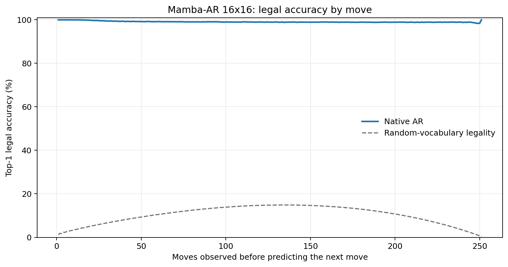
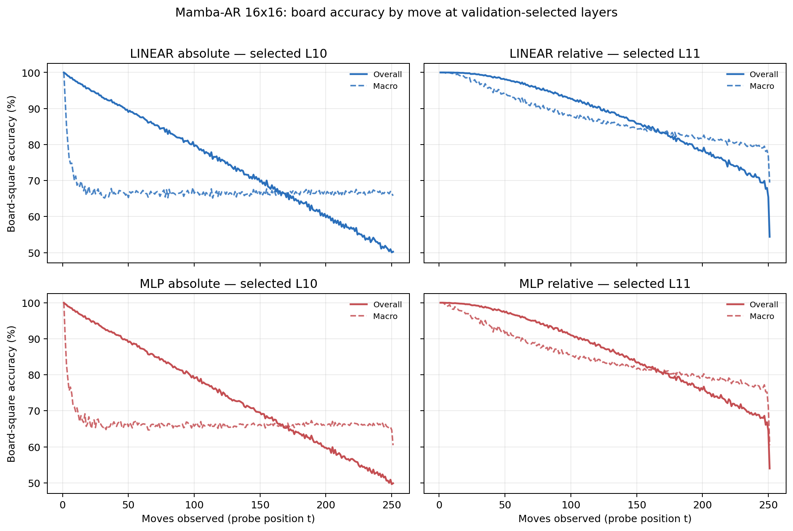

# Proposal evaluation: Mamba-AR 16x16

- **Suite:** `thesis_eval_suite_v1` over `unified_eval_v4`
- **Run:** `selected`
- **Checkpoint:** `final.pt` (`1e350a96ded6586032173bb406c6d6d9eec316a7a0105bf16a643fc0f55ee2bd`)
- **Training budget:** `20,000,000` games / `200` shards
- **Next-move readout:** native pretrained AR head
- **Exact continuation:** intentionally excluded because corpus continuations are stochastic legal choices

## 1. Functional legality

| Readout | Top-1 legal | Top-3 legal fraction | Top-5 legal fraction | Legal probability mass |
|---|---:|---:|---:|---:|
| Native AR | 99.10% | 98.31% | 97.27% | 91.31% |

### Statistical context

| Readout | Normalized legal lift | 95% CI for top-1 legal |
|---|---:|---:|
| Native AR | 98.99% | 99.09%–99.11% |

### Legal accuracy by move

### Legality by normalized game phase

| Readout | Phase | Tokens | Mean legal moves | Top-1 legal | Legal mass |
|---|---:|---:|---:|---:|---:|
| Native AR | 0.00–0.25 | 3,148,134 | 16.93 | 99.53% | 94.93% |
| Native AR | 0.25–0.50 | 3,097,644 | 33.66 | 99.04% | 89.12% |
| Native AR | 0.50–0.75 | 3,147,606 | 35.65 | 98.93% | 89.82% |
| Native AR | 0.75–1.00 | 3,147,581 | 18.01 | 98.89% | 91.33% |

## 2. Board-state representations

Layer selection uses only the selection split. Headline test values are macro-balanced accuracy, so changing empty-square prevalence across board sizes cannot dominate the comparison.

**Macro accuracy** is the unweighted mean of the three per-class recalls. Absolute labels use empty/black/white and relative labels use empty/mine/opponent. Each class therefore contributes one third even when empty squares are much more common. Overall accuracy instead weights every square equally and can be dominated by the empty class.

| Probe | Labels | Best layer | Normalized depth | Test macro | Overall | Occupied | Empty |
|---|---|---:|---:|---:|---:|---:|---:|
| LINEAR | absolute | L10 | 0.667 | 66.71% | 74.72% | 50.09% | 99.96% |
| LINEAR | relative | L11 | 0.733 | 84.13% | 87.97% | 76.26% | 99.96% |
| MLP | absolute | L10 | 0.667 | 66.38% | 74.41% | 49.69% | 99.74% |
| MLP | relative | L11 | 0.733 | 82.06% | 86.32% | 73.40% | 99.56% |

### Probe accuracy by layer

These are the untouched test-split tables in the same format as the 8x8 unified JEPA notebook. `Selected` marks the layer chosen using the separate selection split, never the test results.

#### LINEAR board-state probe

| Layer | Absolute accuracy | Absolute macro | Relative accuracy | Relative macro | Selected |
|---:|---:|---:|---:|---:|:---|
| L0 | 64.75% | 56.61% | 65.66% | 57.81% |  |
| L1 | 69.96% | 61.85% | 71.03% | 63.21% |  |
| L2 | 69.40% | 61.35% | 72.63% | 65.64% |  |
| L3 | 68.46% | 60.42% | 78.49% | 73.72% |  |
| L4 | 69.54% | 61.49% | 79.25% | 74.41% |  |
| L5 | 70.15% | 62.10% | 79.80% | 74.94% |  |
| L6 | 70.64% | 62.59% | 80.36% | 75.52% |  |
| L7 | 71.77% | 63.72% | 81.58% | 76.74% |  |
| L8 | 72.55% | 64.50% | 82.48% | 77.66% |  |
| L9 | 73.66% | 65.63% | 83.83% | 79.06% |  |
| L10 | 74.72% | 66.71% | 85.23% | 80.53% | absolute |
| L11 | 74.70% | 66.69% | 87.97% | 84.13% | relative |
| L12 | 74.68% | 66.66% | 87.93% | 84.07% |  |
| L13 | 74.59% | 66.53% | 87.77% | 83.86% |  |
| L14 | 74.51% | 66.43% | 87.64% | 83.69% |  |
| L15 | 74.50% | 66.43% | 87.61% | 83.65% |  |

#### MLP board-state probe

| Layer | Absolute accuracy | Absolute macro | Relative accuracy | Relative macro | Selected |
|---:|---:|---:|---:|---:|:---|
| L0 | 65.17% | 57.00% | 65.82% | 57.87% |  |
| L1 | 68.68% | 60.64% | 69.52% | 61.63% |  |
| L2 | 68.35% | 60.42% | 70.71% | 63.49% |  |
| L3 | 68.64% | 61.02% | 76.04% | 70.98% |  |
| L4 | 68.67% | 60.72% | 76.70% | 71.60% |  |
| L5 | 69.04% | 61.03% | 77.13% | 72.03% |  |
| L6 | 69.47% | 61.45% | 77.52% | 72.36% |  |
| L7 | 70.62% | 62.61% | 78.80% | 73.61% |  |
| L8 | 71.44% | 63.44% | 79.67% | 74.51% |  |
| L9 | 72.73% | 64.69% | 81.27% | 76.10% |  |
| L10 | 74.41% | 66.38% | 83.47% | 78.31% | absolute |
| L11 | 74.44% | 66.40% | 86.32% | 82.06% | relative |
| L12 | 74.37% | 66.27% | 86.30% | 81.99% |  |
| L13 | 74.27% | 66.13% | 86.00% | 81.58% |  |
| L14 | 74.16% | 65.99% | 85.78% | 81.30% |  |
| L15 | 74.12% | 65.95% | 85.77% | 81.29% |  |

### Board accuracy by move at each selected layer

### Selected board probes by game phase

| Probe | Labels | Phase | Macro accuracy | Occupied | Empty |
|---|---|---:|---:|---:|---:|
| LINEAR | absolute | 1/4 | 73.52% | 61.57% | 100.00% |
| LINEAR | absolute | 2/4 | 66.84% | 50.39% | 100.00% |
| LINEAR | absolute | 11/4 | 66.51% | 49.82% | 99.91% |
| LINEAR | absolute | 12/4 | 66.77% | 50.21% | 99.89% |
| LINEAR | absolute | 13/4 | 66.72% | 50.13% | 99.89% |
| LINEAR | absolute | 14/4 | 66.59% | 49.95% | 99.87% |
| LINEAR | absolute | 15/4 | 66.65% | 50.03% | 99.87% |
| LINEAR | absolute | 16/4 | 66.72% | 50.15% | 99.86% |
| LINEAR | absolute | 3/4 | 66.65% | 50.00% | 99.99% |
| LINEAR | absolute | 4/4 | 66.77% | 50.16% | 99.98% |
| LINEAR | absolute | 5/4 | 66.60% | 49.91% | 99.97% |
| LINEAR | absolute | 6/4 | 66.61% | 49.93% | 99.96% |
| LINEAR | absolute | 7/4 | 66.74% | 50.13% | 99.96% |
| LINEAR | absolute | 8/4 | 66.64% | 49.99% | 99.95% |
| LINEAR | absolute | 9/4 | 66.46% | 49.71% | 99.93% |
| LINEAR | absolute | 10/4 | 66.64% | 50.00% | 99.93% |
| LINEAR | relative | 1/4 | 99.69% | 99.58% | 100.00% |
| LINEAR | relative | 2/4 | 97.97% | 97.05% | 100.00% |
| LINEAR | relative | 11/4 | 83.81% | 75.80% | 99.89% |
| LINEAR | relative | 12/4 | 82.86% | 74.39% | 99.86% |
| LINEAR | relative | 13/4 | 82.01% | 73.10% | 99.88% |
| LINEAR | relative | 14/4 | 81.22% | 71.95% | 99.84% |
| LINEAR | relative | 15/4 | 80.33% | 70.67% | 99.77% |
| LINEAR | relative | 16/4 | 78.43% | 67.76% | 99.85% |
| LINEAR | relative | 3/4 | 95.49% | 93.33% | 100.00% |
| LINEAR | relative | 4/4 | 93.19% | 89.85% | 100.00% |
| LINEAR | relative | 5/4 | 91.12% | 86.76% | 99.99% |
| LINEAR | relative | 6/4 | 89.45% | 84.24% | 99.99% |
| LINEAR | relative | 7/4 | 87.87% | 81.89% | 99.97% |
| LINEAR | relative | 8/4 | 86.75% | 80.21% | 99.95% |
| LINEAR | relative | 9/4 | 85.66% | 78.57% | 99.94% |
| LINEAR | relative | 10/4 | 84.54% | 76.89% | 99.93% |
| MLP | absolute | 1/4 | 73.07% | 60.60% | 100.00% |
| MLP | absolute | 2/4 | 66.78% | 50.23% | 99.99% |
| MLP | absolute | 11/4 | 66.10% | 49.45% | 99.39% |
| MLP | absolute | 12/4 | 66.20% | 49.66% | 99.26% |
| MLP | absolute | 13/4 | 66.30% | 49.95% | 99.02% |
| MLP | absolute | 14/4 | 66.16% | 49.81% | 98.85% |
| MLP | absolute | 15/4 | 66.21% | 50.03% | 98.55% |
| MLP | absolute | 16/4 | 65.98% | 50.00% | 97.93% |
| MLP | absolute | 3/4 | 66.28% | 49.43% | 99.95% |
| MLP | absolute | 4/4 | 66.49% | 49.78% | 99.90% |
| MLP | absolute | 5/4 | 66.00% | 49.07% | 99.86% |
| MLP | absolute | 6/4 | 66.03% | 49.14% | 99.81% |
| MLP | absolute | 7/4 | 66.14% | 49.32% | 99.77% |
| MLP | absolute | 8/4 | 66.00% | 49.14% | 99.69% |
| MLP | absolute | 9/4 | 65.89% | 49.04% | 99.57% |
| MLP | absolute | 10/4 | 66.13% | 49.47% | 99.47% |
| MLP | relative | 1/4 | 98.77% | 98.37% | 100.00% |
| MLP | relative | 2/4 | 96.28% | 94.70% | 100.00% |
| MLP | relative | 11/4 | 81.13% | 72.35% | 98.84% |
| MLP | relative | 12/4 | 80.43% | 71.37% | 98.65% |
| MLP | relative | 13/4 | 79.69% | 70.48% | 98.19% |
| MLP | relative | 14/4 | 78.78% | 69.38% | 97.66% |
| MLP | relative | 15/4 | 77.91% | 68.48% | 96.88% |
| MLP | relative | 16/4 | 75.69% | 66.20% | 94.73% |
| MLP | relative | 3/4 | 93.44% | 90.43% | 99.98% |
| MLP | relative | 4/4 | 90.93% | 86.65% | 99.94% |
| MLP | relative | 5/4 | 88.76% | 83.42% | 99.88% |
| MLP | relative | 6/4 | 86.99% | 80.77% | 99.78% |
| MLP | relative | 7/4 | 85.26% | 78.21% | 99.65% |
| MLP | relative | 8/4 | 84.11% | 76.56% | 99.50% |
| MLP | relative | 9/4 | 82.98% | 74.92% | 99.32% |
| MLP | relative | 10/4 | 81.95% | 73.47% | 99.08% |

## 3. Efficiency and reproducibility

- Encoder parameters: `25,824,768`
- Total parameters: `25,824,768`
- Checkpoint bytes: `310,103,901`
- Evaluation GPU: `NVIDIA L4`
- Training hardware: `unreported`
- Training precision: `bf16`
- Python / PyTorch / CUDA: `3.13.15` / `2.11.0+cu128` / `12.8`
- Median training chunk: `79.39 s`
- Estimated training loop: `4.41 h`
- Median games/s: `1259.58`
- Median supervision units/s: `315956.79`
- Timing scope: dt_seconds excludes normal checkpoint/Drive-sync time; validation is included only in observed_train_plus_validation_loop_hours

## 4. Interpretation boundary

- Board probes establish decodability, not by themselves causal use.
- Legal behavior measures rule compatibility, not strategic playing strength.
- Bootstrap legality intervals quantify test-game sampling only; they do not replace independent pretraining seeds.
- Board-probe point estimates use one deterministic probe seed; the random-encoder control is not a substitute for model-seed replication.
- Cross-board results compare separately trained scaling conditions, not zero-shot transfer.

## Artifact index

- Unified JSON: `/content/seed_evaluation_views/mamba_ar_b16_seed000/runs/selected/thesis_eval/final/results__unified_eval_v4.json`
- Unified summary: `/content/seed_evaluation_views/mamba_ar_b16_seed000/runs/selected/thesis_eval/final/summary__unified_eval_v4.md`
- Position manifest: `/content/seed_evaluation_views/mamba_ar_b16_seed000/runs/selected/thesis_eval/final/position_manifest__unified_eval_v4.json`
- Legal-by-move figure: `/content/seed_evaluation_views/mamba_ar_b16_seed000/runs/selected/thesis_eval/final/legal_accuracy_by_move__thesis_eval_suite_v1.png`
- Board-by-move figure: `/content/seed_evaluation_views/mamba_ar_b16_seed000/runs/selected/thesis_eval/final/board_accuracy_by_move__thesis_eval_suite_v1.png`
