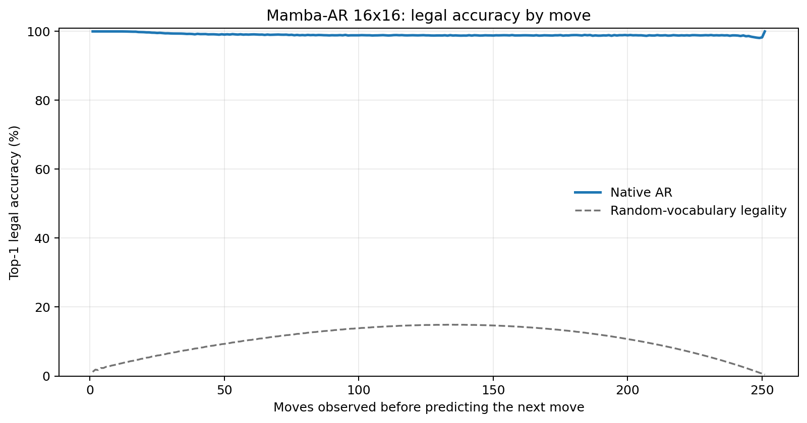
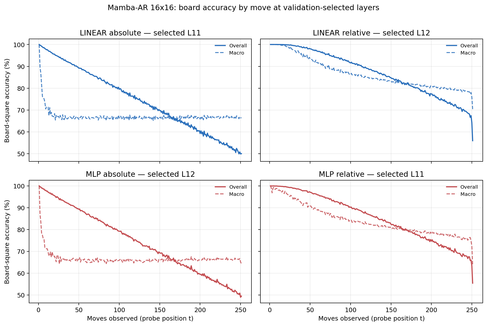

# Proposal evaluation: Mamba-AR 16x16

- **Suite:** `thesis_eval_suite_v1` over `unified_eval_v4`
- **Run:** `selected`
- **Checkpoint:** `final.pt` (`3af7b6265cc72414d0691fb732b6b487e0d5051d71c12bec7eb2e25242b209b2`)
- **Training budget:** `20,000,000` games / `200` shards
- **Next-move readout:** native pretrained AR head
- **Exact continuation:** intentionally excluded because corpus continuations are stochastic legal choices

## 1. Functional legality

| Readout | Top-1 legal | Top-3 legal fraction | Top-5 legal fraction | Legal probability mass |
|---|---:|---:|---:|---:|
| Native AR | 99.02% | 98.19% | 97.12% | 90.35% |

### Statistical context

| Readout | Normalized legal lift | 95% CI for top-1 legal |
|---|---:|---:|
| Native AR | 98.91% | 99.01%–99.03% |

### Legal accuracy by move

### Legality by normalized game phase

| Readout | Phase | Tokens | Mean legal moves | Top-1 legal | Legal mass |
|---|---:|---:|---:|---:|---:|
| Native AR | 0.00–0.25 | 3,148,134 | 16.93 | 99.49% | 94.33% |
| Native AR | 0.25–0.50 | 3,097,644 | 33.66 | 98.92% | 87.76% |
| Native AR | 0.50–0.75 | 3,147,606 | 35.65 | 98.85% | 88.72% |
| Native AR | 0.75–1.00 | 3,147,581 | 18.01 | 98.82% | 90.55% |

## 2. Board-state representations

Layer selection uses only the selection split. Headline test values are macro-balanced accuracy, so changing empty-square prevalence across board sizes cannot dominate the comparison.

**Macro accuracy** is the unweighted mean of the three per-class recalls. Absolute labels use empty/black/white and relative labels use empty/mine/opponent. Each class therefore contributes one third even when empty squares are much more common. Overall accuracy instead weights every square equally and can be dominated by the empty class.

| Probe | Labels | Best layer | Normalized depth | Test macro | Overall | Occupied | Empty |
|---|---|---:|---:|---:|---:|---:|---:|
| LINEAR | absolute | L11 | 0.733 | 66.61% | 74.64% | 49.93% | 99.97% |
| LINEAR | relative | L12 | 0.800 | 82.98% | 87.11% | 74.55% | 99.98% |
| MLP | absolute | L12 | 0.800 | 66.25% | 74.34% | 49.42% | 99.89% |
| MLP | relative | L11 | 0.733 | 81.10% | 85.57% | 72.02% | 99.46% |

### Probe accuracy by layer

These are the untouched test-split tables in the same format as the 8x8 unified JEPA notebook. `Selected` marks the layer chosen using the separate selection split, never the test results.

#### LINEAR board-state probe

| Layer | Absolute accuracy | Absolute macro | Relative accuracy | Relative macro | Selected |
|---:|---:|---:|---:|---:|:---|
| L0 | 64.75% | 56.59% | 65.65% | 57.77% |  |
| L1 | 70.86% | 62.80% | 72.17% | 64.47% |  |
| L2 | 69.05% | 61.00% | 76.33% | 70.71% |  |
| L3 | 68.43% | 60.37% | 79.63% | 75.20% |  |
| L4 | 70.22% | 62.15% | 81.31% | 76.85% |  |
| L5 | 70.66% | 62.59% | 81.66% | 77.17% |  |
| L6 | 71.04% | 62.99% | 82.21% | 77.78% |  |
| L7 | 71.43% | 63.38% | 82.87% | 78.52% |  |
| L8 | 71.98% | 63.92% | 83.82% | 79.57% |  |
| L9 | 73.39% | 65.36% | 85.47% | 81.30% |  |
| L10 | 74.04% | 66.02% | 86.32% | 82.19% |  |
| L11 | 74.64% | 66.61% | 87.10% | 82.99% | absolute |
| L12 | 74.64% | 66.60% | 87.11% | 82.98% | relative |
| L13 | 74.54% | 66.47% | 86.95% | 82.78% |  |
| L14 | 74.45% | 66.36% | 86.83% | 82.62% |  |
| L15 | 74.46% | 66.37% | 86.78% | 82.57% |  |

#### MLP board-state probe

| Layer | Absolute accuracy | Absolute macro | Relative accuracy | Relative macro | Selected |
|---:|---:|---:|---:|---:|:---|
| L0 | 65.06% | 56.85% | 65.83% | 57.88% |  |
| L1 | 69.31% | 61.26% | 70.36% | 62.53% |  |
| L2 | 68.35% | 60.49% | 73.77% | 67.85% |  |
| L3 | 67.41% | 59.38% | 77.19% | 72.50% |  |
| L4 | 69.02% | 60.95% | 78.69% | 74.00% |  |
| L5 | 69.49% | 61.40% | 79.05% | 74.30% |  |
| L6 | 69.90% | 61.86% | 79.61% | 74.91% |  |
| L7 | 70.27% | 62.26% | 80.25% | 75.67% |  |
| L8 | 70.93% | 62.91% | 81.29% | 76.76% |  |
| L9 | 72.62% | 64.59% | 83.31% | 78.82% |  |
| L10 | 73.47% | 65.43% | 84.41% | 79.94% |  |
| L11 | 74.32% | 66.25% | 85.57% | 81.10% | relative |
| L12 | 74.34% | 66.25% | 85.58% | 81.04% | absolute |
| L13 | 74.24% | 66.10% | 85.30% | 80.67% |  |
| L14 | 74.11% | 65.93% | 85.07% | 80.36% |  |
| L15 | 74.09% | 65.91% | 85.00% | 80.26% |  |

### Board accuracy by move at each selected layer

### Selected board probes by game phase

| Probe | Labels | Phase | Macro accuracy | Occupied | Empty |
|---|---|---:|---:|---:|---:|
| LINEAR | absolute | 1/4 | 74.02% | 62.30% | 100.00% |
| LINEAR | absolute | 2/4 | 66.95% | 50.53% | 100.00% |
| LINEAR | absolute | 11/4 | 66.35% | 49.58% | 99.90% |
| LINEAR | absolute | 12/4 | 66.63% | 49.99% | 99.90% |
| LINEAR | absolute | 13/4 | 66.67% | 50.06% | 99.87% |
| LINEAR | absolute | 14/4 | 66.60% | 49.98% | 99.84% |
| LINEAR | absolute | 15/4 | 66.71% | 50.14% | 99.86% |
| LINEAR | absolute | 16/4 | 66.61% | 49.96% | 99.89% |
| LINEAR | absolute | 3/4 | 66.45% | 49.69% | 100.00% |
| LINEAR | absolute | 4/4 | 66.57% | 49.85% | 99.99% |
| LINEAR | absolute | 5/4 | 66.46% | 49.71% | 99.98% |
| LINEAR | absolute | 6/4 | 66.34% | 49.52% | 99.97% |
| LINEAR | absolute | 7/4 | 66.49% | 49.74% | 99.97% |
| LINEAR | absolute | 8/4 | 66.46% | 49.71% | 99.96% |
| LINEAR | absolute | 9/4 | 66.37% | 49.58% | 99.95% |
| LINEAR | absolute | 10/4 | 66.43% | 49.69% | 99.93% |
| LINEAR | relative | 1/4 | 99.87% | 99.82% | 100.00% |
| LINEAR | relative | 2/4 | 98.45% | 97.73% | 100.00% |
| LINEAR | relative | 11/4 | 82.32% | 73.57% | 99.94% |
| LINEAR | relative | 12/4 | 81.65% | 72.56% | 99.90% |
| LINEAR | relative | 13/4 | 80.87% | 71.41% | 99.87% |
| LINEAR | relative | 14/4 | 80.11% | 70.29% | 99.86% |
| LINEAR | relative | 15/4 | 79.39% | 69.21% | 99.88% |
| LINEAR | relative | 16/4 | 77.78% | 66.78% | 99.86% |
| LINEAR | relative | 3/4 | 95.42% | 93.21% | 100.00% |
| LINEAR | relative | 4/4 | 92.53% | 88.89% | 100.00% |
| LINEAR | relative | 5/4 | 89.83% | 84.84% | 100.00% |
| LINEAR | relative | 6/4 | 87.98% | 82.05% | 99.99% |
| LINEAR | relative | 7/4 | 86.37% | 79.63% | 99.98% |
| LINEAR | relative | 8/4 | 85.18% | 77.85% | 99.97% |
| LINEAR | relative | 9/4 | 84.09% | 76.21% | 99.96% |
| LINEAR | relative | 10/4 | 83.12% | 74.75% | 99.95% |
| MLP | absolute | 1/4 | 73.42% | 61.19% | 100.00% |
| MLP | absolute | 2/4 | 66.90% | 50.45% | 100.00% |
| MLP | absolute | 11/4 | 66.03% | 49.21% | 99.68% |
| MLP | absolute | 12/4 | 66.12% | 49.38% | 99.57% |
| MLP | absolute | 13/4 | 66.22% | 49.59% | 99.48% |
| MLP | absolute | 14/4 | 66.30% | 49.75% | 99.40% |
| MLP | absolute | 15/4 | 66.50% | 50.07% | 99.34% |
| MLP | absolute | 16/4 | 66.22% | 49.75% | 99.15% |
| MLP | absolute | 3/4 | 66.22% | 49.33% | 100.00% |
| MLP | absolute | 4/4 | 66.04% | 49.06% | 99.99% |
| MLP | absolute | 5/4 | 65.83% | 48.75% | 99.98% |
| MLP | absolute | 6/4 | 65.63% | 48.47% | 99.95% |
| MLP | absolute | 7/4 | 65.95% | 48.95% | 99.92% |
| MLP | absolute | 8/4 | 65.83% | 48.81% | 99.85% |
| MLP | absolute | 9/4 | 65.62% | 48.51% | 99.81% |
| MLP | absolute | 10/4 | 65.98% | 49.10% | 99.75% |
| MLP | relative | 1/4 | 98.24% | 97.71% | 100.00% |
| MLP | relative | 2/4 | 95.66% | 93.82% | 99.99% |
| MLP | relative | 11/4 | 80.10% | 70.88% | 98.72% |
| MLP | relative | 12/4 | 79.35% | 69.97% | 98.24% |
| MLP | relative | 13/4 | 78.67% | 69.21% | 97.71% |
| MLP | relative | 14/4 | 77.86% | 68.25% | 97.22% |
| MLP | relative | 15/4 | 76.99% | 67.43% | 96.23% |
| MLP | relative | 16/4 | 75.04% | 65.53% | 94.13% |
| MLP | relative | 3/4 | 92.42% | 88.94% | 99.95% |
| MLP | relative | 4/4 | 89.70% | 84.85% | 99.88% |
| MLP | relative | 5/4 | 87.35% | 81.36% | 99.81% |
| MLP | relative | 6/4 | 85.47% | 78.55% | 99.69% |
| MLP | relative | 7/4 | 83.99% | 76.36% | 99.56% |
| MLP | relative | 8/4 | 82.84% | 74.73% | 99.38% |
| MLP | relative | 9/4 | 81.74% | 73.16% | 99.15% |
| MLP | relative | 10/4 | 80.90% | 71.96% | 98.98% |

## 3. Efficiency and reproducibility

- Encoder parameters: `25,824,768`
- Total parameters: `25,824,768`
- Checkpoint bytes: `310,103,901`
- Evaluation GPU: `NVIDIA L4`
- Training hardware: `unreported`
- Training precision: `bf16`
- Python / PyTorch / CUDA: `3.13.15` / `2.11.0+cu128` / `12.8`
- Median training chunk: `77.26 s`
- Estimated training loop: `4.29 h`
- Median games/s: `1294.33`
- Median supervision units/s: `324644.75`
- Timing scope: dt_seconds excludes normal checkpoint/Drive-sync time; validation is included only in observed_train_plus_validation_loop_hours

## 4. Interpretation boundary

- Board probes establish decodability, not by themselves causal use.
- Legal behavior measures rule compatibility, not strategic playing strength.
- Bootstrap legality intervals quantify test-game sampling only; they do not replace independent pretraining seeds.
- Board-probe point estimates use one deterministic probe seed; the random-encoder control is not a substitute for model-seed replication.
- Cross-board results compare separately trained scaling conditions, not zero-shot transfer.

## Artifact index

- Unified JSON: `/content/seed_evaluation_views/mamba_ar_b16_seed001/runs/selected/thesis_eval/final/results__unified_eval_v4.json`
- Unified summary: `/content/seed_evaluation_views/mamba_ar_b16_seed001/runs/selected/thesis_eval/final/summary__unified_eval_v4.md`
- Position manifest: `/content/seed_evaluation_views/mamba_ar_b16_seed001/runs/selected/thesis_eval/final/position_manifest__unified_eval_v4.json`
- Legal-by-move figure: `/content/seed_evaluation_views/mamba_ar_b16_seed001/runs/selected/thesis_eval/final/legal_accuracy_by_move__thesis_eval_suite_v1.png`
- Board-by-move figure: `/content/seed_evaluation_views/mamba_ar_b16_seed001/runs/selected/thesis_eval/final/board_accuracy_by_move__thesis_eval_suite_v1.png`
