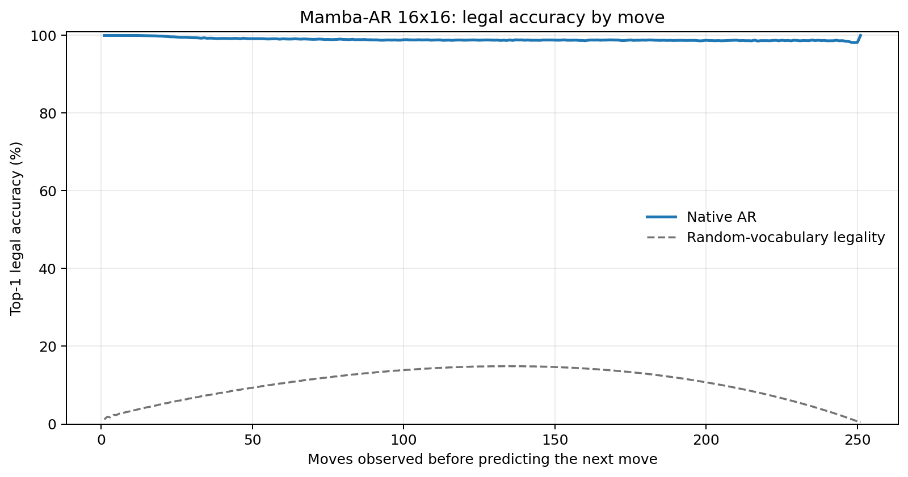
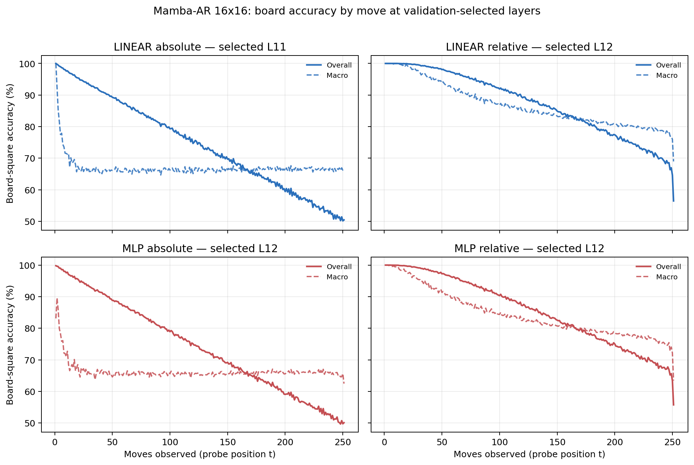

# Proposal evaluation: Mamba-AR 16x16

- **Suite:** `thesis_eval_suite_v1` over `unified_eval_v4`
- **Run:** `selected`
- **Checkpoint:** `final.pt` (`c9b9b03fe7d38540fad933324c3f27309c5d1d14c50069bdff11eb602e2ba1cc`)
- **Training budget:** `20,000,000` games / `200` shards
- **Next-move readout:** native pretrained AR head
- **Exact continuation:** intentionally excluded because corpus continuations are stochastic legal choices

## 1. Functional legality

| Readout | Top-1 legal | Top-3 legal fraction | Top-5 legal fraction | Legal probability mass |
|---|---:|---:|---:|---:|
| Native AR | 98.96% | 98.13% | 97.06% | 90.52% |

### Statistical context

| Readout | Normalized legal lift | 95% CI for top-1 legal |
|---|---:|---:|
| Native AR | 98.84% | 98.95%–98.97% |

### Legal accuracy by move

### Legality by normalized game phase

| Readout | Phase | Tokens | Mean legal moves | Top-1 legal | Legal mass |
|---|---:|---:|---:|---:|---:|
| Native AR | 0.00–0.25 | 3,148,134 | 16.93 | 99.50% | 94.33% |
| Native AR | 0.25–0.50 | 3,097,644 | 33.66 | 98.89% | 88.05% |
| Native AR | 0.50–0.75 | 3,147,606 | 35.65 | 98.78% | 89.02% |
| Native AR | 0.75–1.00 | 3,147,581 | 18.01 | 98.67% | 90.65% |

## 2. Board-state representations

Layer selection uses only the selection split. Headline test values are macro-balanced accuracy, so changing empty-square prevalence across board sizes cannot dominate the comparison.

**Macro accuracy** is the unweighted mean of the three per-class recalls. Absolute labels use empty/black/white and relative labels use empty/mine/opponent. Each class therefore contributes one third even when empty squares are much more common. Overall accuracy instead weights every square equally and can be dominated by the empty class.

| Probe | Labels | Best layer | Normalized depth | Test macro | Overall | Occupied | Empty |
|---|---|---:|---:|---:|---:|---:|---:|
| LINEAR | absolute | L11 | 0.733 | 66.60% | 74.60% | 49.98% | 99.82% |
| LINEAR | relative | L12 | 0.800 | 83.26% | 87.29% | 74.99% | 99.90% |
| MLP | absolute | L12 | 0.800 | 66.13% | 74.23% | 49.29% | 99.79% |
| MLP | relative | L12 | 0.800 | 81.17% | 85.63% | 72.10% | 99.49% |

### Probe accuracy by layer

These are the untouched test-split tables in the same format as the 8x8 unified JEPA notebook. `Selected` marks the layer chosen using the separate selection split, never the test results.

#### LINEAR board-state probe

| Layer | Absolute accuracy | Absolute macro | Relative accuracy | Relative macro | Selected |
|---:|---:|---:|---:|---:|:---|
| L0 | 64.76% | 56.61% | 65.65% | 57.79% |  |
| L1 | 71.12% | 63.03% | 72.50% | 64.80% |  |
| L2 | 69.22% | 61.14% | 75.69% | 69.78% |  |
| L3 | 68.47% | 60.42% | 79.69% | 75.24% |  |
| L4 | 69.02% | 60.98% | 79.99% | 75.52% |  |
| L5 | 70.03% | 61.98% | 81.06% | 76.60% |  |
| L6 | 70.49% | 62.43% | 81.70% | 77.29% |  |
| L7 | 71.80% | 63.77% | 83.32% | 79.02% |  |
| L8 | 72.33% | 64.31% | 84.14% | 79.92% |  |
| L9 | 72.94% | 64.92% | 84.96% | 80.79% |  |
| L10 | 73.97% | 65.96% | 86.10% | 81.95% |  |
| L11 | 74.60% | 66.60% | 86.82% | 82.68% | absolute |
| L12 | 74.61% | 66.58% | 87.29% | 83.26% | relative |
| L13 | 74.60% | 66.56% | 87.19% | 83.11% |  |
| L14 | 74.50% | 66.43% | 87.03% | 82.91% |  |
| L15 | 74.48% | 66.40% | 86.99% | 82.85% |  |

#### MLP board-state probe

| Layer | Absolute accuracy | Absolute macro | Relative accuracy | Relative macro | Selected |
|---:|---:|---:|---:|---:|:---|
| L0 | 65.24% | 57.10% | 65.82% | 57.88% |  |
| L1 | 69.41% | 61.36% | 70.51% | 62.69% |  |
| L2 | 68.48% | 60.61% | 73.19% | 67.00% |  |
| L3 | 67.61% | 59.62% | 77.15% | 72.47% |  |
| L4 | 67.93% | 59.94% | 77.42% | 72.71% |  |
| L5 | 68.86% | 60.83% | 78.44% | 73.76% |  |
| L6 | 69.33% | 61.29% | 78.99% | 74.32% |  |
| L7 | 70.68% | 62.66% | 80.69% | 76.08% |  |
| L8 | 71.29% | 63.25% | 81.61% | 77.08% |  |
| L9 | 72.04% | 64.00% | 82.62% | 78.15% |  |
| L10 | 73.39% | 65.35% | 84.21% | 79.71% |  |
| L11 | 74.21% | 66.17% | 85.16% | 80.62% |  |
| L12 | 74.23% | 66.13% | 85.63% | 81.17% | absolute + relative |
| L13 | 74.24% | 66.11% | 85.40% | 80.80% |  |
| L14 | 74.10% | 65.93% | 85.13% | 80.45% |  |
| L15 | 74.09% | 65.91% | 85.14% | 80.47% |  |

### Board accuracy by move at each selected layer

### Selected board probes by game phase

| Probe | Labels | Phase | Macro accuracy | Occupied | Empty |
|---|---|---:|---:|---:|---:|
| LINEAR | absolute | 1/4 | 74.47% | 62.98% | 100.00% |
| LINEAR | absolute | 2/4 | 66.97% | 50.59% | 100.00% |
| LINEAR | absolute | 11/4 | 66.36% | 49.75% | 99.59% |
| LINEAR | absolute | 12/4 | 66.64% | 50.17% | 99.59% |
| LINEAR | absolute | 13/4 | 66.66% | 50.20% | 99.56% |
| LINEAR | absolute | 14/4 | 66.54% | 50.02% | 99.56% |
| LINEAR | absolute | 15/4 | 66.58% | 50.11% | 99.53% |
| LINEAR | absolute | 16/4 | 66.51% | 50.11% | 99.32% |
| LINEAR | absolute | 3/4 | 66.37% | 49.59% | 99.98% |
| LINEAR | absolute | 4/4 | 66.44% | 49.70% | 99.94% |
| LINEAR | absolute | 5/4 | 66.17% | 49.32% | 99.88% |
| LINEAR | absolute | 6/4 | 66.21% | 49.40% | 99.82% |
| LINEAR | absolute | 7/4 | 66.42% | 49.75% | 99.75% |
| LINEAR | absolute | 8/4 | 66.33% | 49.66% | 99.67% |
| LINEAR | absolute | 9/4 | 66.25% | 49.54% | 99.65% |
| LINEAR | absolute | 10/4 | 66.47% | 49.90% | 99.61% |
| LINEAR | relative | 1/4 | 99.87% | 99.82% | 100.00% |
| LINEAR | relative | 2/4 | 98.42% | 97.71% | 100.00% |
| LINEAR | relative | 11/4 | 82.62% | 74.10% | 99.76% |
| LINEAR | relative | 12/4 | 81.76% | 72.84% | 99.67% |
| LINEAR | relative | 13/4 | 80.92% | 71.62% | 99.60% |
| LINEAR | relative | 14/4 | 80.28% | 70.69% | 99.55% |
| LINEAR | relative | 15/4 | 79.49% | 69.56% | 99.44% |
| LINEAR | relative | 16/4 | 77.61% | 66.88% | 99.12% |
| LINEAR | relative | 3/4 | 95.62% | 93.53% | 99.99% |
| LINEAR | relative | 4/4 | 92.95% | 89.53% | 99.98% |
| LINEAR | relative | 5/4 | 90.45% | 85.79% | 99.96% |
| LINEAR | relative | 6/4 | 88.53% | 82.91% | 99.93% |
| LINEAR | relative | 7/4 | 86.89% | 80.45% | 99.90% |
| LINEAR | relative | 8/4 | 85.62% | 78.56% | 99.86% |
| LINEAR | relative | 9/4 | 84.44% | 76.81% | 99.82% |
| LINEAR | relative | 10/4 | 83.46% | 75.34% | 99.81% |
| MLP | absolute | 1/4 | 73.36% | 61.20% | 100.00% |
| MLP | absolute | 2/4 | 66.90% | 50.45% | 100.00% |
| MLP | absolute | 11/4 | 65.79% | 48.96% | 99.45% |
| MLP | absolute | 12/4 | 66.09% | 49.46% | 99.35% |
| MLP | absolute | 13/4 | 66.11% | 49.56% | 99.21% |
| MLP | absolute | 14/4 | 66.08% | 49.60% | 99.03% |
| MLP | absolute | 15/4 | 66.12% | 49.86% | 98.63% |
| MLP | absolute | 16/4 | 65.59% | 49.75% | 97.26% |
| MLP | absolute | 3/4 | 66.11% | 49.17% | 99.99% |
| MLP | absolute | 4/4 | 65.58% | 48.39% | 99.97% |
| MLP | absolute | 5/4 | 65.91% | 48.90% | 99.93% |
| MLP | absolute | 6/4 | 65.53% | 48.35% | 99.89% |
| MLP | absolute | 7/4 | 65.69% | 48.62% | 99.79% |
| MLP | absolute | 8/4 | 65.72% | 48.71% | 99.71% |
| MLP | absolute | 9/4 | 65.47% | 48.36% | 99.65% |
| MLP | absolute | 10/4 | 65.74% | 48.85% | 99.53% |
| MLP | relative | 1/4 | 99.25% | 99.01% | 100.00% |
| MLP | relative | 2/4 | 96.73% | 95.32% | 100.00% |
| MLP | relative | 11/4 | 80.05% | 70.77% | 98.74% |
| MLP | relative | 12/4 | 79.27% | 69.75% | 98.39% |
| MLP | relative | 13/4 | 78.54% | 68.85% | 98.00% |
| MLP | relative | 14/4 | 77.84% | 68.07% | 97.48% |
| MLP | relative | 15/4 | 77.03% | 67.28% | 96.64% |
| MLP | relative | 16/4 | 74.58% | 65.33% | 93.15% |
| MLP | relative | 3/4 | 93.36% | 90.30% | 99.98% |
| MLP | relative | 4/4 | 90.57% | 86.12% | 99.92% |
| MLP | relative | 5/4 | 87.98% | 82.30% | 99.83% |
| MLP | relative | 6/4 | 85.98% | 79.30% | 99.73% |
| MLP | relative | 7/4 | 84.31% | 76.84% | 99.56% |
| MLP | relative | 8/4 | 83.04% | 75.03% | 99.36% |
| MLP | relative | 9/4 | 81.82% | 73.24% | 99.22% |
| MLP | relative | 10/4 | 80.79% | 71.83% | 98.89% |

## 3. Efficiency and reproducibility

- Encoder parameters: `25,824,768`
- Total parameters: `25,824,768`
- Checkpoint bytes: `310,103,901`
- Evaluation GPU: `NVIDIA L4`
- Training hardware: `unreported`
- Training precision: `bf16`
- Python / PyTorch / CUDA: `3.13.15` / `2.11.0+cu128` / `12.8`
- Median training chunk: `77.24 s`
- Estimated training loop: `4.29 h`
- Median games/s: `1294.63`
- Median supervision units/s: `324720.93`
- Timing scope: dt_seconds excludes normal checkpoint/Drive-sync time; validation is included only in observed_train_plus_validation_loop_hours

## 4. Interpretation boundary

- Board probes establish decodability, not by themselves causal use.
- Legal behavior measures rule compatibility, not strategic playing strength.
- Bootstrap legality intervals quantify test-game sampling only; they do not replace independent pretraining seeds.
- Board-probe point estimates use one deterministic probe seed; the random-encoder control is not a substitute for model-seed replication.
- Cross-board results compare separately trained scaling conditions, not zero-shot transfer.

## Artifact index

- Unified JSON: `/content/seed_evaluation_views/mamba_ar_b16_seed002/runs/selected/thesis_eval/final/results__unified_eval_v4.json`
- Unified summary: `/content/seed_evaluation_views/mamba_ar_b16_seed002/runs/selected/thesis_eval/final/summary__unified_eval_v4.md`
- Position manifest: `/content/seed_evaluation_views/mamba_ar_b16_seed002/runs/selected/thesis_eval/final/position_manifest__unified_eval_v4.json`
- Legal-by-move figure: `/content/seed_evaluation_views/mamba_ar_b16_seed002/runs/selected/thesis_eval/final/legal_accuracy_by_move__thesis_eval_suite_v1.png`
- Board-by-move figure: `/content/seed_evaluation_views/mamba_ar_b16_seed002/runs/selected/thesis_eval/final/board_accuracy_by_move__thesis_eval_suite_v1.png`
