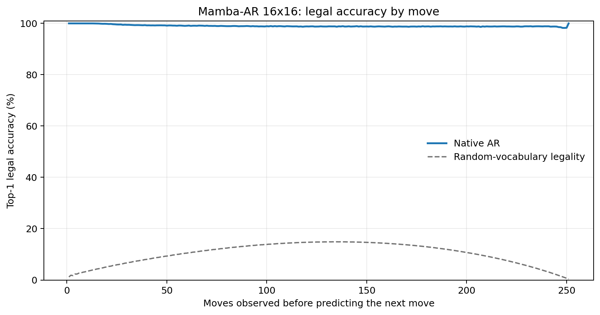
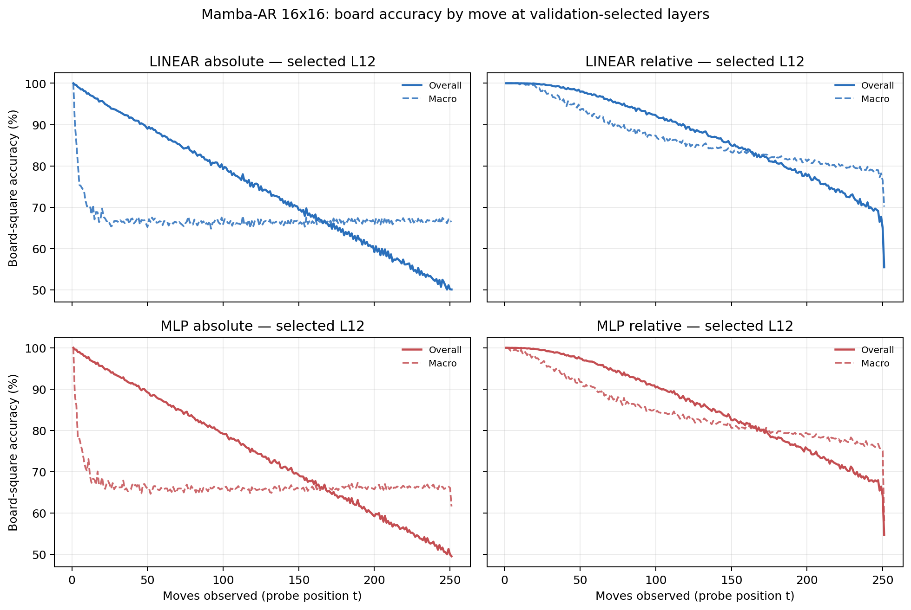

# Proposal evaluation: Mamba-AR 16x16

- **Suite:** `thesis_eval_suite_v1` over `unified_eval_v4`
- **Run:** `selected`
- **Checkpoint:** `final.pt` (`ce2a4acc067f71be608b3a6c4920c221adbaf94c98bf0c31dd93d36becfbf1ee`)
- **Training budget:** `20,000,000` games / `200` shards
- **Next-move readout:** native pretrained AR head
- **Exact continuation:** intentionally excluded because corpus continuations are stochastic legal choices

## 1. Functional legality

| Readout | Top-1 legal | Top-3 legal fraction | Top-5 legal fraction | Legal probability mass |
|---|---:|---:|---:|---:|
| Native AR | 99.00% | 98.19% | 97.13% | 90.68% |

### Statistical context

| Readout | Normalized legal lift | 95% CI for top-1 legal |
|---|---:|---:|
| Native AR | 98.89% | 99.00%–99.01% |

### Legal accuracy by move

### Legality by normalized game phase

| Readout | Phase | Tokens | Mean legal moves | Top-1 legal | Legal mass |
|---|---:|---:|---:|---:|---:|
| Native AR | 0.00–0.25 | 3,148,134 | 16.93 | 99.51% | 94.50% |
| Native AR | 0.25–0.50 | 3,097,644 | 33.66 | 98.91% | 88.26% |
| Native AR | 0.50–0.75 | 3,147,606 | 35.65 | 98.80% | 89.16% |
| Native AR | 0.75–1.00 | 3,147,581 | 18.01 | 98.79% | 90.76% |

## 2. Board-state representations

Layer selection uses only the selection split. Headline test values are macro-balanced accuracy, so changing empty-square prevalence across board sizes cannot dominate the comparison.

**Macro accuracy** is the unweighted mean of the three per-class recalls. Absolute labels use empty/black/white and relative labels use empty/mine/opponent. Each class therefore contributes one third even when empty squares are much more common. Overall accuracy instead weights every square equally and can be dominated by the empty class.

| Probe | Labels | Best layer | Normalized depth | Test macro | Overall | Occupied | Empty |
|---|---|---:|---:|---:|---:|---:|---:|
| LINEAR | absolute | L12 | 0.800 | 66.60% | 74.64% | 49.90% | 99.99% |
| LINEAR | relative | L12 | 0.800 | 83.44% | 87.45% | 75.24% | 99.97% |
| MLP | absolute | L12 | 0.800 | 66.26% | 74.35% | 49.45% | 99.87% |
| MLP | relative | L12 | 0.800 | 81.48% | 85.89% | 72.53% | 99.58% |

### Probe accuracy by layer

These are the untouched test-split tables in the same format as the 8x8 unified JEPA notebook. `Selected` marks the layer chosen using the separate selection split, never the test results.

#### LINEAR board-state probe

| Layer | Absolute accuracy | Absolute macro | Relative accuracy | Relative macro | Selected |
|---:|---:|---:|---:|---:|:---|
| L0 | 64.75% | 56.60% | 65.66% | 57.79% |  |
| L1 | 69.99% | 61.87% | 71.18% | 63.39% |  |
| L2 | 69.11% | 61.06% | 73.22% | 66.56% |  |
| L3 | 67.84% | 59.76% | 77.57% | 72.66% |  |
| L4 | 68.70% | 60.62% | 80.39% | 76.07% |  |
| L5 | 69.34% | 61.28% | 80.96% | 76.65% |  |
| L6 | 69.76% | 61.71% | 81.50% | 77.24% |  |
| L7 | 70.50% | 62.45% | 82.49% | 78.32% |  |
| L8 | 71.39% | 63.35% | 83.67% | 79.59% |  |
| L9 | 72.75% | 64.74% | 85.17% | 81.14% |  |
| L10 | 73.52% | 65.50% | 86.13% | 82.13% |  |
| L11 | 73.93% | 65.92% | 86.61% | 82.61% |  |
| L12 | 74.64% | 66.60% | 87.45% | 83.44% | absolute + relative |
| L13 | 74.56% | 66.50% | 87.26% | 83.19% |  |
| L14 | 74.45% | 66.36% | 87.09% | 82.98% |  |
| L15 | 74.43% | 66.33% | 87.05% | 82.92% |  |

#### MLP board-state probe

| Layer | Absolute accuracy | Absolute macro | Relative accuracy | Relative macro | Selected |
|---:|---:|---:|---:|---:|:---|
| L0 | 65.17% | 57.00% | 65.83% | 57.89% |  |
| L1 | 68.59% | 60.53% | 69.52% | 61.64% |  |
| L2 | 68.28% | 60.30% | 71.44% | 64.55% |  |
| L3 | 68.14% | 60.44% | 75.36% | 70.25% |  |
| L4 | 67.87% | 59.85% | 78.17% | 73.72% |  |
| L5 | 68.39% | 60.37% | 78.59% | 74.12% |  |
| L6 | 68.72% | 60.67% | 79.07% | 74.62% |  |
| L7 | 69.40% | 61.36% | 79.95% | 75.55% |  |
| L8 | 70.25% | 62.21% | 81.04% | 76.67% |  |
| L9 | 71.80% | 63.77% | 82.83% | 78.51% |  |
| L10 | 72.82% | 64.79% | 84.08% | 79.76% |  |
| L11 | 73.35% | 65.29% | 84.75% | 80.40% |  |
| L12 | 74.35% | 66.26% | 85.89% | 81.48% | absolute + relative |
| L13 | 74.22% | 66.07% | 85.57% | 81.02% |  |
| L14 | 74.07% | 65.88% | 85.27% | 80.64% |  |
| L15 | 74.09% | 65.90% | 85.25% | 80.60% |  |

### Board accuracy by move at each selected layer

### Selected board probes by game phase

| Probe | Labels | Phase | Macro accuracy | Occupied | Empty |
|---|---|---:|---:|---:|---:|
| LINEAR | absolute | 1/4 | 73.73% | 61.96% | 100.00% |
| LINEAR | absolute | 2/4 | 66.93% | 50.51% | 100.00% |
| LINEAR | absolute | 11/4 | 66.41% | 49.62% | 99.97% |
| LINEAR | absolute | 12/4 | 66.63% | 49.96% | 99.95% |
| LINEAR | absolute | 13/4 | 66.67% | 50.03% | 99.94% |
| LINEAR | absolute | 14/4 | 66.67% | 50.03% | 99.95% |
| LINEAR | absolute | 15/4 | 66.67% | 50.04% | 99.93% |
| LINEAR | absolute | 16/4 | 66.72% | 50.10% | 99.94% |
| LINEAR | absolute | 3/4 | 66.75% | 50.14% | 100.00% |
| LINEAR | absolute | 4/4 | 66.54% | 49.82% | 100.00% |
| LINEAR | absolute | 5/4 | 66.27% | 49.40% | 100.00% |
| LINEAR | absolute | 6/4 | 66.19% | 49.29% | 99.99% |
| LINEAR | absolute | 7/4 | 66.49% | 49.74% | 99.99% |
| LINEAR | absolute | 8/4 | 66.38% | 49.57% | 99.99% |
| LINEAR | absolute | 9/4 | 66.35% | 49.53% | 99.98% |
| LINEAR | absolute | 10/4 | 66.33% | 49.51% | 99.97% |
| LINEAR | relative | 1/4 | 99.85% | 99.79% | 100.00% |
| LINEAR | relative | 2/4 | 98.41% | 97.68% | 100.00% |
| LINEAR | relative | 11/4 | 82.91% | 74.47% | 99.90% |
| LINEAR | relative | 12/4 | 82.08% | 73.22% | 99.86% |
| LINEAR | relative | 13/4 | 81.35% | 72.16% | 99.82% |
| LINEAR | relative | 14/4 | 80.58% | 71.00% | 99.83% |
| LINEAR | relative | 15/4 | 79.84% | 69.91% | 99.79% |
| LINEAR | relative | 16/4 | 78.08% | 67.21% | 99.88% |
| LINEAR | relative | 3/4 | 95.58% | 93.48% | 100.00% |
| LINEAR | relative | 4/4 | 92.93% | 89.49% | 99.99% |
| LINEAR | relative | 5/4 | 90.37% | 85.65% | 99.99% |
| LINEAR | relative | 6/4 | 88.40% | 82.68% | 99.98% |
| LINEAR | relative | 7/4 | 86.82% | 80.31% | 99.98% |
| LINEAR | relative | 8/4 | 85.65% | 78.56% | 99.96% |
| LINEAR | relative | 9/4 | 84.68% | 77.10% | 99.95% |
| LINEAR | relative | 10/4 | 83.69% | 75.62% | 99.93% |
| MLP | absolute | 1/4 | 73.36% | 61.10% | 100.00% |
| MLP | absolute | 2/4 | 66.85% | 50.35% | 100.00% |
| MLP | absolute | 11/4 | 66.02% | 49.21% | 99.65% |
| MLP | absolute | 12/4 | 66.18% | 49.52% | 99.49% |
| MLP | absolute | 13/4 | 66.30% | 49.78% | 99.35% |
| MLP | absolute | 14/4 | 66.15% | 49.60% | 99.25% |
| MLP | absolute | 15/4 | 66.33% | 49.95% | 99.08% |
| MLP | absolute | 16/4 | 66.18% | 49.90% | 98.76% |
| MLP | absolute | 3/4 | 66.28% | 49.41% | 100.00% |
| MLP | absolute | 4/4 | 65.93% | 48.90% | 99.99% |
| MLP | absolute | 5/4 | 65.76% | 48.66% | 99.98% |
| MLP | absolute | 6/4 | 65.83% | 48.77% | 99.95% |
| MLP | absolute | 7/4 | 65.94% | 48.94% | 99.91% |
| MLP | absolute | 8/4 | 65.80% | 48.77% | 99.85% |
| MLP | absolute | 9/4 | 65.76% | 48.74% | 99.80% |
| MLP | absolute | 10/4 | 65.91% | 49.02% | 99.71% |
| MLP | relative | 1/4 | 99.12% | 98.85% | 100.00% |
| MLP | relative | 2/4 | 96.70% | 95.27% | 100.00% |
| MLP | relative | 11/4 | 80.55% | 71.46% | 98.91% |
| MLP | relative | 12/4 | 79.66% | 70.30% | 98.51% |
| MLP | relative | 13/4 | 79.05% | 69.54% | 98.17% |
| MLP | relative | 14/4 | 78.30% | 68.65% | 97.69% |
| MLP | relative | 15/4 | 77.37% | 67.70% | 96.82% |
| MLP | relative | 16/4 | 75.67% | 65.69% | 95.70% |
| MLP | relative | 3/4 | 93.46% | 90.44% | 99.99% |
| MLP | relative | 4/4 | 90.72% | 86.32% | 99.96% |
| MLP | relative | 5/4 | 88.05% | 82.34% | 99.91% |
| MLP | relative | 6/4 | 86.14% | 79.47% | 99.81% |
| MLP | relative | 7/4 | 84.47% | 77.01% | 99.69% |
| MLP | relative | 8/4 | 83.29% | 75.31% | 99.51% |
| MLP | relative | 9/4 | 82.16% | 73.70% | 99.34% |
| MLP | relative | 10/4 | 81.24% | 72.43% | 99.05% |

## 3. Efficiency and reproducibility

- Encoder parameters: `25,824,768`
- Total parameters: `25,824,768`
- Checkpoint bytes: `310,103,901`
- Evaluation GPU: `NVIDIA L4`
- Training hardware: `unreported`
- Training precision: `bf16`
- Python / PyTorch / CUDA: `3.13.15` / `2.11.0+cu128` / `12.8`
- Median training chunk: `77.29 s`
- Estimated training loop: `4.29 h`
- Median games/s: `1293.88`
- Median supervision units/s: `324547.29`
- Timing scope: dt_seconds excludes normal checkpoint/Drive-sync time; validation is included only in observed_train_plus_validation_loop_hours

## 4. Interpretation boundary

- Board probes establish decodability, not by themselves causal use.
- Legal behavior measures rule compatibility, not strategic playing strength.
- Bootstrap legality intervals quantify test-game sampling only; they do not replace independent pretraining seeds.
- Board-probe point estimates use one deterministic probe seed; the random-encoder control is not a substitute for model-seed replication.
- Cross-board results compare separately trained scaling conditions, not zero-shot transfer.

## Artifact index

- Unified JSON: `/content/seed_evaluation_views/mamba_ar_b16_seed003/runs/selected/thesis_eval/final/results__unified_eval_v4.json`
- Unified summary: `/content/seed_evaluation_views/mamba_ar_b16_seed003/runs/selected/thesis_eval/final/summary__unified_eval_v4.md`
- Position manifest: `/content/seed_evaluation_views/mamba_ar_b16_seed003/runs/selected/thesis_eval/final/position_manifest__unified_eval_v4.json`
- Legal-by-move figure: `/content/seed_evaluation_views/mamba_ar_b16_seed003/runs/selected/thesis_eval/final/legal_accuracy_by_move__thesis_eval_suite_v1.png`
- Board-by-move figure: `/content/seed_evaluation_views/mamba_ar_b16_seed003/runs/selected/thesis_eval/final/board_accuracy_by_move__thesis_eval_suite_v1.png`
