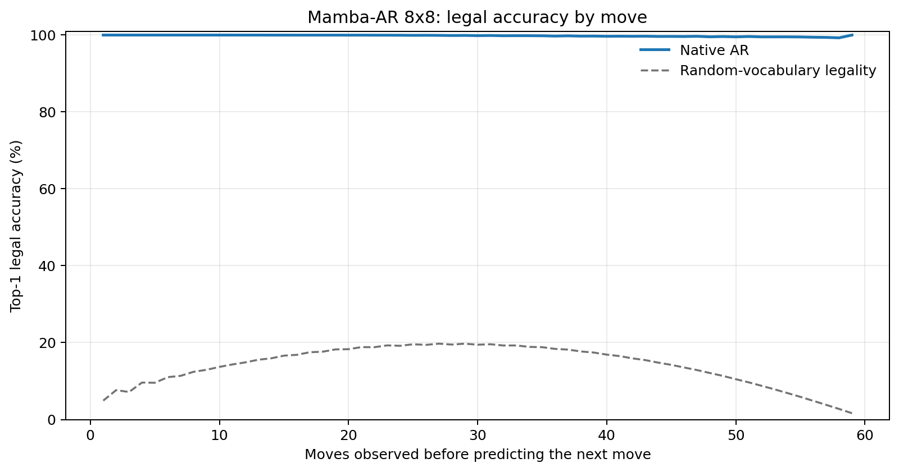
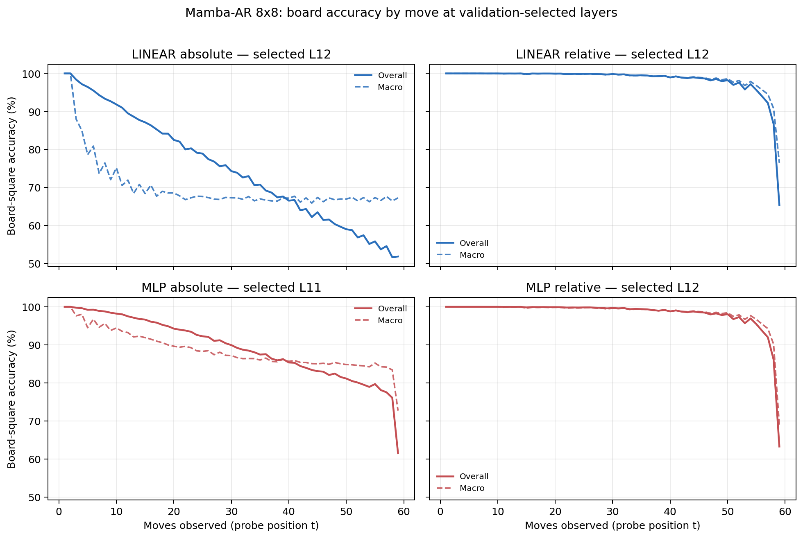

# Proposal evaluation: Mamba-AR 8x8

- **Suite:** `thesis_eval_suite_v1` over `unified_eval_v4`
- **Run:** `selected`
- **Checkpoint:** `final.pt` (`1d7e725418192720c9ecc3118869efa46170ed5f79ccc2139f9fffb17380cb2a`)
- **Training budget:** `19,999,840` games / `200` shards
- **Next-move readout:** native pretrained AR head
- **Exact continuation:** intentionally excluded because corpus continuations are stochastic legal choices

## 1. Functional legality

| Readout | Top-1 legal | Top-3 legal fraction | Top-5 legal fraction | Legal probability mass |
|---|---:|---:|---:|---:|
| Native AR | 99.82% | 96.88% | 92.55% | 99.30% |

### Statistical context

| Readout | Normalized legal lift | 95% CI for top-1 legal |
|---|---:|---:|
| Native AR | 99.79% | 99.81%–99.82% |

### Legal accuracy by move

### Legality by normalized game phase

| Readout | Phase | Tokens | Mean legal moves | Top-1 legal | Legal mass |
|---|---:|---:|---:|---:|---:|
| Native AR | 0.00–0.25 | 749,909 | 7.22 | 100.00% | 99.97% |
| Native AR | 0.25–0.50 | 699,679 | 11.44 | 99.95% | 99.82% |
| Native AR | 0.50–0.75 | 749,593 | 10.84 | 99.76% | 99.17% |
| Native AR | 0.75–1.00 | 749,129 | 5.15 | 99.56% | 98.27% |

## 2. Board-state representations

Layer selection uses only the selection split. Headline test values are macro-balanced accuracy, so changing empty-square prevalence across board sizes cannot dominate the comparison.

**Macro accuracy** is the unweighted mean of the three per-class recalls. Absolute labels use empty/black/white and relative labels use empty/mine/opponent. Each class therefore contributes one third even when empty squares are much more common. Overall accuracy instead weights every square equally and can be dominated by the empty class.

| Probe | Labels | Best layer | Normalized depth | Test macro | Overall | Occupied | Empty |
|---|---|---:|---:|---:|---:|---:|---:|
| LINEAR | absolute | L12 | 0.800 | 68.68% | 75.42% | 53.08% | 100.00% |
| LINEAR | relative | L12 | 0.800 | 97.96% | 98.41% | 96.97% | 100.00% |
| MLP | absolute | L11 | 0.733 | 86.71% | 89.56% | 80.07% | 100.00% |
| MLP | relative | L12 | 0.800 | 97.77% | 98.28% | 96.73% | 99.98% |

### Probe accuracy by layer

These are the untouched test-split tables in the same format as the 8x8 unified JEPA notebook. `Selected` marks the layer chosen using the separate selection split, never the test results.

#### LINEAR board-state probe

| Layer | Absolute accuracy | Absolute macro | Relative accuracy | Relative macro | Selected |
|---:|---:|---:|---:|---:|:---|
| L0 | 62.63% | 55.60% | 64.80% | 58.19% |  |
| L1 | 73.91% | 67.07% | 78.81% | 73.09% |  |
| L2 | 72.81% | 65.98% | 88.49% | 85.80% |  |
| L3 | 73.51% | 66.65% | 89.74% | 87.21% |  |
| L4 | 73.87% | 66.96% | 91.12% | 88.81% |  |
| L5 | 74.18% | 67.29% | 92.21% | 90.14% |  |
| L6 | 74.25% | 67.36% | 93.25% | 91.47% |  |
| L7 | 74.93% | 68.13% | 94.31% | 92.76% |  |
| L8 | 74.70% | 67.86% | 96.30% | 95.32% |  |
| L9 | 74.97% | 68.15% | 96.86% | 96.01% |  |
| L10 | 75.40% | 68.66% | 97.53% | 96.83% |  |
| L11 | 75.47% | 68.74% | 97.88% | 97.29% |  |
| L12 | 75.42% | 68.68% | 98.41% | 97.96% | absolute + relative |
| L13 | 75.32% | 68.56% | 98.40% | 97.94% |  |
| L14 | 74.39% | 67.52% | 97.44% | 96.81% |  |
| L15 | 74.40% | 67.52% | 97.44% | 96.81% |  |

#### MLP board-state probe

| Layer | Absolute accuracy | Absolute macro | Relative accuracy | Relative macro | Selected |
|---:|---:|---:|---:|---:|:---|
| L0 | 65.06% | 58.72% | 65.22% | 58.59% |  |
| L1 | 75.90% | 69.68% | 78.15% | 72.34% |  |
| L2 | 83.35% | 79.65% | 87.49% | 84.75% |  |
| L3 | 81.23% | 76.66% | 88.73% | 86.11% |  |
| L4 | 80.66% | 75.71% | 90.19% | 87.73% |  |
| L5 | 85.57% | 81.94% | 91.33% | 89.11% |  |
| L6 | 86.19% | 82.71% | 92.35% | 90.40% |  |
| L7 | 86.15% | 82.46% | 93.66% | 91.94% |  |
| L8 | 89.03% | 86.18% | 95.70% | 94.58% |  |
| L9 | 85.62% | 81.76% | 96.43% | 95.47% |  |
| L10 | 88.53% | 85.41% | 97.30% | 96.53% |  |
| L11 | 89.56% | 86.71% | 97.71% | 97.05% | absolute |
| L12 | 80.89% | 75.66% | 98.28% | 97.77% | relative |
| L13 | 79.32% | 73.67% | 98.16% | 97.62% |  |
| L14 | 74.49% | 67.64% | 96.84% | 96.05% |  |
| L15 | 74.25% | 67.33% | 96.85% | 96.06% |  |

### Board accuracy by move at each selected layer

### Selected board probes by game phase

| Probe | Labels | Phase | Macro accuracy | Occupied | Empty |
|---|---|---:|---:|---:|---:|
| LINEAR | absolute | 1/4 | 95.88% | 94.32% | 100.00% |
| LINEAR | absolute | 2/4 | 80.46% | 72.22% | 100.00% |
| LINEAR | absolute | 11/4 | 67.44% | 51.20% | 100.00% |
| LINEAR | absolute | 12/4 | 67.29% | 50.93% | 99.99% |
| LINEAR | absolute | 13/4 | 67.68% | 51.59% | 100.00% |
| LINEAR | absolute | 14/4 | 67.69% | 51.53% | 99.99% |
| LINEAR | absolute | 15/4 | 67.62% | 51.42% | 100.00% |
| LINEAR | absolute | 16/4 | 67.39% | 51.08% | 100.00% |
| LINEAR | absolute | 3/4 | 74.65% | 63.14% | 100.00% |
| LINEAR | absolute | 4/4 | 71.36% | 57.19% | 100.00% |
| LINEAR | absolute | 5/4 | 70.12% | 55.56% | 100.00% |
| LINEAR | absolute | 6/4 | 68.85% | 53.42% | 100.00% |
| LINEAR | absolute | 7/4 | 68.42% | 53.06% | 100.00% |
| LINEAR | absolute | 8/4 | 68.08% | 52.18% | 100.00% |
| LINEAR | absolute | 9/4 | 68.08% | 52.15% | 100.00% |
| LINEAR | absolute | 10/4 | 67.40% | 51.13% | 100.00% |
| LINEAR | relative | 1/4 | 100.00% | 100.00% | 100.00% |
| LINEAR | relative | 2/4 | 100.00% | 100.00% | 100.00% |
| LINEAR | relative | 11/4 | 99.20% | 98.81% | 99.99% |
| LINEAR | relative | 12/4 | 99.04% | 98.59% | 99.97% |
| LINEAR | relative | 13/4 | 98.74% | 98.15% | 99.97% |
| LINEAR | relative | 14/4 | 98.34% | 97.52% | 99.99% |
| LINEAR | relative | 15/4 | 97.39% | 96.16% | 99.97% |
| LINEAR | relative | 16/4 | 89.36% | 84.09% | 99.96% |
| LINEAR | relative | 3/4 | 99.95% | 99.93% | 100.00% |
| LINEAR | relative | 4/4 | 99.95% | 99.92% | 100.00% |
| LINEAR | relative | 5/4 | 99.86% | 99.80% | 100.00% |
| LINEAR | relative | 6/4 | 99.86% | 99.80% | 100.00% |
| LINEAR | relative | 7/4 | 99.81% | 99.73% | 100.00% |
| LINEAR | relative | 8/4 | 99.73% | 99.61% | 99.99% |
| LINEAR | relative | 9/4 | 99.63% | 99.46% | 99.99% |
| LINEAR | relative | 10/4 | 99.42% | 99.15% | 99.99% |
| MLP | absolute | 1/4 | 99.24% | 99.15% | 100.00% |
| MLP | absolute | 2/4 | 96.42% | 95.02% | 100.00% |
| MLP | absolute | 11/4 | 85.94% | 78.91% | 99.99% |
| MLP | absolute | 12/4 | 85.56% | 78.35% | 99.98% |
| MLP | absolute | 13/4 | 85.23% | 77.87% | 99.98% |
| MLP | absolute | 14/4 | 85.17% | 77.76% | 100.00% |
| MLP | absolute | 15/4 | 84.84% | 77.28% | 99.97% |
| MLP | absolute | 16/4 | 81.41% | 72.29% | 99.64% |
| MLP | absolute | 3/4 | 94.75% | 92.31% | 100.00% |
| MLP | absolute | 4/4 | 92.82% | 89.25% | 100.00% |
| MLP | absolute | 5/4 | 91.60% | 87.43% | 100.00% |
| MLP | absolute | 6/4 | 89.91% | 84.87% | 100.00% |
| MLP | absolute | 7/4 | 88.93% | 83.46% | 100.00% |
| MLP | absolute | 8/4 | 88.06% | 82.09% | 100.00% |
| MLP | absolute | 9/4 | 86.92% | 80.38% | 100.00% |
| MLP | absolute | 10/4 | 86.50% | 79.78% | 100.00% |
| MLP | relative | 1/4 | 100.00% | 100.00% | 100.00% |
| MLP | relative | 2/4 | 100.00% | 100.00% | 100.00% |
| MLP | relative | 11/4 | 99.01% | 98.55% | 99.97% |
| MLP | relative | 12/4 | 98.87% | 98.35% | 99.96% |
| MLP | relative | 13/4 | 98.57% | 97.91% | 99.94% |
| MLP | relative | 14/4 | 98.16% | 97.31% | 99.92% |
| MLP | relative | 15/4 | 97.22% | 95.93% | 99.92% |
| MLP | relative | 16/4 | 88.08% | 83.33% | 97.94% |
| MLP | relative | 3/4 | 99.95% | 99.93% | 100.00% |
| MLP | relative | 4/4 | 99.92% | 99.89% | 100.00% |
| MLP | relative | 5/4 | 99.79% | 99.71% | 100.00% |
| MLP | relative | 6/4 | 99.78% | 99.69% | 100.00% |
| MLP | relative | 7/4 | 99.72% | 99.61% | 100.00% |
| MLP | relative | 8/4 | 99.62% | 99.45% | 99.99% |
| MLP | relative | 9/4 | 99.48% | 99.24% | 99.99% |
| MLP | relative | 10/4 | 99.32% | 99.01% | 99.99% |

## 3. Nanda-style causal intervention

- Readout: `native_ar`
- Selected intervention scale: `2`
- Interpretation scope: native model behavior

| Control | Target top-1 legal | Target legal mass | Top-N FP+FN |
|---|---:|---:|---:|
| Null | 90.40% | 90.43% | 2.290 |
| Magnitude-matched random | 91.00% | 90.40% | 2.322 |
| Relative-board direction | 96.90% | 93.24% | 0.966 |

For AR this edits the native prediction path. For JEPA it establishes causal steerability of the composed JEPA encoder plus its post-hoc frozen MLP readout; it is not evidence of a native JEPA action head.

## 4. Efficiency and reproducibility

- Encoder parameters: `25,529,856`
- Total parameters: `25,529,856`
- Checkpoint bytes: `306,564,957`
- Evaluation GPU: `NVIDIA L4`
- Training hardware: `unreported`
- Training precision: `bf16`
- Python / PyTorch / CUDA: `3.13.15` / `2.11.0+cu128` / `12.8`
- Median training chunk: `36.33 s`
- Estimated training loop: `2.02 h`
- Median games/s: `2752.81`
- Median supervision units/s: `162320.94`
- Timing scope: dt_seconds excludes normal checkpoint/Drive-sync time; validation is included only in observed_train_plus_validation_loop_hours

## 5. Interpretation boundary

- Board probes establish decodability, not by themselves causal use.
- Legal behavior measures rule compatibility, not strategic playing strength.
- Bootstrap legality intervals quantify test-game sampling only; they do not replace independent pretraining seeds.
- Board-probe point estimates use one deterministic probe seed; the random-encoder control is not a substitute for model-seed replication.
- Cross-board results compare separately trained scaling conditions, not zero-shot transfer.

## Artifact index

- Unified JSON: `/content/seed_evaluation_views/mamba_ar_b8_seed000/runs/selected/thesis_eval/final/results__unified_eval_v4.json`
- Unified summary: `/content/seed_evaluation_views/mamba_ar_b8_seed000/runs/selected/thesis_eval/final/summary__unified_eval_v4.md`
- Position manifest: `/content/seed_evaluation_views/mamba_ar_b8_seed000/runs/selected/thesis_eval/final/position_manifest__unified_eval_v4.json`
- Legal-by-move figure: `/content/seed_evaluation_views/mamba_ar_b8_seed000/runs/selected/thesis_eval/final/legal_accuracy_by_move__thesis_eval_suite_v1.png`
- Board-by-move figure: `/content/seed_evaluation_views/mamba_ar_b8_seed000/runs/selected/thesis_eval/final/board_accuracy_by_move__thesis_eval_suite_v1.png`
- Causal-intervention JSON: `/content/seed_evaluation_views/mamba_ar_b8_seed000/runs/selected/thesis_eval/final/results__unified_eval_v4.json` (`causal_intervention` key)
