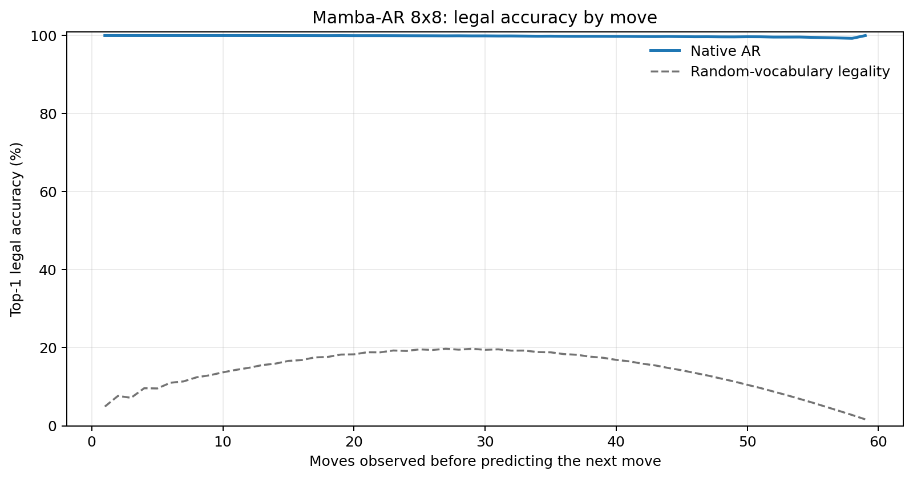
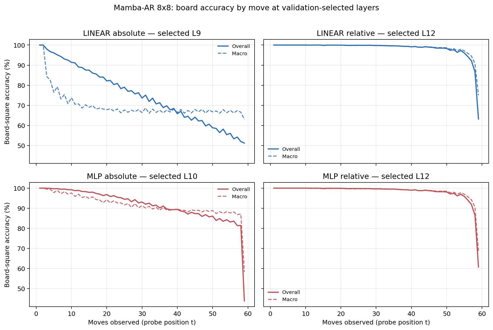

# Proposal evaluation: Mamba-AR 8x8

- **Suite:** `thesis_eval_suite_v1` over `unified_eval_v4`
- **Run:** `selected`
- **Checkpoint:** `final.pt` (`5992d241b42782f4af086ed71dce537ba8ebc362bf31aecadfb04183e7b031b3`)
- **Training budget:** `19,999,840` games / `200` shards
- **Next-move readout:** native pretrained AR head
- **Exact continuation:** intentionally excluded because corpus continuations are stochastic legal choices

## 1. Functional legality

| Readout | Top-1 legal | Top-3 legal fraction | Top-5 legal fraction | Legal probability mass |
|---|---:|---:|---:|---:|
| Native AR | 99.85% | 96.91% | 92.58% | 99.43% |

### Statistical context

| Readout | Normalized legal lift | 95% CI for top-1 legal |
|---|---:|---:|
| Native AR | 99.83% | 99.84%–99.86% |

### Legal accuracy by move

### Legality by normalized game phase

| Readout | Phase | Tokens | Mean legal moves | Top-1 legal | Legal mass |
|---|---:|---:|---:|---:|---:|
| Native AR | 0.00–0.25 | 749,909 | 7.22 | 100.00% | 99.97% |
| Native AR | 0.25–0.50 | 699,679 | 11.44 | 99.96% | 99.85% |
| Native AR | 0.50–0.75 | 749,593 | 10.84 | 99.82% | 99.35% |
| Native AR | 0.75–1.00 | 749,129 | 5.15 | 99.62% | 98.57% |

## 2. Board-state representations

Layer selection uses only the selection split. Headline test values are macro-balanced accuracy, so changing empty-square prevalence across board sizes cannot dominate the comparison.

**Macro accuracy** is the unweighted mean of the three per-class recalls. Absolute labels use empty/black/white and relative labels use empty/mine/opponent. Each class therefore contributes one third even when empty squares are much more common. Overall accuracy instead weights every square equally and can be dominated by the empty class.

| Probe | Labels | Best layer | Normalized depth | Test macro | Overall | Occupied | Empty |
|---|---|---:|---:|---:|---:|---:|---:|
| LINEAR | absolute | L9 | 0.600 | 68.74% | 75.47% | 53.17% | 99.99% |
| LINEAR | relative | L12 | 0.800 | 98.02% | 98.45% | 97.05% | 100.00% |
| MLP | absolute | L10 | 0.667 | 89.64% | 91.86% | 84.49% | 99.97% |
| MLP | relative | L12 | 0.800 | 97.81% | 98.31% | 96.79% | 99.98% |

### Probe accuracy by layer

These are the untouched test-split tables in the same format as the 8x8 unified JEPA notebook. `Selected` marks the layer chosen using the separate selection split, never the test results.

#### LINEAR board-state probe

| Layer | Absolute accuracy | Absolute macro | Relative accuracy | Relative macro | Selected |
|---:|---:|---:|---:|---:|:---|
| L0 | 62.57% | 55.52% | 64.79% | 58.16% |  |
| L1 | 73.48% | 66.63% | 78.08% | 72.26% |  |
| L2 | 73.84% | 67.02% | 79.75% | 74.38% |  |
| L3 | 72.44% | 65.60% | 87.26% | 84.36% |  |
| L4 | 73.86% | 66.98% | 88.84% | 85.95% |  |
| L5 | 74.02% | 67.14% | 89.00% | 86.14% |  |
| L6 | 73.20% | 66.23% | 92.14% | 90.25% |  |
| L7 | 72.79% | 65.76% | 93.20% | 91.65% |  |
| L8 | 74.72% | 67.88% | 95.28% | 94.04% |  |
| L9 | 75.47% | 68.74% | 96.11% | 95.02% | absolute |
| L10 | 75.42% | 68.68% | 97.73% | 97.09% |  |
| L11 | 75.40% | 68.66% | 98.25% | 97.76% |  |
| L12 | 75.36% | 68.61% | 98.45% | 98.02% | relative |
| L13 | 75.22% | 68.44% | 98.40% | 97.94% |  |
| L14 | 74.10% | 67.17% | 97.36% | 96.73% |  |
| L15 | 74.13% | 67.20% | 97.37% | 96.74% |  |

#### MLP board-state probe

| Layer | Absolute accuracy | Absolute macro | Relative accuracy | Relative macro | Selected |
|---:|---:|---:|---:|---:|:---|
| L0 | 65.05% | 58.69% | 65.24% | 58.61% |  |
| L1 | 75.03% | 68.69% | 77.32% | 71.38% |  |
| L2 | 75.73% | 69.55% | 78.96% | 73.46% |  |
| L3 | 82.00% | 78.09% | 85.92% | 82.89% |  |
| L4 | 82.63% | 78.29% | 87.80% | 84.69% |  |
| L5 | 82.86% | 78.53% | 87.94% | 84.89% |  |
| L6 | 86.79% | 83.78% | 90.78% | 88.69% |  |
| L7 | 86.65% | 83.73% | 91.76% | 90.06% |  |
| L8 | 88.16% | 85.09% | 94.42% | 93.00% |  |
| L9 | 86.69% | 83.06% | 95.56% | 94.32% |  |
| L10 | 91.86% | 89.64% | 97.51% | 96.79% | absolute |
| L11 | 82.76% | 78.05% | 98.13% | 97.58% |  |
| L12 | 77.06% | 70.79% | 98.31% | 97.81% | relative |
| L13 | 76.31% | 69.82% | 98.16% | 97.62% |  |
| L14 | 73.88% | 66.87% | 96.71% | 95.91% |  |
| L15 | 74.02% | 67.05% | 96.72% | 95.92% |  |

### Board accuracy by move at each selected layer

### Selected board probes by game phase

| Probe | Labels | Phase | Macro accuracy | Occupied | Empty |
|---|---|---:|---:|---:|---:|
| LINEAR | absolute | 1/4 | 94.73% | 93.02% | 100.00% |
| LINEAR | absolute | 2/4 | 78.93% | 70.09% | 100.00% |
| LINEAR | absolute | 11/4 | 67.85% | 51.81% | 99.97% |
| LINEAR | absolute | 12/4 | 67.49% | 51.25% | 99.98% |
| LINEAR | absolute | 13/4 | 68.30% | 52.53% | 99.98% |
| LINEAR | absolute | 14/4 | 67.65% | 51.47% | 99.98% |
| LINEAR | absolute | 15/4 | 67.74% | 51.61% | 99.98% |
| LINEAR | absolute | 16/4 | 66.79% | 50.80% | 98.77% |
| LINEAR | absolute | 3/4 | 73.97% | 62.18% | 100.00% |
| LINEAR | absolute | 4/4 | 71.04% | 56.70% | 100.00% |
| LINEAR | absolute | 5/4 | 70.24% | 55.72% | 100.00% |
| LINEAR | absolute | 6/4 | 68.94% | 53.54% | 100.00% |
| LINEAR | absolute | 7/4 | 68.34% | 52.93% | 100.00% |
| LINEAR | absolute | 8/4 | 68.25% | 52.42% | 99.99% |
| LINEAR | absolute | 9/4 | 68.16% | 52.27% | 100.00% |
| LINEAR | absolute | 10/4 | 67.46% | 51.25% | 100.00% |
| LINEAR | relative | 1/4 | 100.00% | 100.00% | 100.00% |
| LINEAR | relative | 2/4 | 100.00% | 100.00% | 100.00% |
| LINEAR | relative | 11/4 | 99.30% | 98.97% | 99.99% |
| LINEAR | relative | 12/4 | 99.13% | 98.73% | 99.97% |
| LINEAR | relative | 13/4 | 98.92% | 98.41% | 99.98% |
| LINEAR | relative | 14/4 | 98.52% | 97.79% | 100.00% |
| LINEAR | relative | 15/4 | 97.61% | 96.48% | 99.97% |
| LINEAR | relative | 16/4 | 89.01% | 83.57% | 99.96% |
| LINEAR | relative | 3/4 | 99.97% | 99.96% | 100.00% |
| LINEAR | relative | 4/4 | 99.96% | 99.95% | 100.00% |
| LINEAR | relative | 5/4 | 99.86% | 99.80% | 100.00% |
| LINEAR | relative | 6/4 | 99.85% | 99.78% | 100.00% |
| LINEAR | relative | 7/4 | 99.80% | 99.72% | 100.00% |
| LINEAR | relative | 8/4 | 99.81% | 99.73% | 100.00% |
| LINEAR | relative | 9/4 | 99.69% | 99.54% | 99.99% |
| LINEAR | relative | 10/4 | 99.55% | 99.34% | 99.99% |
| MLP | absolute | 1/4 | 99.85% | 99.85% | 100.00% |
| MLP | absolute | 2/4 | 98.54% | 98.00% | 100.00% |
| MLP | absolute | 11/4 | 89.37% | 84.11% | 99.92% |
| MLP | absolute | 12/4 | 88.98% | 83.55% | 99.86% |
| MLP | absolute | 13/4 | 88.79% | 83.25% | 99.87% |
| MLP | absolute | 14/4 | 88.53% | 82.87% | 99.84% |
| MLP | absolute | 15/4 | 88.04% | 82.15% | 99.81% |
| MLP | absolute | 16/4 | 80.68% | 71.59% | 98.85% |
| MLP | absolute | 3/4 | 97.38% | 96.21% | 100.00% |
| MLP | absolute | 4/4 | 96.20% | 94.31% | 100.00% |
| MLP | absolute | 5/4 | 94.94% | 92.45% | 100.00% |
| MLP | absolute | 6/4 | 93.56% | 90.36% | 99.99% |
| MLP | absolute | 7/4 | 92.46% | 88.75% | 99.98% |
| MLP | absolute | 8/4 | 91.46% | 87.21% | 99.98% |
| MLP | absolute | 9/4 | 90.66% | 86.01% | 99.95% |
| MLP | absolute | 10/4 | 90.09% | 85.18% | 99.93% |
| MLP | relative | 1/4 | 100.00% | 100.00% | 100.00% |
| MLP | relative | 2/4 | 100.00% | 100.00% | 100.00% |
| MLP | relative | 11/4 | 99.13% | 98.73% | 99.98% |
| MLP | relative | 12/4 | 99.00% | 98.54% | 99.92% |
| MLP | relative | 13/4 | 98.70% | 98.11% | 99.94% |
| MLP | relative | 14/4 | 98.32% | 97.50% | 99.97% |
| MLP | relative | 15/4 | 97.42% | 96.23% | 99.91% |
| MLP | relative | 16/4 | 87.92% | 82.82% | 98.50% |
| MLP | relative | 3/4 | 99.96% | 99.96% | 100.00% |
| MLP | relative | 4/4 | 99.90% | 99.87% | 100.00% |
| MLP | relative | 5/4 | 99.80% | 99.71% | 100.00% |
| MLP | relative | 6/4 | 99.77% | 99.67% | 100.00% |
| MLP | relative | 7/4 | 99.69% | 99.56% | 100.00% |
| MLP | relative | 8/4 | 99.65% | 99.50% | 100.00% |
| MLP | relative | 9/4 | 99.54% | 99.33% | 100.00% |
| MLP | relative | 10/4 | 99.42% | 99.16% | 99.99% |

## 3. Nanda-style causal intervention

- Readout: `native_ar`
- Selected intervention scale: `2`
- Interpretation scope: native model behavior

| Control | Target top-1 legal | Target legal mass | Top-N FP+FN |
|---|---:|---:|---:|
| Null | 91.90% | 90.50% | 2.302 |
| Magnitude-matched random | 89.70% | 90.41% | 2.306 |
| Relative-board direction | 95.10% | 92.20% | 1.060 |

For AR this edits the native prediction path. For JEPA it establishes causal steerability of the composed JEPA encoder plus its post-hoc frozen MLP readout; it is not evidence of a native JEPA action head.

## 4. Efficiency and reproducibility

- Encoder parameters: `25,529,856`
- Total parameters: `25,529,856`
- Checkpoint bytes: `306,564,957`
- Evaluation GPU: `NVIDIA L4`
- Training hardware: `unreported`
- Training precision: `bf16`
- Python / PyTorch / CUDA: `3.13.15` / `2.11.0+cu128` / `12.8`
- Median training chunk: `35.37 s`
- Estimated training loop: `1.97 h`
- Median games/s: `2827.19`
- Median supervision units/s: `166712.29`
- Timing scope: dt_seconds excludes normal checkpoint/Drive-sync time; validation is included only in observed_train_plus_validation_loop_hours

## 5. Interpretation boundary

- Board probes establish decodability, not by themselves causal use.
- Legal behavior measures rule compatibility, not strategic playing strength.
- Bootstrap legality intervals quantify test-game sampling only; they do not replace independent pretraining seeds.
- Board-probe point estimates use one deterministic probe seed; the random-encoder control is not a substitute for model-seed replication.
- Cross-board results compare separately trained scaling conditions, not zero-shot transfer.

## Artifact index

- Unified JSON: `/content/seed_evaluation_views/mamba_ar_b8_seed001/runs/selected/thesis_eval/final/results__unified_eval_v4.json`
- Unified summary: `/content/seed_evaluation_views/mamba_ar_b8_seed001/runs/selected/thesis_eval/final/summary__unified_eval_v4.md`
- Position manifest: `/content/seed_evaluation_views/mamba_ar_b8_seed001/runs/selected/thesis_eval/final/position_manifest__unified_eval_v4.json`
- Legal-by-move figure: `/content/seed_evaluation_views/mamba_ar_b8_seed001/runs/selected/thesis_eval/final/legal_accuracy_by_move__thesis_eval_suite_v1.png`
- Board-by-move figure: `/content/seed_evaluation_views/mamba_ar_b8_seed001/runs/selected/thesis_eval/final/board_accuracy_by_move__thesis_eval_suite_v1.png`
- Causal-intervention JSON: `/content/seed_evaluation_views/mamba_ar_b8_seed001/runs/selected/thesis_eval/final/results__unified_eval_v4.json` (`causal_intervention` key)
