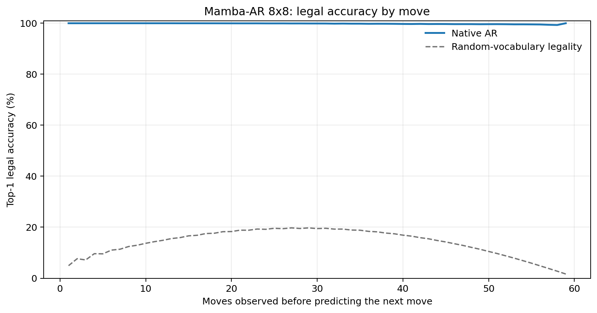
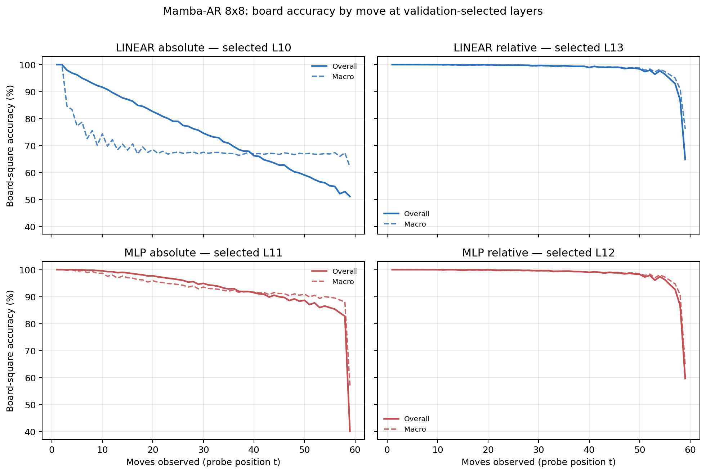

# Proposal evaluation: Mamba-AR 8x8

- **Suite:** `thesis_eval_suite_v1` over `unified_eval_v4`
- **Run:** `selected`
- **Checkpoint:** `final.pt` (`01c0e04cee8c0175e13d8bad97ae414b05eab5b6cdb642db10921a0f627c57ea`)
- **Training budget:** `19,999,840` games / `200` shards
- **Next-move readout:** native pretrained AR head
- **Exact continuation:** intentionally excluded because corpus continuations are stochastic legal choices

## 1. Functional legality

| Readout | Top-1 legal | Top-3 legal fraction | Top-5 legal fraction | Legal probability mass |
|---|---:|---:|---:|---:|
| Native AR | 99.83% | 96.90% | 92.57% | 99.42% |

### Statistical context

| Readout | Normalized legal lift | 95% CI for top-1 legal |
|---|---:|---:|
| Native AR | 99.81% | 99.83%–99.84% |

### Legal accuracy by move

### Legality by normalized game phase

| Readout | Phase | Tokens | Mean legal moves | Top-1 legal | Legal mass |
|---|---:|---:|---:|---:|---:|
| Native AR | 0.00–0.25 | 749,909 | 7.22 | 100.00% | 99.97% |
| Native AR | 0.25–0.50 | 699,679 | 11.44 | 99.95% | 99.84% |
| Native AR | 0.50–0.75 | 749,593 | 10.84 | 99.79% | 99.34% |
| Native AR | 0.75–1.00 | 749,129 | 5.15 | 99.60% | 98.58% |

## 2. Board-state representations

Layer selection uses only the selection split. Headline test values are macro-balanced accuracy, so changing empty-square prevalence across board sizes cannot dominate the comparison.

**Macro accuracy** is the unweighted mean of the three per-class recalls. Absolute labels use empty/black/white and relative labels use empty/mine/opponent. Each class therefore contributes one third even when empty squares are much more common. Overall accuracy instead weights every square equally and can be dominated by the empty class.

| Probe | Labels | Best layer | Normalized depth | Test macro | Overall | Occupied | Empty |
|---|---|---:|---:|---:|---:|---:|---:|
| LINEAR | absolute | L10 | 0.667 | 68.71% | 75.44% | 53.11% | 99.99% |
| LINEAR | relative | L13 | 0.867 | 98.05% | 98.48% | 97.11% | 99.99% |
| MLP | absolute | L11 | 0.733 | 91.54% | 93.36% | 87.33% | 99.99% |
| MLP | relative | L12 | 0.800 | 97.88% | 98.36% | 96.89% | 99.98% |

### Probe accuracy by layer

These are the untouched test-split tables in the same format as the 8x8 unified JEPA notebook. `Selected` marks the layer chosen using the separate selection split, never the test results.

#### LINEAR board-state probe

| Layer | Absolute accuracy | Absolute macro | Relative accuracy | Relative macro | Selected |
|---:|---:|---:|---:|---:|:---|
| L0 | 62.61% | 55.56% | 64.81% | 58.17% |  |
| L1 | 72.60% | 65.78% | 78.24% | 72.74% |  |
| L2 | 74.21% | 67.39% | 83.34% | 78.88% |  |
| L3 | 73.46% | 66.61% | 87.11% | 83.89% |  |
| L4 | 73.06% | 66.17% | 88.82% | 86.16% |  |
| L5 | 73.60% | 66.67% | 89.87% | 87.32% |  |
| L6 | 73.49% | 66.56% | 91.61% | 89.55% |  |
| L7 | 74.33% | 67.46% | 92.58% | 90.63% |  |
| L8 | 74.12% | 67.23% | 93.36% | 91.69% |  |
| L9 | 73.59% | 66.65% | 95.88% | 94.88% |  |
| L10 | 75.44% | 68.71% | 97.33% | 96.58% | absolute |
| L11 | 75.44% | 68.71% | 98.01% | 97.45% |  |
| L12 | 75.47% | 68.74% | 98.49% | 98.07% |  |
| L13 | 75.38% | 68.63% | 98.48% | 98.05% | relative |
| L14 | 74.32% | 67.43% | 97.51% | 96.89% |  |
| L15 | 74.30% | 67.41% | 97.51% | 96.90% |  |

#### MLP board-state probe

| Layer | Absolute accuracy | Absolute macro | Relative accuracy | Relative macro | Selected |
|---:|---:|---:|---:|---:|:---|
| L0 | 65.08% | 58.70% | 65.24% | 58.62% |  |
| L1 | 75.23% | 69.22% | 77.60% | 71.93% |  |
| L2 | 78.31% | 72.75% | 82.43% | 77.80% |  |
| L3 | 82.80% | 78.73% | 86.03% | 82.67% |  |
| L4 | 83.99% | 80.36% | 87.60% | 84.84% |  |
| L5 | 84.54% | 80.81% | 88.75% | 86.05% |  |
| L6 | 86.23% | 83.06% | 90.42% | 88.21% |  |
| L7 | 85.98% | 82.41% | 91.62% | 89.49% |  |
| L8 | 87.27% | 84.11% | 92.30% | 90.43% |  |
| L9 | 91.43% | 89.56% | 94.91% | 93.76% |  |
| L10 | 91.41% | 89.07% | 97.08% | 96.25% |  |
| L11 | 93.36% | 91.54% | 97.85% | 97.24% | absolute |
| L12 | 84.49% | 80.26% | 98.36% | 97.88% | relative |
| L13 | 79.27% | 73.59% | 98.28% | 97.78% |  |
| L14 | 74.61% | 67.79% | 96.95% | 96.18% |  |
| L15 | 74.67% | 67.88% | 96.92% | 96.15% |  |

### Board accuracy by move at each selected layer

### Selected board probes by game phase

| Probe | Labels | Phase | Macro accuracy | Occupied | Empty |
|---|---|---:|---:|---:|---:|
| LINEAR | absolute | 1/4 | 94.74% | 92.77% | 100.00% |
| LINEAR | absolute | 2/4 | 78.89% | 70.00% | 100.00% |
| LINEAR | absolute | 11/4 | 67.55% | 51.34% | 100.00% |
| LINEAR | absolute | 12/4 | 67.57% | 51.36% | 99.99% |
| LINEAR | absolute | 13/4 | 67.80% | 51.78% | 100.00% |
| LINEAR | absolute | 14/4 | 67.64% | 51.47% | 99.98% |
| LINEAR | absolute | 15/4 | 67.63% | 51.44% | 100.00% |
| LINEAR | absolute | 16/4 | 66.80% | 50.95% | 98.50% |
| LINEAR | absolute | 3/4 | 73.74% | 61.80% | 100.00% |
| LINEAR | absolute | 4/4 | 71.42% | 57.26% | 100.00% |
| LINEAR | absolute | 5/4 | 70.18% | 55.57% | 100.00% |
| LINEAR | absolute | 6/4 | 68.84% | 53.39% | 100.00% |
| LINEAR | absolute | 7/4 | 68.24% | 52.76% | 100.00% |
| LINEAR | absolute | 8/4 | 68.32% | 52.53% | 100.00% |
| LINEAR | absolute | 9/4 | 68.30% | 52.47% | 100.00% |
| LINEAR | absolute | 10/4 | 67.85% | 51.83% | 100.00% |
| LINEAR | relative | 1/4 | 100.00% | 100.00% | 100.00% |
| LINEAR | relative | 2/4 | 99.99% | 99.99% | 100.00% |
| LINEAR | relative | 11/4 | 99.23% | 98.88% | 99.94% |
| LINEAR | relative | 12/4 | 99.16% | 98.77% | 99.95% |
| LINEAR | relative | 13/4 | 98.96% | 98.47% | 99.96% |
| LINEAR | relative | 14/4 | 98.60% | 97.95% | 99.93% |
| LINEAR | relative | 15/4 | 97.81% | 96.77% | 99.95% |
| LINEAR | relative | 16/4 | 89.55% | 84.37% | 100.00% |
| LINEAR | relative | 3/4 | 99.91% | 99.88% | 100.00% |
| LINEAR | relative | 4/4 | 99.83% | 99.77% | 100.00% |
| LINEAR | relative | 5/4 | 99.74% | 99.63% | 100.00% |
| LINEAR | relative | 6/4 | 99.75% | 99.65% | 100.00% |
| LINEAR | relative | 7/4 | 99.67% | 99.53% | 99.99% |
| LINEAR | relative | 8/4 | 99.60% | 99.43% | 99.98% |
| LINEAR | relative | 9/4 | 99.50% | 99.27% | 99.98% |
| LINEAR | relative | 10/4 | 99.44% | 99.19% | 99.97% |
| MLP | absolute | 1/4 | 99.93% | 99.93% | 100.00% |
| MLP | absolute | 2/4 | 99.55% | 99.38% | 100.00% |
| MLP | absolute | 11/4 | 91.80% | 87.72% | 99.95% |
| MLP | absolute | 12/4 | 91.38% | 87.09% | 99.97% |
| MLP | absolute | 13/4 | 90.96% | 86.47% | 99.95% |
| MLP | absolute | 14/4 | 90.68% | 86.03% | 99.97% |
| MLP | absolute | 15/4 | 89.98% | 85.04% | 99.88% |
| MLP | absolute | 16/4 | 81.22% | 72.15% | 99.37% |
| MLP | absolute | 3/4 | 98.64% | 98.03% | 100.00% |
| MLP | absolute | 4/4 | 97.58% | 96.38% | 100.00% |
| MLP | absolute | 5/4 | 96.72% | 95.11% | 100.00% |
| MLP | absolute | 6/4 | 95.59% | 93.40% | 100.00% |
| MLP | absolute | 7/4 | 94.78% | 92.20% | 100.00% |
| MLP | absolute | 8/4 | 93.76% | 90.64% | 99.99% |
| MLP | absolute | 9/4 | 93.19% | 89.78% | 99.99% |
| MLP | absolute | 10/4 | 92.37% | 88.57% | 99.99% |
| MLP | relative | 1/4 | 100.00% | 100.00% | 100.00% |
| MLP | relative | 2/4 | 100.00% | 100.00% | 100.00% |
| MLP | relative | 11/4 | 99.19% | 98.83% | 99.96% |
| MLP | relative | 12/4 | 99.07% | 98.64% | 99.96% |
| MLP | relative | 13/4 | 98.86% | 98.33% | 99.96% |
| MLP | relative | 14/4 | 98.50% | 97.81% | 99.91% |
| MLP | relative | 15/4 | 97.66% | 96.56% | 99.95% |
| MLP | relative | 16/4 | 87.66% | 82.97% | 97.43% |
| MLP | relative | 3/4 | 99.93% | 99.91% | 100.00% |
| MLP | relative | 4/4 | 99.93% | 99.90% | 100.00% |
| MLP | relative | 5/4 | 99.82% | 99.74% | 100.00% |
| MLP | relative | 6/4 | 99.77% | 99.68% | 100.00% |
| MLP | relative | 7/4 | 99.69% | 99.56% | 100.00% |
| MLP | relative | 8/4 | 99.62% | 99.46% | 100.00% |
| MLP | relative | 9/4 | 99.47% | 99.23% | 100.00% |
| MLP | relative | 10/4 | 99.38% | 99.11% | 99.98% |

## 3. Nanda-style causal intervention

- Readout: `native_ar`
- Selected intervention scale: `4`
- Interpretation scope: native model behavior

| Control | Target top-1 legal | Target legal mass | Top-N FP+FN |
|---|---:|---:|---:|
| Null | 91.40% | 90.46% | 2.318 |
| Magnitude-matched random | 89.60% | 90.38% | 2.298 |
| Relative-board direction | 95.50% | 94.45% | 0.680 |

For AR this edits the native prediction path. For JEPA it establishes causal steerability of the composed JEPA encoder plus its post-hoc frozen MLP readout; it is not evidence of a native JEPA action head.

## 4. Efficiency and reproducibility

- Encoder parameters: `25,529,856`
- Total parameters: `25,529,856`
- Checkpoint bytes: `306,564,957`
- Evaluation GPU: `NVIDIA L4`
- Training hardware: `unreported`
- Training precision: `bf16`
- Python / PyTorch / CUDA: `3.13.15` / `2.11.0+cu128` / `12.8`
- Median training chunk: `35.37 s`
- Estimated training loop: `1.96 h`
- Median games/s: `2827.41`
- Median supervision units/s: `166722.47`
- Timing scope: dt_seconds excludes normal checkpoint/Drive-sync time; validation is included only in observed_train_plus_validation_loop_hours

## 5. Interpretation boundary

- Board probes establish decodability, not by themselves causal use.
- Legal behavior measures rule compatibility, not strategic playing strength.
- Bootstrap legality intervals quantify test-game sampling only; they do not replace independent pretraining seeds.
- Board-probe point estimates use one deterministic probe seed; the random-encoder control is not a substitute for model-seed replication.
- Cross-board results compare separately trained scaling conditions, not zero-shot transfer.

## Artifact index

- Unified JSON: `/content/seed_evaluation_views/mamba_ar_b8_seed002/runs/selected/thesis_eval/final/results__unified_eval_v4.json`
- Unified summary: `/content/seed_evaluation_views/mamba_ar_b8_seed002/runs/selected/thesis_eval/final/summary__unified_eval_v4.md`
- Position manifest: `/content/seed_evaluation_views/mamba_ar_b8_seed002/runs/selected/thesis_eval/final/position_manifest__unified_eval_v4.json`
- Legal-by-move figure: `/content/seed_evaluation_views/mamba_ar_b8_seed002/runs/selected/thesis_eval/final/legal_accuracy_by_move__thesis_eval_suite_v1.png`
- Board-by-move figure: `/content/seed_evaluation_views/mamba_ar_b8_seed002/runs/selected/thesis_eval/final/board_accuracy_by_move__thesis_eval_suite_v1.png`
- Causal-intervention JSON: `/content/seed_evaluation_views/mamba_ar_b8_seed002/runs/selected/thesis_eval/final/results__unified_eval_v4.json` (`causal_intervention` key)
