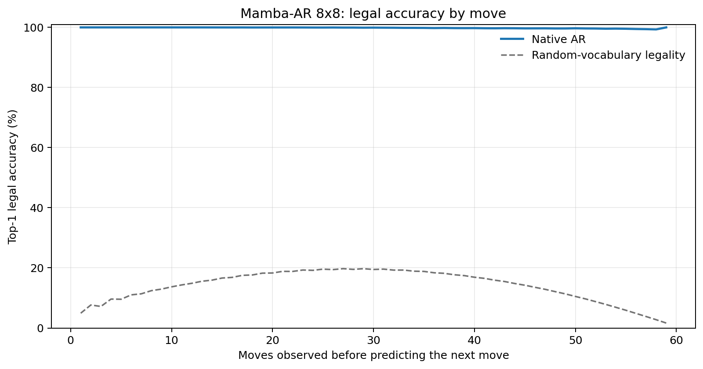
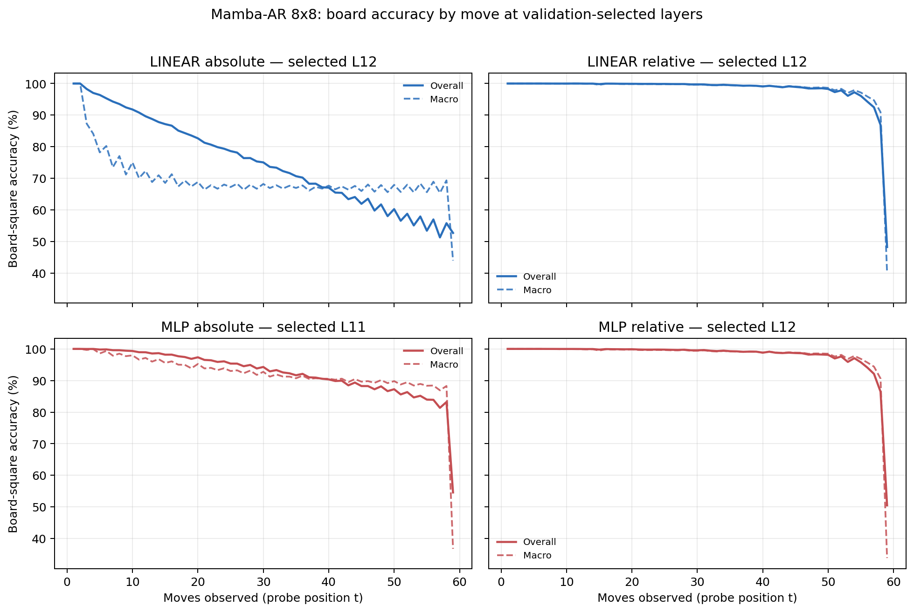

# Proposal evaluation: Mamba-AR 8x8

- **Suite:** `thesis_eval_suite_v1` over `unified_eval_v4`
- **Run:** `selected`
- **Checkpoint:** `final.pt` (`fefed6e1bbe8a99dc13bcbde77acb4bb4cc631d4359f08dda325fbd25db3dc2c`)
- **Training budget:** `19,999,840` games / `200` shards
- **Next-move readout:** native pretrained AR head
- **Exact continuation:** intentionally excluded because corpus continuations are stochastic legal choices

## 1. Functional legality

| Readout | Top-1 legal | Top-3 legal fraction | Top-5 legal fraction | Legal probability mass |
|---|---:|---:|---:|---:|
| Native AR | 99.84% | 96.90% | 92.57% | 99.37% |

### Statistical context

| Readout | Normalized legal lift | 95% CI for top-1 legal |
|---|---:|---:|
| Native AR | 99.82% | 99.83%–99.85% |

### Legal accuracy by move

### Legality by normalized game phase

| Readout | Phase | Tokens | Mean legal moves | Top-1 legal | Legal mass |
|---|---:|---:|---:|---:|---:|
| Native AR | 0.00–0.25 | 749,909 | 7.22 | 100.00% | 99.97% |
| Native AR | 0.25–0.50 | 699,679 | 11.44 | 99.96% | 99.85% |
| Native AR | 0.50–0.75 | 749,593 | 10.84 | 99.80% | 99.28% |
| Native AR | 0.75–1.00 | 749,129 | 5.15 | 99.61% | 98.43% |

## 2. Board-state representations

Layer selection uses only the selection split. Headline test values are macro-balanced accuracy, so changing empty-square prevalence across board sizes cannot dominate the comparison.

**Macro accuracy** is the unweighted mean of the three per-class recalls. Absolute labels use empty/black/white and relative labels use empty/mine/opponent. Each class therefore contributes one third even when empty squares are much more common. Overall accuracy instead weights every square equally and can be dominated by the empty class.

| Probe | Labels | Best layer | Normalized depth | Test macro | Overall | Occupied | Empty |
|---|---|---:|---:|---:|---:|---:|---:|
| LINEAR | absolute | L12 | 0.800 | 68.81% | 75.51% | 53.28% | 99.96% |
| LINEAR | relative | L12 | 0.800 | 97.71% | 98.20% | 96.61% | 99.95% |
| MLP | absolute | L11 | 0.733 | 90.79% | 92.75% | 86.21% | 99.94% |
| MLP | relative | L12 | 0.800 | 97.56% | 98.11% | 96.45% | 99.93% |

### Probe accuracy by layer

These are the untouched test-split tables in the same format as the 8x8 unified JEPA notebook. `Selected` marks the layer chosen using the separate selection split, never the test results.

#### LINEAR board-state probe

| Layer | Absolute accuracy | Absolute macro | Relative accuracy | Relative macro | Selected |
|---:|---:|---:|---:|---:|:---|
| L0 | 62.63% | 55.58% | 64.76% | 58.11% |  |
| L1 | 74.02% | 67.14% | 80.36% | 74.99% |  |
| L2 | 72.98% | 66.07% | 86.13% | 82.71% |  |
| L3 | 71.66% | 64.73% | 90.46% | 88.42% |  |
| L4 | 72.64% | 65.68% | 91.83% | 89.93% |  |
| L5 | 73.32% | 66.34% | 93.11% | 91.38% |  |
| L6 | 73.61% | 66.65% | 93.96% | 92.43% |  |
| L7 | 74.30% | 67.42% | 95.12% | 93.83% |  |
| L8 | 74.71% | 67.88% | 95.94% | 94.86% |  |
| L9 | 75.24% | 68.48% | 96.74% | 95.84% |  |
| L10 | 75.45% | 68.73% | 97.10% | 96.31% |  |
| L11 | 75.47% | 68.76% | 97.87% | 97.29% |  |
| L12 | 75.51% | 68.81% | 98.20% | 97.71% | absolute + relative |
| L13 | 75.35% | 68.60% | 98.11% | 97.58% |  |
| L14 | 74.52% | 67.69% | 97.22% | 96.53% |  |
| L15 | 74.26% | 67.35% | 97.12% | 96.40% |  |

#### MLP board-state probe

| Layer | Absolute accuracy | Absolute macro | Relative accuracy | Relative macro | Selected |
|---:|---:|---:|---:|---:|:---|
| L0 | 65.09% | 58.74% | 65.28% | 58.67% |  |
| L1 | 75.99% | 69.73% | 79.47% | 74.01% |  |
| L2 | 81.02% | 76.52% | 85.05% | 81.51% |  |
| L3 | 84.65% | 81.62% | 89.29% | 87.23% |  |
| L4 | 82.85% | 78.91% | 90.75% | 88.73% |  |
| L5 | 81.31% | 76.63% | 92.18% | 90.28% |  |
| L6 | 79.81% | 74.64% | 93.04% | 91.33% |  |
| L7 | 84.16% | 80.05% | 94.42% | 93.00% |  |
| L8 | 85.17% | 81.26% | 95.39% | 94.18% |  |
| L9 | 88.83% | 85.80% | 96.54% | 95.55% |  |
| L10 | 89.88% | 87.13% | 96.96% | 96.09% |  |
| L11 | 92.75% | 90.79% | 97.82% | 97.19% | absolute |
| L12 | 86.86% | 83.29% | 98.11% | 97.56% | relative |
| L13 | 78.49% | 72.62% | 97.87% | 97.26% |  |
| L14 | 74.70% | 67.92% | 96.70% | 95.88% |  |
| L15 | 74.58% | 67.75% | 96.66% | 95.83% |  |

### Board accuracy by move at each selected layer

### Selected board probes by game phase

| Probe | Labels | Phase | Macro accuracy | Occupied | Empty |
|---|---|---:|---:|---:|---:|
| LINEAR | absolute | 1/4 | 95.64% | 93.97% | 100.00% |
| LINEAR | absolute | 2/4 | 79.90% | 71.51% | 100.00% |
| LINEAR | absolute | 11/4 | 67.55% | 51.36% | 99.99% |
| LINEAR | absolute | 12/4 | 67.56% | 51.34% | 99.98% |
| LINEAR | absolute | 13/4 | 67.32% | 51.07% | 99.98% |
| LINEAR | absolute | 14/4 | 67.45% | 51.17% | 99.99% |
| LINEAR | absolute | 15/4 | 67.58% | 51.37% | 100.00% |
| LINEAR | absolute | 16/4 | 65.97% | 52.62% | 92.67% |
| LINEAR | absolute | 3/4 | 74.43% | 62.83% | 100.00% |
| LINEAR | absolute | 4/4 | 71.63% | 57.61% | 100.00% |
| LINEAR | absolute | 5/4 | 70.29% | 55.78% | 100.00% |
| LINEAR | absolute | 6/4 | 68.59% | 53.03% | 99.99% |
| LINEAR | absolute | 7/4 | 68.18% | 52.68% | 100.00% |
| LINEAR | absolute | 8/4 | 68.25% | 52.42% | 100.00% |
| LINEAR | absolute | 9/4 | 68.24% | 52.40% | 100.00% |
| LINEAR | absolute | 10/4 | 68.11% | 52.21% | 100.00% |
| LINEAR | relative | 1/4 | 100.00% | 100.00% | 100.00% |
| LINEAR | relative | 2/4 | 99.99% | 99.99% | 100.00% |
| LINEAR | relative | 11/4 | 99.24% | 98.89% | 99.97% |
| LINEAR | relative | 12/4 | 99.14% | 98.75% | 99.95% |
| LINEAR | relative | 13/4 | 98.87% | 98.35% | 99.96% |
| LINEAR | relative | 14/4 | 98.49% | 97.78% | 99.95% |
| LINEAR | relative | 15/4 | 97.59% | 96.44% | 100.00% |
| LINEAR | relative | 16/4 | 84.25% | 80.16% | 92.44% |
| LINEAR | relative | 3/4 | 99.96% | 99.96% | 100.00% |
| LINEAR | relative | 4/4 | 99.94% | 99.92% | 100.00% |
| LINEAR | relative | 5/4 | 99.82% | 99.75% | 100.00% |
| LINEAR | relative | 6/4 | 99.83% | 99.76% | 99.99% |
| LINEAR | relative | 7/4 | 99.80% | 99.72% | 100.00% |
| LINEAR | relative | 8/4 | 99.72% | 99.60% | 100.00% |
| LINEAR | relative | 9/4 | 99.54% | 99.33% | 99.99% |
| LINEAR | relative | 10/4 | 99.45% | 99.20% | 99.99% |
| MLP | absolute | 1/4 | 99.90% | 99.90% | 100.00% |
| MLP | absolute | 2/4 | 99.06% | 98.74% | 100.00% |
| MLP | absolute | 11/4 | 90.67% | 86.03% | 99.96% |
| MLP | absolute | 12/4 | 90.29% | 85.45% | 99.98% |
| MLP | absolute | 13/4 | 89.68% | 84.53% | 99.98% |
| MLP | absolute | 14/4 | 89.55% | 84.36% | 99.93% |
| MLP | absolute | 15/4 | 88.88% | 83.33% | 100.00% |
| MLP | absolute | 16/4 | 80.20% | 75.23% | 90.14% |
| MLP | absolute | 3/4 | 97.82% | 96.84% | 100.00% |
| MLP | absolute | 4/4 | 96.75% | 95.13% | 100.00% |
| MLP | absolute | 5/4 | 95.57% | 93.38% | 100.00% |
| MLP | absolute | 6/4 | 94.38% | 91.59% | 100.00% |
| MLP | absolute | 7/4 | 93.53% | 90.33% | 100.00% |
| MLP | absolute | 8/4 | 92.73% | 89.10% | 100.00% |
| MLP | absolute | 9/4 | 91.94% | 87.91% | 99.98% |
| MLP | absolute | 10/4 | 91.27% | 86.93% | 99.98% |
| MLP | relative | 1/4 | 100.00% | 100.00% | 100.00% |
| MLP | relative | 2/4 | 99.99% | 99.99% | 100.00% |
| MLP | relative | 11/4 | 99.03% | 98.60% | 99.93% |
| MLP | relative | 12/4 | 98.93% | 98.46% | 99.91% |
| MLP | relative | 13/4 | 98.68% | 98.11% | 99.90% |
| MLP | relative | 14/4 | 98.29% | 97.53% | 99.86% |
| MLP | relative | 15/4 | 97.38% | 96.19% | 99.86% |
| MLP | relative | 16/4 | 83.58% | 80.58% | 90.06% |
| MLP | relative | 3/4 | 99.94% | 99.92% | 100.00% |
| MLP | relative | 4/4 | 99.88% | 99.84% | 100.00% |
| MLP | relative | 5/4 | 99.74% | 99.63% | 100.00% |
| MLP | relative | 6/4 | 99.71% | 99.60% | 99.99% |
| MLP | relative | 7/4 | 99.65% | 99.51% | 100.00% |
| MLP | relative | 8/4 | 99.53% | 99.34% | 99.99% |
| MLP | relative | 9/4 | 99.35% | 99.07% | 99.98% |
| MLP | relative | 10/4 | 99.23% | 98.90% | 99.97% |

## 3. Nanda-style causal intervention

- Readout: `native_ar`
- Selected intervention scale: `4`
- Interpretation scope: native model behavior

| Control | Target top-1 legal | Target legal mass | Top-N FP+FN |
|---|---:|---:|---:|
| Null | 91.50% | 90.40% | 2.304 |
| Magnitude-matched random | 91.00% | 90.36% | 2.318 |
| Relative-board direction | 96.20% | 94.94% | 0.616 |

For AR this edits the native prediction path. For JEPA it establishes causal steerability of the composed JEPA encoder plus its post-hoc frozen MLP readout; it is not evidence of a native JEPA action head.

## 4. Efficiency and reproducibility

- Encoder parameters: `25,529,856`
- Total parameters: `25,529,856`
- Checkpoint bytes: `306,564,957`
- Evaluation GPU: `NVIDIA L4`
- Training hardware: `unreported`
- Training precision: `bf16`
- Python / PyTorch / CUDA: `3.12.13` / `2.11.0+cu128` / `12.8`
- Median training chunk: `35.36 s`
- Estimated training loop: `1.96 h`
- Median games/s: `2827.67`
- Median supervision units/s: `166736.35`
- Timing scope: dt_seconds excludes normal checkpoint/Drive-sync time; validation is included only in observed_train_plus_validation_loop_hours

## 5. Interpretation boundary

- Board probes establish decodability, not by themselves causal use.
- Legal behavior measures rule compatibility, not strategic playing strength.
- Bootstrap legality intervals quantify test-game sampling only; they do not replace independent pretraining seeds.
- Board-probe point estimates use one deterministic probe seed; the random-encoder control is not a substitute for model-seed replication.
- Cross-board results compare separately trained scaling conditions, not zero-shot transfer.

## Artifact index

- Unified JSON: `/content/seed_evaluation_views/mamba_ar_b8_seed003/runs/selected/thesis_eval/final/results__unified_eval_v4.json`
- Unified summary: `/content/seed_evaluation_views/mamba_ar_b8_seed003/runs/selected/thesis_eval/final/summary__unified_eval_v4.md`
- Position manifest: `/content/seed_evaluation_views/mamba_ar_b8_seed003/runs/selected/thesis_eval/final/position_manifest__unified_eval_v4.json`
- Legal-by-move figure: `/content/seed_evaluation_views/mamba_ar_b8_seed003/runs/selected/thesis_eval/final/legal_accuracy_by_move__thesis_eval_suite_v1.png`
- Board-by-move figure: `/content/seed_evaluation_views/mamba_ar_b8_seed003/runs/selected/thesis_eval/final/board_accuracy_by_move__thesis_eval_suite_v1.png`
- Causal-intervention JSON: `/content/seed_evaluation_views/mamba_ar_b8_seed003/runs/selected/thesis_eval/final/results__unified_eval_v4.json` (`causal_intervention` key)
