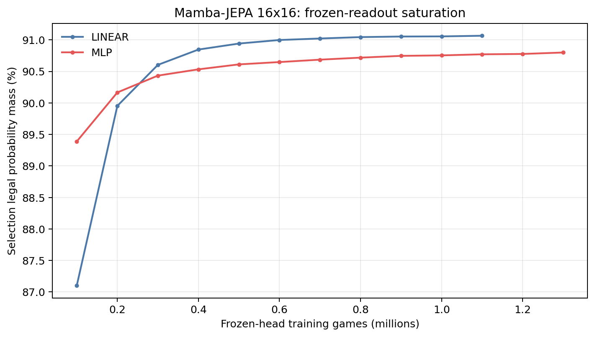
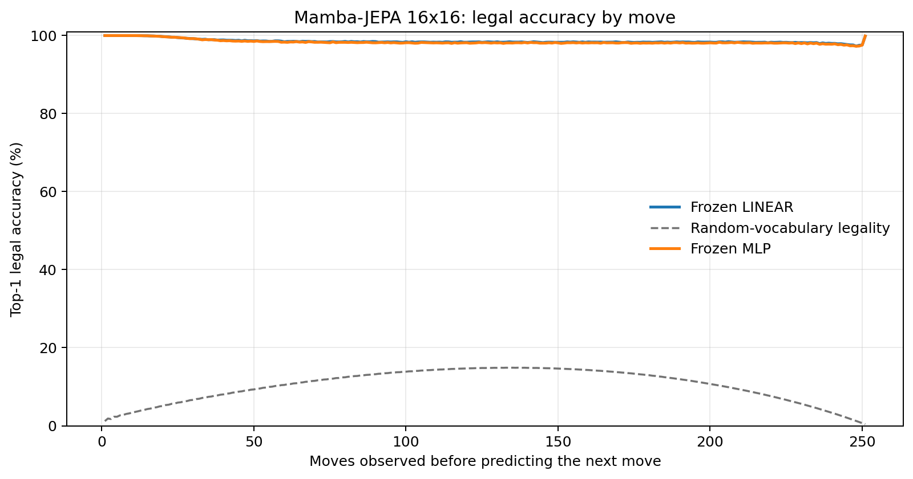
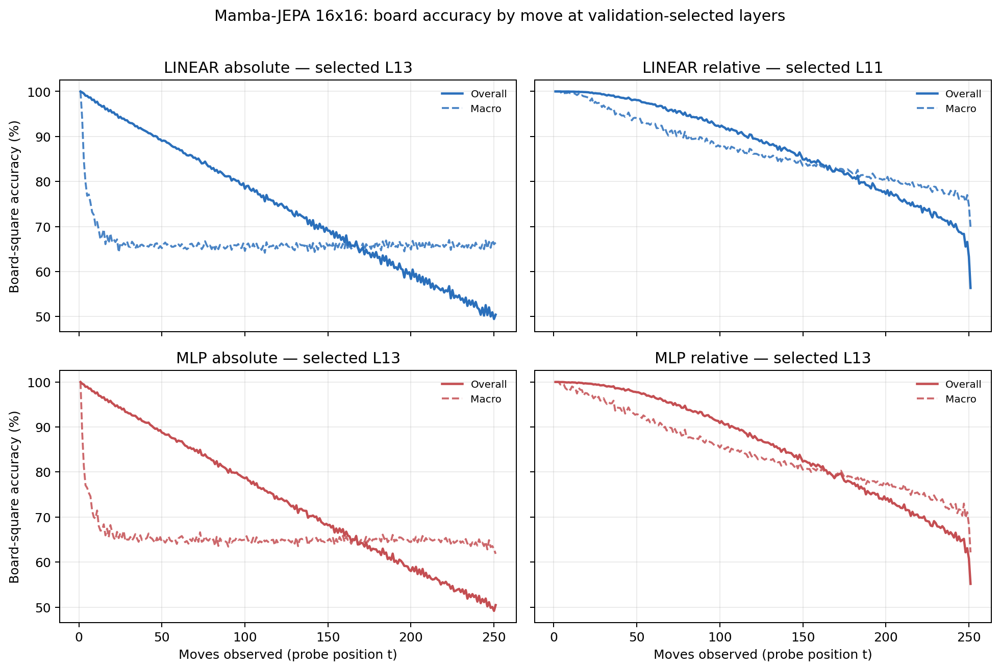

# Proposal evaluation: Mamba-JEPA 16x16

- **Suite:** `thesis_eval_suite_v1` over `unified_eval_v4`
- **Run:** `selected`
- **Checkpoint:** `final.pt` (`2da5d0c983cd5cca2e0b677249a6239101e4470e2602fca80b01c30637746fc0`)
- **Training budget:** `20,000,000` games / `200` shards
- **Next-move readout:** frozen bf16 encoder with common fp32 Linear/MLP readouts
- **Exact continuation:** intentionally excluded because corpus continuations are stochastic legal choices

## 1. Functional legality

| Readout | Top-1 legal | Top-3 legal fraction | Top-5 legal fraction | Legal probability mass |
|---|---:|---:|---:|---:|
| Frozen LINEAR | 98.53% | 97.74% | 96.73% | 91.02% |
| Frozen MLP | 98.38% | 97.58% | 96.57% | 90.74% |

### Statistical context

| Readout | Normalized legal lift | 95% CI for top-1 legal |
|---|---:|---:|
| Frozen LINEAR | 98.37% | 98.52%–98.55% |
| Frozen MLP | 98.19% | 98.37%–98.39% |

### Frozen-head saturation

There is no minimum shard count. Training stops under the pre-registered selection legal-mass patience rule and restores the best checkpoint.

### Legal accuracy by move

### Legality by normalized game phase

| Readout | Phase | Tokens | Mean legal moves | Top-1 legal | Legal mass |
|---|---:|---:|---:|---:|---:|
| Frozen LINEAR | 0.00–0.25 | 3,148,134 | 16.93 | 99.24% | 94.97% |
| Frozen LINEAR | 0.25–0.50 | 3,097,644 | 33.66 | 98.38% | 88.94% |
| Frozen LINEAR | 0.50–0.75 | 3,147,606 | 35.65 | 98.32% | 89.52% |
| Frozen LINEAR | 0.75–1.00 | 3,147,581 | 18.01 | 98.20% | 90.61% |
| Frozen MLP | 0.00–0.25 | 3,148,134 | 16.93 | 99.17% | 94.53% |
| Frozen MLP | 0.25–0.50 | 3,097,644 | 33.66 | 98.19% | 88.58% |
| Frozen MLP | 0.50–0.75 | 3,147,606 | 35.65 | 98.13% | 89.15% |
| Frozen MLP | 0.75–1.00 | 3,147,581 | 18.01 | 98.02% | 90.66% |

## 2. Board-state representations

Layer selection uses only the selection split. Headline test values are macro-balanced accuracy, so changing empty-square prevalence across board sizes cannot dominate the comparison.

**Macro accuracy** is the unweighted mean of the three per-class recalls. Absolute labels use empty/black/white and relative labels use empty/mine/opponent. Each class therefore contributes one third even when empty squares are much more common. Overall accuracy instead weights every square equally and can be dominated by the empty class.

| Probe | Labels | Best layer | Normalized depth | Test macro | Overall | Occupied | Empty |
|---|---|---:|---:|---:|---:|---:|---:|
| LINEAR | absolute | L13 | 0.867 | 66.08% | 74.20% | 49.24% | 99.78% |
| LINEAR | relative | L11 | 0.733 | 83.87% | 87.52% | 76.41% | 98.91% |
| MLP | absolute | L13 | 0.867 | 65.53% | 73.72% | 48.51% | 99.56% |
| MLP | relative | L13 | 0.867 | 81.20% | 85.52% | 72.41% | 98.96% |

### Probe accuracy by layer

These are the untouched test-split tables in the same format as the 8x8 unified JEPA notebook. `Selected` marks the layer chosen using the separate selection split, never the test results.

#### LINEAR board-state probe

| Layer | Absolute accuracy | Absolute macro | Relative accuracy | Relative macro | Selected |
|---:|---:|---:|---:|---:|:---|
| L0 | 64.61% | 56.45% | 65.54% | 57.68% |  |
| L1 | 70.81% | 62.64% | 71.83% | 63.93% |  |
| L2 | 70.29% | 62.17% | 71.39% | 63.59% |  |
| L3 | 68.78% | 60.68% | 75.82% | 70.12% |  |
| L4 | 68.86% | 60.75% | 75.56% | 69.73% |  |
| L5 | 70.56% | 62.45% | 76.96% | 70.99% |  |
| L6 | 72.11% | 64.04% | 78.14% | 72.02% |  |
| L7 | 70.63% | 62.50% | 85.38% | 81.75% |  |
| L8 | 71.58% | 63.48% | 85.90% | 82.25% |  |
| L9 | 72.50% | 64.39% | 86.59% | 82.94% |  |
| L10 | 73.09% | 65.00% | 87.09% | 83.46% |  |
| L11 | 73.60% | 65.52% | 87.52% | 83.87% | relative |
| L12 | 73.89% | 65.79% | 87.63% | 83.90% |  |
| L13 | 74.20% | 66.08% | 87.67% | 83.85% | absolute |
| L14 | 73.91% | 65.74% | 86.91% | 82.89% |  |
| L15 | 73.48% | 65.28% | 86.04% | 81.88% |  |

#### MLP board-state probe

| Layer | Absolute accuracy | Absolute macro | Relative accuracy | Relative macro | Selected |
|---:|---:|---:|---:|---:|:---|
| L0 | 65.20% | 57.03% | 65.82% | 57.88% |  |
| L1 | 69.27% | 61.17% | 70.05% | 62.09% |  |
| L2 | 68.90% | 60.82% | 69.74% | 61.81% |  |
| L3 | 68.24% | 60.34% | 73.52% | 67.51% |  |
| L4 | 68.06% | 60.08% | 73.19% | 67.08% |  |
| L5 | 69.34% | 61.34% | 74.39% | 68.12% |  |
| L6 | 70.93% | 62.89% | 75.64% | 69.17% |  |
| L7 | 69.25% | 61.16% | 82.20% | 78.30% |  |
| L8 | 70.28% | 62.19% | 82.86% | 78.92% |  |
| L9 | 71.33% | 63.21% | 83.78% | 79.84% |  |
| L10 | 72.08% | 64.00% | 84.52% | 80.56% |  |
| L11 | 72.81% | 64.69% | 85.14% | 81.10% |  |
| L12 | 73.25% | 65.10% | 85.33% | 81.19% |  |
| L13 | 73.72% | 65.53% | 85.52% | 81.20% | absolute + relative |
| L14 | 73.40% | 65.14% | 84.47% | 79.84% |  |
| L15 | 72.90% | 64.62% | 83.53% | 78.73% |  |

### Board accuracy by move at each selected layer

### Selected board probes by game phase

| Probe | Labels | Phase | Macro accuracy | Occupied | Empty |
|---|---|---:|---:|---:|---:|
| LINEAR | absolute | 1/4 | 74.55% | 62.96% | 100.00% |
| LINEAR | absolute | 2/4 | 66.58% | 49.97% | 100.00% |
| LINEAR | absolute | 11/4 | 65.66% | 48.79% | 99.41% |
| LINEAR | absolute | 12/4 | 65.83% | 49.20% | 99.07% |
| LINEAR | absolute | 13/4 | 65.82% | 49.41% | 98.66% |
| LINEAR | absolute | 14/4 | 65.72% | 49.51% | 98.12% |
| LINEAR | absolute | 15/4 | 65.79% | 49.93% | 97.50% |
| LINEAR | absolute | 16/4 | 65.69% | 49.92% | 97.22% |
| LINEAR | absolute | 3/4 | 65.93% | 48.91% | 100.00% |
| LINEAR | absolute | 4/4 | 65.84% | 48.77% | 99.99% |
| LINEAR | absolute | 5/4 | 65.73% | 48.60% | 99.99% |
| LINEAR | absolute | 6/4 | 65.54% | 48.32% | 99.97% |
| LINEAR | absolute | 7/4 | 65.65% | 48.50% | 99.94% |
| LINEAR | absolute | 8/4 | 65.63% | 48.52% | 99.86% |
| LINEAR | absolute | 9/4 | 65.62% | 48.54% | 99.76% |
| LINEAR | absolute | 10/4 | 65.63% | 48.63% | 99.63% |
| LINEAR | relative | 1/4 | 99.59% | 99.45% | 100.00% |
| LINEAR | relative | 2/4 | 97.78% | 96.78% | 99.99% |
| LINEAR | relative | 11/4 | 83.12% | 76.18% | 97.12% |
| LINEAR | relative | 12/4 | 82.02% | 74.84% | 96.45% |
| LINEAR | relative | 13/4 | 80.73% | 73.30% | 95.66% |
| LINEAR | relative | 14/4 | 79.68% | 72.06% | 95.01% |
| LINEAR | relative | 15/4 | 78.44% | 70.71% | 94.00% |
| LINEAR | relative | 16/4 | 76.09% | 67.14% | 94.04% |
| LINEAR | relative | 3/4 | 95.11% | 92.82% | 99.95% |
| LINEAR | relative | 4/4 | 93.18% | 89.96% | 99.82% |
| LINEAR | relative | 5/4 | 91.09% | 86.96% | 99.58% |
| LINEAR | relative | 6/4 | 89.48% | 84.68% | 99.30% |
| LINEAR | relative | 7/4 | 87.81% | 82.32% | 98.98% |
| LINEAR | relative | 8/4 | 86.47% | 80.51% | 98.58% |
| LINEAR | relative | 9/4 | 85.27% | 78.92% | 98.13% |
| LINEAR | relative | 10/4 | 84.08% | 77.38% | 97.59% |
| MLP | absolute | 1/4 | 72.92% | 60.49% | 100.00% |
| MLP | absolute | 2/4 | 66.05% | 49.17% | 100.00% |
| MLP | absolute | 11/4 | 64.95% | 47.99% | 98.88% |
| MLP | absolute | 12/4 | 65.04% | 48.36% | 98.38% |
| MLP | absolute | 13/4 | 65.04% | 48.75% | 97.61% |
| MLP | absolute | 14/4 | 64.98% | 49.18% | 96.59% |
| MLP | absolute | 15/4 | 64.66% | 49.65% | 94.69% |
| MLP | absolute | 16/4 | 63.95% | 49.86% | 92.12% |
| MLP | absolute | 3/4 | 65.32% | 47.98% | 99.99% |
| MLP | absolute | 4/4 | 65.03% | 47.55% | 99.98% |
| MLP | absolute | 5/4 | 65.04% | 47.59% | 99.96% |
| MLP | absolute | 6/4 | 64.65% | 47.01% | 99.93% |
| MLP | absolute | 7/4 | 64.95% | 47.48% | 99.87% |
| MLP | absolute | 8/4 | 64.79% | 47.31% | 99.73% |
| MLP | absolute | 9/4 | 64.79% | 47.40% | 99.53% |
| MLP | absolute | 10/4 | 64.81% | 47.60% | 99.25% |
| MLP | relative | 1/4 | 98.71% | 98.35% | 100.00% |
| MLP | relative | 2/4 | 96.76% | 95.45% | 99.99% |
| MLP | relative | 11/4 | 79.99% | 71.38% | 97.38% |
| MLP | relative | 12/4 | 78.75% | 70.06% | 96.25% |
| MLP | relative | 13/4 | 77.56% | 68.90% | 94.99% |
| MLP | relative | 14/4 | 76.17% | 67.73% | 93.14% |
| MLP | relative | 15/4 | 74.25% | 66.44% | 89.97% |
| MLP | relative | 16/4 | 71.02% | 63.58% | 85.99% |
| MLP | relative | 3/4 | 94.28% | 91.73% | 99.97% |
| MLP | relative | 4/4 | 91.87% | 88.09% | 99.91% |
| MLP | relative | 5/4 | 89.43% | 84.49% | 99.80% |
| MLP | relative | 6/4 | 87.51% | 81.62% | 99.64% |
| MLP | relative | 7/4 | 85.49% | 78.67% | 99.46% |
| MLP | relative | 8/4 | 83.82% | 76.33% | 99.11% |
| MLP | relative | 9/4 | 82.37% | 74.36% | 98.65% |
| MLP | relative | 10/4 | 81.08% | 72.67% | 98.10% |

## 3. Efficiency and reproducibility

- Encoder parameters: `25,824,768`
- Total parameters: `51,912,192`
- Checkpoint bytes: `415,594,862`
- Evaluation GPU: `NVIDIA L4`
- Training hardware: `unreported`
- Training precision: `bf16`
- Python / PyTorch / CUDA: `3.13.15` / `2.11.0+cu128` / `12.8`
- Median training chunk: `189.07 s`
- Estimated training loop: `10.50 h`
- Median games/s: `528.90`
- Median supervision units/s: `132129.16`
- Timing scope: dt_seconds excludes normal checkpoint/Drive-sync time; validation is included only in observed_train_plus_validation_loop_hours

## 4. Interpretation boundary

- Board probes establish decodability, not by themselves causal use.
- Legal behavior measures rule compatibility, not strategic playing strength.
- Bootstrap legality intervals quantify test-game sampling only; they do not replace independent pretraining seeds.
- Board-probe point estimates use one deterministic probe seed; the random-encoder control is not a substitute for model-seed replication.
- Cross-board results compare separately trained scaling conditions, not zero-shot transfer.

## Artifact index

- Unified JSON: `/content/seed_evaluation_views/mamba_jepa_b16_seed000/runs/selected/thesis_eval/final/results__unified_eval_v4.json`
- Unified summary: `/content/seed_evaluation_views/mamba_jepa_b16_seed000/runs/selected/thesis_eval/final/summary__unified_eval_v4.md`
- Position manifest: `/content/seed_evaluation_views/mamba_jepa_b16_seed000/runs/selected/thesis_eval/final/position_manifest__unified_eval_v4.json`
- Legal-by-move figure: `/content/seed_evaluation_views/mamba_jepa_b16_seed000/runs/selected/thesis_eval/final/legal_accuracy_by_move__thesis_eval_suite_v1.png`
- Board-by-move figure: `/content/seed_evaluation_views/mamba_jepa_b16_seed000/runs/selected/thesis_eval/final/board_accuracy_by_move__thesis_eval_suite_v1.png`
