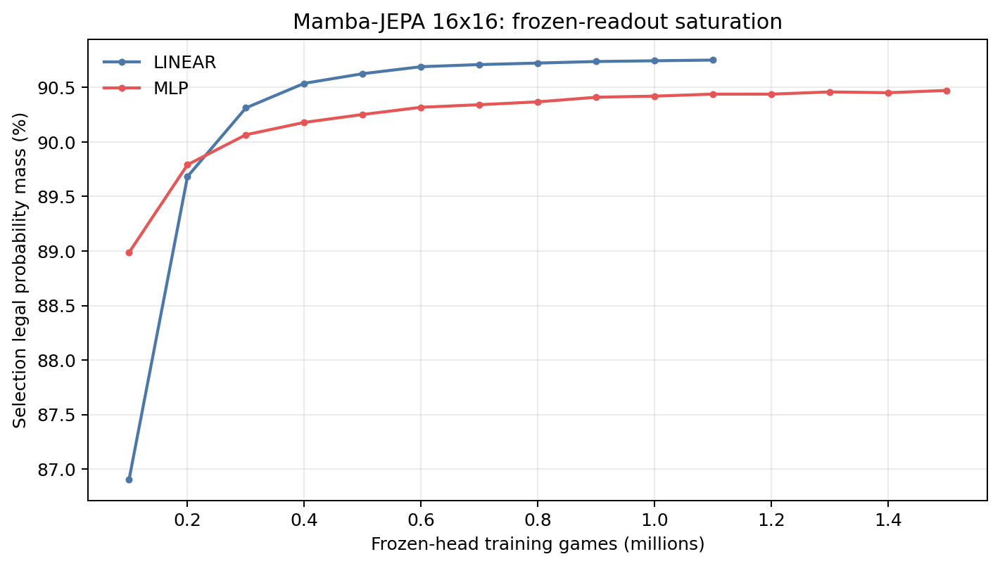
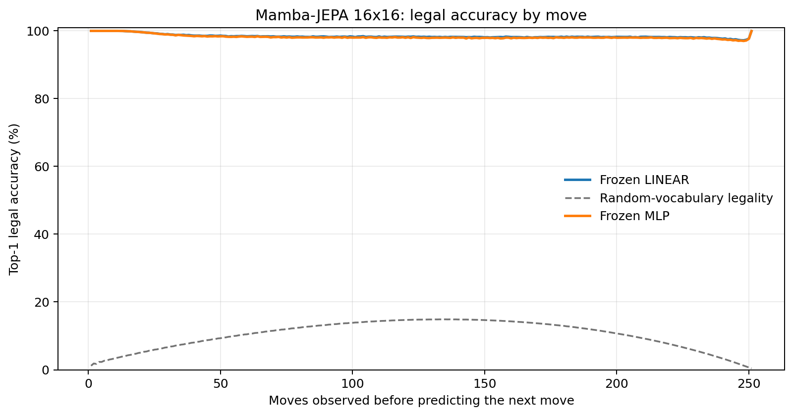
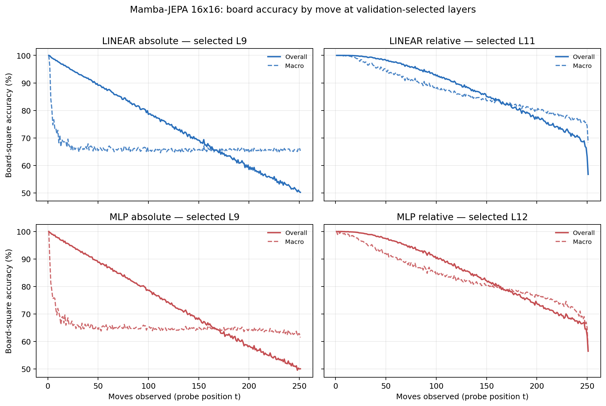

# Proposal evaluation: Mamba-JEPA 16x16

- **Suite:** `thesis_eval_suite_v1` over `unified_eval_v4`
- **Run:** `selected`
- **Checkpoint:** `final.pt` (`3bdf5631e3bc6c89754742c33cbfe961436e4a01fec60377d37a2ccbc444b771`)
- **Training budget:** `20,000,000` games / `200` shards
- **Next-move readout:** frozen bf16 encoder with common fp32 Linear/MLP readouts
- **Exact continuation:** intentionally excluded because corpus continuations are stochastic legal choices

## 1. Functional legality

| Readout | Top-1 legal | Top-3 legal fraction | Top-5 legal fraction | Legal probability mass |
|---|---:|---:|---:|---:|
| Frozen LINEAR | 98.41% | 97.59% | 96.57% | 90.70% |
| Frozen MLP | 98.23% | 97.40% | 96.37% | 90.43% |

### Statistical context

| Readout | Normalized legal lift | 95% CI for top-1 legal |
|---|---:|---:|
| Frozen LINEAR | 98.23% | 98.40%–98.43% |
| Frozen MLP | 98.03% | 98.22%–98.24% |

### Frozen-head saturation

There is no minimum shard count. Training stops under the pre-registered selection legal-mass patience rule and restores the best checkpoint.

### Legal accuracy by move

### Legality by normalized game phase

| Readout | Phase | Tokens | Mean legal moves | Top-1 legal | Legal mass |
|---|---:|---:|---:|---:|---:|
| Frozen LINEAR | 0.00–0.25 | 3,148,134 | 16.93 | 99.12% | 94.62% |
| Frozen LINEAR | 0.25–0.50 | 3,097,644 | 33.66 | 98.29% | 88.48% |
| Frozen LINEAR | 0.50–0.75 | 3,147,606 | 35.65 | 98.18% | 89.23% |
| Frozen LINEAR | 0.75–1.00 | 3,147,581 | 18.01 | 98.06% | 90.42% |
| Frozen MLP | 0.00–0.25 | 3,148,134 | 16.93 | 99.04% | 94.31% |
| Frozen MLP | 0.25–0.50 | 3,097,644 | 33.66 | 98.08% | 88.12% |
| Frozen MLP | 0.50–0.75 | 3,147,606 | 35.65 | 97.96% | 88.83% |
| Frozen MLP | 0.75–1.00 | 3,147,581 | 18.01 | 97.85% | 90.42% |

## 2. Board-state representations

Layer selection uses only the selection split. Headline test values are macro-balanced accuracy, so changing empty-square prevalence across board sizes cannot dominate the comparison.

**Macro accuracy** is the unweighted mean of the three per-class recalls. Absolute labels use empty/black/white and relative labels use empty/mine/opponent. Each class therefore contributes one third even when empty squares are much more common. Overall accuracy instead weights every square equally and can be dominated by the empty class.

| Probe | Labels | Best layer | Normalized depth | Test macro | Overall | Occupied | Empty |
|---|---|---:|---:|---:|---:|---:|---:|
| LINEAR | absolute | L9 | 0.600 | 66.24% | 74.29% | 49.52% | 99.67% |
| LINEAR | relative | L11 | 0.733 | 83.81% | 87.57% | 76.15% | 99.28% |
| MLP | absolute | L9 | 0.600 | 65.55% | 73.65% | 48.71% | 99.21% |
| MLP | relative | L12 | 0.800 | 81.03% | 85.30% | 72.41% | 98.50% |

### Probe accuracy by layer

These are the untouched test-split tables in the same format as the 8x8 unified JEPA notebook. `Selected` marks the layer chosen using the separate selection split, never the test results.

#### LINEAR board-state probe

| Layer | Absolute accuracy | Absolute macro | Relative accuracy | Relative macro | Selected |
|---:|---:|---:|---:|---:|:---|
| L0 | 64.68% | 56.53% | 65.57% | 57.69% |  |
| L1 | 66.53% | 58.46% | 67.65% | 59.92% |  |
| L2 | 66.17% | 58.09% | 68.93% | 61.82% |  |
| L3 | 67.58% | 59.46% | 70.84% | 63.85% |  |
| L4 | 72.65% | 64.58% | 75.53% | 68.36% |  |
| L5 | 72.29% | 64.19% | 80.74% | 75.40% |  |
| L6 | 73.35% | 65.26% | 81.71% | 76.31% |  |
| L7 | 73.84% | 65.76% | 82.06% | 76.60% |  |
| L8 | 74.05% | 65.98% | 82.24% | 76.77% |  |
| L9 | 74.29% | 66.24% | 82.22% | 76.68% | absolute |
| L10 | 73.71% | 65.58% | 87.27% | 83.46% |  |
| L11 | 73.87% | 65.75% | 87.57% | 83.81% | relative |
| L12 | 74.10% | 65.98% | 87.55% | 83.72% |  |
| L13 | 74.11% | 65.98% | 87.09% | 83.10% |  |
| L14 | 73.92% | 65.76% | 86.37% | 82.18% |  |
| L15 | 73.57% | 65.38% | 85.59% | 81.27% |  |

#### MLP board-state probe

| Layer | Absolute accuracy | Absolute macro | Relative accuracy | Relative macro | Selected |
|---:|---:|---:|---:|---:|:---|
| L0 | 65.20% | 57.02% | 65.80% | 57.84% |  |
| L1 | 66.60% | 58.54% | 67.29% | 59.41% |  |
| L2 | 66.44% | 58.50% | 68.05% | 60.68% |  |
| L3 | 67.06% | 59.10% | 69.26% | 62.05% |  |
| L4 | 71.51% | 63.45% | 73.60% | 66.17% |  |
| L5 | 71.14% | 63.09% | 77.91% | 72.27% |  |
| L6 | 72.16% | 64.05% | 78.96% | 73.14% |  |
| L7 | 72.87% | 64.76% | 79.53% | 73.60% |  |
| L8 | 73.24% | 65.12% | 79.87% | 73.90% |  |
| L9 | 73.65% | 65.55% | 80.06% | 74.00% | absolute |
| L10 | 72.79% | 64.61% | 84.55% | 80.35% |  |
| L11 | 73.05% | 64.88% | 85.19% | 81.07% |  |
| L12 | 73.44% | 65.26% | 85.30% | 81.03% | relative |
| L13 | 73.58% | 65.37% | 84.84% | 80.33% |  |
| L14 | 73.39% | 65.14% | 83.91% | 79.10% |  |
| L15 | 72.99% | 64.70% | 83.06% | 78.09% |  |

### Board accuracy by move at each selected layer

### Selected board probes by game phase

| Probe | Labels | Phase | Macro accuracy | Occupied | Empty |
|---|---|---:|---:|---:|---:|
| LINEAR | absolute | 1/4 | 74.85% | 63.46% | 100.00% |
| LINEAR | absolute | 2/4 | 67.74% | 51.74% | 100.00% |
| LINEAR | absolute | 11/4 | 65.59% | 48.82% | 99.13% |
| LINEAR | absolute | 12/4 | 65.75% | 49.30% | 98.63% |
| LINEAR | absolute | 13/4 | 65.74% | 49.54% | 98.15% |
| LINEAR | absolute | 14/4 | 65.55% | 49.61% | 97.41% |
| LINEAR | absolute | 15/4 | 65.67% | 50.06% | 96.89% |
| LINEAR | absolute | 16/4 | 65.61% | 50.18% | 96.46% |
| LINEAR | absolute | 3/4 | 67.07% | 50.63% | 99.99% |
| LINEAR | absolute | 4/4 | 66.40% | 49.60% | 99.99% |
| LINEAR | absolute | 5/4 | 66.17% | 49.28% | 99.96% |
| LINEAR | absolute | 6/4 | 66.05% | 49.11% | 99.93% |
| LINEAR | absolute | 7/4 | 65.83% | 48.80% | 99.87% |
| LINEAR | absolute | 8/4 | 65.77% | 48.76% | 99.76% |
| LINEAR | absolute | 9/4 | 65.68% | 48.71% | 99.62% |
| LINEAR | absolute | 10/4 | 65.71% | 48.85% | 99.41% |
| LINEAR | relative | 1/4 | 99.85% | 99.80% | 100.00% |
| LINEAR | relative | 2/4 | 98.31% | 97.59% | 99.99% |
| LINEAR | relative | 11/4 | 82.84% | 75.28% | 98.06% |
| LINEAR | relative | 12/4 | 81.76% | 74.07% | 97.23% |
| LINEAR | relative | 13/4 | 80.59% | 72.86% | 96.13% |
| LINEAR | relative | 14/4 | 79.30% | 71.73% | 94.54% |
| LINEAR | relative | 15/4 | 77.82% | 70.58% | 92.42% |
| LINEAR | relative | 16/4 | 75.47% | 67.32% | 91.84% |
| LINEAR | relative | 3/4 | 95.96% | 94.08% | 99.97% |
| LINEAR | relative | 4/4 | 93.78% | 90.81% | 99.95% |
| LINEAR | relative | 5/4 | 91.64% | 87.62% | 99.90% |
| LINEAR | relative | 6/4 | 89.87% | 84.97% | 99.84% |
| LINEAR | relative | 7/4 | 88.03% | 82.29% | 99.71% |
| LINEAR | relative | 8/4 | 86.48% | 80.06% | 99.49% |
| LINEAR | relative | 9/4 | 85.02% | 78.02% | 99.18% |
| LINEAR | relative | 10/4 | 83.93% | 76.59% | 98.72% |
| MLP | absolute | 1/4 | 73.85% | 62.00% | 100.00% |
| MLP | absolute | 2/4 | 67.15% | 50.83% | 100.00% |
| MLP | absolute | 11/4 | 64.67% | 48.01% | 97.97% |
| MLP | absolute | 12/4 | 64.60% | 48.45% | 96.88% |
| MLP | absolute | 13/4 | 64.51% | 48.87% | 95.78% |
| MLP | absolute | 14/4 | 64.20% | 49.29% | 94.01% |
| MLP | absolute | 15/4 | 63.76% | 49.94% | 91.41% |
| MLP | absolute | 16/4 | 63.02% | 49.94% | 89.18% |
| MLP | absolute | 3/4 | 65.89% | 48.84% | 99.98% |
| MLP | absolute | 4/4 | 65.42% | 48.15% | 99.96% |
| MLP | absolute | 5/4 | 65.30% | 47.99% | 99.92% |
| MLP | absolute | 6/4 | 65.07% | 47.69% | 99.82% |
| MLP | absolute | 7/4 | 65.03% | 47.70% | 99.67% |
| MLP | absolute | 8/4 | 64.69% | 47.30% | 99.45% |
| MLP | absolute | 9/4 | 64.59% | 47.32% | 99.11% |
| MLP | absolute | 10/4 | 64.71% | 47.77% | 98.60% |
| MLP | relative | 1/4 | 98.97% | 98.68% | 100.00% |
| MLP | relative | 2/4 | 96.83% | 95.54% | 99.99% |
| MLP | relative | 11/4 | 79.26% | 70.81% | 96.38% |
| MLP | relative | 12/4 | 78.26% | 69.96% | 94.97% |
| MLP | relative | 13/4 | 77.07% | 69.13% | 93.05% |
| MLP | relative | 14/4 | 75.55% | 68.13% | 90.49% |
| MLP | relative | 15/4 | 73.40% | 67.45% | 85.41% |
| MLP | relative | 16/4 | 69.38% | 65.34% | 77.55% |
| MLP | relative | 3/4 | 93.82% | 91.06% | 99.93% |
| MLP | relative | 4/4 | 90.99% | 86.84% | 99.82% |
| MLP | relative | 5/4 | 88.67% | 83.44% | 99.63% |
| MLP | relative | 6/4 | 86.68% | 80.52% | 99.39% |
| MLP | relative | 7/4 | 84.72% | 77.74% | 99.08% |
| MLP | relative | 8/4 | 83.05% | 75.46% | 98.60% |
| MLP | relative | 9/4 | 81.61% | 73.54% | 98.06% |
| MLP | relative | 10/4 | 80.44% | 72.11% | 97.34% |

## 3. Efficiency and reproducibility

- Encoder parameters: `25,824,768`
- Total parameters: `51,912,192`
- Checkpoint bytes: `415,594,862`
- Evaluation GPU: `NVIDIA L4`
- Training hardware: `unreported`
- Training precision: `bf16`
- Python / PyTorch / CUDA: `3.13.15` / `2.11.0+cu128` / `12.8`
- Median training chunk: `186.09 s`
- Estimated training loop: `10.34 h`
- Median games/s: `537.36`
- Median supervision units/s: `134252.17`
- Timing scope: dt_seconds excludes normal checkpoint/Drive-sync time; validation is included only in observed_train_plus_validation_loop_hours

## 4. Interpretation boundary

- Board probes establish decodability, not by themselves causal use.
- Legal behavior measures rule compatibility, not strategic playing strength.
- Bootstrap legality intervals quantify test-game sampling only; they do not replace independent pretraining seeds.
- Board-probe point estimates use one deterministic probe seed; the random-encoder control is not a substitute for model-seed replication.
- Cross-board results compare separately trained scaling conditions, not zero-shot transfer.

## Artifact index

- Unified JSON: `/content/seed_evaluation_views/mamba_jepa_b16_seed001/runs/selected/thesis_eval/final/results__unified_eval_v4.json`
- Unified summary: `/content/seed_evaluation_views/mamba_jepa_b16_seed001/runs/selected/thesis_eval/final/summary__unified_eval_v4.md`
- Position manifest: `/content/seed_evaluation_views/mamba_jepa_b16_seed001/runs/selected/thesis_eval/final/position_manifest__unified_eval_v4.json`
- Legal-by-move figure: `/content/seed_evaluation_views/mamba_jepa_b16_seed001/runs/selected/thesis_eval/final/legal_accuracy_by_move__thesis_eval_suite_v1.png`
- Board-by-move figure: `/content/seed_evaluation_views/mamba_jepa_b16_seed001/runs/selected/thesis_eval/final/board_accuracy_by_move__thesis_eval_suite_v1.png`
