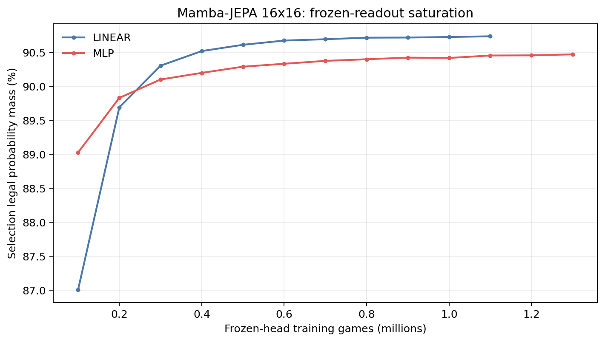
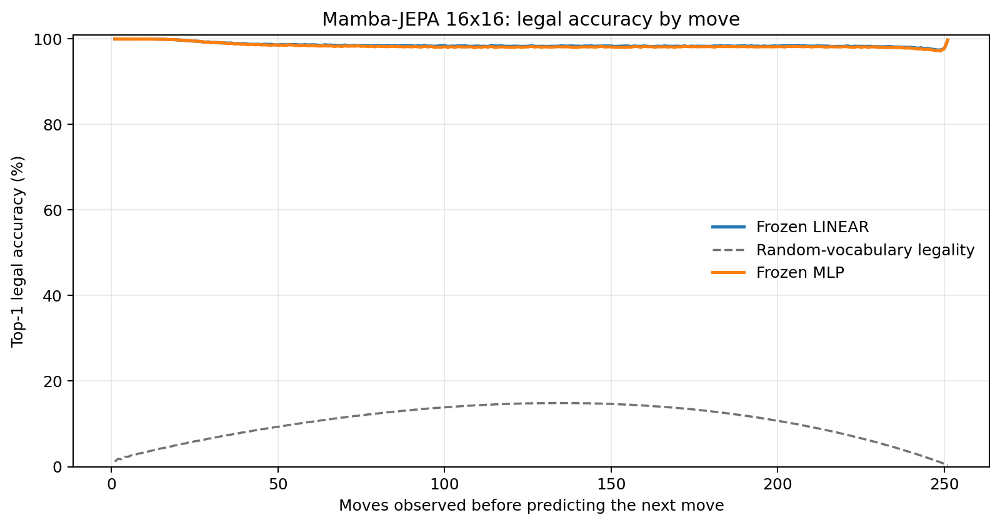
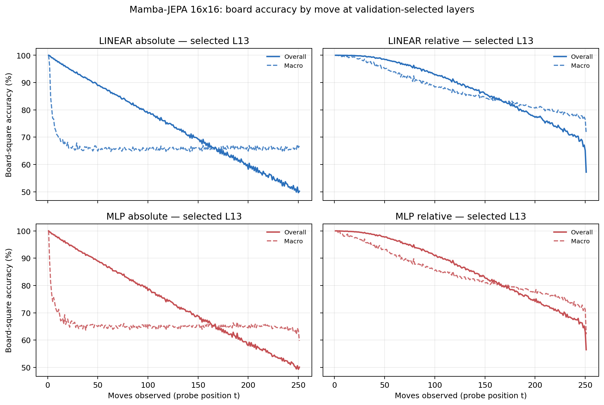

# Proposal evaluation: Mamba-JEPA 16x16

- **Suite:** `thesis_eval_suite_v1` over `unified_eval_v4`
- **Run:** `selected`
- **Checkpoint:** `final.pt` (`325876cd5b57f99214b75b95944ab63a33a8ca161649e5ac930b9171657c8744`)
- **Training budget:** `20,000,000` games / `200` shards
- **Next-move readout:** frozen bf16 encoder with common fp32 Linear/MLP readouts
- **Exact continuation:** intentionally excluded because corpus continuations are stochastic legal choices

## 1. Functional legality

| Readout | Top-1 legal | Top-3 legal fraction | Top-5 legal fraction | Legal probability mass |
|---|---:|---:|---:|---:|
| Frozen LINEAR | 98.55% | 97.74% | 96.72% | 90.71% |
| Frozen MLP | 98.41% | 97.59% | 96.58% | 90.43% |

### Statistical context

| Readout | Normalized legal lift | 95% CI for top-1 legal |
|---|---:|---:|
| Frozen LINEAR | 98.38% | 98.54%–98.56% |
| Frozen MLP | 98.22% | 98.40%–98.42% |

### Frozen-head saturation

There is no minimum shard count. Training stops under the pre-registered selection legal-mass patience rule and restores the best checkpoint.

### Legal accuracy by move

### Legality by normalized game phase

| Readout | Phase | Tokens | Mean legal moves | Top-1 legal | Legal mass |
|---|---:|---:|---:|---:|---:|
| Frozen LINEAR | 0.00–0.25 | 3,148,134 | 16.93 | 99.26% | 95.11% |
| Frozen LINEAR | 0.25–0.50 | 3,097,644 | 33.66 | 98.39% | 88.37% |
| Frozen LINEAR | 0.50–0.75 | 3,147,606 | 35.65 | 98.32% | 88.87% |
| Frozen LINEAR | 0.75–1.00 | 3,147,581 | 18.01 | 98.22% | 90.45% |
| Frozen MLP | 0.00–0.25 | 3,148,134 | 16.93 | 99.21% | 94.64% |
| Frozen MLP | 0.25–0.50 | 3,097,644 | 33.66 | 98.19% | 88.05% |
| Frozen MLP | 0.50–0.75 | 3,147,606 | 35.65 | 98.16% | 88.54% |
| Frozen MLP | 0.75–1.00 | 3,147,581 | 18.01 | 98.06% | 90.46% |

## 2. Board-state representations

Layer selection uses only the selection split. Headline test values are macro-balanced accuracy, so changing empty-square prevalence across board sizes cannot dominate the comparison.

**Macro accuracy** is the unweighted mean of the three per-class recalls. Absolute labels use empty/black/white and relative labels use empty/mine/opponent. Each class therefore contributes one third even when empty squares are much more common. Overall accuracy instead weights every square equally and can be dominated by the empty class.

| Probe | Labels | Best layer | Normalized depth | Test macro | Overall | Occupied | Empty |
|---|---|---:|---:|---:|---:|---:|---:|
| LINEAR | absolute | L13 | 0.867 | 66.18% | 74.28% | 49.36% | 99.81% |
| LINEAR | relative | L13 | 0.867 | 84.11% | 87.88% | 76.43% | 99.61% |
| MLP | absolute | L13 | 0.867 | 65.63% | 73.80% | 48.66% | 99.56% |
| MLP | relative | L13 | 0.867 | 81.62% | 85.84% | 73.05% | 98.95% |

### Probe accuracy by layer

These are the untouched test-split tables in the same format as the 8x8 unified JEPA notebook. `Selected` marks the layer chosen using the separate selection split, never the test results.

#### LINEAR board-state probe

| Layer | Absolute accuracy | Absolute macro | Relative accuracy | Relative macro | Selected |
|---:|---:|---:|---:|---:|:---|
| L0 | 64.66% | 56.50% | 65.56% | 57.68% |  |
| L1 | 66.90% | 58.80% | 68.46% | 60.86% |  |
| L2 | 67.38% | 59.29% | 71.23% | 64.47% |  |
| L3 | 69.06% | 60.97% | 72.68% | 65.79% |  |
| L4 | 69.77% | 61.70% | 72.91% | 65.86% |  |
| L5 | 69.45% | 61.40% | 74.00% | 67.47% |  |
| L6 | 68.69% | 60.62% | 78.54% | 73.72% |  |
| L7 | 67.67% | 59.54% | 83.14% | 79.63% |  |
| L8 | 69.37% | 61.28% | 84.17% | 80.66% |  |
| L9 | 70.98% | 62.89% | 85.40% | 81.87% |  |
| L10 | 72.42% | 64.31% | 86.66% | 83.10% |  |
| L11 | 73.49% | 65.41% | 87.52% | 83.92% |  |
| L12 | 73.99% | 65.90% | 87.79% | 84.10% |  |
| L13 | 74.28% | 66.18% | 87.88% | 84.11% | absolute + relative |
| L14 | 73.95% | 65.78% | 87.07% | 83.09% |  |
| L15 | 73.46% | 65.25% | 86.12% | 82.00% |  |

#### MLP board-state probe

| Layer | Absolute accuracy | Absolute macro | Relative accuracy | Relative macro | Selected |
|---:|---:|---:|---:|---:|:---|
| L0 | 65.22% | 57.05% | 65.82% | 57.87% |  |
| L1 | 66.67% | 58.65% | 67.67% | 59.96% |  |
| L2 | 66.85% | 58.87% | 69.69% | 62.73% |  |
| L3 | 67.97% | 59.99% | 70.79% | 63.73% |  |
| L4 | 68.67% | 60.64% | 71.10% | 63.85% |  |
| L5 | 68.77% | 60.84% | 72.17% | 65.41% |  |
| L6 | 70.13% | 62.93% | 76.11% | 71.02% |  |
| L7 | 67.20% | 59.20% | 80.54% | 76.75% |  |
| L8 | 68.32% | 60.22% | 81.54% | 77.81% |  |
| L9 | 69.89% | 61.79% | 82.78% | 79.02% |  |
| L10 | 71.39% | 63.27% | 84.12% | 80.28% |  |
| L11 | 72.70% | 64.59% | 85.29% | 81.42% |  |
| L12 | 73.36% | 65.21% | 85.64% | 81.59% |  |
| L13 | 73.80% | 65.63% | 85.84% | 81.62% | absolute + relative |
| L14 | 73.43% | 65.18% | 84.77% | 80.24% |  |
| L15 | 72.87% | 64.58% | 83.74% | 79.07% |  |

### Board accuracy by move at each selected layer

### Selected board probes by game phase

| Probe | Labels | Phase | Macro accuracy | Occupied | Empty |
|---|---|---:|---:|---:|---:|
| LINEAR | absolute | 1/4 | 74.63% | 63.15% | 100.00% |
| LINEAR | absolute | 2/4 | 66.61% | 50.02% | 100.00% |
| LINEAR | absolute | 11/4 | 65.82% | 48.96% | 99.53% |
| LINEAR | absolute | 12/4 | 66.01% | 49.40% | 99.23% |
| LINEAR | absolute | 13/4 | 66.06% | 49.63% | 98.91% |
| LINEAR | absolute | 14/4 | 65.87% | 49.59% | 98.43% |
| LINEAR | absolute | 15/4 | 65.88% | 49.95% | 97.73% |
| LINEAR | absolute | 16/4 | 65.81% | 49.99% | 97.43% |
| LINEAR | absolute | 3/4 | 65.96% | 48.95% | 100.00% |
| LINEAR | absolute | 4/4 | 65.85% | 48.78% | 99.99% |
| LINEAR | absolute | 5/4 | 65.66% | 48.49% | 99.99% |
| LINEAR | absolute | 6/4 | 65.51% | 48.27% | 99.97% |
| LINEAR | absolute | 7/4 | 65.76% | 48.67% | 99.95% |
| LINEAR | absolute | 8/4 | 65.86% | 48.84% | 99.89% |
| LINEAR | absolute | 9/4 | 65.65% | 48.56% | 99.81% |
| LINEAR | absolute | 10/4 | 65.90% | 49.02% | 99.67% |
| LINEAR | relative | 1/4 | 99.57% | 99.46% | 100.00% |
| LINEAR | relative | 2/4 | 98.74% | 98.22% | 100.00% |
| LINEAR | relative | 11/4 | 83.46% | 75.75% | 99.00% |
| LINEAR | relative | 12/4 | 82.34% | 74.28% | 98.54% |
| LINEAR | relative | 13/4 | 81.13% | 72.73% | 98.02% |
| LINEAR | relative | 14/4 | 80.27% | 71.73% | 97.44% |
| LINEAR | relative | 15/4 | 78.87% | 70.18% | 96.34% |
| LINEAR | relative | 16/4 | 77.01% | 67.39% | 96.32% |
| LINEAR | relative | 3/4 | 96.74% | 95.24% | 99.98% |
| LINEAR | relative | 4/4 | 94.40% | 91.73% | 99.96% |
| LINEAR | relative | 5/4 | 92.21% | 88.47% | 99.93% |
| LINEAR | relative | 6/4 | 90.36% | 85.71% | 99.87% |
| LINEAR | relative | 7/4 | 88.48% | 82.91% | 99.80% |
| LINEAR | relative | 8/4 | 86.94% | 80.67% | 99.67% |
| LINEAR | relative | 9/4 | 85.57% | 78.68% | 99.51% |
| LINEAR | relative | 10/4 | 84.47% | 77.13% | 99.27% |
| MLP | absolute | 1/4 | 73.06% | 60.75% | 100.00% |
| MLP | absolute | 2/4 | 66.17% | 49.35% | 100.00% |
| MLP | absolute | 11/4 | 65.16% | 48.26% | 98.95% |
| MLP | absolute | 12/4 | 65.13% | 48.49% | 98.38% |
| MLP | absolute | 13/4 | 65.17% | 48.93% | 97.64% |
| MLP | absolute | 14/4 | 65.23% | 49.41% | 96.86% |
| MLP | absolute | 15/4 | 64.73% | 49.67% | 94.83% |
| MLP | absolute | 16/4 | 63.92% | 49.77% | 92.21% |
| MLP | absolute | 3/4 | 65.27% | 47.92% | 99.99% |
| MLP | absolute | 4/4 | 65.16% | 47.75% | 99.98% |
| MLP | absolute | 5/4 | 64.99% | 47.51% | 99.96% |
| MLP | absolute | 6/4 | 64.84% | 47.31% | 99.90% |
| MLP | absolute | 7/4 | 65.07% | 47.67% | 99.83% |
| MLP | absolute | 8/4 | 65.02% | 47.66% | 99.70% |
| MLP | absolute | 9/4 | 64.88% | 47.56% | 99.51% |
| MLP | absolute | 10/4 | 65.04% | 47.93% | 99.28% |
| MLP | relative | 1/4 | 98.59% | 98.20% | 100.00% |
| MLP | relative | 2/4 | 97.04% | 95.84% | 99.99% |
| MLP | relative | 11/4 | 80.29% | 71.79% | 97.43% |
| MLP | relative | 12/4 | 79.18% | 70.64% | 96.36% |
| MLP | relative | 13/4 | 78.05% | 69.64% | 94.96% |
| MLP | relative | 14/4 | 76.81% | 68.57% | 93.36% |
| MLP | relative | 15/4 | 75.11% | 67.54% | 90.31% |
| MLP | relative | 16/4 | 72.13% | 65.23% | 86.01% |
| MLP | relative | 3/4 | 94.55% | 92.13% | 99.96% |
| MLP | relative | 4/4 | 92.02% | 88.32% | 99.88% |
| MLP | relative | 5/4 | 89.48% | 84.58% | 99.78% |
| MLP | relative | 6/4 | 87.49% | 81.61% | 99.61% |
| MLP | relative | 7/4 | 85.44% | 78.65% | 99.37% |
| MLP | relative | 8/4 | 84.02% | 76.70% | 99.00% |
| MLP | relative | 9/4 | 82.49% | 74.56% | 98.59% |
| MLP | relative | 10/4 | 81.25% | 72.97% | 98.00% |

## 3. Efficiency and reproducibility

- Encoder parameters: `25,824,768`
- Total parameters: `51,912,192`
- Checkpoint bytes: `415,596,846`
- Evaluation GPU: `NVIDIA L4`
- Training hardware: `unreported`
- Training precision: `bf16`
- Python / PyTorch / CUDA: `3.13.15` / `2.11.0+cu128` / `12.8`
- Median training chunk: `190.12 s`
- Estimated training loop: `10.56 h`
- Median games/s: `525.98`
- Median supervision units/s: `131414.35`
- Timing scope: dt_seconds excludes normal checkpoint/Drive-sync time; validation is included only in observed_train_plus_validation_loop_hours

## 4. Interpretation boundary

- Board probes establish decodability, not by themselves causal use.
- Legal behavior measures rule compatibility, not strategic playing strength.
- Bootstrap legality intervals quantify test-game sampling only; they do not replace independent pretraining seeds.
- Board-probe point estimates use one deterministic probe seed; the random-encoder control is not a substitute for model-seed replication.
- Cross-board results compare separately trained scaling conditions, not zero-shot transfer.

## Artifact index

- Unified JSON: `/content/seed_evaluation_views/mamba_jepa_b16_seed002/runs/selected/thesis_eval/final/results__unified_eval_v4.json`
- Unified summary: `/content/seed_evaluation_views/mamba_jepa_b16_seed002/runs/selected/thesis_eval/final/summary__unified_eval_v4.md`
- Position manifest: `/content/seed_evaluation_views/mamba_jepa_b16_seed002/runs/selected/thesis_eval/final/position_manifest__unified_eval_v4.json`
- Legal-by-move figure: `/content/seed_evaluation_views/mamba_jepa_b16_seed002/runs/selected/thesis_eval/final/legal_accuracy_by_move__thesis_eval_suite_v1.png`
- Board-by-move figure: `/content/seed_evaluation_views/mamba_jepa_b16_seed002/runs/selected/thesis_eval/final/board_accuracy_by_move__thesis_eval_suite_v1.png`
