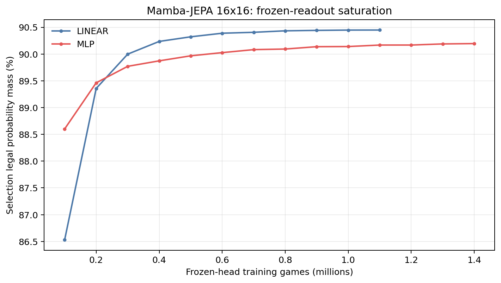
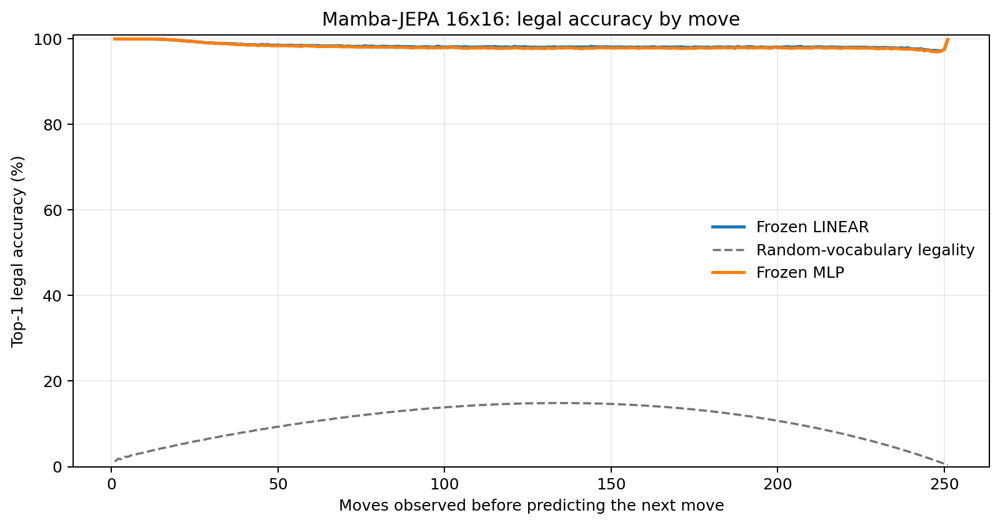
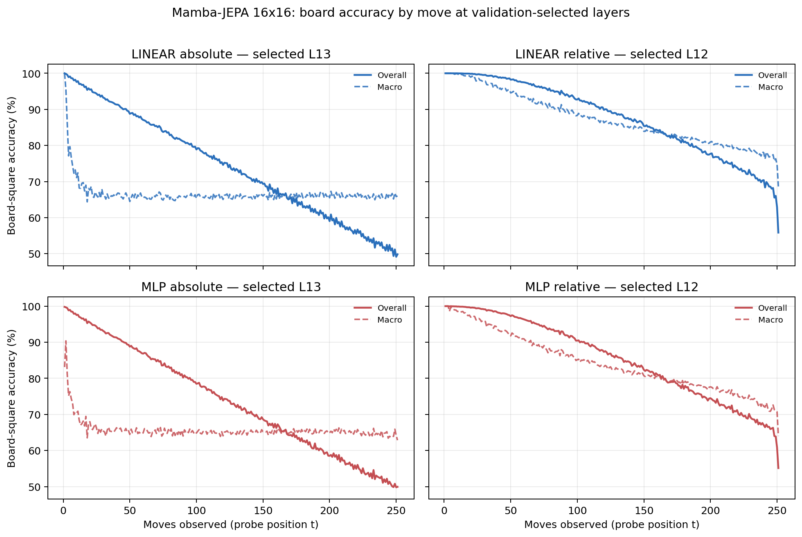

# Proposal evaluation: Mamba-JEPA 16x16

- **Suite:** `thesis_eval_suite_v1` over `unified_eval_v4`
- **Run:** `selected`
- **Checkpoint:** `final.pt` (`cc489ef82235bbaf6d70cc83217be4a11c96aaf1efb24211cf94a0376cbac53c`)
- **Training budget:** `20,000,000` games / `200` shards
- **Next-move readout:** frozen bf16 encoder with common fp32 Linear/MLP readouts
- **Exact continuation:** intentionally excluded because corpus continuations are stochastic legal choices

## 1. Functional legality

| Readout | Top-1 legal | Top-3 legal fraction | Top-5 legal fraction | Legal probability mass |
|---|---:|---:|---:|---:|
| Frozen LINEAR | 98.37% | 97.54% | 96.51% | 90.40% |
| Frozen MLP | 98.20% | 97.36% | 96.33% | 90.15% |

### Statistical context

| Readout | Normalized legal lift | 95% CI for top-1 legal |
|---|---:|---:|
| Frozen LINEAR | 98.19% | 98.36%–98.39% |
| Frozen MLP | 97.99% | 98.18%–98.21% |

### Frozen-head saturation

There is no minimum shard count. Training stops under the pre-registered selection legal-mass patience rule and restores the best checkpoint.

### Legal accuracy by move

### Legality by normalized game phase

| Readout | Phase | Tokens | Mean legal moves | Top-1 legal | Legal mass |
|---|---:|---:|---:|---:|---:|
| Frozen LINEAR | 0.00–0.25 | 3,148,134 | 16.93 | 99.17% | 94.64% |
| Frozen LINEAR | 0.25–0.50 | 3,097,644 | 33.66 | 98.21% | 88.09% |
| Frozen LINEAR | 0.50–0.75 | 3,147,606 | 35.65 | 98.11% | 88.74% |
| Frozen LINEAR | 0.75–1.00 | 3,147,581 | 18.01 | 97.99% | 90.08% |
| Frozen MLP | 0.00–0.25 | 3,148,134 | 16.93 | 99.11% | 94.21% |
| Frozen MLP | 0.25–0.50 | 3,097,644 | 33.66 | 98.00% | 87.77% |
| Frozen MLP | 0.50–0.75 | 3,147,606 | 35.65 | 97.87% | 88.42% |
| Frozen MLP | 0.75–1.00 | 3,147,581 | 18.01 | 97.80% | 90.14% |

## 2. Board-state representations

Layer selection uses only the selection split. Headline test values are macro-balanced accuracy, so changing empty-square prevalence across board sizes cannot dominate the comparison.

**Macro accuracy** is the unweighted mean of the three per-class recalls. Absolute labels use empty/black/white and relative labels use empty/mine/opponent. Each class therefore contributes one third even when empty squares are much more common. Overall accuracy instead weights every square equally and can be dominated by the empty class.

| Probe | Labels | Best layer | Normalized depth | Test macro | Overall | Occupied | Empty |
|---|---|---:|---:|---:|---:|---:|---:|
| LINEAR | absolute | L13 | 0.867 | 66.25% | 74.34% | 49.45% | 99.85% |
| LINEAR | relative | L12 | 0.800 | 83.91% | 87.68% | 76.23% | 99.42% |
| MLP | absolute | L13 | 0.867 | 65.69% | 73.87% | 48.71% | 99.65% |
| MLP | relative | L12 | 0.800 | 81.31% | 85.48% | 72.80% | 98.48% |

### Probe accuracy by layer

These are the untouched test-split tables in the same format as the 8x8 unified JEPA notebook. `Selected` marks the layer chosen using the separate selection split, never the test results.

#### LINEAR board-state probe

| Layer | Absolute accuracy | Absolute macro | Relative accuracy | Relative macro | Selected |
|---:|---:|---:|---:|---:|:---|
| L0 | 64.67% | 56.53% | 65.54% | 57.69% |  |
| L1 | 66.56% | 58.40% | 67.69% | 59.88% |  |
| L2 | 69.65% | 61.52% | 71.46% | 63.89% |  |
| L3 | 69.49% | 61.37% | 71.91% | 64.55% |  |
| L4 | 70.48% | 62.40% | 74.55% | 67.79% |  |
| L5 | 69.17% | 61.07% | 77.87% | 72.72% |  |
| L6 | 71.51% | 63.39% | 80.05% | 74.76% |  |
| L7 | 73.17% | 65.10% | 81.54% | 76.16% |  |
| L8 | 73.45% | 65.39% | 81.67% | 76.25% |  |
| L9 | 73.63% | 65.57% | 81.66% | 76.17% |  |
| L10 | 73.00% | 64.90% | 86.61% | 82.85% |  |
| L11 | 73.66% | 65.59% | 87.28% | 83.55% |  |
| L12 | 74.11% | 66.03% | 87.68% | 83.91% | relative |
| L13 | 74.34% | 66.25% | 87.65% | 83.78% | absolute |
| L14 | 74.05% | 65.90% | 86.88% | 82.80% |  |
| L15 | 73.58% | 65.38% | 85.95% | 81.71% |  |

#### MLP board-state probe

| Layer | Absolute accuracy | Absolute macro | Relative accuracy | Relative macro | Selected |
|---:|---:|---:|---:|---:|:---|
| L0 | 65.19% | 57.01% | 65.80% | 57.84% |  |
| L1 | 66.37% | 58.26% | 67.15% | 59.28% |  |
| L2 | 68.47% | 60.41% | 69.82% | 62.11% |  |
| L3 | 68.20% | 60.15% | 69.87% | 62.29% |  |
| L4 | 68.86% | 60.84% | 71.92% | 64.88% |  |
| L5 | 68.86% | 61.19% | 74.94% | 69.47% |  |
| L6 | 70.10% | 62.08% | 76.88% | 71.27% |  |
| L7 | 71.95% | 63.89% | 78.76% | 72.97% |  |
| L8 | 72.42% | 64.37% | 79.03% | 73.14% |  |
| L9 | 72.65% | 64.57% | 79.09% | 73.13% |  |
| L10 | 71.79% | 63.66% | 83.66% | 79.58% |  |
| L11 | 72.72% | 64.60% | 84.79% | 80.70% |  |
| L12 | 73.48% | 65.34% | 85.48% | 81.31% | relative |
| L13 | 73.87% | 65.69% | 85.59% | 81.23% | absolute |
| L14 | 73.53% | 65.29% | 84.54% | 79.89% |  |
| L15 | 73.02% | 64.72% | 83.52% | 78.70% |  |

### Board accuracy by move at each selected layer

### Selected board probes by game phase

| Probe | Labels | Phase | Macro accuracy | Occupied | Empty |
|---|---|---:|---:|---:|---:|
| LINEAR | absolute | 1/4 | 74.98% | 63.62% | 100.00% |
| LINEAR | absolute | 2/4 | 66.96% | 50.54% | 100.00% |
| LINEAR | absolute | 11/4 | 65.95% | 49.09% | 99.66% |
| LINEAR | absolute | 12/4 | 66.09% | 49.40% | 99.45% |
| LINEAR | absolute | 13/4 | 66.28% | 49.85% | 99.14% |
| LINEAR | absolute | 14/4 | 66.05% | 49.72% | 98.72% |
| LINEAR | absolute | 15/4 | 65.92% | 49.82% | 98.11% |
| LINEAR | absolute | 16/4 | 65.89% | 49.89% | 97.89% |
| LINEAR | absolute | 3/4 | 66.15% | 49.23% | 100.00% |
| LINEAR | absolute | 4/4 | 65.89% | 48.83% | 99.99% |
| LINEAR | absolute | 5/4 | 65.85% | 48.78% | 99.99% |
| LINEAR | absolute | 6/4 | 65.69% | 48.54% | 99.98% |
| LINEAR | absolute | 7/4 | 65.94% | 48.93% | 99.95% |
| LINEAR | absolute | 8/4 | 65.95% | 48.96% | 99.92% |
| LINEAR | absolute | 9/4 | 65.76% | 48.70% | 99.87% |
| LINEAR | absolute | 10/4 | 65.94% | 49.02% | 99.78% |
| LINEAR | relative | 1/4 | 99.77% | 99.68% | 100.00% |
| LINEAR | relative | 2/4 | 98.42% | 97.72% | 99.99% |
| LINEAR | relative | 11/4 | 83.18% | 75.56% | 98.54% |
| LINEAR | relative | 12/4 | 82.21% | 74.27% | 98.18% |
| LINEAR | relative | 13/4 | 80.97% | 72.65% | 97.71% |
| LINEAR | relative | 14/4 | 79.94% | 71.46% | 97.03% |
| LINEAR | relative | 15/4 | 78.68% | 69.94% | 96.31% |
| LINEAR | relative | 16/4 | 76.27% | 66.61% | 95.67% |
| LINEAR | relative | 3/4 | 96.20% | 94.44% | 99.95% |
| LINEAR | relative | 4/4 | 94.10% | 91.31% | 99.88% |
| LINEAR | relative | 5/4 | 91.89% | 88.06% | 99.78% |
| LINEAR | relative | 6/4 | 90.22% | 85.59% | 99.66% |
| LINEAR | relative | 7/4 | 88.36% | 82.89% | 99.49% |
| LINEAR | relative | 8/4 | 86.86% | 80.74% | 99.27% |
| LINEAR | relative | 9/4 | 85.47% | 78.76% | 99.04% |
| LINEAR | relative | 10/4 | 84.48% | 77.36% | 98.83% |
| MLP | absolute | 1/4 | 72.69% | 60.15% | 100.00% |
| MLP | absolute | 2/4 | 66.36% | 49.61% | 100.00% |
| MLP | absolute | 11/4 | 65.26% | 48.31% | 99.18% |
| MLP | absolute | 12/4 | 65.33% | 48.60% | 98.76% |
| MLP | absolute | 13/4 | 65.29% | 48.93% | 98.02% |
| MLP | absolute | 14/4 | 65.30% | 49.29% | 97.32% |
| MLP | absolute | 15/4 | 64.83% | 49.48% | 95.51% |
| MLP | absolute | 16/4 | 64.48% | 49.82% | 93.80% |
| MLP | absolute | 3/4 | 65.71% | 48.55% | 100.00% |
| MLP | absolute | 4/4 | 65.32% | 47.98% | 99.99% |
| MLP | absolute | 5/4 | 65.18% | 47.78% | 99.97% |
| MLP | absolute | 6/4 | 65.09% | 47.66% | 99.93% |
| MLP | absolute | 7/4 | 65.21% | 47.87% | 99.87% |
| MLP | absolute | 8/4 | 65.03% | 47.65% | 99.75% |
| MLP | absolute | 9/4 | 65.01% | 47.69% | 99.63% |
| MLP | absolute | 10/4 | 65.11% | 47.94% | 99.45% |
| MLP | relative | 1/4 | 98.80% | 98.37% | 100.00% |
| MLP | relative | 2/4 | 96.64% | 95.18% | 99.98% |
| MLP | relative | 11/4 | 79.81% | 71.65% | 96.28% |
| MLP | relative | 12/4 | 78.79% | 70.57% | 95.34% |
| MLP | relative | 13/4 | 77.60% | 69.36% | 94.16% |
| MLP | relative | 14/4 | 76.42% | 68.40% | 92.54% |
| MLP | relative | 15/4 | 74.58% | 67.21% | 89.41% |
| MLP | relative | 16/4 | 71.35% | 64.60% | 84.89% |
| MLP | relative | 3/4 | 93.85% | 91.09% | 99.86% |
| MLP | relative | 4/4 | 91.44% | 87.54% | 99.67% |
| MLP | relative | 5/4 | 89.04% | 84.08% | 99.38% |
| MLP | relative | 6/4 | 87.18% | 81.44% | 99.00% |
| MLP | relative | 7/4 | 85.20% | 78.63% | 98.66% |
| MLP | relative | 8/4 | 83.59% | 76.45% | 98.16% |
| MLP | relative | 9/4 | 82.15% | 74.53% | 97.62% |
| MLP | relative | 10/4 | 81.15% | 73.28% | 97.06% |

## 3. Efficiency and reproducibility

- Encoder parameters: `25,824,768`
- Total parameters: `51,912,192`
- Checkpoint bytes: `415,594,862`
- Evaluation GPU: `NVIDIA L4`
- Training hardware: `unreported`
- Training precision: `bf16`
- Python / PyTorch / CUDA: `3.13.15` / `2.11.0+cu128` / `12.8`
- Median training chunk: `186.35 s`
- Estimated training loop: `10.35 h`
- Median games/s: `536.63`
- Median supervision units/s: `134055.54`
- Timing scope: dt_seconds excludes normal checkpoint/Drive-sync time; validation is included only in observed_train_plus_validation_loop_hours

## 4. Interpretation boundary

- Board probes establish decodability, not by themselves causal use.
- Legal behavior measures rule compatibility, not strategic playing strength.
- Bootstrap legality intervals quantify test-game sampling only; they do not replace independent pretraining seeds.
- Board-probe point estimates use one deterministic probe seed; the random-encoder control is not a substitute for model-seed replication.
- Cross-board results compare separately trained scaling conditions, not zero-shot transfer.

## Artifact index

- Unified JSON: `/content/seed_evaluation_views/mamba_jepa_b16_seed003/runs/selected/thesis_eval/final/results__unified_eval_v4.json`
- Unified summary: `/content/seed_evaluation_views/mamba_jepa_b16_seed003/runs/selected/thesis_eval/final/summary__unified_eval_v4.md`
- Position manifest: `/content/seed_evaluation_views/mamba_jepa_b16_seed003/runs/selected/thesis_eval/final/position_manifest__unified_eval_v4.json`
- Legal-by-move figure: `/content/seed_evaluation_views/mamba_jepa_b16_seed003/runs/selected/thesis_eval/final/legal_accuracy_by_move__thesis_eval_suite_v1.png`
- Board-by-move figure: `/content/seed_evaluation_views/mamba_jepa_b16_seed003/runs/selected/thesis_eval/final/board_accuracy_by_move__thesis_eval_suite_v1.png`
