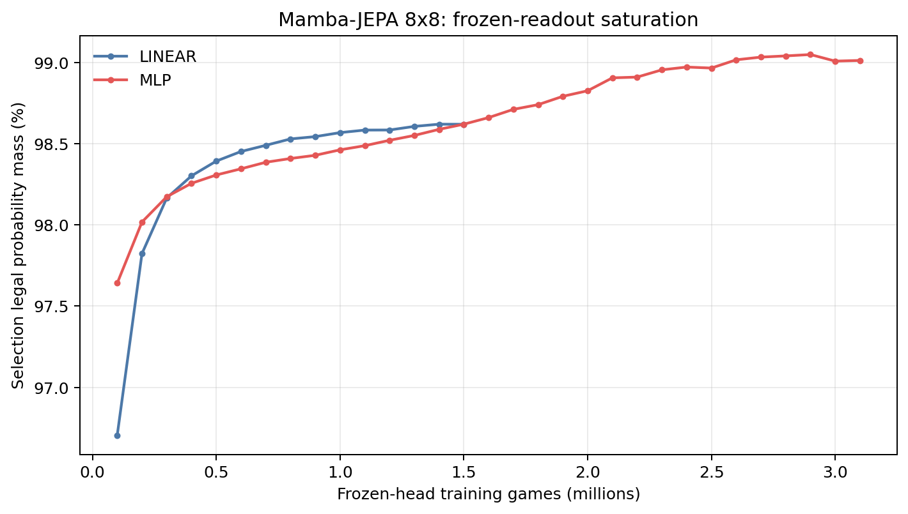
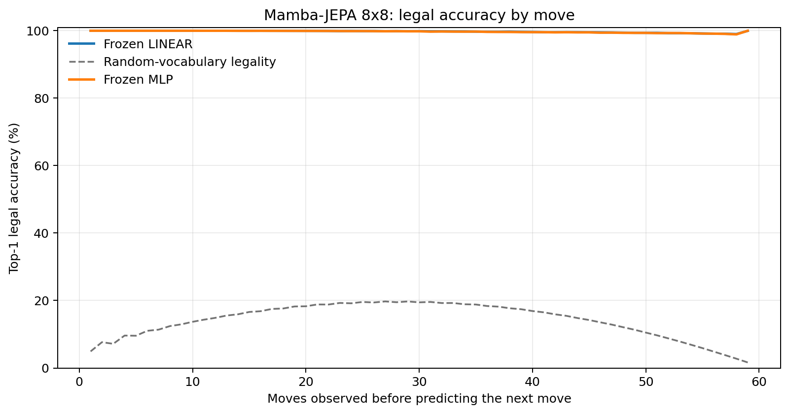
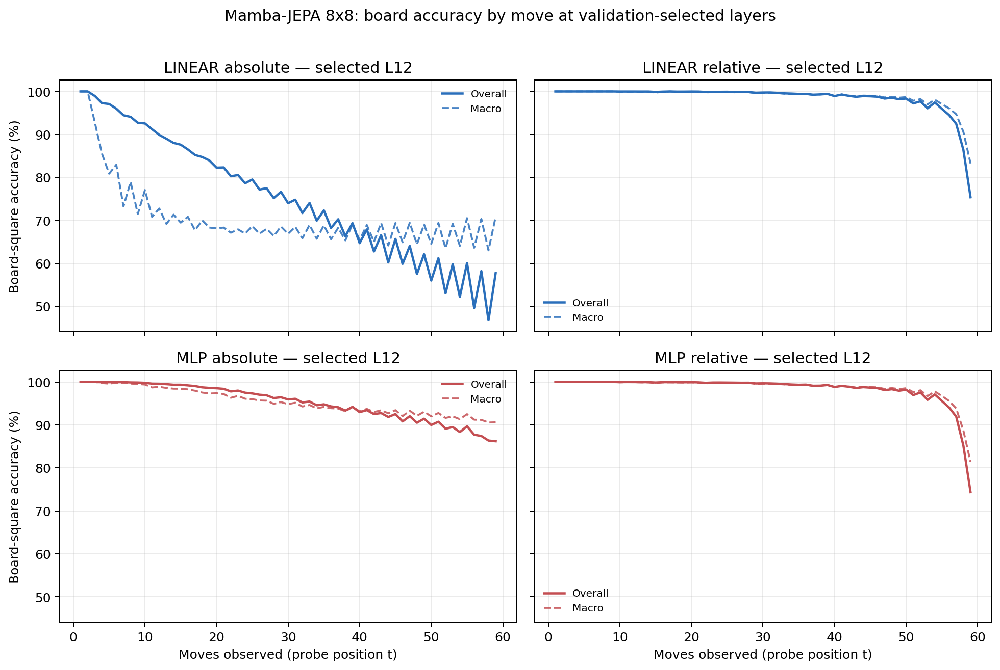

# Proposal evaluation: Mamba-JEPA 8x8

- **Suite:** `thesis_eval_suite_v1` over `unified_eval_v4`
- **Run:** `selected`
- **Checkpoint:** `final.pt` (`c466a775c883a691b9d5f487cbe2a05013514d1631d9fb0bcaee895c28859729`)
- **Training budget:** `19,999,840` games / `200` shards
- **Next-move readout:** frozen bf16 encoder with common fp32 Linear/MLP readouts
- **Exact continuation:** intentionally excluded because corpus continuations are stochastic legal choices

## 1. Functional legality

| Readout | Top-1 legal | Top-3 legal fraction | Top-5 legal fraction | Legal probability mass |
|---|---:|---:|---:|---:|
| Frozen LINEAR | 99.75% | 96.82% | 92.50% | 98.56% |
| Frozen MLP | 99.72% | 96.80% | 92.49% | 99.01% |

### Statistical context

| Readout | Normalized legal lift | 95% CI for top-1 legal |
|---|---:|---:|
| Frozen LINEAR | 99.70% | 99.74%–99.75% |
| Frozen MLP | 99.68% | 99.71%–99.73% |

### Frozen-head saturation

There is no minimum shard count. Training stops under the pre-registered selection legal-mass patience rule and restores the best checkpoint.

### Legal accuracy by move

### Legality by normalized game phase

| Readout | Phase | Tokens | Mean legal moves | Top-1 legal | Legal mass |
|---|---:|---:|---:|---:|---:|
| Frozen LINEAR | 0.00–0.25 | 749,909 | 7.22 | 100.00% | 99.20% |
| Frozen LINEAR | 0.25–0.50 | 699,679 | 11.44 | 99.93% | 98.52% |
| Frozen LINEAR | 0.50–0.75 | 749,593 | 10.84 | 99.71% | 98.22% |
| Frozen LINEAR | 0.75–1.00 | 749,129 | 5.15 | 99.36% | 98.31% |
| Frozen MLP | 0.00–0.25 | 749,909 | 7.22 | 100.00% | 99.80% |
| Frozen MLP | 0.25–0.50 | 699,679 | 11.44 | 99.92% | 99.51% |
| Frozen MLP | 0.50–0.75 | 749,593 | 10.84 | 99.66% | 98.86% |
| Frozen MLP | 0.75–1.00 | 749,129 | 5.15 | 99.33% | 97.90% |

## 2. Board-state representations

Layer selection uses only the selection split. Headline test values are macro-balanced accuracy, so changing empty-square prevalence across board sizes cannot dominate the comparison.

**Macro accuracy** is the unweighted mean of the three per-class recalls. Absolute labels use empty/black/white and relative labels use empty/mine/opponent. Each class therefore contributes one third even when empty squares are much more common. Overall accuracy instead weights every square equally and can be dominated by the empty class.

| Probe | Labels | Best layer | Normalized depth | Test macro | Overall | Occupied | Empty |
|---|---|---:|---:|---:|---:|---:|---:|
| LINEAR | absolute | L12 | 0.800 | 68.93% | 75.61% | 53.43% | 100.00% |
| LINEAR | relative | L12 | 0.800 | 98.21% | 98.61% | 97.35% | 100.00% |
| MLP | absolute | L12 | 0.800 | 94.12% | 95.38% | 91.19% | 99.99% |
| MLP | relative | L12 | 0.800 | 98.05% | 98.48% | 97.12% | 99.98% |

### Probe accuracy by layer

These are the untouched test-split tables in the same format as the 8x8 unified JEPA notebook. `Selected` marks the layer chosen using the separate selection split, never the test results.

#### LINEAR board-state probe

| Layer | Absolute accuracy | Absolute macro | Relative accuracy | Relative macro | Selected |
|---:|---:|---:|---:|---:|:---|
| L0 | 62.60% | 55.57% | 64.79% | 58.18% |  |
| L1 | 74.04% | 67.21% | 78.32% | 72.41% |  |
| L2 | 73.12% | 66.34% | 87.46% | 84.45% |  |
| L3 | 74.01% | 67.18% | 88.70% | 85.76% |  |
| L4 | 73.80% | 66.91% | 88.82% | 85.95% |  |
| L5 | 73.97% | 67.07% | 89.11% | 86.29% |  |
| L6 | 72.72% | 65.72% | 92.40% | 90.61% |  |
| L7 | 74.26% | 67.40% | 93.73% | 92.10% |  |
| L8 | 73.73% | 66.82% | 96.55% | 95.67% |  |
| L9 | 75.05% | 68.28% | 97.33% | 96.58% |  |
| L10 | 75.33% | 68.60% | 97.79% | 97.17% |  |
| L11 | 75.61% | 68.93% | 98.14% | 97.61% |  |
| L12 | 75.61% | 68.93% | 98.61% | 98.21% | absolute + relative |
| L13 | 75.54% | 68.84% | 98.47% | 98.03% |  |
| L14 | 74.99% | 68.23% | 97.24% | 96.54% |  |
| L15 | 75.29% | 68.71% | 96.49% | 95.66% |  |

#### MLP board-state probe

| Layer | Absolute accuracy | Absolute macro | Relative accuracy | Relative macro | Selected |
|---:|---:|---:|---:|---:|:---|
| L0 | 65.08% | 58.75% | 65.27% | 58.64% |  |
| L1 | 75.79% | 69.51% | 77.70% | 71.73% |  |
| L2 | 83.97% | 80.40% | 86.50% | 83.48% |  |
| L3 | 83.62% | 79.60% | 87.69% | 84.70% |  |
| L4 | 83.46% | 79.45% | 87.65% | 84.65% |  |
| L5 | 83.87% | 79.85% | 87.97% | 85.00% |  |
| L6 | 87.82% | 85.29% | 90.86% | 88.92% |  |
| L7 | 88.10% | 85.16% | 92.72% | 90.92% |  |
| L8 | 93.19% | 91.83% | 95.78% | 94.83% |  |
| L9 | 92.25% | 90.24% | 96.99% | 96.19% |  |
| L10 | 93.46% | 91.72% | 97.61% | 96.95% |  |
| L11 | 95.18% | 93.87% | 98.00% | 97.44% |  |
| L12 | 95.38% | 94.12% | 98.48% | 98.05% | absolute + relative |
| L13 | 93.34% | 91.53% | 98.21% | 97.70% |  |
| L14 | 87.30% | 83.98% | 96.58% | 95.73% |  |
| L15 | 82.58% | 78.07% | 95.56% | 94.51% |  |

### Board accuracy by move at each selected layer

### Selected board probes by game phase

| Probe | Labels | Phase | Macro accuracy | Occupied | Empty |
|---|---|---:|---:|---:|---:|
| LINEAR | absolute | 1/4 | 97.46% | 96.30% | 100.00% |
| LINEAR | absolute | 2/4 | 81.96% | 74.57% | 100.00% |
| LINEAR | absolute | 11/4 | 67.63% | 51.47% | 100.00% |
| LINEAR | absolute | 12/4 | 67.25% | 50.88% | 100.00% |
| LINEAR | absolute | 13/4 | 68.54% | 52.86% | 100.00% |
| LINEAR | absolute | 14/4 | 67.45% | 51.18% | 100.00% |
| LINEAR | absolute | 15/4 | 67.61% | 51.42% | 99.98% |
| LINEAR | absolute | 16/4 | 67.48% | 51.21% | 100.00% |
| LINEAR | absolute | 3/4 | 76.07% | 65.17% | 100.00% |
| LINEAR | absolute | 4/4 | 72.23% | 58.46% | 100.00% |
| LINEAR | absolute | 5/4 | 70.74% | 56.41% | 100.00% |
| LINEAR | absolute | 6/4 | 68.88% | 53.45% | 100.00% |
| LINEAR | absolute | 7/4 | 68.62% | 53.29% | 100.00% |
| LINEAR | absolute | 8/4 | 68.36% | 52.59% | 100.00% |
| LINEAR | absolute | 9/4 | 68.31% | 52.49% | 100.00% |
| LINEAR | absolute | 10/4 | 67.30% | 51.00% | 100.00% |
| LINEAR | relative | 1/4 | 100.00% | 100.00% | 100.00% |
| LINEAR | relative | 2/4 | 100.00% | 100.00% | 100.00% |
| LINEAR | relative | 11/4 | 99.22% | 98.84% | 100.00% |
| LINEAR | relative | 12/4 | 99.06% | 98.61% | 99.99% |
| LINEAR | relative | 13/4 | 98.84% | 98.29% | 99.99% |
| LINEAR | relative | 14/4 | 98.46% | 97.71% | 99.99% |
| LINEAR | relative | 15/4 | 97.57% | 96.42% | 99.95% |
| LINEAR | relative | 16/4 | 91.14% | 86.79% | 100.00% |
| LINEAR | relative | 3/4 | 99.97% | 99.96% | 100.00% |
| LINEAR | relative | 4/4 | 99.93% | 99.91% | 100.00% |
| LINEAR | relative | 5/4 | 99.88% | 99.81% | 100.00% |
| LINEAR | relative | 6/4 | 99.89% | 99.85% | 100.00% |
| LINEAR | relative | 7/4 | 99.86% | 99.79% | 100.00% |
| LINEAR | relative | 8/4 | 99.75% | 99.63% | 99.99% |
| LINEAR | relative | 9/4 | 99.61% | 99.42% | 99.99% |
| LINEAR | relative | 10/4 | 99.38% | 99.10% | 100.00% |
| MLP | absolute | 1/4 | 100.00% | 100.00% | 100.00% |
| MLP | absolute | 2/4 | 99.80% | 99.70% | 100.00% |
| MLP | absolute | 11/4 | 93.66% | 90.50% | 99.98% |
| MLP | absolute | 12/4 | 93.23% | 89.87% | 99.97% |
| MLP | absolute | 13/4 | 93.00% | 89.53% | 99.96% |
| MLP | absolute | 14/4 | 92.56% | 88.86% | 99.97% |
| MLP | absolute | 15/4 | 91.95% | 87.95% | 99.94% |
| MLP | absolute | 16/4 | 90.94% | 86.42% | 100.00% |
| MLP | absolute | 3/4 | 99.36% | 99.06% | 100.00% |
| MLP | absolute | 4/4 | 98.69% | 98.03% | 100.00% |
| MLP | absolute | 5/4 | 98.12% | 97.20% | 100.00% |
| MLP | absolute | 6/4 | 97.10% | 95.65% | 100.00% |
| MLP | absolute | 7/4 | 96.35% | 94.54% | 99.99% |
| MLP | absolute | 8/4 | 95.48% | 93.23% | 100.00% |
| MLP | absolute | 9/4 | 94.81% | 92.22% | 99.99% |
| MLP | absolute | 10/4 | 94.05% | 91.08% | 99.99% |
| MLP | relative | 1/4 | 100.00% | 100.00% | 100.00% |
| MLP | relative | 2/4 | 99.99% | 99.99% | 100.00% |
| MLP | relative | 11/4 | 99.09% | 98.65% | 99.99% |
| MLP | relative | 12/4 | 98.93% | 98.42% | 99.98% |
| MLP | relative | 13/4 | 98.65% | 98.03% | 99.93% |
| MLP | relative | 14/4 | 98.28% | 97.45% | 99.95% |
| MLP | relative | 15/4 | 97.31% | 96.13% | 99.77% |
| MLP | relative | 16/4 | 90.06% | 86.04% | 98.30% |
| MLP | relative | 3/4 | 99.96% | 99.95% | 100.00% |
| MLP | relative | 4/4 | 99.91% | 99.88% | 100.00% |
| MLP | relative | 5/4 | 99.86% | 99.79% | 100.00% |
| MLP | relative | 6/4 | 99.82% | 99.74% | 100.00% |
| MLP | relative | 7/4 | 99.80% | 99.71% | 99.99% |
| MLP | relative | 8/4 | 99.70% | 99.57% | 99.99% |
| MLP | relative | 9/4 | 99.54% | 99.32% | 99.98% |
| MLP | relative | 10/4 | 99.31% | 98.99% | 99.99% |

## 3. Nanda-style causal intervention

- Readout: `frozen_mlp`
- Selected intervention scale: `4`
- Interpretation scope: JEPA encoder plus post-hoc frozen MLP readout

| Control | Target top-1 legal | Target legal mass | Top-N FP+FN |
|---|---:|---:|---:|
| Null | 92.20% | 90.23% | 2.402 |
| Magnitude-matched random | 92.00% | 90.09% | 2.398 |
| Relative-board direction | 97.60% | 92.75% | 0.840 |

For AR this edits the native prediction path. For JEPA it establishes causal steerability of the composed JEPA encoder plus its post-hoc frozen MLP readout; it is not evidence of a native JEPA action head.

## 4. Architecture-matched random-encoder control

### Frozen next-move readouts

| Readout | Trained top-1 legal | Random top-1 legal | Trained legal mass | Random legal mass |
|---|---:|---:|---:|---:|
| LINEAR | 99.75% | 40.56% | 98.56% | 22.42% |
| MLP | 99.72% | 50.17% | 99.01% | 28.62% |

### Board-state probes

The lift compares independently selection-chosen trained and random layers under the same probe protocol and position manifest.

| Probe | Labels | Trained macro | Random macro | Trained − random |
|---|---|---:|---:|---:|
| LINEAR | absolute | 68.93% | 55.86% | 13.07% |
| LINEAR | relative | 98.21% | 58.28% | 39.92% |
| MLP | absolute | 94.12% | 58.16% | 35.96% |
| MLP | relative | 98.05% | 58.67% | 39.38% |

## 5. Efficiency and reproducibility

- Encoder parameters: `25,529,856`
- Total parameters: `51,322,368`
- Checkpoint bytes: `411,662,638`
- Evaluation GPU: `NVIDIA L4`
- Training hardware: `unreported`
- Training precision: `bf16`
- Python / PyTorch / CUDA: `3.12.13` / `2.11.0+cu128` / `12.8`
- Median training chunk: `52.37 s`
- Estimated training loop: `2.91 h`
- Median games/s: `1909.64`
- Median supervision units/s: `110717.96`
- Timing scope: dt_seconds excludes normal checkpoint/Drive-sync time; validation is included only in observed_train_plus_validation_loop_hours

## 6. Interpretation boundary

- Board probes establish decodability, not by themselves causal use.
- Legal behavior measures rule compatibility, not strategic playing strength.
- Bootstrap legality intervals quantify test-game sampling only; they do not replace independent pretraining seeds.
- Board-probe point estimates use one deterministic probe seed; the random-encoder control is not a substitute for model-seed replication.
- Cross-board results compare separately trained scaling conditions, not zero-shot transfer.

## Artifact index

- Unified JSON: `/content/seed_evaluation_views/mamba_jepa_b8_seed000/runs/selected/thesis_eval/final/results__unified_eval_v4.json`
- Unified summary: `/content/seed_evaluation_views/mamba_jepa_b8_seed000/runs/selected/thesis_eval/final/summary__unified_eval_v4.md`
- Position manifest: `/content/seed_evaluation_views/mamba_jepa_b8_seed000/runs/selected/thesis_eval/final/position_manifest__unified_eval_v4.json`
- Legal-by-move figure: `/content/seed_evaluation_views/mamba_jepa_b8_seed000/runs/selected/thesis_eval/final/legal_accuracy_by_move__thesis_eval_suite_v1.png`
- Board-by-move figure: `/content/seed_evaluation_views/mamba_jepa_b8_seed000/runs/selected/thesis_eval/final/board_accuracy_by_move__thesis_eval_suite_v1.png`
- Random-control JSON: `/content/seed_evaluation_views/mamba_jepa_b8_seed000/runs/selected/thesis_eval/final/random_encoder_control/results__unified_eval_v4.json`
- Causal-intervention JSON: `/content/seed_evaluation_views/mamba_jepa_b8_seed000/runs/selected/thesis_eval/final/results__unified_eval_v4.json` (`causal_intervention` key)
