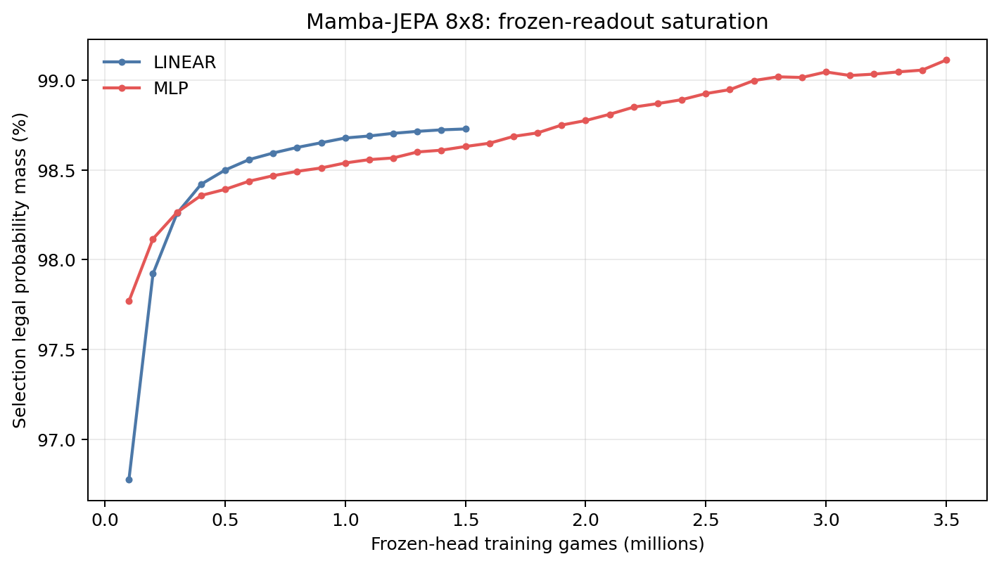
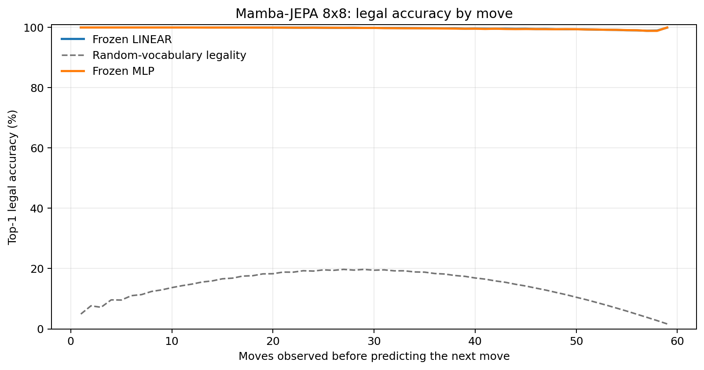
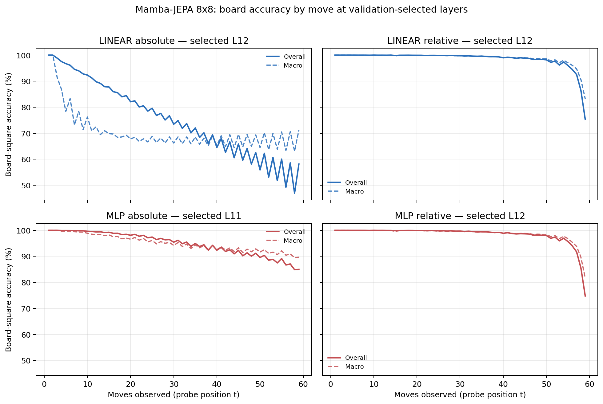

# Proposal evaluation: Mamba-JEPA 8x8

- **Suite:** `thesis_eval_suite_v1` over `unified_eval_v4`
- **Run:** `selected`
- **Checkpoint:** `final.pt` (`21fc832a9d851ed2d2951344f9d80e89610511cb77f065fde40b43805d24b26d`)
- **Training budget:** `19,999,840` games / `200` shards
- **Next-move readout:** frozen bf16 encoder with common fp32 Linear/MLP readouts
- **Exact continuation:** intentionally excluded because corpus continuations are stochastic legal choices

## 1. Functional legality

| Readout | Top-1 legal | Top-3 legal fraction | Top-5 legal fraction | Legal probability mass |
|---|---:|---:|---:|---:|
| Frozen LINEAR | 99.74% | 96.82% | 92.50% | 98.66% |
| Frozen MLP | 99.72% | 96.81% | 92.49% | 99.03% |

### Statistical context

| Readout | Normalized legal lift | 95% CI for top-1 legal |
|---|---:|---:|
| Frozen LINEAR | 99.70% | 99.73%–99.75% |
| Frozen MLP | 99.68% | 99.71%–99.73% |

### Frozen-head saturation

There is no minimum shard count. Training stops under the pre-registered selection legal-mass patience rule and restores the best checkpoint.

### Legal accuracy by move

### Legality by normalized game phase

| Readout | Phase | Tokens | Mean legal moves | Top-1 legal | Legal mass |
|---|---:|---:|---:|---:|---:|
| Frozen LINEAR | 0.00–0.25 | 749,909 | 7.22 | 100.00% | 99.27% |
| Frozen LINEAR | 0.25–0.50 | 699,679 | 11.44 | 99.94% | 98.67% |
| Frozen LINEAR | 0.50–0.75 | 749,593 | 10.84 | 99.71% | 98.36% |
| Frozen LINEAR | 0.75–1.00 | 749,129 | 5.15 | 99.33% | 98.36% |
| Frozen MLP | 0.00–0.25 | 749,909 | 7.22 | 99.99% | 99.82% |
| Frozen MLP | 0.25–0.50 | 699,679 | 11.44 | 99.93% | 99.53% |
| Frozen MLP | 0.50–0.75 | 749,593 | 10.84 | 99.66% | 98.89% |
| Frozen MLP | 0.75–1.00 | 749,129 | 5.15 | 99.31% | 97.90% |

## 2. Board-state representations

Layer selection uses only the selection split. Headline test values are macro-balanced accuracy, so changing empty-square prevalence across board sizes cannot dominate the comparison.

**Macro accuracy** is the unweighted mean of the three per-class recalls. Absolute labels use empty/black/white and relative labels use empty/mine/opponent. Each class therefore contributes one third even when empty squares are much more common. Overall accuracy instead weights every square equally and can be dominated by the empty class.

| Probe | Labels | Best layer | Normalized depth | Test macro | Overall | Occupied | Empty |
|---|---|---:|---:|---:|---:|---:|---:|
| LINEAR | absolute | L12 | 0.800 | 68.96% | 75.64% | 53.48% | 100.00% |
| LINEAR | relative | L12 | 0.800 | 98.22% | 98.62% | 97.37% | 100.00% |
| MLP | absolute | L11 | 0.733 | 93.75% | 95.09% | 90.62% | 100.00% |
| MLP | relative | L12 | 0.800 | 98.04% | 98.48% | 97.12% | 99.99% |

### Probe accuracy by layer

These are the untouched test-split tables in the same format as the 8x8 unified JEPA notebook. `Selected` marks the layer chosen using the separate selection split, never the test results.

#### LINEAR board-state probe

| Layer | Absolute accuracy | Absolute macro | Relative accuracy | Relative macro | Selected |
|---:|---:|---:|---:|---:|:---|
| L0 | 62.59% | 55.55% | 64.83% | 58.22% |  |
| L1 | 73.49% | 66.64% | 78.26% | 72.47% |  |
| L2 | 73.83% | 67.00% | 81.18% | 76.23% |  |
| L3 | 72.78% | 65.95% | 87.66% | 84.79% |  |
| L4 | 73.92% | 67.02% | 89.16% | 86.30% |  |
| L5 | 73.93% | 67.03% | 89.20% | 86.38% |  |
| L6 | 72.79% | 65.79% | 93.47% | 91.90% |  |
| L7 | 73.30% | 66.34% | 93.88% | 92.40% |  |
| L8 | 73.22% | 66.25% | 95.97% | 95.00% |  |
| L9 | 74.27% | 67.43% | 96.85% | 96.05% |  |
| L10 | 75.54% | 68.84% | 97.91% | 97.31% |  |
| L11 | 75.56% | 68.87% | 98.17% | 97.66% |  |
| L12 | 75.64% | 68.96% | 98.62% | 98.22% | absolute + relative |
| L13 | 75.38% | 68.64% | 98.35% | 97.88% |  |
| L14 | 74.78% | 67.97% | 97.04% | 96.31% |  |
| L15 | 74.35% | 67.53% | 96.16% | 95.28% |  |

#### MLP board-state probe

| Layer | Absolute accuracy | Absolute macro | Relative accuracy | Relative macro | Selected |
|---:|---:|---:|---:|---:|:---|
| L0 | 65.08% | 58.74% | 65.23% | 58.64% |  |
| L1 | 75.33% | 69.10% | 77.51% | 71.64% |  |
| L2 | 76.81% | 70.92% | 80.15% | 75.03% |  |
| L3 | 83.75% | 80.27% | 86.31% | 83.35% |  |
| L4 | 84.71% | 80.96% | 88.08% | 85.08% |  |
| L5 | 83.35% | 79.21% | 88.02% | 85.00% |  |
| L6 | 89.78% | 87.74% | 92.15% | 90.44% |  |
| L7 | 88.90% | 86.47% | 92.67% | 91.02% |  |
| L8 | 92.31% | 90.83% | 94.99% | 93.93% |  |
| L9 | 92.20% | 90.39% | 96.20% | 95.31% |  |
| L10 | 93.38% | 91.58% | 97.75% | 97.10% |  |
| L11 | 95.09% | 93.75% | 98.04% | 97.49% | absolute |
| L12 | 93.59% | 91.84% | 98.48% | 98.04% | relative |
| L13 | 86.28% | 82.56% | 98.01% | 97.44% |  |
| L14 | 80.10% | 74.79% | 96.34% | 95.45% |  |
| L15 | 75.96% | 69.64% | 95.25% | 94.17% |  |

### Board accuracy by move at each selected layer

### Selected board probes by game phase

| Probe | Labels | Phase | Macro accuracy | Occupied | Empty |
|---|---|---:|---:|---:|---:|
| LINEAR | absolute | 1/4 | 97.05% | 95.95% | 100.00% |
| LINEAR | absolute | 2/4 | 82.14% | 74.81% | 100.00% |
| LINEAR | absolute | 11/4 | 67.53% | 51.31% | 100.00% |
| LINEAR | absolute | 12/4 | 67.36% | 51.03% | 100.00% |
| LINEAR | absolute | 13/4 | 68.55% | 52.89% | 100.00% |
| LINEAR | absolute | 14/4 | 67.88% | 51.82% | 99.99% |
| LINEAR | absolute | 15/4 | 67.71% | 51.57% | 99.98% |
| LINEAR | absolute | 16/4 | 67.59% | 51.38% | 100.00% |
| LINEAR | absolute | 3/4 | 76.01% | 64.99% | 100.00% |
| LINEAR | absolute | 4/4 | 72.20% | 58.40% | 100.00% |
| LINEAR | absolute | 5/4 | 70.34% | 55.83% | 100.00% |
| LINEAR | absolute | 6/4 | 68.97% | 53.58% | 100.00% |
| LINEAR | absolute | 7/4 | 68.59% | 53.25% | 100.00% |
| LINEAR | absolute | 8/4 | 68.29% | 52.48% | 100.00% |
| LINEAR | absolute | 9/4 | 68.08% | 52.14% | 100.00% |
| LINEAR | absolute | 10/4 | 67.33% | 51.05% | 100.00% |
| LINEAR | relative | 1/4 | 100.00% | 100.00% | 100.00% |
| LINEAR | relative | 2/4 | 99.98% | 99.98% | 100.00% |
| LINEAR | relative | 11/4 | 99.27% | 98.92% | 99.99% |
| LINEAR | relative | 12/4 | 99.07% | 98.63% | 99.99% |
| LINEAR | relative | 13/4 | 98.82% | 98.25% | 99.99% |
| LINEAR | relative | 14/4 | 98.45% | 97.69% | 99.99% |
| LINEAR | relative | 15/4 | 97.58% | 96.44% | 99.98% |
| LINEAR | relative | 16/4 | 91.14% | 86.79% | 100.00% |
| LINEAR | relative | 3/4 | 99.95% | 99.94% | 100.00% |
| LINEAR | relative | 4/4 | 99.96% | 99.95% | 100.00% |
| LINEAR | relative | 5/4 | 99.87% | 99.81% | 100.00% |
| LINEAR | relative | 6/4 | 99.88% | 99.83% | 100.00% |
| LINEAR | relative | 7/4 | 99.86% | 99.80% | 100.00% |
| LINEAR | relative | 8/4 | 99.79% | 99.70% | 100.00% |
| LINEAR | relative | 9/4 | 99.64% | 99.47% | 100.00% |
| LINEAR | relative | 10/4 | 99.52% | 99.30% | 99.99% |
| MLP | absolute | 1/4 | 100.00% | 100.00% | 100.00% |
| MLP | absolute | 2/4 | 99.67% | 99.51% | 100.00% |
| MLP | absolute | 11/4 | 93.40% | 90.09% | 100.00% |
| MLP | absolute | 12/4 | 92.83% | 89.26% | 99.98% |
| MLP | absolute | 13/4 | 92.56% | 88.84% | 99.99% |
| MLP | absolute | 14/4 | 92.25% | 88.40% | 99.97% |
| MLP | absolute | 15/4 | 91.48% | 87.22% | 100.00% |
| MLP | absolute | 16/4 | 90.22% | 85.36% | 99.92% |
| MLP | absolute | 3/4 | 99.06% | 98.62% | 100.00% |
| MLP | absolute | 4/4 | 98.31% | 97.46% | 100.00% |
| MLP | absolute | 5/4 | 97.61% | 96.42% | 100.00% |
| MLP | absolute | 6/4 | 96.84% | 95.27% | 100.00% |
| MLP | absolute | 7/4 | 96.24% | 94.37% | 100.00% |
| MLP | absolute | 8/4 | 95.31% | 92.96% | 100.00% |
| MLP | absolute | 9/4 | 94.58% | 91.87% | 100.00% |
| MLP | absolute | 10/4 | 93.63% | 90.47% | 99.99% |
| MLP | relative | 1/4 | 100.00% | 100.00% | 100.00% |
| MLP | relative | 2/4 | 99.97% | 99.97% | 100.00% |
| MLP | relative | 11/4 | 99.12% | 98.70% | 100.00% |
| MLP | relative | 12/4 | 98.88% | 98.36% | 99.97% |
| MLP | relative | 13/4 | 98.66% | 98.03% | 99.96% |
| MLP | relative | 14/4 | 98.25% | 97.40% | 99.97% |
| MLP | relative | 15/4 | 97.30% | 96.11% | 99.83% |
| MLP | relative | 16/4 | 90.25% | 86.13% | 98.69% |
| MLP | relative | 3/4 | 99.93% | 99.91% | 100.00% |
| MLP | relative | 4/4 | 99.91% | 99.88% | 100.00% |
| MLP | relative | 5/4 | 99.82% | 99.74% | 100.00% |
| MLP | relative | 6/4 | 99.84% | 99.78% | 100.00% |
| MLP | relative | 7/4 | 99.77% | 99.67% | 100.00% |
| MLP | relative | 8/4 | 99.68% | 99.53% | 100.00% |
| MLP | relative | 9/4 | 99.53% | 99.31% | 99.99% |
| MLP | relative | 10/4 | 99.34% | 99.04% | 100.00% |

## 3. Nanda-style causal intervention

- Readout: `frozen_mlp`
- Selected intervention scale: `4`
- Interpretation scope: JEPA encoder plus post-hoc frozen MLP readout

| Control | Target top-1 legal | Target legal mass | Top-N FP+FN |
|---|---:|---:|---:|
| Null | 91.40% | 90.17% | 2.374 |
| Magnitude-matched random | 90.70% | 89.98% | 2.340 |
| Relative-board direction | 95.60% | 91.76% | 1.134 |

For AR this edits the native prediction path. For JEPA it establishes causal steerability of the composed JEPA encoder plus its post-hoc frozen MLP readout; it is not evidence of a native JEPA action head.

## 4. Architecture-matched random-encoder control

### Frozen next-move readouts

| Readout | Trained top-1 legal | Random top-1 legal | Trained legal mass | Random legal mass |
|---|---:|---:|---:|---:|
| LINEAR | 99.74% | 40.56% | 98.66% | 22.42% |
| MLP | 99.72% | 50.17% | 99.03% | 28.62% |

### Board-state probes

The lift compares independently selection-chosen trained and random layers under the same probe protocol and position manifest.

| Probe | Labels | Trained macro | Random macro | Trained − random |
|---|---|---:|---:|---:|
| LINEAR | absolute | 68.96% | 55.86% | 13.10% |
| LINEAR | relative | 98.22% | 58.28% | 39.94% |
| MLP | absolute | 93.75% | 58.16% | 35.59% |
| MLP | relative | 98.04% | 58.67% | 39.38% |

## 5. Efficiency and reproducibility

- Encoder parameters: `25,529,856`
- Total parameters: `51,322,368`
- Checkpoint bytes: `411,662,638`
- Evaluation GPU: `NVIDIA L4`
- Training hardware: `unreported`
- Training precision: `bf16`
- Python / PyTorch / CUDA: `3.12.13` / `2.11.0+cu128` / `12.8`
- Median training chunk: `52.47 s`
- Estimated training loop: `2.92 h`
- Median games/s: `1905.66`
- Median supervision units/s: `110486.13`
- Timing scope: dt_seconds excludes normal checkpoint/Drive-sync time; validation is included only in observed_train_plus_validation_loop_hours

## 6. Interpretation boundary

- Board probes establish decodability, not by themselves causal use.
- Legal behavior measures rule compatibility, not strategic playing strength.
- Bootstrap legality intervals quantify test-game sampling only; they do not replace independent pretraining seeds.
- Board-probe point estimates use one deterministic probe seed; the random-encoder control is not a substitute for model-seed replication.
- Cross-board results compare separately trained scaling conditions, not zero-shot transfer.

## Artifact index

- Unified JSON: `/content/seed_evaluation_views/mamba_jepa_b8_seed001/runs/selected/thesis_eval/final/results__unified_eval_v4.json`
- Unified summary: `/content/seed_evaluation_views/mamba_jepa_b8_seed001/runs/selected/thesis_eval/final/summary__unified_eval_v4.md`
- Position manifest: `/content/seed_evaluation_views/mamba_jepa_b8_seed001/runs/selected/thesis_eval/final/position_manifest__unified_eval_v4.json`
- Legal-by-move figure: `/content/seed_evaluation_views/mamba_jepa_b8_seed001/runs/selected/thesis_eval/final/legal_accuracy_by_move__thesis_eval_suite_v1.png`
- Board-by-move figure: `/content/seed_evaluation_views/mamba_jepa_b8_seed001/runs/selected/thesis_eval/final/board_accuracy_by_move__thesis_eval_suite_v1.png`
- Random-control JSON: `/content/seed_evaluation_views/mamba_jepa_b8_seed001/runs/selected/thesis_eval/final/random_encoder_control/results__unified_eval_v4.json`
- Causal-intervention JSON: `/content/seed_evaluation_views/mamba_jepa_b8_seed001/runs/selected/thesis_eval/final/results__unified_eval_v4.json` (`causal_intervention` key)
