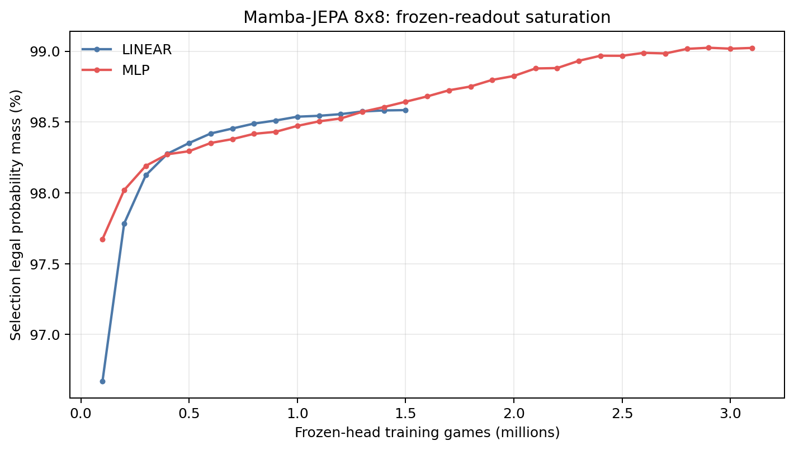
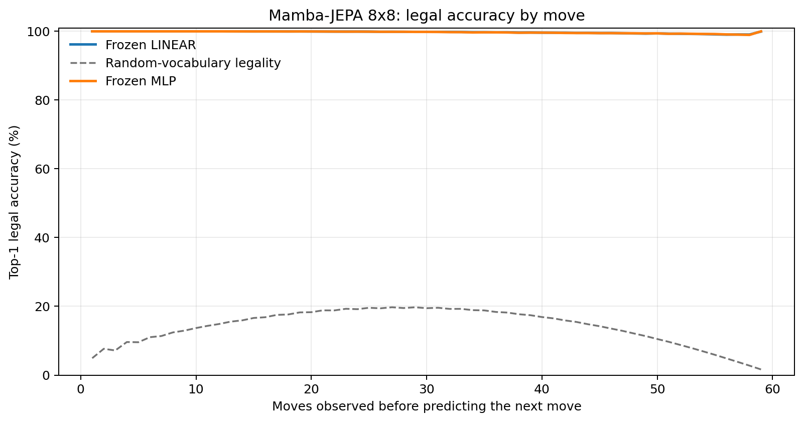
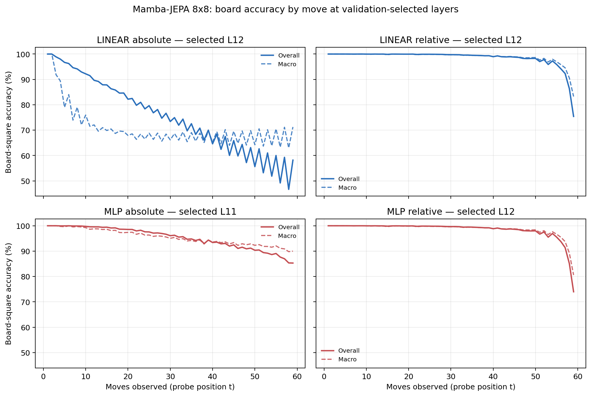

# Proposal evaluation: Mamba-JEPA 8x8

- **Suite:** `thesis_eval_suite_v1` over `unified_eval_v4`
- **Run:** `selected`
- **Checkpoint:** `final.pt` (`2d233f6c79f9a072f9e942a4ef8e831ec389ba3aed4236291a01efe0eac412c2`)
- **Training budget:** `19,999,840` games / `200` shards
- **Next-move readout:** frozen bf16 encoder with common fp32 Linear/MLP readouts
- **Exact continuation:** intentionally excluded because corpus continuations are stochastic legal choices

## 1. Functional legality

| Readout | Top-1 legal | Top-3 legal fraction | Top-5 legal fraction | Legal probability mass |
|---|---:|---:|---:|---:|
| Frozen LINEAR | 99.74% | 96.82% | 92.49% | 98.53% |
| Frozen MLP | 99.73% | 96.80% | 92.48% | 98.97% |

### Statistical context

| Readout | Normalized legal lift | 95% CI for top-1 legal |
|---|---:|---:|
| Frozen LINEAR | 99.69% | 99.73%–99.74% |
| Frozen MLP | 99.68% | 99.72%–99.74% |

### Frozen-head saturation

There is no minimum shard count. Training stops under the pre-registered selection legal-mass patience rule and restores the best checkpoint.

### Legal accuracy by move

### Legality by normalized game phase

| Readout | Phase | Tokens | Mean legal moves | Top-1 legal | Legal mass |
|---|---:|---:|---:|---:|---:|
| Frozen LINEAR | 0.00–0.25 | 749,909 | 7.22 | 100.00% | 99.16% |
| Frozen LINEAR | 0.25–0.50 | 699,679 | 11.44 | 99.93% | 98.50% |
| Frozen LINEAR | 0.50–0.75 | 749,593 | 10.84 | 99.70% | 98.19% |
| Frozen LINEAR | 0.75–1.00 | 749,129 | 5.15 | 99.33% | 98.26% |
| Frozen MLP | 0.00–0.25 | 749,909 | 7.22 | 100.00% | 99.80% |
| Frozen MLP | 0.25–0.50 | 699,679 | 11.44 | 99.92% | 99.53% |
| Frozen MLP | 0.50–0.75 | 749,593 | 10.84 | 99.66% | 98.83% |
| Frozen MLP | 0.75–1.00 | 749,129 | 5.15 | 99.34% | 97.76% |

## 2. Board-state representations

Layer selection uses only the selection split. Headline test values are macro-balanced accuracy, so changing empty-square prevalence across board sizes cannot dominate the comparison.

**Macro accuracy** is the unweighted mean of the three per-class recalls. Absolute labels use empty/black/white and relative labels use empty/mine/opponent. Each class therefore contributes one third even when empty squares are much more common. Overall accuracy instead weights every square equally and can be dominated by the empty class.

| Probe | Labels | Best layer | Normalized depth | Test macro | Overall | Occupied | Empty |
|---|---|---:|---:|---:|---:|---:|---:|
| LINEAR | absolute | L12 | 0.800 | 69.09% | 75.74% | 53.68% | 100.00% |
| LINEAR | relative | L12 | 0.800 | 98.19% | 98.60% | 97.32% | 100.00% |
| MLP | absolute | L11 | 0.733 | 94.16% | 95.41% | 91.24% | 100.00% |
| MLP | relative | L12 | 0.800 | 97.99% | 98.44% | 97.03% | 99.99% |

### Probe accuracy by layer

These are the untouched test-split tables in the same format as the 8x8 unified JEPA notebook. `Selected` marks the layer chosen using the separate selection split, never the test results.

#### LINEAR board-state probe

| Layer | Absolute accuracy | Absolute macro | Relative accuracy | Relative macro | Selected |
|---:|---:|---:|---:|---:|:---|
| L0 | 62.60% | 55.55% | 64.82% | 58.18% |  |
| L1 | 72.12% | 65.24% | 78.12% | 72.72% |  |
| L2 | 74.07% | 67.20% | 83.12% | 78.60% |  |
| L3 | 74.87% | 68.06% | 84.45% | 80.14% |  |
| L4 | 74.00% | 67.12% | 91.55% | 89.34% |  |
| L5 | 73.82% | 66.90% | 92.24% | 90.22% |  |
| L6 | 73.80% | 66.88% | 92.67% | 90.78% |  |
| L7 | 73.98% | 67.07% | 93.05% | 91.26% |  |
| L8 | 73.06% | 66.05% | 96.24% | 95.32% |  |
| L9 | 74.58% | 67.74% | 97.05% | 96.27% |  |
| L10 | 75.31% | 68.57% | 97.72% | 97.07% |  |
| L11 | 75.59% | 68.90% | 98.12% | 97.58% |  |
| L12 | 75.74% | 69.09% | 98.60% | 98.19% | absolute + relative |
| L13 | 75.59% | 68.90% | 98.44% | 97.99% |  |
| L14 | 74.87% | 68.07% | 97.16% | 96.43% |  |
| L15 | 74.72% | 67.96% | 96.38% | 95.50% |  |

#### MLP board-state probe

| Layer | Absolute accuracy | Absolute macro | Relative accuracy | Relative macro | Selected |
|---:|---:|---:|---:|---:|:---|
| L0 | 65.06% | 58.71% | 65.27% | 58.68% |  |
| L1 | 75.25% | 69.36% | 77.45% | 71.95% |  |
| L2 | 78.83% | 73.40% | 82.10% | 77.42% |  |
| L3 | 78.75% | 73.05% | 83.34% | 78.80% |  |
| L4 | 87.28% | 84.19% | 90.56% | 88.19% |  |
| L5 | 87.87% | 84.99% | 91.19% | 89.03% |  |
| L6 | 86.19% | 82.80% | 91.53% | 89.48% |  |
| L7 | 87.33% | 84.22% | 91.90% | 89.93% |  |
| L8 | 92.69% | 91.33% | 95.21% | 94.22% |  |
| L9 | 92.16% | 90.27% | 96.44% | 95.59% |  |
| L10 | 93.38% | 91.63% | 97.48% | 96.77% |  |
| L11 | 95.41% | 94.16% | 97.97% | 97.39% | absolute |
| L12 | 94.54% | 93.06% | 98.44% | 97.99% | relative |
| L13 | 86.73% | 83.12% | 98.14% | 97.62% |  |
| L14 | 83.27% | 78.82% | 96.47% | 95.58% |  |
| L15 | 78.87% | 73.31% | 95.46% | 94.38% |  |

### Board accuracy by move at each selected layer

### Selected board probes by game phase

| Probe | Labels | Phase | Macro accuracy | Occupied | Empty |
|---|---|---:|---:|---:|---:|
| LINEAR | absolute | 1/4 | 97.20% | 96.12% | 100.00% |
| LINEAR | absolute | 2/4 | 82.99% | 76.03% | 100.00% |
| LINEAR | absolute | 11/4 | 67.88% | 51.84% | 100.00% |
| LINEAR | absolute | 12/4 | 67.46% | 51.19% | 100.00% |
| LINEAR | absolute | 13/4 | 68.67% | 53.06% | 100.00% |
| LINEAR | absolute | 14/4 | 67.80% | 51.71% | 99.99% |
| LINEAR | absolute | 15/4 | 67.79% | 51.69% | 100.00% |
| LINEAR | absolute | 16/4 | 67.65% | 51.48% | 100.00% |
| LINEAR | absolute | 3/4 | 76.30% | 65.48% | 100.00% |
| LINEAR | absolute | 4/4 | 72.12% | 58.30% | 100.00% |
| LINEAR | absolute | 5/4 | 70.99% | 56.83% | 100.00% |
| LINEAR | absolute | 6/4 | 69.00% | 53.63% | 100.00% |
| LINEAR | absolute | 7/4 | 68.77% | 53.54% | 100.00% |
| LINEAR | absolute | 8/4 | 68.32% | 52.52% | 100.00% |
| LINEAR | absolute | 9/4 | 68.31% | 52.49% | 100.00% |
| LINEAR | absolute | 10/4 | 67.33% | 51.05% | 99.99% |
| LINEAR | relative | 1/4 | 100.00% | 100.00% | 100.00% |
| LINEAR | relative | 2/4 | 99.97% | 99.97% | 100.00% |
| LINEAR | relative | 11/4 | 99.26% | 98.90% | 100.00% |
| LINEAR | relative | 12/4 | 99.08% | 98.64% | 99.99% |
| LINEAR | relative | 13/4 | 98.78% | 98.19% | 99.99% |
| LINEAR | relative | 14/4 | 98.35% | 97.56% | 99.98% |
| LINEAR | relative | 15/4 | 97.51% | 96.33% | 99.98% |
| LINEAR | relative | 16/4 | 91.04% | 86.65% | 100.00% |
| LINEAR | relative | 3/4 | 99.95% | 99.93% | 100.00% |
| LINEAR | relative | 4/4 | 99.95% | 99.94% | 100.00% |
| LINEAR | relative | 5/4 | 99.90% | 99.84% | 100.00% |
| LINEAR | relative | 6/4 | 99.87% | 99.82% | 100.00% |
| LINEAR | relative | 7/4 | 99.88% | 99.82% | 100.00% |
| LINEAR | relative | 8/4 | 99.79% | 99.70% | 100.00% |
| LINEAR | relative | 9/4 | 99.63% | 99.45% | 99.99% |
| LINEAR | relative | 10/4 | 99.47% | 99.22% | 100.00% |
| MLP | absolute | 1/4 | 100.00% | 100.00% | 100.00% |
| MLP | absolute | 2/4 | 99.77% | 99.67% | 100.00% |
| MLP | absolute | 11/4 | 93.86% | 90.79% | 100.00% |
| MLP | absolute | 12/4 | 93.43% | 90.15% | 99.98% |
| MLP | absolute | 13/4 | 92.91% | 89.38% | 99.99% |
| MLP | absolute | 14/4 | 92.60% | 88.91% | 99.98% |
| MLP | absolute | 15/4 | 91.90% | 87.85% | 100.00% |
| MLP | absolute | 16/4 | 90.51% | 85.80% | 99.92% |
| MLP | absolute | 3/4 | 99.30% | 98.99% | 100.00% |
| MLP | absolute | 4/4 | 98.76% | 98.14% | 100.00% |
| MLP | absolute | 5/4 | 98.13% | 97.21% | 100.00% |
| MLP | absolute | 6/4 | 97.25% | 95.88% | 100.00% |
| MLP | absolute | 7/4 | 96.64% | 94.98% | 100.00% |
| MLP | absolute | 8/4 | 95.89% | 93.84% | 100.00% |
| MLP | absolute | 9/4 | 95.07% | 92.61% | 100.00% |
| MLP | absolute | 10/4 | 94.05% | 91.08% | 100.00% |
| MLP | relative | 1/4 | 100.00% | 100.00% | 100.00% |
| MLP | relative | 2/4 | 99.97% | 99.97% | 100.00% |
| MLP | relative | 11/4 | 99.13% | 98.72% | 99.98% |
| MLP | relative | 12/4 | 98.90% | 98.38% | 99.97% |
| MLP | relative | 13/4 | 98.60% | 97.95% | 99.96% |
| MLP | relative | 14/4 | 98.12% | 97.22% | 99.97% |
| MLP | relative | 15/4 | 97.21% | 95.97% | 99.83% |
| MLP | relative | 16/4 | 90.03% | 85.66% | 98.97% |
| MLP | relative | 3/4 | 99.94% | 99.92% | 100.00% |
| MLP | relative | 4/4 | 99.91% | 99.87% | 100.00% |
| MLP | relative | 5/4 | 99.84% | 99.77% | 100.00% |
| MLP | relative | 6/4 | 99.81% | 99.73% | 100.00% |
| MLP | relative | 7/4 | 99.79% | 99.69% | 99.99% |
| MLP | relative | 8/4 | 99.69% | 99.54% | 100.00% |
| MLP | relative | 9/4 | 99.51% | 99.28% | 99.99% |
| MLP | relative | 10/4 | 99.38% | 99.10% | 99.99% |

## 3. Nanda-style causal intervention

- Readout: `frozen_mlp`
- Selected intervention scale: `4`
- Interpretation scope: JEPA encoder plus post-hoc frozen MLP readout

| Control | Target top-1 legal | Target legal mass | Top-N FP+FN |
|---|---:|---:|---:|
| Null | 90.50% | 90.25% | 2.364 |
| Magnitude-matched random | 91.30% | 90.03% | 2.338 |
| Relative-board direction | 96.00% | 91.60% | 1.082 |

For AR this edits the native prediction path. For JEPA it establishes causal steerability of the composed JEPA encoder plus its post-hoc frozen MLP readout; it is not evidence of a native JEPA action head.

## 4. Architecture-matched random-encoder control

### Frozen next-move readouts

| Readout | Trained top-1 legal | Random top-1 legal | Trained legal mass | Random legal mass |
|---|---:|---:|---:|---:|
| LINEAR | 99.74% | 40.56% | 98.53% | 22.42% |
| MLP | 99.73% | 50.17% | 98.97% | 28.62% |

### Board-state probes

The lift compares independently selection-chosen trained and random layers under the same probe protocol and position manifest.

| Probe | Labels | Trained macro | Random macro | Trained − random |
|---|---|---:|---:|---:|
| LINEAR | absolute | 69.09% | 55.86% | 13.23% |
| LINEAR | relative | 98.19% | 58.28% | 39.90% |
| MLP | absolute | 94.16% | 58.16% | 36.00% |
| MLP | relative | 97.99% | 58.67% | 39.32% |

## 5. Efficiency and reproducibility

- Encoder parameters: `25,529,856`
- Total parameters: `51,322,368`
- Checkpoint bytes: `411,662,638`
- Evaluation GPU: `NVIDIA L4`
- Training hardware: `unreported`
- Training precision: `bf16`
- Python / PyTorch / CUDA: `3.12.13` / `2.11.0+cu128` / `12.8`
- Median training chunk: `52.59 s`
- Estimated training loop: `2.92 h`
- Median games/s: `1901.48`
- Median supervision units/s: `110243.95`
- Timing scope: dt_seconds excludes normal checkpoint/Drive-sync time; validation is included only in observed_train_plus_validation_loop_hours

## 6. Interpretation boundary

- Board probes establish decodability, not by themselves causal use.
- Legal behavior measures rule compatibility, not strategic playing strength.
- Bootstrap legality intervals quantify test-game sampling only; they do not replace independent pretraining seeds.
- Board-probe point estimates use one deterministic probe seed; the random-encoder control is not a substitute for model-seed replication.
- Cross-board results compare separately trained scaling conditions, not zero-shot transfer.

## Artifact index

- Unified JSON: `/content/seed_evaluation_views/mamba_jepa_b8_seed002/runs/selected/thesis_eval/final/results__unified_eval_v4.json`
- Unified summary: `/content/seed_evaluation_views/mamba_jepa_b8_seed002/runs/selected/thesis_eval/final/summary__unified_eval_v4.md`
- Position manifest: `/content/seed_evaluation_views/mamba_jepa_b8_seed002/runs/selected/thesis_eval/final/position_manifest__unified_eval_v4.json`
- Legal-by-move figure: `/content/seed_evaluation_views/mamba_jepa_b8_seed002/runs/selected/thesis_eval/final/legal_accuracy_by_move__thesis_eval_suite_v1.png`
- Board-by-move figure: `/content/seed_evaluation_views/mamba_jepa_b8_seed002/runs/selected/thesis_eval/final/board_accuracy_by_move__thesis_eval_suite_v1.png`
- Random-control JSON: `/content/seed_evaluation_views/mamba_jepa_b8_seed002/runs/selected/thesis_eval/final/random_encoder_control/results__unified_eval_v4.json`
- Causal-intervention JSON: `/content/seed_evaluation_views/mamba_jepa_b8_seed002/runs/selected/thesis_eval/final/results__unified_eval_v4.json` (`causal_intervention` key)
