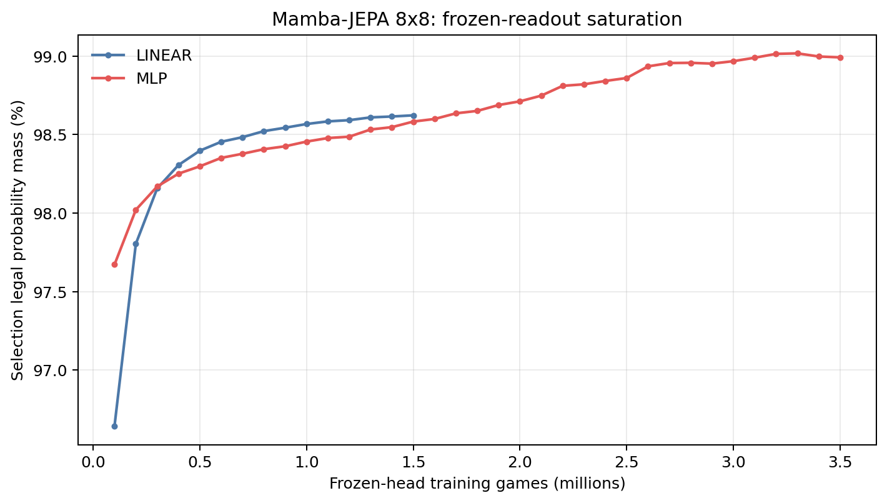
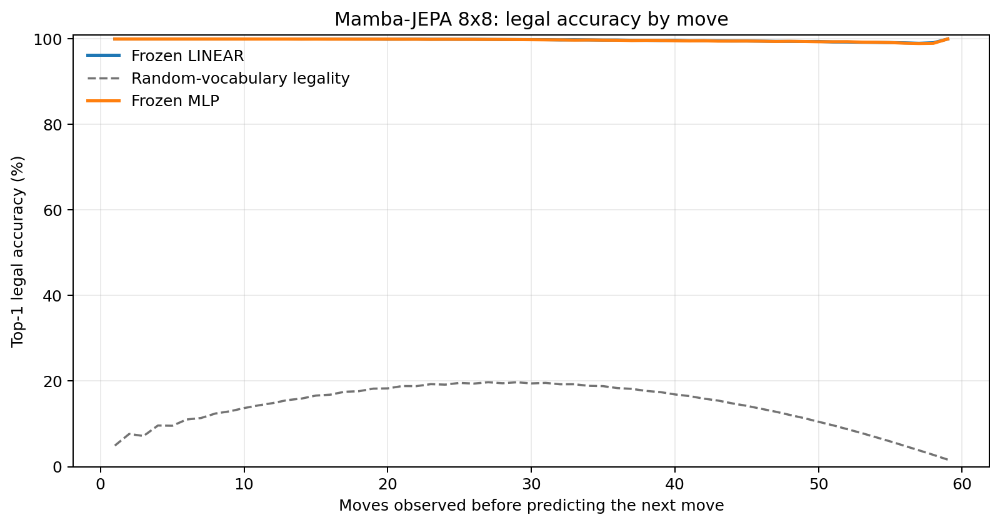
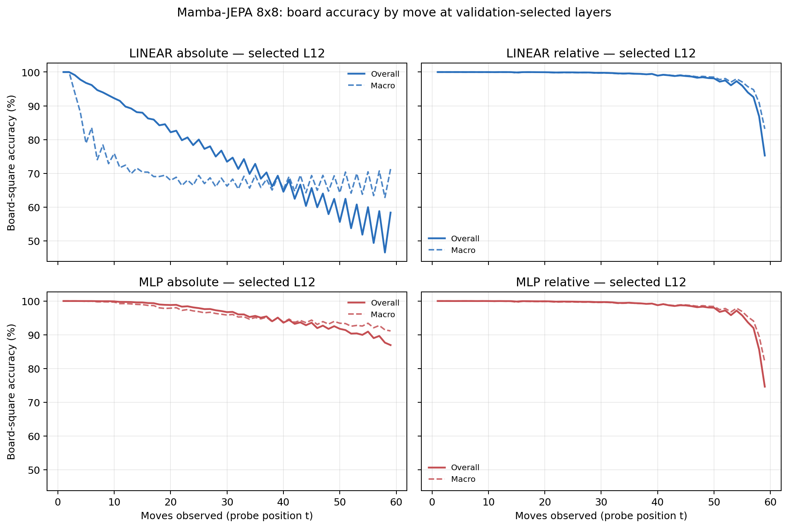

# Proposal evaluation: Mamba-JEPA 8x8

- **Suite:** `thesis_eval_suite_v1` over `unified_eval_v4`
- **Run:** `selected`
- **Checkpoint:** `final.pt` (`efc79dc529c0351cac7dbf9fde3f7716493a16f5649f6adfdca647577c2fcd23`)
- **Training budget:** `19,999,840` games / `200` shards
- **Next-move readout:** frozen bf16 encoder with common fp32 Linear/MLP readouts
- **Exact continuation:** intentionally excluded because corpus continuations are stochastic legal choices

## 1. Functional legality

| Readout | Top-1 legal | Top-3 legal fraction | Top-5 legal fraction | Legal probability mass |
|---|---:|---:|---:|---:|
| Frozen LINEAR | 99.74% | 96.82% | 92.50% | 98.58% |
| Frozen MLP | 99.73% | 96.80% | 92.49% | 98.97% |

### Statistical context

| Readout | Normalized legal lift | 95% CI for top-1 legal |
|---|---:|---:|
| Frozen LINEAR | 99.70% | 99.73%–99.75% |
| Frozen MLP | 99.69% | 99.72%–99.74% |

### Frozen-head saturation

There is no minimum shard count. Training stops under the pre-registered selection legal-mass patience rule and restores the best checkpoint.

### Legal accuracy by move

### Legality by normalized game phase

| Readout | Phase | Tokens | Mean legal moves | Top-1 legal | Legal mass |
|---|---:|---:|---:|---:|---:|
| Frozen LINEAR | 0.00–0.25 | 749,909 | 7.22 | 100.00% | 99.16% |
| Frozen LINEAR | 0.25–0.50 | 699,679 | 11.44 | 99.93% | 98.56% |
| Frozen LINEAR | 0.50–0.75 | 749,593 | 10.84 | 99.70% | 98.29% |
| Frozen LINEAR | 0.75–1.00 | 749,129 | 5.15 | 99.34% | 98.31% |
| Frozen MLP | 0.00–0.25 | 749,909 | 7.22 | 100.00% | 99.83% |
| Frozen MLP | 0.25–0.50 | 699,679 | 11.44 | 99.93% | 99.53% |
| Frozen MLP | 0.50–0.75 | 749,593 | 10.84 | 99.67% | 98.82% |
| Frozen MLP | 0.75–1.00 | 749,129 | 5.15 | 99.33% | 97.73% |

## 2. Board-state representations

Layer selection uses only the selection split. Headline test values are macro-balanced accuracy, so changing empty-square prevalence across board sizes cannot dominate the comparison.

**Macro accuracy** is the unweighted mean of the three per-class recalls. Absolute labels use empty/black/white and relative labels use empty/mine/opponent. Each class therefore contributes one third even when empty squares are much more common. Overall accuracy instead weights every square equally and can be dominated by the empty class.

| Probe | Labels | Best layer | Normalized depth | Test macro | Overall | Occupied | Empty |
|---|---|---:|---:|---:|---:|---:|---:|
| LINEAR | absolute | L12 | 0.800 | 69.06% | 75.71% | 53.63% | 100.00% |
| LINEAR | relative | L12 | 0.800 | 98.21% | 98.61% | 97.35% | 100.00% |
| MLP | absolute | L12 | 0.800 | 94.94% | 96.02% | 92.41% | 100.00% |
| MLP | relative | L12 | 0.800 | 98.03% | 98.48% | 97.10% | 99.99% |

### Probe accuracy by layer

These are the untouched test-split tables in the same format as the 8x8 unified JEPA notebook. `Selected` marks the layer chosen using the separate selection split, never the test results.

#### LINEAR board-state probe

| Layer | Absolute accuracy | Absolute macro | Relative accuracy | Relative macro | Selected |
|---:|---:|---:|---:|---:|:---|
| L0 | 62.62% | 55.58% | 64.80% | 58.19% |  |
| L1 | 74.05% | 67.21% | 79.18% | 73.53% |  |
| L2 | 73.18% | 66.35% | 86.43% | 83.12% |  |
| L3 | 73.22% | 66.34% | 86.99% | 83.80% |  |
| L4 | 73.86% | 66.99% | 87.62% | 84.44% |  |
| L5 | 73.36% | 66.44% | 89.05% | 86.39% |  |
| L6 | 71.84% | 64.84% | 94.73% | 93.51% |  |
| L7 | 73.75% | 66.84% | 95.61% | 94.48% |  |
| L8 | 74.19% | 67.31% | 96.14% | 95.15% |  |
| L9 | 74.57% | 67.74% | 96.84% | 96.01% |  |
| L10 | 75.34% | 68.61% | 97.73% | 97.09% |  |
| L11 | 75.61% | 68.93% | 98.11% | 97.57% |  |
| L12 | 75.71% | 69.06% | 98.61% | 98.21% | absolute + relative |
| L13 | 75.47% | 68.76% | 98.37% | 97.90% |  |
| L14 | 74.92% | 68.14% | 97.18% | 96.47% |  |
| L15 | 75.29% | 68.70% | 96.33% | 95.47% |  |

#### MLP board-state probe

| Layer | Absolute accuracy | Absolute macro | Relative accuracy | Relative macro | Selected |
|---:|---:|---:|---:|---:|:---|
| L0 | 65.06% | 58.68% | 65.28% | 58.69% |  |
| L1 | 75.96% | 69.72% | 78.45% | 72.67% |  |
| L2 | 82.32% | 78.21% | 85.38% | 81.94% |  |
| L3 | 82.39% | 78.27% | 85.76% | 82.41% |  |
| L4 | 81.95% | 77.46% | 86.47% | 83.08% |  |
| L5 | 83.57% | 79.69% | 87.71% | 84.84% |  |
| L6 | 88.94% | 86.97% | 93.48% | 92.23% |  |
| L7 | 86.62% | 83.39% | 94.80% | 93.57% |  |
| L8 | 84.41% | 80.45% | 95.40% | 94.30% |  |
| L9 | 85.36% | 81.54% | 96.25% | 95.34% |  |
| L10 | 91.47% | 89.20% | 97.50% | 96.79% |  |
| L11 | 95.31% | 94.03% | 97.98% | 97.41% |  |
| L12 | 96.02% | 94.94% | 98.48% | 98.03% | absolute + relative |
| L13 | 94.07% | 92.47% | 98.03% | 97.46% |  |
| L14 | 87.29% | 83.97% | 96.53% | 95.67% |  |
| L15 | 82.17% | 77.55% | 95.44% | 94.35% |  |

### Board accuracy by move at each selected layer

### Selected board probes by game phase

| Probe | Labels | Phase | Macro accuracy | Occupied | Empty |
|---|---|---:|---:|---:|---:|
| LINEAR | absolute | 1/4 | 97.89% | 96.95% | 100.00% |
| LINEAR | absolute | 2/4 | 82.61% | 75.54% | 100.00% |
| LINEAR | absolute | 11/4 | 67.53% | 51.33% | 100.00% |
| LINEAR | absolute | 12/4 | 67.28% | 50.92% | 99.99% |
| LINEAR | absolute | 13/4 | 68.55% | 52.88% | 100.00% |
| LINEAR | absolute | 14/4 | 67.77% | 51.67% | 99.99% |
| LINEAR | absolute | 15/4 | 67.86% | 51.78% | 100.00% |
| LINEAR | absolute | 16/4 | 67.62% | 51.44% | 100.00% |
| LINEAR | absolute | 3/4 | 76.41% | 65.47% | 100.00% |
| LINEAR | absolute | 4/4 | 72.44% | 58.76% | 100.00% |
| LINEAR | absolute | 5/4 | 70.92% | 56.71% | 100.00% |
| LINEAR | absolute | 6/4 | 69.03% | 53.67% | 100.00% |
| LINEAR | absolute | 7/4 | 68.79% | 53.55% | 100.00% |
| LINEAR | absolute | 8/4 | 68.54% | 52.85% | 100.00% |
| LINEAR | absolute | 9/4 | 68.02% | 52.05% | 100.00% |
| LINEAR | absolute | 10/4 | 67.52% | 51.33% | 100.00% |
| LINEAR | relative | 1/4 | 100.00% | 100.00% | 100.00% |
| LINEAR | relative | 2/4 | 99.99% | 99.99% | 100.00% |
| LINEAR | relative | 11/4 | 99.30% | 98.96% | 100.00% |
| LINEAR | relative | 12/4 | 99.08% | 98.65% | 99.98% |
| LINEAR | relative | 13/4 | 98.80% | 98.22% | 99.98% |
| LINEAR | relative | 14/4 | 98.39% | 97.62% | 99.97% |
| LINEAR | relative | 15/4 | 97.54% | 96.34% | 100.00% |
| LINEAR | relative | 16/4 | 91.11% | 86.76% | 100.00% |
| LINEAR | relative | 3/4 | 99.97% | 99.96% | 100.00% |
| LINEAR | relative | 4/4 | 99.97% | 99.96% | 100.00% |
| LINEAR | relative | 5/4 | 99.91% | 99.86% | 100.00% |
| LINEAR | relative | 6/4 | 99.87% | 99.82% | 100.00% |
| LINEAR | relative | 7/4 | 99.86% | 99.79% | 100.00% |
| LINEAR | relative | 8/4 | 99.79% | 99.69% | 100.00% |
| LINEAR | relative | 9/4 | 99.65% | 99.48% | 100.00% |
| LINEAR | relative | 10/4 | 99.51% | 99.28% | 100.00% |
| MLP | absolute | 1/4 | 100.00% | 100.00% | 100.00% |
| MLP | absolute | 2/4 | 99.91% | 99.87% | 100.00% |
| MLP | absolute | 11/4 | 94.55% | 91.83% | 99.98% |
| MLP | absolute | 12/4 | 94.06% | 91.10% | 99.98% |
| MLP | absolute | 13/4 | 93.82% | 90.74% | 99.98% |
| MLP | absolute | 14/4 | 93.51% | 90.27% | 99.98% |
| MLP | absolute | 15/4 | 92.90% | 89.36% | 99.97% |
| MLP | absolute | 16/4 | 91.90% | 87.86% | 99.96% |
| MLP | absolute | 3/4 | 99.62% | 99.43% | 100.00% |
| MLP | absolute | 4/4 | 99.17% | 98.75% | 100.00% |
| MLP | absolute | 5/4 | 98.62% | 97.92% | 100.00% |
| MLP | absolute | 6/4 | 97.78% | 96.67% | 99.99% |
| MLP | absolute | 7/4 | 97.18% | 95.77% | 100.00% |
| MLP | absolute | 8/4 | 96.45% | 94.67% | 100.00% |
| MLP | absolute | 9/4 | 95.68% | 93.52% | 100.00% |
| MLP | absolute | 10/4 | 94.86% | 92.29% | 100.00% |
| MLP | relative | 1/4 | 100.00% | 100.00% | 100.00% |
| MLP | relative | 2/4 | 99.99% | 99.99% | 100.00% |
| MLP | relative | 11/4 | 99.11% | 98.69% | 100.00% |
| MLP | relative | 12/4 | 98.86% | 98.33% | 99.97% |
| MLP | relative | 13/4 | 98.66% | 98.02% | 99.97% |
| MLP | relative | 14/4 | 98.23% | 97.39% | 99.95% |
| MLP | relative | 15/4 | 97.32% | 96.08% | 99.91% |
| MLP | relative | 16/4 | 90.31% | 86.10% | 98.97% |
| MLP | relative | 3/4 | 99.96% | 99.95% | 100.00% |
| MLP | relative | 4/4 | 99.94% | 99.92% | 100.00% |
| MLP | relative | 5/4 | 99.83% | 99.75% | 100.00% |
| MLP | relative | 6/4 | 99.79% | 99.70% | 100.00% |
| MLP | relative | 7/4 | 99.74% | 99.62% | 100.00% |
| MLP | relative | 8/4 | 99.64% | 99.49% | 100.00% |
| MLP | relative | 9/4 | 99.51% | 99.27% | 100.00% |
| MLP | relative | 10/4 | 99.36% | 99.06% | 100.00% |

## 3. Nanda-style causal intervention

- Readout: `frozen_mlp`
- Selected intervention scale: `4`
- Interpretation scope: JEPA encoder plus post-hoc frozen MLP readout

| Control | Target top-1 legal | Target legal mass | Top-N FP+FN |
|---|---:|---:|---:|
| Null | 91.40% | 90.15% | 2.350 |
| Magnitude-matched random | 90.90% | 89.93% | 2.368 |
| Relative-board direction | 96.50% | 92.97% | 0.800 |

For AR this edits the native prediction path. For JEPA it establishes causal steerability of the composed JEPA encoder plus its post-hoc frozen MLP readout; it is not evidence of a native JEPA action head.

## 4. Architecture-matched random-encoder control

### Frozen next-move readouts

| Readout | Trained top-1 legal | Random top-1 legal | Trained legal mass | Random legal mass |
|---|---:|---:|---:|---:|
| LINEAR | 99.74% | 40.56% | 98.58% | 22.42% |
| MLP | 99.73% | 50.17% | 98.97% | 28.62% |

### Board-state probes

The lift compares independently selection-chosen trained and random layers under the same probe protocol and position manifest.

| Probe | Labels | Trained macro | Random macro | Trained − random |
|---|---|---:|---:|---:|
| LINEAR | absolute | 69.06% | 55.86% | 13.20% |
| LINEAR | relative | 98.21% | 58.28% | 39.93% |
| MLP | absolute | 94.94% | 58.16% | 36.78% |
| MLP | relative | 98.03% | 58.67% | 39.36% |

## 5. Efficiency and reproducibility

- Encoder parameters: `25,529,856`
- Total parameters: `51,322,368`
- Checkpoint bytes: `411,662,638`
- Evaluation GPU: `NVIDIA L4`
- Training hardware: `unreported`
- Training precision: `bf16`
- Python / PyTorch / CUDA: `3.12.13` / `2.11.0+cu128` / `12.8`
- Median training chunk: `52.34 s`
- Estimated training loop: `2.91 h`
- Median games/s: `1910.67`
- Median supervision units/s: `110767.95`
- Timing scope: dt_seconds excludes normal checkpoint/Drive-sync time; validation is included only in observed_train_plus_validation_loop_hours

## 6. Interpretation boundary

- Board probes establish decodability, not by themselves causal use.
- Legal behavior measures rule compatibility, not strategic playing strength.
- Bootstrap legality intervals quantify test-game sampling only; they do not replace independent pretraining seeds.
- Board-probe point estimates use one deterministic probe seed; the random-encoder control is not a substitute for model-seed replication.
- Cross-board results compare separately trained scaling conditions, not zero-shot transfer.

## Artifact index

- Unified JSON: `/content/seed_evaluation_views/mamba_jepa_b8_seed003/runs/selected/thesis_eval/final/results__unified_eval_v4.json`
- Unified summary: `/content/seed_evaluation_views/mamba_jepa_b8_seed003/runs/selected/thesis_eval/final/summary__unified_eval_v4.md`
- Position manifest: `/content/seed_evaluation_views/mamba_jepa_b8_seed003/runs/selected/thesis_eval/final/position_manifest__unified_eval_v4.json`
- Legal-by-move figure: `/content/seed_evaluation_views/mamba_jepa_b8_seed003/runs/selected/thesis_eval/final/legal_accuracy_by_move__thesis_eval_suite_v1.png`
- Board-by-move figure: `/content/seed_evaluation_views/mamba_jepa_b8_seed003/runs/selected/thesis_eval/final/board_accuracy_by_move__thesis_eval_suite_v1.png`
- Random-control JSON: `/content/seed_evaluation_views/mamba_jepa_b8_seed003/runs/selected/thesis_eval/final/random_encoder_control/results__unified_eval_v4.json`
- Causal-intervention JSON: `/content/seed_evaluation_views/mamba_jepa_b8_seed003/runs/selected/thesis_eval/final/results__unified_eval_v4.json` (`causal_intervention` key)
