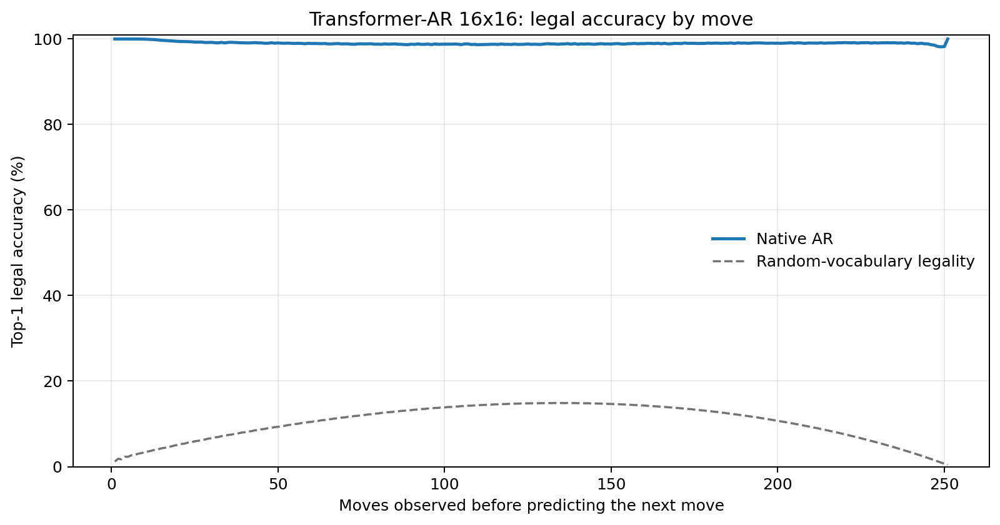
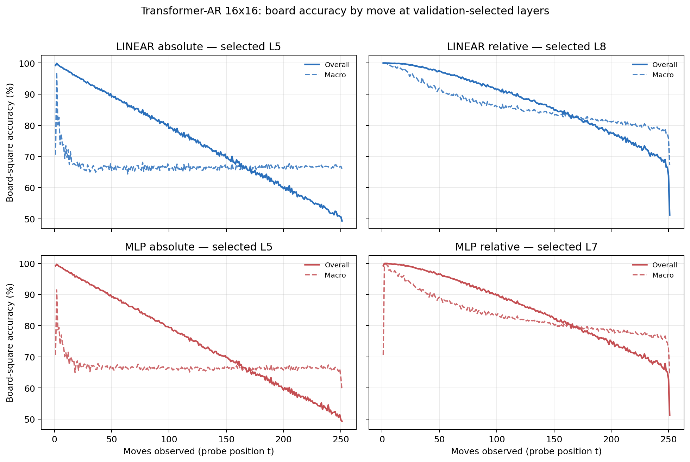

# Proposal evaluation: Transformer-AR 16x16

- **Suite:** `thesis_eval_suite_v1` over `unified_eval_v4`
- **Run:** `selected`
- **Checkpoint:** `final.pt` (`1fab25e92011b84d29d64657b993ed04653436011cfa8a6870a31c8eec1aa4f9`)
- **Training budget:** `20,000,000` games / `200` shards
- **Next-move readout:** native pretrained AR head
- **Exact continuation:** intentionally excluded because corpus continuations are stochastic legal choices

## 1. Functional legality

| Readout | Top-1 legal | Top-3 legal fraction | Top-5 legal fraction | Legal probability mass |
|---|---:|---:|---:|---:|
| Native AR | 99.01% | 98.15% | 97.04% | 89.08% |

### Statistical context

| Readout | Normalized legal lift | 95% CI for top-1 legal |
|---|---:|---:|
| Native AR | 98.90% | 99.01%–99.02% |

### Legal accuracy by move

### Legality by normalized game phase

| Readout | Phase | Tokens | Mean legal moves | Top-1 legal | Legal mass |
|---|---:|---:|---:|---:|---:|
| Native AR | 0.00–0.25 | 3,148,134 | 16.93 | 99.34% | 92.02% |
| Native AR | 0.25–0.50 | 3,097,644 | 33.66 | 98.79% | 86.77% |
| Native AR | 0.50–0.75 | 3,147,606 | 35.65 | 98.91% | 87.77% |
| Native AR | 0.75–1.00 | 3,147,581 | 18.01 | 99.02% | 89.72% |

## 2. Board-state representations

Layer selection uses only the selection split. Headline test values are macro-balanced accuracy, so changing empty-square prevalence across board sizes cannot dominate the comparison.

**Macro accuracy** is the unweighted mean of the three per-class recalls. Absolute labels use empty/black/white and relative labels use empty/mine/opponent. Each class therefore contributes one third even when empty squares are much more common. Overall accuracy instead weights every square equally and can be dominated by the empty class.

| Probe | Labels | Best layer | Normalized depth | Test macro | Overall | Occupied | Empty |
|---|---|---:|---:|---:|---:|---:|---:|
| LINEAR | absolute | L5 | 0.625 | 66.75% | 74.74% | 50.16% | 99.92% |
| LINEAR | relative | L8 | 1.000 | 83.05% | 87.16% | 74.65% | 99.97% |
| MLP | absolute | L5 | 0.625 | 66.75% | 74.68% | 50.27% | 99.68% |
| MLP | relative | L7 | 0.875 | 80.59% | 85.24% | 71.15% | 99.68% |

### Probe accuracy by layer

These are the untouched test-split tables in the same format as the 8x8 unified JEPA notebook. `Selected` marks the layer chosen using the separate selection split, never the test results.

#### LINEAR board-state probe

| Layer | Absolute accuracy | Absolute macro | Relative accuracy | Relative macro | Selected |
|---:|---:|---:|---:|---:|:---|
| L0 | 64.68% | 56.62% | 65.55% | 57.78% |  |
| L1 | 66.68% | 58.69% | 67.89% | 60.26% |  |
| L2 | 72.70% | 64.62% | 74.43% | 66.87% |  |
| L3 | 74.37% | 66.33% | 76.20% | 68.69% |  |
| L4 | 74.62% | 66.60% | 82.21% | 76.55% |  |
| L5 | 74.74% | 66.75% | 86.13% | 81.71% | absolute |
| L6 | 74.71% | 66.69% | 86.93% | 82.75% |  |
| L7 | 74.61% | 66.56% | 87.12% | 83.00% |  |
| L8 | 74.59% | 66.54% | 87.16% | 83.05% | relative |

#### MLP board-state probe

| Layer | Absolute accuracy | Absolute macro | Relative accuracy | Relative macro | Selected |
|---:|---:|---:|---:|---:|:---|
| L0 | 65.54% | 57.53% | 65.81% | 57.87% |  |
| L1 | 66.68% | 58.65% | 67.20% | 59.28% |  |
| L2 | 71.18% | 63.12% | 72.38% | 64.63% |  |
| L3 | 73.28% | 65.20% | 74.58% | 66.81% |  |
| L4 | 74.08% | 66.03% | 79.51% | 73.12% |  |
| L5 | 74.68% | 66.75% | 84.13% | 79.16% | absolute |
| L6 | 74.53% | 66.51% | 85.18% | 80.52% |  |
| L7 | 74.26% | 66.14% | 85.24% | 80.59% | relative |
| L8 | 74.30% | 66.19% | 85.23% | 80.57% |  |

### Board accuracy by move at each selected layer

### Selected board probes by game phase

| Probe | Labels | Phase | Macro accuracy | Occupied | Empty |
|---|---|---:|---:|---:|---:|
| LINEAR | absolute | 1/4 | 74.91% | 63.35% | 100.00% |
| LINEAR | absolute | 2/4 | 67.83% | 51.89% | 100.00% |
| LINEAR | absolute | 11/4 | 66.47% | 49.83% | 99.76% |
| LINEAR | absolute | 12/4 | 66.67% | 50.13% | 99.75% |
| LINEAR | absolute | 13/4 | 66.65% | 50.12% | 99.72% |
| LINEAR | absolute | 14/4 | 66.70% | 50.16% | 99.77% |
| LINEAR | absolute | 15/4 | 66.83% | 50.36% | 99.74% |
| LINEAR | absolute | 16/4 | 66.70% | 50.18% | 99.73% |
| LINEAR | absolute | 3/4 | 67.00% | 50.52% | 100.00% |
| LINEAR | absolute | 4/4 | 66.72% | 50.09% | 99.99% |
| LINEAR | absolute | 5/4 | 66.46% | 49.71% | 99.98% |
| LINEAR | absolute | 6/4 | 66.62% | 49.95% | 99.96% |
| LINEAR | absolute | 7/4 | 66.56% | 49.88% | 99.92% |
| LINEAR | absolute | 8/4 | 66.61% | 49.97% | 99.89% |
| LINEAR | absolute | 9/4 | 66.50% | 49.83% | 99.85% |
| LINEAR | absolute | 10/4 | 66.56% | 49.94% | 99.80% |
| LINEAR | relative | 1/4 | 99.07% | 98.62% | 100.00% |
| LINEAR | relative | 2/4 | 96.51% | 94.85% | 100.00% |
| LINEAR | relative | 11/4 | 82.95% | 74.52% | 99.93% |
| LINEAR | relative | 12/4 | 82.14% | 73.29% | 99.92% |
| LINEAR | relative | 13/4 | 81.32% | 72.08% | 99.87% |
| LINEAR | relative | 14/4 | 80.65% | 71.09% | 99.87% |
| LINEAR | relative | 15/4 | 79.70% | 69.65% | 99.88% |
| LINEAR | relative | 16/4 | 77.64% | 66.54% | 99.93% |
| LINEAR | relative | 3/4 | 93.07% | 89.76% | 100.00% |
| LINEAR | relative | 4/4 | 90.55% | 85.94% | 99.99% |
| LINEAR | relative | 5/4 | 88.80% | 83.32% | 99.99% |
| LINEAR | relative | 6/4 | 87.27% | 80.98% | 99.99% |
| LINEAR | relative | 7/4 | 86.06% | 79.18% | 99.97% |
| LINEAR | relative | 8/4 | 85.29% | 78.01% | 99.97% |
| LINEAR | relative | 9/4 | 84.50% | 76.82% | 99.96% |
| LINEAR | relative | 10/4 | 83.71% | 75.65% | 99.94% |
| MLP | absolute | 1/4 | 73.95% | 62.04% | 100.00% |
| MLP | absolute | 2/4 | 68.29% | 52.52% | 99.99% |
| MLP | absolute | 11/4 | 66.38% | 49.93% | 99.30% |
| MLP | absolute | 12/4 | 66.42% | 50.03% | 99.19% |
| MLP | absolute | 13/4 | 66.40% | 50.10% | 99.00% |
| MLP | absolute | 14/4 | 66.48% | 50.28% | 98.87% |
| MLP | absolute | 15/4 | 66.58% | 50.55% | 98.61% |
| MLP | absolute | 16/4 | 66.20% | 50.46% | 97.66% |
| MLP | absolute | 3/4 | 67.55% | 51.35% | 99.95% |
| MLP | absolute | 4/4 | 66.92% | 50.44% | 99.87% |
| MLP | absolute | 5/4 | 66.80% | 50.31% | 99.79% |
| MLP | absolute | 6/4 | 66.63% | 50.08% | 99.71% |
| MLP | absolute | 7/4 | 66.44% | 49.82% | 99.64% |
| MLP | absolute | 8/4 | 66.52% | 50.00% | 99.55% |
| MLP | absolute | 9/4 | 66.21% | 49.58% | 99.45% |
| MLP | absolute | 10/4 | 66.48% | 50.04% | 99.38% |
| MLP | relative | 1/4 | 96.59% | 94.94% | 100.00% |
| MLP | relative | 2/4 | 93.88% | 91.01% | 99.99% |
| MLP | relative | 11/4 | 79.91% | 70.35% | 99.20% |
| MLP | relative | 12/4 | 79.22% | 69.40% | 99.00% |
| MLP | relative | 13/4 | 78.62% | 68.67% | 98.66% |
| MLP | relative | 14/4 | 77.98% | 67.84% | 98.42% |
| MLP | relative | 15/4 | 77.34% | 67.06% | 98.02% |
| MLP | relative | 16/4 | 75.39% | 64.88% | 96.49% |
| MLP | relative | 3/4 | 90.35% | 85.85% | 99.97% |
| MLP | relative | 4/4 | 87.99% | 82.27% | 99.93% |
| MLP | relative | 5/4 | 85.96% | 79.24% | 99.89% |
| MLP | relative | 6/4 | 84.40% | 76.85% | 99.82% |
| MLP | relative | 7/4 | 83.15% | 75.01% | 99.73% |
| MLP | relative | 8/4 | 82.24% | 73.69% | 99.64% |
| MLP | relative | 9/4 | 81.45% | 72.53% | 99.51% |
| MLP | relative | 10/4 | 80.60% | 71.32% | 99.35% |

## 3. Efficiency and reproducibility

- Encoder parameters: `25,607,680`
- Total parameters: `25,607,680`
- Checkpoint bytes: `309,435,113`
- Evaluation GPU: `NVIDIA L4`
- Training hardware: `unreported`
- Training precision: `bf16`
- Python / PyTorch / CUDA: `3.13.15` / `2.11.0+cu128` / `12.8`
- Median training chunk: `74.14 s`
- Estimated training loop: `4.12 h`
- Median games/s: `1348.87`
- Median supervision units/s: `338349.21`
- Timing scope: dt_seconds excludes normal checkpoint/Drive-sync time; validation is included only in observed_train_plus_validation_loop_hours

## 4. Interpretation boundary

- Board probes establish decodability, not by themselves causal use.
- Legal behavior measures rule compatibility, not strategic playing strength.
- Bootstrap legality intervals quantify test-game sampling only; they do not replace independent pretraining seeds.
- Board-probe point estimates use one deterministic probe seed; the random-encoder control is not a substitute for model-seed replication.
- Cross-board results compare separately trained scaling conditions, not zero-shot transfer.

## Artifact index

- Unified JSON: `/content/seed_evaluation_views/transformer_ar_b16_seed000/runs/selected/thesis_eval/final/results__unified_eval_v4.json`
- Unified summary: `/content/seed_evaluation_views/transformer_ar_b16_seed000/runs/selected/thesis_eval/final/summary__unified_eval_v4.md`
- Position manifest: `/content/seed_evaluation_views/transformer_ar_b16_seed000/runs/selected/thesis_eval/final/position_manifest__unified_eval_v4.json`
- Legal-by-move figure: `/content/seed_evaluation_views/transformer_ar_b16_seed000/runs/selected/thesis_eval/final/legal_accuracy_by_move__thesis_eval_suite_v1.png`
- Board-by-move figure: `/content/seed_evaluation_views/transformer_ar_b16_seed000/runs/selected/thesis_eval/final/board_accuracy_by_move__thesis_eval_suite_v1.png`
