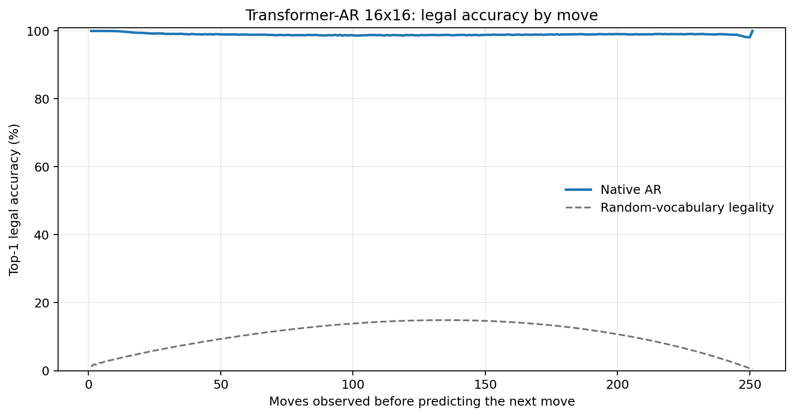
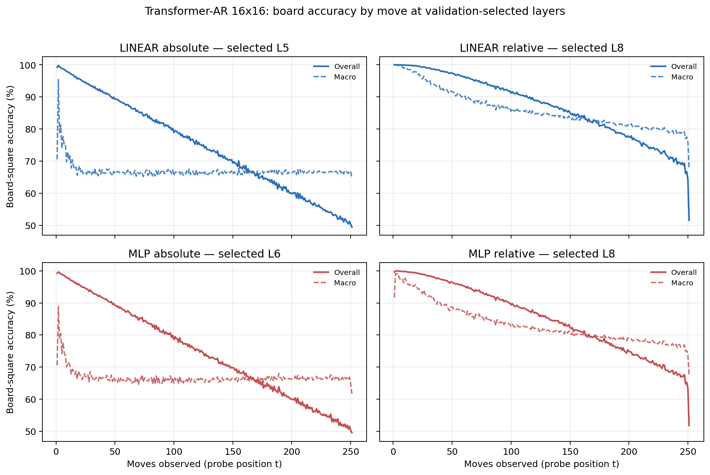

# Proposal evaluation: Transformer-AR 16x16

- **Suite:** `thesis_eval_suite_v1` over `unified_eval_v4`
- **Run:** `selected`
- **Checkpoint:** `final.pt` (`e945a9010c1efb9ab251f997c9502a223fac094630418b005dab44368747c302`)
- **Training budget:** `20,000,000` games / `200` shards
- **Next-move readout:** native pretrained AR head
- **Exact continuation:** intentionally excluded because corpus continuations are stochastic legal choices

## 1. Functional legality

| Readout | Top-1 legal | Top-3 legal fraction | Top-5 legal fraction | Legal probability mass |
|---|---:|---:|---:|---:|
| Native AR | 98.99% | 98.12% | 97.02% | 88.91% |

### Statistical context

| Readout | Normalized legal lift | 95% CI for top-1 legal |
|---|---:|---:|
| Native AR | 98.88% | 98.98%–99.00% |

### Legal accuracy by move

### Legality by normalized game phase

| Readout | Phase | Tokens | Mean legal moves | Top-1 legal | Legal mass |
|---|---:|---:|---:|---:|---:|
| Native AR | 0.00–0.25 | 3,148,134 | 16.93 | 99.31% | 91.89% |
| Native AR | 0.25–0.50 | 3,097,644 | 33.66 | 98.77% | 86.59% |
| Native AR | 0.50–0.75 | 3,147,606 | 35.65 | 98.88% | 87.59% |
| Native AR | 0.75–1.00 | 3,147,581 | 18.01 | 99.00% | 89.54% |

## 2. Board-state representations

Layer selection uses only the selection split. Headline test values are macro-balanced accuracy, so changing empty-square prevalence across board sizes cannot dominate the comparison.

**Macro accuracy** is the unweighted mean of the three per-class recalls. Absolute labels use empty/black/white and relative labels use empty/mine/opponent. Each class therefore contributes one third even when empty squares are much more common. Overall accuracy instead weights every square equally and can be dominated by the empty class.

| Probe | Labels | Best layer | Normalized depth | Test macro | Overall | Occupied | Empty |
|---|---|---:|---:|---:|---:|---:|---:|
| LINEAR | absolute | L5 | 0.625 | 66.70% | 74.70% | 50.10% | 99.91% |
| LINEAR | relative | L8 | 1.000 | 83.00% | 87.12% | 74.57% | 99.97% |
| MLP | absolute | L6 | 0.750 | 66.60% | 74.60% | 49.97% | 99.84% |
| MLP | relative | L8 | 1.000 | 80.57% | 85.23% | 71.08% | 99.74% |

### Probe accuracy by layer

These are the untouched test-split tables in the same format as the 8x8 unified JEPA notebook. `Selected` marks the layer chosen using the separate selection split, never the test results.

#### LINEAR board-state probe

| Layer | Absolute accuracy | Absolute macro | Relative accuracy | Relative macro | Selected |
|---:|---:|---:|---:|---:|:---|
| L0 | 64.69% | 56.62% | 65.56% | 57.79% |  |
| L1 | 66.92% | 58.89% | 68.06% | 60.35% |  |
| L2 | 72.76% | 64.68% | 74.49% | 66.93% |  |
| L3 | 74.42% | 66.40% | 76.47% | 69.03% |  |
| L4 | 74.60% | 66.58% | 81.81% | 76.03% |  |
| L5 | 74.70% | 66.70% | 85.99% | 81.54% | absolute |
| L6 | 74.67% | 66.65% | 86.81% | 82.60% |  |
| L7 | 74.57% | 66.52% | 87.06% | 82.92% |  |
| L8 | 74.56% | 66.50% | 87.12% | 83.00% | relative |

#### MLP board-state probe

| Layer | Absolute accuracy | Absolute macro | Relative accuracy | Relative macro | Selected |
|---:|---:|---:|---:|---:|:---|
| L0 | 65.54% | 57.54% | 65.81% | 57.86% |  |
| L1 | 66.80% | 58.80% | 67.22% | 59.26% |  |
| L2 | 71.18% | 63.11% | 72.40% | 64.64% |  |
| L3 | 73.50% | 65.43% | 74.89% | 67.16% |  |
| L4 | 74.03% | 65.98% | 79.07% | 72.52% |  |
| L5 | 74.40% | 66.40% | 83.93% | 78.90% |  |
| L6 | 74.60% | 66.60% | 84.98% | 80.26% | absolute |
| L7 | 74.51% | 66.46% | 85.20% | 80.53% |  |
| L8 | 74.54% | 66.50% | 85.23% | 80.57% | relative |

### Board accuracy by move at each selected layer

### Selected board probes by game phase

| Probe | Labels | Phase | Macro accuracy | Occupied | Empty |
|---|---|---:|---:|---:|---:|
| LINEAR | absolute | 1/4 | 74.43% | 62.62% | 100.00% |
| LINEAR | absolute | 2/4 | 67.53% | 51.44% | 100.00% |
| LINEAR | absolute | 11/4 | 66.47% | 49.84% | 99.74% |
| LINEAR | absolute | 12/4 | 66.62% | 50.06% | 99.72% |
| LINEAR | absolute | 13/4 | 66.63% | 50.10% | 99.68% |
| LINEAR | absolute | 14/4 | 66.64% | 50.09% | 99.72% |
| LINEAR | absolute | 15/4 | 66.68% | 50.16% | 99.72% |
| LINEAR | absolute | 16/4 | 66.60% | 50.04% | 99.68% |
| LINEAR | absolute | 3/4 | 67.04% | 50.60% | 100.00% |
| LINEAR | absolute | 4/4 | 66.74% | 50.11% | 99.99% |
| LINEAR | absolute | 5/4 | 66.45% | 49.69% | 99.96% |
| LINEAR | absolute | 6/4 | 66.54% | 49.85% | 99.93% |
| LINEAR | absolute | 7/4 | 66.51% | 49.82% | 99.89% |
| LINEAR | absolute | 8/4 | 66.62% | 50.01% | 99.85% |
| LINEAR | absolute | 9/4 | 66.52% | 49.87% | 99.80% |
| LINEAR | absolute | 10/4 | 66.50% | 49.86% | 99.78% |
| LINEAR | relative | 1/4 | 99.08% | 98.63% | 100.00% |
| LINEAR | relative | 2/4 | 96.25% | 94.45% | 99.99% |
| LINEAR | relative | 11/4 | 82.89% | 74.43% | 99.93% |
| LINEAR | relative | 12/4 | 82.08% | 73.21% | 99.90% |
| LINEAR | relative | 13/4 | 81.29% | 72.03% | 99.88% |
| LINEAR | relative | 14/4 | 80.51% | 70.87% | 99.88% |
| LINEAR | relative | 15/4 | 79.83% | 69.86% | 99.87% |
| LINEAR | relative | 16/4 | 77.70% | 66.67% | 99.83% |
| LINEAR | relative | 3/4 | 92.85% | 89.43% | 100.00% |
| LINEAR | relative | 4/4 | 90.64% | 86.07% | 100.00% |
| LINEAR | relative | 5/4 | 88.71% | 83.17% | 99.99% |
| LINEAR | relative | 6/4 | 87.15% | 80.81% | 99.99% |
| LINEAR | relative | 7/4 | 86.02% | 79.12% | 99.97% |
| LINEAR | relative | 8/4 | 85.13% | 77.78% | 99.97% |
| LINEAR | relative | 9/4 | 84.36% | 76.62% | 99.95% |
| LINEAR | relative | 10/4 | 83.54% | 75.39% | 99.94% |
| MLP | absolute | 1/4 | 73.23% | 60.95% | 100.00% |
| MLP | absolute | 2/4 | 67.85% | 51.86% | 100.00% |
| MLP | absolute | 11/4 | 66.40% | 49.81% | 99.57% |
| MLP | absolute | 12/4 | 66.50% | 50.01% | 99.47% |
| MLP | absolute | 13/4 | 66.63% | 50.26% | 99.37% |
| MLP | absolute | 14/4 | 66.51% | 50.10% | 99.33% |
| MLP | absolute | 15/4 | 66.71% | 50.46% | 99.20% |
| MLP | absolute | 16/4 | 66.46% | 50.33% | 98.71% |
| MLP | absolute | 3/4 | 66.92% | 50.38% | 99.99% |
| MLP | absolute | 4/4 | 66.33% | 49.51% | 99.97% |
| MLP | absolute | 5/4 | 66.19% | 49.32% | 99.93% |
| MLP | absolute | 6/4 | 66.03% | 49.08% | 99.90% |
| MLP | absolute | 7/4 | 66.07% | 49.18% | 99.84% |
| MLP | absolute | 8/4 | 66.15% | 49.32% | 99.79% |
| MLP | absolute | 9/4 | 66.09% | 49.27% | 99.73% |
| MLP | absolute | 10/4 | 66.29% | 49.62% | 99.64% |
| MLP | relative | 1/4 | 96.60% | 94.96% | 99.99% |
| MLP | relative | 2/4 | 93.59% | 90.62% | 99.99% |
| MLP | relative | 11/4 | 79.88% | 70.24% | 99.33% |
| MLP | relative | 12/4 | 79.30% | 69.45% | 99.11% |
| MLP | relative | 13/4 | 78.70% | 68.63% | 98.93% |
| MLP | relative | 14/4 | 78.15% | 67.92% | 98.73% |
| MLP | relative | 15/4 | 77.42% | 67.09% | 98.18% |
| MLP | relative | 16/4 | 75.63% | 64.98% | 97.00% |
| MLP | relative | 3/4 | 89.98% | 85.28% | 99.97% |
| MLP | relative | 4/4 | 87.73% | 81.85% | 99.94% |
| MLP | relative | 5/4 | 85.87% | 79.05% | 99.92% |
| MLP | relative | 6/4 | 84.34% | 76.73% | 99.85% |
| MLP | relative | 7/4 | 82.99% | 74.73% | 99.78% |
| MLP | relative | 8/4 | 82.14% | 73.49% | 99.70% |
| MLP | relative | 9/4 | 81.34% | 72.31% | 99.59% |
| MLP | relative | 10/4 | 80.61% | 71.23% | 99.52% |

## 3. Efficiency and reproducibility

- Encoder parameters: `25,607,680`
- Total parameters: `25,607,680`
- Checkpoint bytes: `309,433,897`
- Evaluation GPU: `NVIDIA L4`
- Training hardware: `unreported`
- Training precision: `bf16`
- Python / PyTorch / CUDA: `3.13.15` / `2.11.0+cu128` / `12.8`
- Median training chunk: `71.74 s`
- Estimated training loop: `3.99 h`
- Median games/s: `1393.92`
- Median supervision units/s: `349619.91`
- Timing scope: dt_seconds excludes normal checkpoint/Drive-sync time; validation is included only in observed_train_plus_validation_loop_hours

## 4. Interpretation boundary

- Board probes establish decodability, not by themselves causal use.
- Legal behavior measures rule compatibility, not strategic playing strength.
- Bootstrap legality intervals quantify test-game sampling only; they do not replace independent pretraining seeds.
- Board-probe point estimates use one deterministic probe seed; the random-encoder control is not a substitute for model-seed replication.
- Cross-board results compare separately trained scaling conditions, not zero-shot transfer.

## Artifact index

- Unified JSON: `/content/seed_evaluation_views/transformer_ar_b16_seed001/runs/selected/thesis_eval/final/results__unified_eval_v4.json`
- Unified summary: `/content/seed_evaluation_views/transformer_ar_b16_seed001/runs/selected/thesis_eval/final/summary__unified_eval_v4.md`
- Position manifest: `/content/seed_evaluation_views/transformer_ar_b16_seed001/runs/selected/thesis_eval/final/position_manifest__unified_eval_v4.json`
- Legal-by-move figure: `/content/seed_evaluation_views/transformer_ar_b16_seed001/runs/selected/thesis_eval/final/legal_accuracy_by_move__thesis_eval_suite_v1.png`
- Board-by-move figure: `/content/seed_evaluation_views/transformer_ar_b16_seed001/runs/selected/thesis_eval/final/board_accuracy_by_move__thesis_eval_suite_v1.png`
