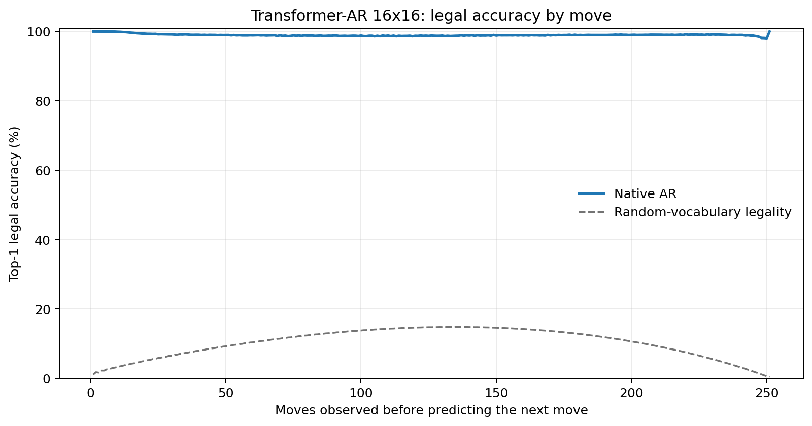
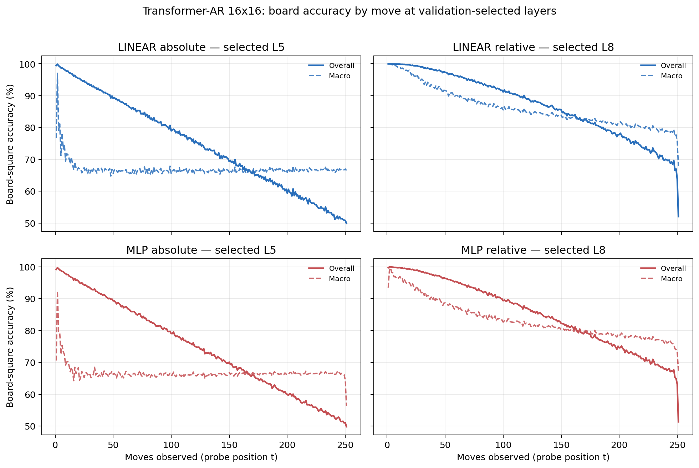

# Proposal evaluation: Transformer-AR 16x16

- **Suite:** `thesis_eval_suite_v1` over `unified_eval_v4`
- **Run:** `selected`
- **Checkpoint:** `final.pt` (`2839b9b76efea48101943b3f7a8984b550ecdab9ed2097abde38421f6b46bd88`)
- **Training budget:** `20,000,000` games / `200` shards
- **Next-move readout:** native pretrained AR head
- **Exact continuation:** intentionally excluded because corpus continuations are stochastic legal choices

## 1. Functional legality

| Readout | Top-1 legal | Top-3 legal fraction | Top-5 legal fraction | Legal probability mass |
|---|---:|---:|---:|---:|
| Native AR | 99.00% | 98.14% | 97.04% | 88.94% |

### Statistical context

| Readout | Normalized legal lift | 95% CI for top-1 legal |
|---|---:|---:|
| Native AR | 98.89% | 99.00%–99.01% |

### Legal accuracy by move

### Legality by normalized game phase

| Readout | Phase | Tokens | Mean legal moves | Top-1 legal | Legal mass |
|---|---:|---:|---:|---:|---:|
| Native AR | 0.00–0.25 | 3,148,134 | 16.93 | 99.30% | 91.84% |
| Native AR | 0.25–0.50 | 3,097,644 | 33.66 | 98.79% | 86.75% |
| Native AR | 0.50–0.75 | 3,147,606 | 35.65 | 98.91% | 87.67% |
| Native AR | 0.75–1.00 | 3,147,581 | 18.01 | 99.01% | 89.45% |

## 2. Board-state representations

Layer selection uses only the selection split. Headline test values are macro-balanced accuracy, so changing empty-square prevalence across board sizes cannot dominate the comparison.

**Macro accuracy** is the unweighted mean of the three per-class recalls. Absolute labels use empty/black/white and relative labels use empty/mine/opponent. Each class therefore contributes one third even when empty squares are much more common. Overall accuracy instead weights every square equally and can be dominated by the empty class.

| Probe | Labels | Best layer | Normalized depth | Test macro | Overall | Occupied | Empty |
|---|---|---:|---:|---:|---:|---:|---:|
| LINEAR | absolute | L5 | 0.625 | 66.75% | 74.73% | 50.17% | 99.91% |
| LINEAR | relative | L8 | 1.000 | 83.01% | 87.12% | 74.58% | 99.97% |
| MLP | absolute | L5 | 0.625 | 66.67% | 74.62% | 50.17% | 99.67% |
| MLP | relative | L8 | 1.000 | 80.57% | 85.22% | 71.08% | 99.72% |

### Probe accuracy by layer

These are the untouched test-split tables in the same format as the 8x8 unified JEPA notebook. `Selected` marks the layer chosen using the separate selection split, never the test results.

#### LINEAR board-state probe

| Layer | Absolute accuracy | Absolute macro | Relative accuracy | Relative macro | Selected |
|---:|---:|---:|---:|---:|:---|
| L0 | 64.65% | 56.59% | 65.54% | 57.77% |  |
| L1 | 66.83% | 58.77% | 67.91% | 60.17% |  |
| L2 | 72.84% | 64.78% | 74.46% | 66.87% |  |
| L3 | 74.47% | 66.45% | 76.08% | 68.53% |  |
| L4 | 74.69% | 66.69% | 82.16% | 76.49% |  |
| L5 | 74.73% | 66.75% | 86.02% | 81.57% | absolute |
| L6 | 74.70% | 66.69% | 86.82% | 82.61% |  |
| L7 | 74.60% | 66.56% | 87.07% | 82.93% |  |
| L8 | 74.58% | 66.53% | 87.12% | 83.01% | relative |

#### MLP board-state probe

| Layer | Absolute accuracy | Absolute macro | Relative accuracy | Relative macro | Selected |
|---:|---:|---:|---:|---:|:---|
| L0 | 65.56% | 57.55% | 65.82% | 57.87% |  |
| L1 | 66.77% | 58.78% | 67.19% | 59.25% |  |
| L2 | 71.42% | 63.36% | 72.52% | 64.74% |  |
| L3 | 73.43% | 65.38% | 74.55% | 66.73% |  |
| L4 | 74.12% | 66.07% | 79.41% | 72.96% |  |
| L5 | 74.62% | 66.67% | 84.02% | 79.03% | absolute |
| L6 | 74.47% | 66.43% | 84.99% | 80.27% |  |
| L7 | 74.52% | 66.48% | 85.20% | 80.54% |  |
| L8 | 74.24% | 66.10% | 85.22% | 80.57% | relative |

### Board accuracy by move at each selected layer

### Selected board probes by game phase

| Probe | Labels | Phase | Macro accuracy | Occupied | Empty |
|---|---|---:|---:|---:|---:|
| LINEAR | absolute | 1/4 | 74.49% | 62.76% | 100.00% |
| LINEAR | absolute | 2/4 | 67.44% | 51.30% | 100.00% |
| LINEAR | absolute | 11/4 | 66.48% | 49.86% | 99.72% |
| LINEAR | absolute | 12/4 | 66.68% | 50.16% | 99.71% |
| LINEAR | absolute | 13/4 | 66.74% | 50.28% | 99.64% |
| LINEAR | absolute | 14/4 | 66.76% | 50.30% | 99.69% |
| LINEAR | absolute | 15/4 | 66.82% | 50.36% | 99.72% |
| LINEAR | absolute | 16/4 | 66.70% | 50.15% | 99.77% |
| LINEAR | absolute | 3/4 | 67.08% | 50.65% | 100.00% |
| LINEAR | absolute | 4/4 | 66.56% | 49.84% | 99.99% |
| LINEAR | absolute | 5/4 | 66.46% | 49.70% | 99.97% |
| LINEAR | absolute | 6/4 | 66.52% | 49.81% | 99.93% |
| LINEAR | absolute | 7/4 | 66.59% | 49.94% | 99.89% |
| LINEAR | absolute | 8/4 | 66.66% | 50.07% | 99.85% |
| LINEAR | absolute | 9/4 | 66.41% | 49.72% | 99.80% |
| LINEAR | absolute | 10/4 | 66.51% | 49.90% | 99.75% |
| LINEAR | relative | 1/4 | 99.08% | 98.63% | 100.00% |
| LINEAR | relative | 2/4 | 96.32% | 94.58% | 100.00% |
| LINEAR | relative | 11/4 | 82.82% | 74.32% | 99.91% |
| LINEAR | relative | 12/4 | 82.12% | 73.27% | 99.91% |
| LINEAR | relative | 13/4 | 81.35% | 72.11% | 99.91% |
| LINEAR | relative | 14/4 | 80.63% | 71.07% | 99.85% |
| LINEAR | relative | 15/4 | 79.72% | 69.68% | 99.88% |
| LINEAR | relative | 16/4 | 77.69% | 66.63% | 99.86% |
| LINEAR | relative | 3/4 | 92.97% | 89.60% | 100.00% |
| LINEAR | relative | 4/4 | 90.54% | 85.93% | 100.00% |
| LINEAR | relative | 5/4 | 88.71% | 83.17% | 99.99% |
| LINEAR | relative | 6/4 | 87.21% | 80.89% | 99.99% |
| LINEAR | relative | 7/4 | 86.02% | 79.11% | 99.98% |
| LINEAR | relative | 8/4 | 85.10% | 77.72% | 99.97% |
| LINEAR | relative | 9/4 | 84.35% | 76.59% | 99.96% |
| LINEAR | relative | 10/4 | 83.61% | 75.48% | 99.95% |
| MLP | absolute | 1/4 | 72.59% | 59.87% | 100.00% |
| MLP | absolute | 2/4 | 67.08% | 50.74% | 99.99% |
| MLP | absolute | 11/4 | 66.52% | 50.13% | 99.29% |
| MLP | absolute | 12/4 | 66.48% | 50.11% | 99.20% |
| MLP | absolute | 13/4 | 66.53% | 50.25% | 99.08% |
| MLP | absolute | 14/4 | 66.54% | 50.32% | 98.98% |
| MLP | absolute | 15/4 | 66.64% | 50.59% | 98.72% |
| MLP | absolute | 16/4 | 66.45% | 50.62% | 98.11% |
| MLP | absolute | 3/4 | 66.90% | 50.37% | 99.93% |
| MLP | absolute | 4/4 | 66.58% | 49.95% | 99.85% |
| MLP | absolute | 5/4 | 66.46% | 49.81% | 99.76% |
| MLP | absolute | 6/4 | 66.12% | 49.34% | 99.66% |
| MLP | absolute | 7/4 | 66.27% | 49.60% | 99.59% |
| MLP | absolute | 8/4 | 66.19% | 49.51% | 99.52% |
| MLP | absolute | 9/4 | 66.21% | 49.58% | 99.44% |
| MLP | absolute | 10/4 | 66.37% | 49.87% | 99.36% |
| MLP | relative | 1/4 | 96.48% | 94.84% | 100.00% |
| MLP | relative | 2/4 | 93.48% | 90.45% | 99.99% |
| MLP | relative | 11/4 | 79.84% | 70.18% | 99.27% |
| MLP | relative | 12/4 | 79.19% | 69.30% | 99.07% |
| MLP | relative | 13/4 | 78.70% | 68.66% | 98.86% |
| MLP | relative | 14/4 | 78.08% | 67.89% | 98.58% |
| MLP | relative | 15/4 | 77.39% | 67.12% | 98.03% |
| MLP | relative | 16/4 | 75.31% | 64.93% | 96.14% |
| MLP | relative | 3/4 | 90.12% | 85.50% | 99.98% |
| MLP | relative | 4/4 | 87.70% | 81.81% | 99.94% |
| MLP | relative | 5/4 | 85.82% | 79.00% | 99.90% |
| MLP | relative | 6/4 | 84.35% | 76.76% | 99.86% |
| MLP | relative | 7/4 | 83.09% | 74.86% | 99.80% |
| MLP | relative | 8/4 | 82.22% | 73.61% | 99.68% |
| MLP | relative | 9/4 | 81.35% | 72.32% | 99.58% |
| MLP | relative | 10/4 | 80.64% | 71.31% | 99.46% |

## 3. Efficiency and reproducibility

- Encoder parameters: `25,607,680`
- Total parameters: `25,607,680`
- Checkpoint bytes: `309,433,897`
- Evaluation GPU: `NVIDIA L4`
- Training hardware: `unreported`
- Training precision: `bf16`
- Python / PyTorch / CUDA: `3.13.15` / `2.11.0+cu128` / `12.8`
- Median training chunk: `71.75 s`
- Estimated training loop: `3.99 h`
- Median games/s: `1393.76`
- Median supervision units/s: `349594.34`
- Timing scope: dt_seconds excludes normal checkpoint/Drive-sync time; validation is included only in observed_train_plus_validation_loop_hours

## 4. Interpretation boundary

- Board probes establish decodability, not by themselves causal use.
- Legal behavior measures rule compatibility, not strategic playing strength.
- Bootstrap legality intervals quantify test-game sampling only; they do not replace independent pretraining seeds.
- Board-probe point estimates use one deterministic probe seed; the random-encoder control is not a substitute for model-seed replication.
- Cross-board results compare separately trained scaling conditions, not zero-shot transfer.

## Artifact index

- Unified JSON: `/content/seed_evaluation_views/transformer_ar_b16_seed002/runs/selected/thesis_eval/final/results__unified_eval_v4.json`
- Unified summary: `/content/seed_evaluation_views/transformer_ar_b16_seed002/runs/selected/thesis_eval/final/summary__unified_eval_v4.md`
- Position manifest: `/content/seed_evaluation_views/transformer_ar_b16_seed002/runs/selected/thesis_eval/final/position_manifest__unified_eval_v4.json`
- Legal-by-move figure: `/content/seed_evaluation_views/transformer_ar_b16_seed002/runs/selected/thesis_eval/final/legal_accuracy_by_move__thesis_eval_suite_v1.png`
- Board-by-move figure: `/content/seed_evaluation_views/transformer_ar_b16_seed002/runs/selected/thesis_eval/final/board_accuracy_by_move__thesis_eval_suite_v1.png`
