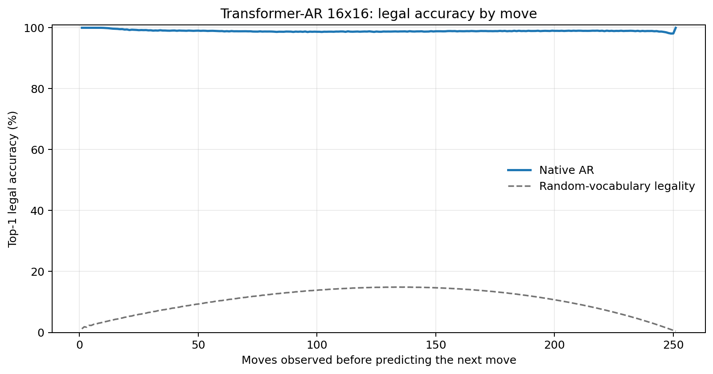
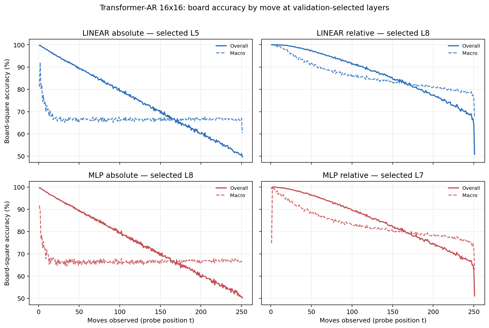

# Proposal evaluation: Transformer-AR 16x16

- **Suite:** `thesis_eval_suite_v1` over `unified_eval_v4`
- **Run:** `selected`
- **Checkpoint:** `final.pt` (`8d632f09d64539ce21780222f8d84a7bb3dab0d94d406c31baae492765766d99`)
- **Training budget:** `20,000,000` games / `200` shards
- **Next-move readout:** native pretrained AR head
- **Exact continuation:** intentionally excluded because corpus continuations are stochastic legal choices

## 1. Functional legality

| Readout | Top-1 legal | Top-3 legal fraction | Top-5 legal fraction | Legal probability mass |
|---|---:|---:|---:|---:|
| Native AR | 98.96% | 98.10% | 97.00% | 88.74% |

### Statistical context

| Readout | Normalized legal lift | 95% CI for top-1 legal |
|---|---:|---:|
| Native AR | 98.84% | 98.96%–98.97% |

### Legal accuracy by move

### Legality by normalized game phase

| Readout | Phase | Tokens | Mean legal moves | Top-1 legal | Legal mass |
|---|---:|---:|---:|---:|---:|
| Native AR | 0.00–0.25 | 3,148,134 | 16.93 | 99.31% | 91.85% |
| Native AR | 0.25–0.50 | 3,097,644 | 33.66 | 98.75% | 86.47% |
| Native AR | 0.50–0.75 | 3,147,606 | 35.65 | 98.86% | 87.36% |
| Native AR | 0.75–1.00 | 3,147,581 | 18.01 | 98.93% | 89.25% |

## 2. Board-state representations

Layer selection uses only the selection split. Headline test values are macro-balanced accuracy, so changing empty-square prevalence across board sizes cannot dominate the comparison.

**Macro accuracy** is the unweighted mean of the three per-class recalls. Absolute labels use empty/black/white and relative labels use empty/mine/opponent. Each class therefore contributes one third even when empty squares are much more common. Overall accuracy instead weights every square equally and can be dominated by the empty class.

| Probe | Labels | Best layer | Normalized depth | Test macro | Overall | Occupied | Empty |
|---|---|---:|---:|---:|---:|---:|---:|
| LINEAR | absolute | L5 | 0.625 | 66.76% | 74.75% | 50.18% | 99.93% |
| LINEAR | relative | L8 | 1.000 | 82.88% | 87.02% | 74.39% | 99.97% |
| MLP | absolute | L8 | 1.000 | 66.86% | 74.81% | 50.33% | 99.91% |
| MLP | relative | L7 | 0.875 | 80.47% | 85.14% | 70.97% | 99.67% |

### Probe accuracy by layer

These are the untouched test-split tables in the same format as the 8x8 unified JEPA notebook. `Selected` marks the layer chosen using the separate selection split, never the test results.

#### LINEAR board-state probe

| Layer | Absolute accuracy | Absolute macro | Relative accuracy | Relative macro | Selected |
|---:|---:|---:|---:|---:|:---|
| L0 | 64.62% | 56.61% | 65.53% | 57.81% |  |
| L1 | 66.67% | 58.69% | 67.91% | 60.30% |  |
| L2 | 72.69% | 64.63% | 74.15% | 66.51% |  |
| L3 | 74.46% | 66.45% | 76.60% | 69.22% |  |
| L4 | 74.65% | 66.65% | 80.46% | 74.25% |  |
| L5 | 74.75% | 66.76% | 85.50% | 80.88% | absolute |
| L6 | 74.72% | 66.71% | 86.73% | 82.48% |  |
| L7 | 74.62% | 66.58% | 87.01% | 82.85% |  |
| L8 | 74.60% | 66.55% | 87.02% | 82.88% | relative |

#### MLP board-state probe

| Layer | Absolute accuracy | Absolute macro | Relative accuracy | Relative macro | Selected |
|---:|---:|---:|---:|---:|:---|
| L0 | 65.52% | 57.50% | 65.82% | 57.87% |  |
| L1 | 66.69% | 58.69% | 67.19% | 59.30% |  |
| L2 | 71.29% | 63.25% | 72.32% | 64.50% |  |
| L3 | 73.48% | 65.43% | 74.91% | 67.20% |  |
| L4 | 74.09% | 66.04% | 77.94% | 70.98% |  |
| L5 | 74.51% | 66.53% | 83.33% | 78.08% |  |
| L6 | 74.71% | 66.74% | 84.93% | 80.19% |  |
| L7 | 74.57% | 66.55% | 85.14% | 80.47% | relative |
| L8 | 74.81% | 66.86% | 85.12% | 80.42% | absolute |

### Board accuracy by move at each selected layer

### Selected board probes by game phase

| Probe | Labels | Phase | Macro accuracy | Occupied | Empty |
|---|---|---:|---:|---:|---:|
| LINEAR | absolute | 1/4 | 75.03% | 63.55% | 100.00% |
| LINEAR | absolute | 2/4 | 67.87% | 51.94% | 100.00% |
| LINEAR | absolute | 11/4 | 66.45% | 49.77% | 99.81% |
| LINEAR | absolute | 12/4 | 66.54% | 49.94% | 99.74% |
| LINEAR | absolute | 13/4 | 66.68% | 50.19% | 99.65% |
| LINEAR | absolute | 14/4 | 66.62% | 50.13% | 99.60% |
| LINEAR | absolute | 15/4 | 66.87% | 50.49% | 99.60% |
| LINEAR | absolute | 16/4 | 66.44% | 50.11% | 99.07% |
| LINEAR | absolute | 3/4 | 67.14% | 50.74% | 100.00% |
| LINEAR | absolute | 4/4 | 66.86% | 50.29% | 100.00% |
| LINEAR | absolute | 5/4 | 66.69% | 50.04% | 99.99% |
| LINEAR | absolute | 6/4 | 66.53% | 49.81% | 99.98% |
| LINEAR | absolute | 7/4 | 66.60% | 49.93% | 99.95% |
| LINEAR | absolute | 8/4 | 66.63% | 49.98% | 99.93% |
| LINEAR | absolute | 9/4 | 66.55% | 49.87% | 99.89% |
| LINEAR | absolute | 10/4 | 66.58% | 49.94% | 99.86% |
| LINEAR | relative | 1/4 | 99.12% | 98.69% | 100.00% |
| LINEAR | relative | 2/4 | 96.32% | 94.56% | 100.00% |
| LINEAR | relative | 11/4 | 82.80% | 74.30% | 99.91% |
| LINEAR | relative | 12/4 | 81.87% | 72.89% | 99.91% |
| LINEAR | relative | 13/4 | 81.18% | 71.86% | 99.88% |
| LINEAR | relative | 14/4 | 80.45% | 70.78% | 99.86% |
| LINEAR | relative | 15/4 | 79.53% | 69.42% | 99.84% |
| LINEAR | relative | 16/4 | 77.51% | 66.38% | 99.83% |
| LINEAR | relative | 3/4 | 92.99% | 89.64% | 100.00% |
| LINEAR | relative | 4/4 | 90.57% | 85.97% | 100.00% |
| LINEAR | relative | 5/4 | 88.63% | 83.06% | 99.99% |
| LINEAR | relative | 6/4 | 87.26% | 80.97% | 99.99% |
| LINEAR | relative | 7/4 | 85.98% | 79.04% | 99.98% |
| LINEAR | relative | 8/4 | 84.98% | 77.55% | 99.96% |
| LINEAR | relative | 9/4 | 84.28% | 76.49% | 99.96% |
| LINEAR | relative | 10/4 | 83.37% | 75.14% | 99.93% |
| MLP | absolute | 1/4 | 72.41% | 59.54% | 100.00% |
| MLP | absolute | 2/4 | 67.12% | 50.76% | 100.00% |
| MLP | absolute | 11/4 | 66.58% | 50.01% | 99.73% |
| MLP | absolute | 12/4 | 66.81% | 50.38% | 99.67% |
| MLP | absolute | 13/4 | 66.80% | 50.38% | 99.63% |
| MLP | absolute | 14/4 | 66.98% | 50.65% | 99.62% |
| MLP | absolute | 15/4 | 67.03% | 50.78% | 99.54% |
| MLP | absolute | 16/4 | 66.99% | 50.74% | 99.48% |
| MLP | absolute | 3/4 | 66.86% | 50.28% | 99.99% |
| MLP | absolute | 4/4 | 66.49% | 49.74% | 99.98% |
| MLP | absolute | 5/4 | 66.62% | 49.94% | 99.97% |
| MLP | absolute | 6/4 | 66.56% | 49.86% | 99.95% |
| MLP | absolute | 7/4 | 66.44% | 49.68% | 99.92% |
| MLP | absolute | 8/4 | 66.37% | 49.61% | 99.87% |
| MLP | absolute | 9/4 | 66.52% | 49.85% | 99.83% |
| MLP | absolute | 10/4 | 66.68% | 50.12% | 99.80% |
| MLP | relative | 1/4 | 96.70% | 95.19% | 100.00% |
| MLP | relative | 2/4 | 93.54% | 90.54% | 99.98% |
| MLP | relative | 11/4 | 79.84% | 70.25% | 99.19% |
| MLP | relative | 12/4 | 79.08% | 69.20% | 98.95% |
| MLP | relative | 13/4 | 78.54% | 68.53% | 98.67% |
| MLP | relative | 14/4 | 77.95% | 67.80% | 98.39% |
| MLP | relative | 15/4 | 77.07% | 66.94% | 97.47% |
| MLP | relative | 16/4 | 74.72% | 64.64% | 94.97% |
| MLP | relative | 3/4 | 90.29% | 85.76% | 99.96% |
| MLP | relative | 4/4 | 87.81% | 81.97% | 99.93% |
| MLP | relative | 5/4 | 85.79% | 78.95% | 99.89% |
| MLP | relative | 6/4 | 84.39% | 76.83% | 99.82% |
| MLP | relative | 7/4 | 83.02% | 74.80% | 99.74% |
| MLP | relative | 8/4 | 82.00% | 73.31% | 99.65% |
| MLP | relative | 9/4 | 81.28% | 72.26% | 99.52% |
| MLP | relative | 10/4 | 80.41% | 71.03% | 99.36% |

## 3. Efficiency and reproducibility

- Encoder parameters: `25,607,680`
- Total parameters: `25,607,680`
- Checkpoint bytes: `309,433,897`
- Evaluation GPU: `NVIDIA L4`
- Training hardware: `unreported`
- Training precision: `bf16`
- Python / PyTorch / CUDA: `3.13.15` / `2.11.0+cu128` / `12.8`
- Median training chunk: `71.66 s`
- Estimated training loop: `3.98 h`
- Median games/s: `1395.38`
- Median supervision units/s: `349994.88`
- Timing scope: dt_seconds excludes normal checkpoint/Drive-sync time; validation is included only in observed_train_plus_validation_loop_hours

## 4. Interpretation boundary

- Board probes establish decodability, not by themselves causal use.
- Legal behavior measures rule compatibility, not strategic playing strength.
- Bootstrap legality intervals quantify test-game sampling only; they do not replace independent pretraining seeds.
- Board-probe point estimates use one deterministic probe seed; the random-encoder control is not a substitute for model-seed replication.
- Cross-board results compare separately trained scaling conditions, not zero-shot transfer.

## Artifact index

- Unified JSON: `/content/seed_evaluation_views/transformer_ar_b16_seed003/runs/selected/thesis_eval/final/results__unified_eval_v4.json`
- Unified summary: `/content/seed_evaluation_views/transformer_ar_b16_seed003/runs/selected/thesis_eval/final/summary__unified_eval_v4.md`
- Position manifest: `/content/seed_evaluation_views/transformer_ar_b16_seed003/runs/selected/thesis_eval/final/position_manifest__unified_eval_v4.json`
- Legal-by-move figure: `/content/seed_evaluation_views/transformer_ar_b16_seed003/runs/selected/thesis_eval/final/legal_accuracy_by_move__thesis_eval_suite_v1.png`
- Board-by-move figure: `/content/seed_evaluation_views/transformer_ar_b16_seed003/runs/selected/thesis_eval/final/board_accuracy_by_move__thesis_eval_suite_v1.png`
