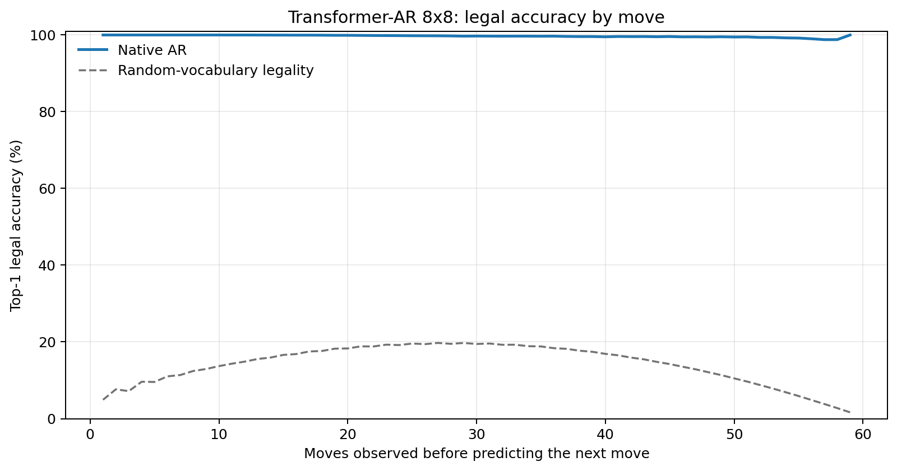
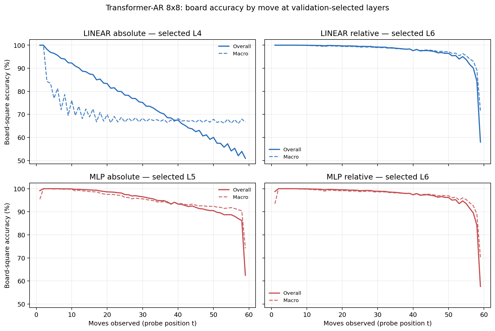

# Proposal evaluation: Transformer-AR 8x8

- **Suite:** `thesis_eval_suite_v1` over `unified_eval_v4`
- **Run:** `selected`
- **Checkpoint:** `final.pt` (`c38baa5b2c844b04ae3e53da49d3540136c531f1f0725f4659fca50224118770`)
- **Training budget:** `19,999,840` games / `200` shards
- **Next-move readout:** native pretrained AR head
- **Exact continuation:** intentionally excluded because corpus continuations are stochastic legal choices

## 1. Functional legality

| Readout | Top-1 legal | Top-3 legal fraction | Top-5 legal fraction | Legal probability mass |
|---|---:|---:|---:|---:|
| Native AR | 99.71% | 96.77% | 92.44% | 98.42% |

### Statistical context

| Readout | Normalized legal lift | 95% CI for top-1 legal |
|---|---:|---:|
| Native AR | 99.66% | 99.70%–99.72% |

### Legal accuracy by move

### Legality by normalized game phase

| Readout | Phase | Tokens | Mean legal moves | Top-1 legal | Legal mass |
|---|---:|---:|---:|---:|---:|
| Native AR | 0.00–0.25 | 749,909 | 7.22 | 99.99% | 99.96% |
| Native AR | 0.25–0.50 | 699,679 | 11.44 | 99.85% | 99.29% |
| Native AR | 0.50–0.75 | 749,593 | 10.84 | 99.63% | 97.73% |
| Native AR | 0.75–1.00 | 749,129 | 5.15 | 99.36% | 96.76% |

## 2. Board-state representations

Layer selection uses only the selection split. Headline test values are macro-balanced accuracy, so changing empty-square prevalence across board sizes cannot dominate the comparison.

**Macro accuracy** is the unweighted mean of the three per-class recalls. Absolute labels use empty/black/white and relative labels use empty/mine/opponent. Each class therefore contributes one third even when empty squares are much more common. Overall accuracy instead weights every square equally and can be dominated by the empty class.

| Probe | Labels | Best layer | Normalized depth | Test macro | Overall | Occupied | Empty |
|---|---|---:|---:|---:|---:|---:|---:|
| LINEAR | absolute | L4 | 0.500 | 68.94% | 75.62% | 53.45% | 100.00% |
| LINEAR | relative | L6 | 0.750 | 96.88% | 97.57% | 95.37% | 99.99% |
| MLP | absolute | L5 | 0.625 | 93.74% | 95.08% | 90.61% | 100.00% |
| MLP | relative | L6 | 0.750 | 96.55% | 97.33% | 94.92% | 99.98% |

### Probe accuracy by layer

These are the untouched test-split tables in the same format as the 8x8 unified JEPA notebook. `Selected` marks the layer chosen using the separate selection split, never the test results.

#### LINEAR board-state probe

| Layer | Absolute accuracy | Absolute macro | Relative accuracy | Relative macro | Selected |
|---:|---:|---:|---:|---:|:---|
| L0 | 62.72% | 55.81% | 64.77% | 58.16% |  |
| L1 | 75.05% | 68.33% | 87.23% | 83.70% |  |
| L2 | 75.58% | 68.90% | 92.23% | 90.03% |  |
| L3 | 75.58% | 68.89% | 94.26% | 92.63% |  |
| L4 | 75.62% | 68.94% | 95.98% | 94.85% | absolute |
| L5 | 75.62% | 68.94% | 97.13% | 96.32% |  |
| L6 | 75.45% | 68.73% | 97.57% | 96.88% | relative |
| L7 | 75.19% | 68.42% | 97.46% | 96.76% |  |
| L8 | 75.14% | 68.36% | 97.40% | 96.68% |  |

#### MLP board-state probe

| Layer | Absolute accuracy | Absolute macro | Relative accuracy | Relative macro | Selected |
|---:|---:|---:|---:|---:|:---|
| L0 | 65.12% | 58.79% | 65.27% | 58.64% |  |
| L1 | 83.99% | 79.79% | 86.53% | 82.87% |  |
| L2 | 89.46% | 86.58% | 92.01% | 89.72% |  |
| L3 | 91.35% | 88.99% | 94.05% | 92.37% |  |
| L4 | 93.41% | 91.61% | 95.85% | 94.67% |  |
| L5 | 95.08% | 93.74% | 96.99% | 96.12% | absolute |
| L6 | 93.36% | 91.56% | 97.33% | 96.55% | relative |
| L7 | 87.12% | 83.63% | 97.14% | 96.34% |  |
| L8 | 85.37% | 81.41% | 97.05% | 96.24% |  |

### Board accuracy by move at each selected layer

### Selected board probes by game phase

| Probe | Labels | Phase | Macro accuracy | Occupied | Empty |
|---|---|---:|---:|---:|---:|
| LINEAR | absolute | 1/4 | 94.84% | 93.70% | 100.00% |
| LINEAR | absolute | 2/4 | 80.01% | 71.87% | 100.00% |
| LINEAR | absolute | 11/4 | 67.82% | 51.76% | 100.00% |
| LINEAR | absolute | 12/4 | 67.67% | 51.50% | 100.00% |
| LINEAR | absolute | 13/4 | 67.58% | 51.44% | 100.00% |
| LINEAR | absolute | 14/4 | 67.68% | 51.50% | 100.00% |
| LINEAR | absolute | 15/4 | 67.46% | 51.19% | 100.00% |
| LINEAR | absolute | 16/4 | 67.41% | 51.13% | 99.96% |
| LINEAR | absolute | 3/4 | 75.24% | 64.08% | 100.00% |
| LINEAR | absolute | 4/4 | 72.63% | 59.05% | 100.00% |
| LINEAR | absolute | 5/4 | 71.24% | 57.19% | 100.00% |
| LINEAR | absolute | 6/4 | 69.31% | 54.09% | 100.00% |
| LINEAR | absolute | 7/4 | 68.34% | 52.94% | 100.00% |
| LINEAR | absolute | 8/4 | 68.62% | 52.98% | 100.00% |
| LINEAR | absolute | 9/4 | 68.45% | 52.69% | 100.00% |
| LINEAR | absolute | 10/4 | 68.12% | 52.21% | 100.00% |
| LINEAR | relative | 1/4 | 100.00% | 100.00% | 100.00% |
| LINEAR | relative | 2/4 | 99.99% | 99.99% | 100.00% |
| LINEAR | relative | 11/4 | 98.16% | 97.27% | 99.97% |
| LINEAR | relative | 12/4 | 97.92% | 96.91% | 99.99% |
| LINEAR | relative | 13/4 | 97.53% | 96.33% | 99.98% |
| LINEAR | relative | 14/4 | 97.02% | 95.57% | 99.99% |
| LINEAR | relative | 15/4 | 95.93% | 93.96% | 99.98% |
| LINEAR | relative | 16/4 | 86.89% | 80.39% | 100.00% |
| LINEAR | relative | 3/4 | 99.89% | 99.84% | 100.00% |
| LINEAR | relative | 4/4 | 99.69% | 99.55% | 100.00% |
| LINEAR | relative | 5/4 | 99.58% | 99.38% | 100.00% |
| LINEAR | relative | 6/4 | 99.47% | 99.23% | 99.98% |
| LINEAR | relative | 7/4 | 99.29% | 98.96% | 99.98% |
| LINEAR | relative | 8/4 | 99.16% | 98.76% | 99.98% |
| LINEAR | relative | 9/4 | 98.87% | 98.35% | 99.98% |
| LINEAR | relative | 10/4 | 98.57% | 97.90% | 99.99% |
| MLP | absolute | 1/4 | 98.53% | 97.03% | 100.00% |
| MLP | absolute | 2/4 | 99.92% | 99.89% | 100.00% |
| MLP | absolute | 11/4 | 93.77% | 90.65% | 100.00% |
| MLP | absolute | 12/4 | 93.30% | 89.95% | 100.00% |
| MLP | absolute | 13/4 | 92.75% | 89.13% | 99.99% |
| MLP | absolute | 14/4 | 92.33% | 88.50% | 100.00% |
| MLP | absolute | 15/4 | 91.78% | 87.67% | 100.00% |
| MLP | absolute | 16/4 | 86.78% | 80.21% | 99.92% |
| MLP | absolute | 3/4 | 99.62% | 99.43% | 100.00% |
| MLP | absolute | 4/4 | 99.13% | 98.70% | 100.00% |
| MLP | absolute | 5/4 | 98.58% | 97.87% | 100.00% |
| MLP | absolute | 6/4 | 97.59% | 96.39% | 100.00% |
| MLP | absolute | 7/4 | 96.86% | 95.31% | 100.00% |
| MLP | absolute | 8/4 | 95.91% | 93.87% | 100.00% |
| MLP | absolute | 9/4 | 95.24% | 92.86% | 100.00% |
| MLP | absolute | 10/4 | 94.38% | 91.58% | 100.00% |
| MLP | relative | 1/4 | 97.89% | 95.75% | 100.00% |
| MLP | relative | 2/4 | 99.99% | 99.98% | 100.00% |
| MLP | relative | 11/4 | 97.83% | 96.80% | 99.94% |
| MLP | relative | 12/4 | 97.64% | 96.52% | 99.93% |
| MLP | relative | 13/4 | 97.21% | 95.89% | 99.92% |
| MLP | relative | 14/4 | 96.79% | 95.25% | 99.94% |
| MLP | relative | 15/4 | 95.66% | 93.59% | 99.97% |
| MLP | relative | 16/4 | 86.46% | 80.04% | 99.80% |
| MLP | relative | 3/4 | 99.79% | 99.70% | 100.00% |
| MLP | relative | 4/4 | 99.49% | 99.26% | 100.00% |
| MLP | relative | 5/4 | 99.23% | 98.87% | 100.00% |
| MLP | relative | 6/4 | 99.09% | 98.68% | 99.98% |
| MLP | relative | 7/4 | 98.90% | 98.41% | 99.98% |
| MLP | relative | 8/4 | 98.82% | 98.29% | 99.95% |
| MLP | relative | 9/4 | 98.55% | 97.88% | 99.95% |
| MLP | relative | 10/4 | 98.20% | 97.39% | 99.94% |

## 3. Nanda-style causal intervention

- Readout: `native_ar`
- Selected intervention scale: `2`
- Interpretation scope: native model behavior

| Control | Target top-1 legal | Target legal mass | Top-N FP+FN |
|---|---:|---:|---:|
| Null | 91.30% | 89.59% | 2.254 |
| Magnitude-matched random | 90.80% | 89.51% | 2.288 |
| Relative-board direction | 98.50% | 95.61% | 0.480 |

For AR this edits the native prediction path. For JEPA it establishes causal steerability of the composed JEPA encoder plus its post-hoc frozen MLP readout; it is not evidence of a native JEPA action head.

## 4. Efficiency and reproducibility

- Encoder parameters: `25,312,768`
- Total parameters: `25,312,768`
- Checkpoint bytes: `303,990,249`
- Evaluation GPU: `NVIDIA L4`
- Training hardware: `unreported`
- Training precision: `bf16`
- Python / PyTorch / CUDA: `3.12.13` / `2.11.0+cu128` / `12.8`
- Median training chunk: `10.11 s`
- Estimated training loop: `0.56 h`
- Median games/s: `9893.08`
- Median supervision units/s: `583370.35`
- Timing scope: dt_seconds excludes normal checkpoint/Drive-sync time; validation is included only in observed_train_plus_validation_loop_hours

## 5. Interpretation boundary

- Board probes establish decodability, not by themselves causal use.
- Legal behavior measures rule compatibility, not strategic playing strength.
- Bootstrap legality intervals quantify test-game sampling only; they do not replace independent pretraining seeds.
- Board-probe point estimates use one deterministic probe seed; the random-encoder control is not a substitute for model-seed replication.
- Cross-board results compare separately trained scaling conditions, not zero-shot transfer.

## Artifact index

- Unified JSON: `/content/seed_evaluation_views/transformer_ar_b8_seed000/runs/selected/thesis_eval/final/results__unified_eval_v4.json`
- Unified summary: `/content/seed_evaluation_views/transformer_ar_b8_seed000/runs/selected/thesis_eval/final/summary__unified_eval_v4.md`
- Position manifest: `/content/seed_evaluation_views/transformer_ar_b8_seed000/runs/selected/thesis_eval/final/position_manifest__unified_eval_v4.json`
- Legal-by-move figure: `/content/seed_evaluation_views/transformer_ar_b8_seed000/runs/selected/thesis_eval/final/legal_accuracy_by_move__thesis_eval_suite_v1.png`
- Board-by-move figure: `/content/seed_evaluation_views/transformer_ar_b8_seed000/runs/selected/thesis_eval/final/board_accuracy_by_move__thesis_eval_suite_v1.png`
- Causal-intervention JSON: `/content/seed_evaluation_views/transformer_ar_b8_seed000/runs/selected/thesis_eval/final/results__unified_eval_v4.json` (`causal_intervention` key)
