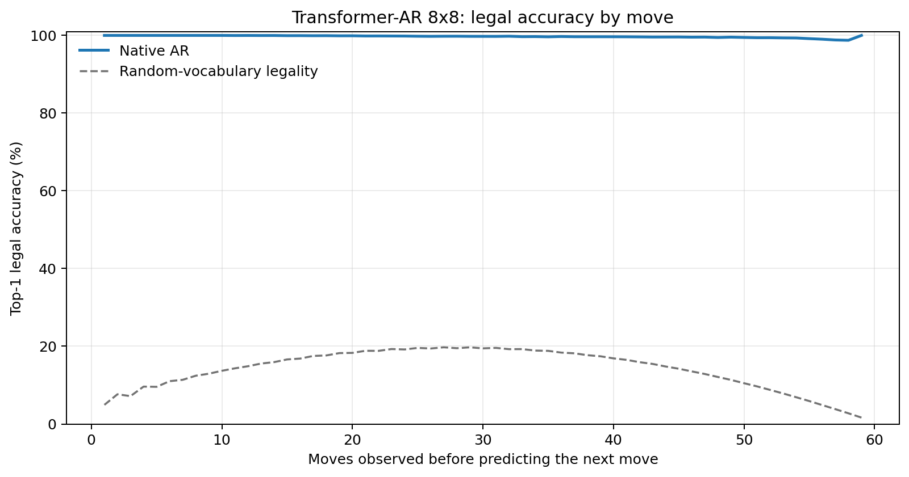
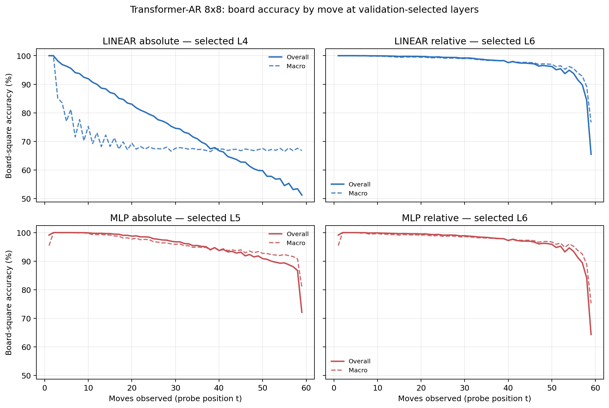

# Proposal evaluation: Transformer-AR 8x8

- **Suite:** `thesis_eval_suite_v1` over `unified_eval_v4`
- **Run:** `selected`
- **Checkpoint:** `final.pt` (`ba14a88df9f37c2f78cc2ba24b26b70b74081f2722fc71708fa42cc25481c930`)
- **Training budget:** `19,999,840` games / `200` shards
- **Next-move readout:** native pretrained AR head
- **Exact continuation:** intentionally excluded because corpus continuations are stochastic legal choices

## 1. Functional legality

| Readout | Top-1 legal | Top-3 legal fraction | Top-5 legal fraction | Legal probability mass |
|---|---:|---:|---:|---:|
| Native AR | 99.72% | 96.77% | 92.43% | 98.35% |

### Statistical context

| Readout | Normalized legal lift | 95% CI for top-1 legal |
|---|---:|---:|
| Native AR | 99.67% | 99.71%–99.73% |

### Legal accuracy by move

### Legality by normalized game phase

| Readout | Phase | Tokens | Mean legal moves | Top-1 legal | Legal mass |
|---|---:|---:|---:|---:|---:|
| Native AR | 0.00–0.25 | 749,909 | 7.22 | 99.99% | 99.95% |
| Native AR | 0.25–0.50 | 699,679 | 11.44 | 99.85% | 99.23% |
| Native AR | 0.50–0.75 | 749,593 | 10.84 | 99.68% | 97.62% |
| Native AR | 0.75–1.00 | 749,129 | 5.15 | 99.37% | 96.64% |

## 2. Board-state representations

Layer selection uses only the selection split. Headline test values are macro-balanced accuracy, so changing empty-square prevalence across board sizes cannot dominate the comparison.

**Macro accuracy** is the unweighted mean of the three per-class recalls. Absolute labels use empty/black/white and relative labels use empty/mine/opponent. Each class therefore contributes one third even when empty squares are much more common. Overall accuracy instead weights every square equally and can be dominated by the empty class.

| Probe | Labels | Best layer | Normalized depth | Test macro | Overall | Occupied | Empty |
|---|---|---:|---:|---:|---:|---:|---:|
| LINEAR | absolute | L4 | 0.500 | 68.90% | 75.59% | 53.40% | 100.00% |
| LINEAR | relative | L6 | 0.750 | 96.94% | 97.61% | 95.45% | 99.99% |
| MLP | absolute | L5 | 0.625 | 94.43% | 95.63% | 91.65% | 100.00% |
| MLP | relative | L6 | 0.750 | 96.58% | 97.35% | 94.97% | 99.98% |

### Probe accuracy by layer

These are the untouched test-split tables in the same format as the 8x8 unified JEPA notebook. `Selected` marks the layer chosen using the separate selection split, never the test results.

#### LINEAR board-state probe

| Layer | Absolute accuracy | Absolute macro | Relative accuracy | Relative macro | Selected |
|---:|---:|---:|---:|---:|:---|
| L0 | 62.71% | 55.82% | 64.81% | 58.21% |  |
| L1 | 75.15% | 68.43% | 87.30% | 83.78% |  |
| L2 | 75.62% | 68.94% | 92.31% | 90.11% |  |
| L3 | 75.64% | 68.96% | 94.29% | 92.68% |  |
| L4 | 75.59% | 68.90% | 96.02% | 94.90% | absolute |
| L5 | 75.57% | 68.87% | 97.25% | 96.48% |  |
| L6 | 75.40% | 68.66% | 97.61% | 96.94% | relative |
| L7 | 75.20% | 68.43% | 97.55% | 96.88% |  |
| L8 | 75.13% | 68.34% | 97.51% | 96.82% |  |

#### MLP board-state probe

| Layer | Absolute accuracy | Absolute macro | Relative accuracy | Relative macro | Selected |
|---:|---:|---:|---:|---:|:---|
| L0 | 65.12% | 58.78% | 65.23% | 58.59% |  |
| L1 | 84.01% | 79.80% | 86.59% | 82.91% |  |
| L2 | 89.64% | 86.81% | 92.06% | 89.79% |  |
| L3 | 91.84% | 89.60% | 94.08% | 92.41% |  |
| L4 | 94.07% | 92.46% | 95.88% | 94.71% |  |
| L5 | 95.63% | 94.43% | 97.13% | 96.29% | absolute |
| L6 | 93.16% | 91.31% | 97.35% | 96.58% | relative |
| L7 | 88.35% | 85.19% | 97.26% | 96.50% |  |
| L8 | 87.91% | 84.65% | 97.17% | 96.38% |  |

### Board accuracy by move at each selected layer

### Selected board probes by game phase

| Probe | Labels | Phase | Macro accuracy | Occupied | Empty |
|---|---|---:|---:|---:|---:|
| LINEAR | absolute | 1/4 | 95.04% | 93.67% | 100.00% |
| LINEAR | absolute | 2/4 | 79.75% | 71.36% | 100.00% |
| LINEAR | absolute | 11/4 | 67.64% | 51.49% | 100.00% |
| LINEAR | absolute | 12/4 | 67.66% | 51.49% | 100.00% |
| LINEAR | absolute | 13/4 | 67.78% | 51.75% | 100.00% |
| LINEAR | absolute | 14/4 | 67.69% | 51.52% | 100.00% |
| LINEAR | absolute | 15/4 | 67.74% | 51.61% | 100.00% |
| LINEAR | absolute | 16/4 | 67.60% | 51.40% | 100.00% |
| LINEAR | absolute | 3/4 | 74.61% | 63.11% | 100.00% |
| LINEAR | absolute | 4/4 | 72.28% | 58.55% | 100.00% |
| LINEAR | absolute | 5/4 | 70.48% | 56.03% | 100.00% |
| LINEAR | absolute | 6/4 | 69.07% | 53.73% | 100.00% |
| LINEAR | absolute | 7/4 | 68.57% | 53.27% | 100.00% |
| LINEAR | absolute | 8/4 | 68.29% | 52.50% | 100.00% |
| LINEAR | absolute | 9/4 | 68.43% | 52.68% | 100.00% |
| LINEAR | absolute | 10/4 | 67.98% | 52.01% | 100.00% |
| LINEAR | relative | 1/4 | 100.00% | 100.00% | 100.00% |
| LINEAR | relative | 2/4 | 99.97% | 99.96% | 100.00% |
| LINEAR | relative | 11/4 | 98.10% | 97.19% | 99.97% |
| LINEAR | relative | 12/4 | 97.78% | 96.69% | 99.99% |
| LINEAR | relative | 13/4 | 97.33% | 96.04% | 99.96% |
| LINEAR | relative | 14/4 | 96.84% | 95.30% | 99.96% |
| LINEAR | relative | 15/4 | 95.85% | 93.84% | 100.00% |
| LINEAR | relative | 16/4 | 88.11% | 82.19% | 100.00% |
| LINEAR | relative | 3/4 | 99.83% | 99.75% | 100.00% |
| LINEAR | relative | 4/4 | 99.66% | 99.51% | 100.00% |
| LINEAR | relative | 5/4 | 99.49% | 99.25% | 99.99% |
| LINEAR | relative | 6/4 | 99.43% | 99.16% | 99.99% |
| LINEAR | relative | 7/4 | 99.25% | 98.91% | 99.98% |
| LINEAR | relative | 8/4 | 99.08% | 98.66% | 99.98% |
| LINEAR | relative | 9/4 | 98.87% | 98.34% | 99.96% |
| LINEAR | relative | 10/4 | 98.42% | 97.69% | 99.96% |
| MLP | absolute | 1/4 | 98.53% | 97.03% | 100.00% |
| MLP | absolute | 2/4 | 99.98% | 99.97% | 100.00% |
| MLP | absolute | 11/4 | 94.40% | 91.60% | 99.99% |
| MLP | absolute | 12/4 | 93.95% | 90.92% | 100.00% |
| MLP | absolute | 13/4 | 93.56% | 90.34% | 100.00% |
| MLP | absolute | 14/4 | 93.00% | 89.50% | 99.99% |
| MLP | absolute | 15/4 | 92.28% | 88.42% | 100.00% |
| MLP | absolute | 16/4 | 88.88% | 83.32% | 100.00% |
| MLP | absolute | 3/4 | 99.71% | 99.57% | 100.00% |
| MLP | absolute | 4/4 | 99.29% | 98.93% | 100.00% |
| MLP | absolute | 5/4 | 98.75% | 98.12% | 100.00% |
| MLP | absolute | 6/4 | 97.90% | 96.85% | 100.00% |
| MLP | absolute | 7/4 | 97.33% | 96.01% | 100.00% |
| MLP | absolute | 8/4 | 96.42% | 94.63% | 100.00% |
| MLP | absolute | 9/4 | 95.74% | 93.61% | 100.00% |
| MLP | absolute | 10/4 | 94.94% | 92.42% | 100.00% |
| MLP | relative | 1/4 | 98.53% | 97.03% | 100.00% |
| MLP | relative | 2/4 | 99.91% | 99.88% | 100.00% |
| MLP | relative | 11/4 | 97.73% | 96.65% | 99.97% |
| MLP | relative | 12/4 | 97.44% | 96.23% | 99.94% |
| MLP | relative | 13/4 | 97.02% | 95.61% | 99.93% |
| MLP | relative | 14/4 | 96.61% | 94.97% | 99.95% |
| MLP | relative | 15/4 | 95.58% | 93.48% | 99.94% |
| MLP | relative | 16/4 | 87.59% | 81.69% | 99.72% |
| MLP | relative | 3/4 | 99.54% | 99.36% | 100.00% |
| MLP | relative | 4/4 | 99.34% | 99.05% | 100.00% |
| MLP | relative | 5/4 | 99.20% | 98.85% | 99.98% |
| MLP | relative | 6/4 | 99.10% | 98.71% | 99.99% |
| MLP | relative | 7/4 | 98.85% | 98.34% | 99.98% |
| MLP | relative | 8/4 | 98.69% | 98.12% | 99.95% |
| MLP | relative | 9/4 | 98.42% | 97.69% | 99.96% |
| MLP | relative | 10/4 | 98.10% | 97.24% | 99.95% |

## 3. Nanda-style causal intervention

- Readout: `native_ar`
- Selected intervention scale: `2`
- Interpretation scope: native model behavior

| Control | Target top-1 legal | Target legal mass | Top-N FP+FN |
|---|---:|---:|---:|
| Null | 93.10% | 89.48% | 2.242 |
| Magnitude-matched random | 90.40% | 89.34% | 2.288 |
| Relative-board direction | 97.90% | 95.32% | 0.480 |

For AR this edits the native prediction path. For JEPA it establishes causal steerability of the composed JEPA encoder plus its post-hoc frozen MLP readout; it is not evidence of a native JEPA action head.

## 4. Efficiency and reproducibility

- Encoder parameters: `25,312,768`
- Total parameters: `25,312,768`
- Checkpoint bytes: `303,990,249`
- Evaluation GPU: `NVIDIA L4`
- Training hardware: `unreported`
- Training precision: `bf16`
- Python / PyTorch / CUDA: `3.12.13` / `2.11.0+cu128` / `12.8`
- Median training chunk: `10.10 s`
- Estimated training loop: `0.56 h`
- Median games/s: `9903.45`
- Median supervision units/s: `583979.08`
- Timing scope: dt_seconds excludes normal checkpoint/Drive-sync time; validation is included only in observed_train_plus_validation_loop_hours

## 5. Interpretation boundary

- Board probes establish decodability, not by themselves causal use.
- Legal behavior measures rule compatibility, not strategic playing strength.
- Bootstrap legality intervals quantify test-game sampling only; they do not replace independent pretraining seeds.
- Board-probe point estimates use one deterministic probe seed; the random-encoder control is not a substitute for model-seed replication.
- Cross-board results compare separately trained scaling conditions, not zero-shot transfer.

## Artifact index

- Unified JSON: `/content/seed_evaluation_views/transformer_ar_b8_seed001/runs/selected/thesis_eval/final/results__unified_eval_v4.json`
- Unified summary: `/content/seed_evaluation_views/transformer_ar_b8_seed001/runs/selected/thesis_eval/final/summary__unified_eval_v4.md`
- Position manifest: `/content/seed_evaluation_views/transformer_ar_b8_seed001/runs/selected/thesis_eval/final/position_manifest__unified_eval_v4.json`
- Legal-by-move figure: `/content/seed_evaluation_views/transformer_ar_b8_seed001/runs/selected/thesis_eval/final/legal_accuracy_by_move__thesis_eval_suite_v1.png`
- Board-by-move figure: `/content/seed_evaluation_views/transformer_ar_b8_seed001/runs/selected/thesis_eval/final/board_accuracy_by_move__thesis_eval_suite_v1.png`
- Causal-intervention JSON: `/content/seed_evaluation_views/transformer_ar_b8_seed001/runs/selected/thesis_eval/final/results__unified_eval_v4.json` (`causal_intervention` key)
