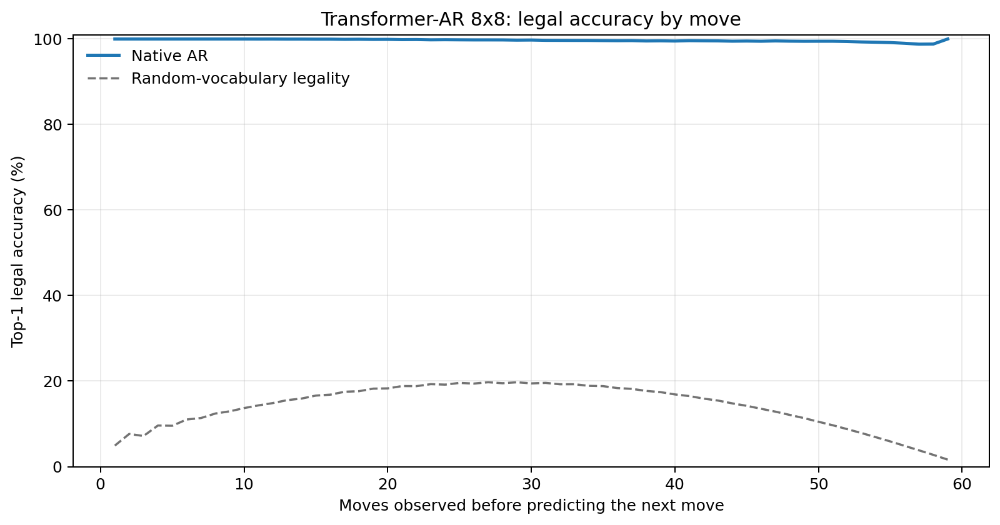
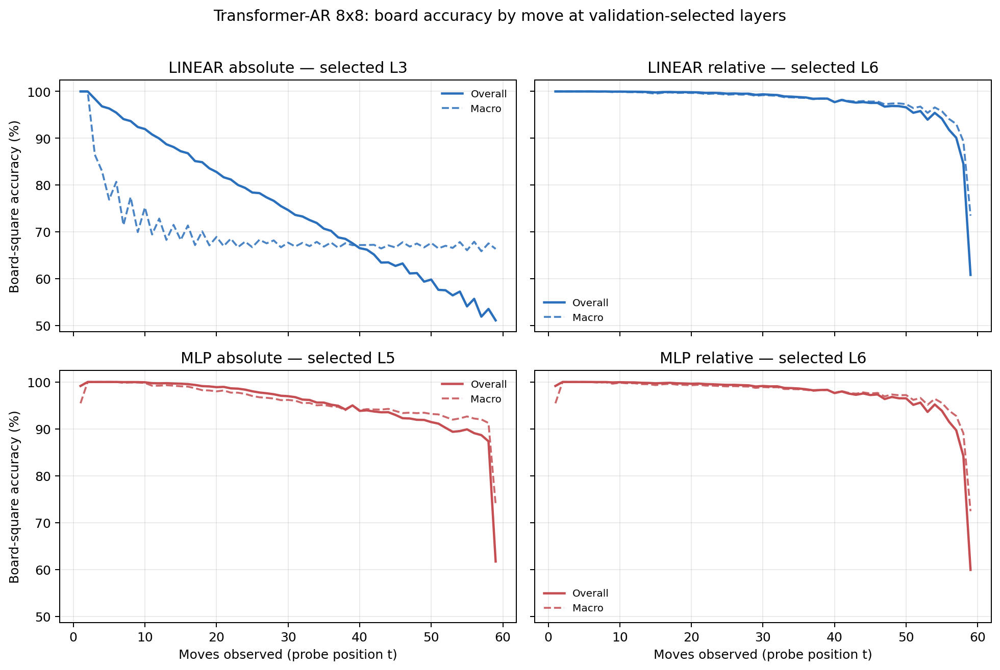

# Proposal evaluation: Transformer-AR 8x8

- **Suite:** `thesis_eval_suite_v1` over `unified_eval_v4`
- **Run:** `selected`
- **Checkpoint:** `final.pt` (`25965b0c96cdfb3b2784d51773c992df7cba26d9f0fc0cf2c878ae1f9ab9fcad`)
- **Training budget:** `19,999,840` games / `200` shards
- **Next-move readout:** native pretrained AR head
- **Exact continuation:** intentionally excluded because corpus continuations are stochastic legal choices

## 1. Functional legality

| Readout | Top-1 legal | Top-3 legal fraction | Top-5 legal fraction | Legal probability mass |
|---|---:|---:|---:|---:|
| Native AR | 99.70% | 96.76% | 92.43% | 98.47% |

### Statistical context

| Readout | Normalized legal lift | 95% CI for top-1 legal |
|---|---:|---:|
| Native AR | 99.65% | 99.69%–99.71% |

### Legal accuracy by move

### Legality by normalized game phase

| Readout | Phase | Tokens | Mean legal moves | Top-1 legal | Legal mass |
|---|---:|---:|---:|---:|---:|
| Native AR | 0.00–0.25 | 749,909 | 7.22 | 99.99% | 99.96% |
| Native AR | 0.25–0.50 | 699,679 | 11.44 | 99.85% | 99.30% |
| Native AR | 0.50–0.75 | 749,593 | 10.84 | 99.61% | 97.82% |
| Native AR | 0.75–1.00 | 749,129 | 5.15 | 99.34% | 96.87% |

## 2. Board-state representations

Layer selection uses only the selection split. Headline test values are macro-balanced accuracy, so changing empty-square prevalence across board sizes cannot dominate the comparison.

**Macro accuracy** is the unweighted mean of the three per-class recalls. Absolute labels use empty/black/white and relative labels use empty/mine/opponent. Each class therefore contributes one third even when empty squares are much more common. Overall accuracy instead weights every square equally and can be dominated by the empty class.

| Probe | Labels | Best layer | Normalized depth | Test macro | Overall | Occupied | Empty |
|---|---|---:|---:|---:|---:|---:|---:|
| LINEAR | absolute | L3 | 0.375 | 68.91% | 75.60% | 53.41% | 100.00% |
| LINEAR | relative | L6 | 0.750 | 97.05% | 97.71% | 95.63% | 99.99% |
| MLP | absolute | L5 | 0.625 | 94.36% | 95.57% | 91.55% | 100.00% |
| MLP | relative | L6 | 0.750 | 96.77% | 97.50% | 95.24% | 99.99% |

### Probe accuracy by layer

These are the untouched test-split tables in the same format as the 8x8 unified JEPA notebook. `Selected` marks the layer chosen using the separate selection split, never the test results.

#### LINEAR board-state probe

| Layer | Absolute accuracy | Absolute macro | Relative accuracy | Relative macro | Selected |
|---:|---:|---:|---:|---:|:---|
| L0 | 62.70% | 55.78% | 64.81% | 58.20% |  |
| L1 | 75.19% | 68.48% | 87.33% | 83.81% |  |
| L2 | 75.59% | 68.90% | 92.13% | 89.89% |  |
| L3 | 75.60% | 68.91% | 94.55% | 93.00% | absolute |
| L4 | 75.56% | 68.87% | 96.06% | 94.95% |  |
| L5 | 75.56% | 68.86% | 97.23% | 96.46% |  |
| L6 | 75.45% | 68.73% | 97.71% | 97.05% | relative |
| L7 | 75.22% | 68.45% | 97.63% | 96.97% |  |
| L8 | 75.17% | 68.39% | 97.54% | 96.86% |  |

#### MLP board-state probe

| Layer | Absolute accuracy | Absolute macro | Relative accuracy | Relative macro | Selected |
|---:|---:|---:|---:|---:|:---|
| L0 | 65.11% | 58.74% | 65.22% | 58.55% |  |
| L1 | 84.02% | 79.80% | 86.64% | 82.95% |  |
| L2 | 89.50% | 86.64% | 91.84% | 89.47% |  |
| L3 | 92.39% | 90.31% | 94.36% | 92.75% |  |
| L4 | 93.99% | 92.35% | 95.92% | 94.76% |  |
| L5 | 95.57% | 94.36% | 97.11% | 96.27% | absolute |
| L6 | 94.41% | 92.88% | 97.50% | 96.77% | relative |
| L7 | 90.26% | 87.62% | 97.37% | 96.63% |  |
| L8 | 85.68% | 81.80% | 97.21% | 96.44% |  |

### Board accuracy by move at each selected layer

### Selected board probes by game phase

| Probe | Labels | Phase | Macro accuracy | Occupied | Empty |
|---|---|---:|---:|---:|---:|
| LINEAR | absolute | 1/4 | 95.55% | 94.49% | 100.00% |
| LINEAR | absolute | 2/4 | 79.54% | 71.07% | 100.00% |
| LINEAR | absolute | 11/4 | 67.74% | 51.65% | 100.00% |
| LINEAR | absolute | 12/4 | 67.55% | 51.32% | 100.00% |
| LINEAR | absolute | 13/4 | 67.88% | 51.90% | 100.00% |
| LINEAR | absolute | 14/4 | 67.77% | 51.62% | 100.00% |
| LINEAR | absolute | 15/4 | 67.63% | 51.44% | 99.98% |
| LINEAR | absolute | 16/4 | 67.39% | 51.19% | 99.80% |
| LINEAR | absolute | 3/4 | 74.73% | 63.22% | 100.00% |
| LINEAR | absolute | 4/4 | 72.14% | 58.31% | 100.00% |
| LINEAR | absolute | 5/4 | 70.73% | 56.41% | 100.00% |
| LINEAR | absolute | 6/4 | 69.11% | 53.79% | 100.00% |
| LINEAR | absolute | 7/4 | 68.16% | 52.69% | 100.00% |
| LINEAR | absolute | 8/4 | 68.75% | 53.18% | 100.00% |
| LINEAR | absolute | 9/4 | 68.21% | 52.35% | 100.00% |
| LINEAR | absolute | 10/4 | 68.22% | 52.36% | 100.00% |
| LINEAR | relative | 1/4 | 100.00% | 100.00% | 100.00% |
| LINEAR | relative | 2/4 | 99.99% | 99.98% | 100.00% |
| LINEAR | relative | 11/4 | 98.26% | 97.43% | 99.98% |
| LINEAR | relative | 12/4 | 98.01% | 97.04% | 99.99% |
| LINEAR | relative | 13/4 | 97.65% | 96.52% | 99.99% |
| LINEAR | relative | 14/4 | 97.15% | 95.77% | 100.00% |
| LINEAR | relative | 15/4 | 96.13% | 94.27% | 100.00% |
| LINEAR | relative | 16/4 | 87.45% | 81.23% | 100.00% |
| LINEAR | relative | 3/4 | 99.91% | 99.86% | 100.00% |
| LINEAR | relative | 4/4 | 99.78% | 99.69% | 100.00% |
| LINEAR | relative | 5/4 | 99.67% | 99.52% | 100.00% |
| LINEAR | relative | 6/4 | 99.62% | 99.45% | 99.99% |
| LINEAR | relative | 7/4 | 99.43% | 99.17% | 99.99% |
| LINEAR | relative | 8/4 | 99.27% | 98.93% | 99.98% |
| LINEAR | relative | 9/4 | 99.05% | 98.59% | 99.99% |
| LINEAR | relative | 10/4 | 98.67% | 98.04% | 99.99% |
| MLP | absolute | 1/4 | 98.53% | 97.03% | 100.00% |
| MLP | absolute | 2/4 | 99.96% | 99.95% | 100.00% |
| MLP | absolute | 11/4 | 94.48% | 91.72% | 100.00% |
| MLP | absolute | 12/4 | 94.21% | 91.31% | 100.00% |
| MLP | absolute | 13/4 | 93.58% | 90.38% | 100.00% |
| MLP | absolute | 14/4 | 93.30% | 89.95% | 100.00% |
| MLP | absolute | 15/4 | 92.40% | 88.60% | 100.00% |
| MLP | absolute | 16/4 | 87.34% | 81.01% | 100.00% |
| MLP | absolute | 3/4 | 99.69% | 99.55% | 100.00% |
| MLP | absolute | 4/4 | 99.27% | 98.90% | 100.00% |
| MLP | absolute | 5/4 | 98.79% | 98.19% | 100.00% |
| MLP | absolute | 6/4 | 98.06% | 97.09% | 100.00% |
| MLP | absolute | 7/4 | 97.43% | 96.15% | 100.00% |
| MLP | absolute | 8/4 | 96.53% | 94.79% | 100.00% |
| MLP | absolute | 9/4 | 95.84% | 93.76% | 100.00% |
| MLP | absolute | 10/4 | 95.03% | 92.55% | 100.00% |
| MLP | relative | 1/4 | 98.53% | 97.03% | 100.00% |
| MLP | relative | 2/4 | 99.96% | 99.95% | 100.00% |
| MLP | relative | 11/4 | 98.09% | 97.18% | 99.98% |
| MLP | relative | 12/4 | 97.76% | 96.70% | 99.95% |
| MLP | relative | 13/4 | 97.37% | 96.12% | 99.99% |
| MLP | relative | 14/4 | 96.97% | 95.51% | 99.99% |
| MLP | relative | 15/4 | 95.91% | 93.95% | 100.00% |
| MLP | relative | 16/4 | 86.98% | 80.70% | 99.96% |
| MLP | relative | 3/4 | 99.79% | 99.70% | 100.00% |
| MLP | relative | 4/4 | 99.60% | 99.42% | 100.00% |
| MLP | relative | 5/4 | 99.47% | 99.23% | 100.00% |
| MLP | relative | 6/4 | 99.32% | 99.03% | 99.99% |
| MLP | relative | 7/4 | 99.13% | 98.74% | 99.99% |
| MLP | relative | 8/4 | 98.96% | 98.49% | 99.99% |
| MLP | relative | 9/4 | 98.77% | 98.21% | 99.98% |
| MLP | relative | 10/4 | 98.42% | 97.69% | 99.98% |

## 3. Nanda-style causal intervention

- Readout: `native_ar`
- Selected intervention scale: `4`
- Interpretation scope: native model behavior

| Control | Target top-1 legal | Target legal mass | Top-N FP+FN |
|---|---:|---:|---:|
| Null | 91.90% | 89.70% | 2.276 |
| Magnitude-matched random | 90.00% | 89.58% | 2.296 |
| Relative-board direction | 94.80% | 95.61% | 0.470 |

For AR this edits the native prediction path. For JEPA it establishes causal steerability of the composed JEPA encoder plus its post-hoc frozen MLP readout; it is not evidence of a native JEPA action head.

## 4. Efficiency and reproducibility

- Encoder parameters: `25,312,768`
- Total parameters: `25,312,768`
- Checkpoint bytes: `303,990,249`
- Evaluation GPU: `NVIDIA L4`
- Training hardware: `unreported`
- Training precision: `bf16`
- Python / PyTorch / CUDA: `3.13.15` / `2.11.0+cu128` / `12.8`
- Median training chunk: `10.10 s`
- Estimated training loop: `0.56 h`
- Median games/s: `9898.31`
- Median supervision units/s: `583684.27`
- Timing scope: dt_seconds excludes normal checkpoint/Drive-sync time; validation is included only in observed_train_plus_validation_loop_hours

## 5. Interpretation boundary

- Board probes establish decodability, not by themselves causal use.
- Legal behavior measures rule compatibility, not strategic playing strength.
- Bootstrap legality intervals quantify test-game sampling only; they do not replace independent pretraining seeds.
- Board-probe point estimates use one deterministic probe seed; the random-encoder control is not a substitute for model-seed replication.
- Cross-board results compare separately trained scaling conditions, not zero-shot transfer.

## Artifact index

- Unified JSON: `/content/seed_evaluation_views/transformer_ar_b8_seed002/runs/selected/thesis_eval/final/results__unified_eval_v4.json`
- Unified summary: `/content/seed_evaluation_views/transformer_ar_b8_seed002/runs/selected/thesis_eval/final/summary__unified_eval_v4.md`
- Position manifest: `/content/seed_evaluation_views/transformer_ar_b8_seed002/runs/selected/thesis_eval/final/position_manifest__unified_eval_v4.json`
- Legal-by-move figure: `/content/seed_evaluation_views/transformer_ar_b8_seed002/runs/selected/thesis_eval/final/legal_accuracy_by_move__thesis_eval_suite_v1.png`
- Board-by-move figure: `/content/seed_evaluation_views/transformer_ar_b8_seed002/runs/selected/thesis_eval/final/board_accuracy_by_move__thesis_eval_suite_v1.png`
- Causal-intervention JSON: `/content/seed_evaluation_views/transformer_ar_b8_seed002/runs/selected/thesis_eval/final/results__unified_eval_v4.json` (`causal_intervention` key)
