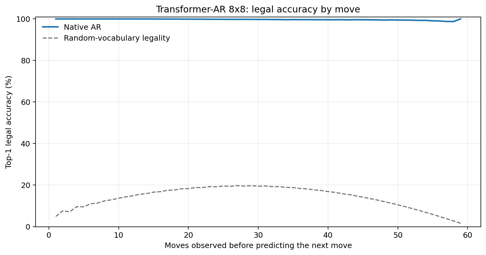
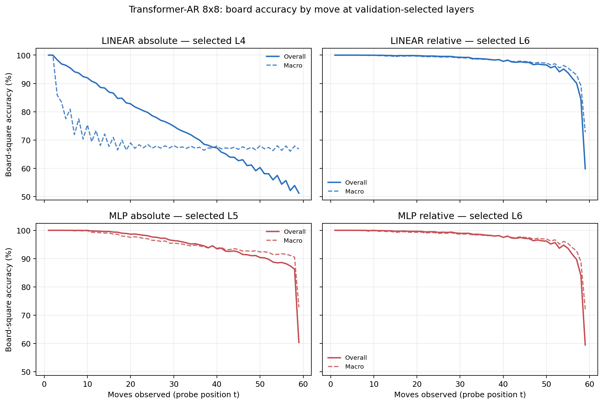

# Proposal evaluation: Transformer-AR 8x8

- **Suite:** `thesis_eval_suite_v1` over `unified_eval_v4`
- **Run:** `selected`
- **Checkpoint:** `final.pt` (`8945cc94c8face57f7b2fe99ba886d0f5cfe3492db6dbddb4a01c7450c853c2a`)
- **Training budget:** `19,999,840` games / `200` shards
- **Next-move readout:** native pretrained AR head
- **Exact continuation:** intentionally excluded because corpus continuations are stochastic legal choices

## 1. Functional legality

| Readout | Top-1 legal | Top-3 legal fraction | Top-5 legal fraction | Legal probability mass |
|---|---:|---:|---:|---:|
| Native AR | 99.71% | 96.78% | 92.45% | 98.50% |

### Statistical context

| Readout | Normalized legal lift | 95% CI for top-1 legal |
|---|---:|---:|
| Native AR | 99.67% | 99.70%–99.72% |

### Legal accuracy by move

### Legality by normalized game phase

| Readout | Phase | Tokens | Mean legal moves | Top-1 legal | Legal mass |
|---|---:|---:|---:|---:|---:|
| Native AR | 0.00–0.25 | 749,909 | 7.22 | 99.99% | 99.96% |
| Native AR | 0.25–0.50 | 699,679 | 11.44 | 99.86% | 99.32% |
| Native AR | 0.50–0.75 | 749,593 | 10.84 | 99.65% | 97.86% |
| Native AR | 0.75–1.00 | 749,129 | 5.15 | 99.35% | 96.91% |

## 2. Board-state representations

Layer selection uses only the selection split. Headline test values are macro-balanced accuracy, so changing empty-square prevalence across board sizes cannot dominate the comparison.

**Macro accuracy** is the unweighted mean of the three per-class recalls. Absolute labels use empty/black/white and relative labels use empty/mine/opponent. Each class therefore contributes one third even when empty squares are much more common. Overall accuracy instead weights every square equally and can be dominated by the empty class.

| Probe | Labels | Best layer | Normalized depth | Test macro | Overall | Occupied | Empty |
|---|---|---:|---:|---:|---:|---:|---:|
| LINEAR | absolute | L4 | 0.500 | 68.89% | 75.59% | 53.39% | 100.00% |
| LINEAR | relative | L6 | 0.750 | 96.98% | 97.65% | 95.51% | 99.99% |
| MLP | absolute | L5 | 0.625 | 93.85% | 95.18% | 90.79% | 100.00% |
| MLP | relative | L6 | 0.750 | 96.70% | 97.45% | 95.14% | 99.98% |

### Probe accuracy by layer

These are the untouched test-split tables in the same format as the 8x8 unified JEPA notebook. `Selected` marks the layer chosen using the separate selection split, never the test results.

#### LINEAR board-state probe

| Layer | Absolute accuracy | Absolute macro | Relative accuracy | Relative macro | Selected |
|---:|---:|---:|---:|---:|:---|
| L0 | 62.69% | 55.78% | 64.79% | 58.19% |  |
| L1 | 75.17% | 68.44% | 87.50% | 84.04% |  |
| L2 | 75.58% | 68.89% | 92.46% | 90.31% |  |
| L3 | 75.61% | 68.92% | 94.58% | 93.04% |  |
| L4 | 75.59% | 68.89% | 96.04% | 94.92% | absolute |
| L5 | 75.53% | 68.82% | 97.22% | 96.44% |  |
| L6 | 75.40% | 68.67% | 97.65% | 96.98% | relative |
| L7 | 75.18% | 68.41% | 97.61% | 96.95% |  |
| L8 | 75.11% | 68.32% | 97.54% | 96.86% |  |

#### MLP board-state probe

| Layer | Absolute accuracy | Absolute macro | Relative accuracy | Relative macro | Selected |
|---:|---:|---:|---:|---:|:---|
| L0 | 65.12% | 58.78% | 65.23% | 58.57% |  |
| L1 | 84.48% | 80.39% | 86.85% | 83.25% |  |
| L2 | 89.87% | 87.11% | 92.18% | 89.94% |  |
| L3 | 92.11% | 89.95% | 94.36% | 92.77% |  |
| L4 | 93.79% | 92.10% | 95.93% | 94.76% |  |
| L5 | 95.18% | 93.85% | 97.11% | 96.27% | absolute |
| L6 | 93.90% | 92.24% | 97.45% | 96.70% | relative |
| L7 | 89.15% | 86.20% | 97.33% | 96.57% |  |
| L8 | 86.03% | 82.23% | 97.19% | 96.41% |  |

### Board accuracy by move at each selected layer

### Selected board probes by game phase

| Probe | Labels | Phase | Macro accuracy | Occupied | Empty |
|---|---|---:|---:|---:|---:|
| LINEAR | absolute | 1/4 | 95.34% | 94.22% | 100.00% |
| LINEAR | absolute | 2/4 | 79.78% | 71.39% | 100.00% |
| LINEAR | absolute | 11/4 | 67.68% | 51.56% | 100.00% |
| LINEAR | absolute | 12/4 | 67.60% | 51.39% | 100.00% |
| LINEAR | absolute | 13/4 | 67.72% | 51.65% | 100.00% |
| LINEAR | absolute | 14/4 | 67.84% | 51.75% | 100.00% |
| LINEAR | absolute | 15/4 | 67.70% | 51.54% | 100.00% |
| LINEAR | absolute | 16/4 | 67.54% | 51.31% | 100.00% |
| LINEAR | absolute | 3/4 | 74.65% | 63.18% | 100.00% |
| LINEAR | absolute | 4/4 | 72.36% | 58.65% | 100.00% |
| LINEAR | absolute | 5/4 | 70.16% | 55.56% | 100.00% |
| LINEAR | absolute | 6/4 | 68.86% | 53.42% | 100.00% |
| LINEAR | absolute | 7/4 | 68.55% | 53.24% | 100.00% |
| LINEAR | absolute | 8/4 | 68.52% | 52.83% | 100.00% |
| LINEAR | absolute | 9/4 | 68.28% | 52.44% | 100.00% |
| LINEAR | absolute | 10/4 | 68.10% | 52.19% | 100.00% |
| LINEAR | relative | 1/4 | 100.00% | 100.00% | 100.00% |
| LINEAR | relative | 2/4 | 99.98% | 99.98% | 100.00% |
| LINEAR | relative | 11/4 | 98.23% | 97.38% | 99.96% |
| LINEAR | relative | 12/4 | 97.91% | 96.90% | 99.98% |
| LINEAR | relative | 13/4 | 97.54% | 96.36% | 99.98% |
| LINEAR | relative | 14/4 | 97.11% | 95.70% | 99.99% |
| LINEAR | relative | 15/4 | 96.05% | 94.16% | 99.98% |
| LINEAR | relative | 16/4 | 87.24% | 80.92% | 100.00% |
| LINEAR | relative | 3/4 | 99.89% | 99.85% | 100.00% |
| LINEAR | relative | 4/4 | 99.75% | 99.62% | 100.00% |
| LINEAR | relative | 5/4 | 99.62% | 99.44% | 99.99% |
| LINEAR | relative | 6/4 | 99.59% | 99.40% | 99.99% |
| LINEAR | relative | 7/4 | 99.44% | 99.17% | 99.99% |
| LINEAR | relative | 8/4 | 99.27% | 98.93% | 99.98% |
| LINEAR | relative | 9/4 | 98.90% | 98.39% | 99.98% |
| LINEAR | relative | 10/4 | 98.58% | 97.91% | 99.98% |
| MLP | absolute | 1/4 | 100.00% | 100.00% | 100.00% |
| MLP | absolute | 2/4 | 99.94% | 99.92% | 100.00% |
| MLP | absolute | 11/4 | 94.09% | 91.14% | 100.00% |
| MLP | absolute | 12/4 | 93.51% | 90.27% | 100.00% |
| MLP | absolute | 13/4 | 92.92% | 89.39% | 100.00% |
| MLP | absolute | 14/4 | 92.59% | 88.88% | 100.00% |
| MLP | absolute | 15/4 | 91.77% | 87.66% | 100.00% |
| MLP | absolute | 16/4 | 86.56% | 79.84% | 100.00% |
| MLP | absolute | 3/4 | 99.73% | 99.61% | 100.00% |
| MLP | absolute | 4/4 | 99.18% | 98.76% | 100.00% |
| MLP | absolute | 5/4 | 98.62% | 97.92% | 100.00% |
| MLP | absolute | 6/4 | 97.68% | 96.52% | 100.00% |
| MLP | absolute | 7/4 | 96.93% | 95.41% | 100.00% |
| MLP | absolute | 8/4 | 96.11% | 94.17% | 100.00% |
| MLP | absolute | 9/4 | 95.21% | 92.82% | 100.00% |
| MLP | absolute | 10/4 | 94.63% | 91.95% | 100.00% |
| MLP | relative | 1/4 | 100.00% | 100.00% | 100.00% |
| MLP | relative | 2/4 | 99.98% | 99.97% | 100.00% |
| MLP | relative | 11/4 | 97.94% | 96.98% | 99.94% |
| MLP | relative | 12/4 | 97.66% | 96.54% | 99.95% |
| MLP | relative | 13/4 | 97.26% | 95.97% | 99.96% |
| MLP | relative | 14/4 | 96.83% | 95.30% | 99.98% |
| MLP | relative | 15/4 | 95.79% | 93.81% | 99.92% |
| MLP | relative | 16/4 | 86.86% | 80.54% | 99.92% |
| MLP | relative | 3/4 | 99.80% | 99.72% | 100.00% |
| MLP | relative | 4/4 | 99.63% | 99.45% | 100.00% |
| MLP | relative | 5/4 | 99.38% | 99.09% | 99.99% |
| MLP | relative | 6/4 | 99.25% | 98.93% | 99.99% |
| MLP | relative | 7/4 | 99.09% | 98.69% | 99.98% |
| MLP | relative | 8/4 | 98.96% | 98.50% | 99.98% |
| MLP | relative | 9/4 | 98.59% | 97.93% | 99.97% |
| MLP | relative | 10/4 | 98.29% | 97.51% | 99.96% |

## 3. Nanda-style causal intervention

- Readout: `native_ar`
- Selected intervention scale: `2`
- Interpretation scope: native model behavior

| Control | Target top-1 legal | Target legal mass | Top-N FP+FN |
|---|---:|---:|---:|
| Null | 91.20% | 89.67% | 2.302 |
| Magnitude-matched random | 91.10% | 89.66% | 2.276 |
| Relative-board direction | 97.60% | 95.69% | 0.474 |

For AR this edits the native prediction path. For JEPA it establishes causal steerability of the composed JEPA encoder plus its post-hoc frozen MLP readout; it is not evidence of a native JEPA action head.

## 4. Efficiency and reproducibility

- Encoder parameters: `25,312,768`
- Total parameters: `25,312,768`
- Checkpoint bytes: `303,990,249`
- Evaluation GPU: `NVIDIA L4`
- Training hardware: `unreported`
- Training precision: `bf16`
- Python / PyTorch / CUDA: `3.13.15` / `2.11.0+cu128` / `12.8`
- Median training chunk: `10.10 s`
- Estimated training loop: `0.56 h`
- Median games/s: `9896.23`
- Median supervision units/s: `583536.58`
- Timing scope: dt_seconds excludes normal checkpoint/Drive-sync time; validation is included only in observed_train_plus_validation_loop_hours

## 5. Interpretation boundary

- Board probes establish decodability, not by themselves causal use.
- Legal behavior measures rule compatibility, not strategic playing strength.
- Bootstrap legality intervals quantify test-game sampling only; they do not replace independent pretraining seeds.
- Board-probe point estimates use one deterministic probe seed; the random-encoder control is not a substitute for model-seed replication.
- Cross-board results compare separately trained scaling conditions, not zero-shot transfer.

## Artifact index

- Unified JSON: `/content/seed_evaluation_views/transformer_ar_b8_seed003/runs/selected/thesis_eval/final/results__unified_eval_v4.json`
- Unified summary: `/content/seed_evaluation_views/transformer_ar_b8_seed003/runs/selected/thesis_eval/final/summary__unified_eval_v4.md`
- Position manifest: `/content/seed_evaluation_views/transformer_ar_b8_seed003/runs/selected/thesis_eval/final/position_manifest__unified_eval_v4.json`
- Legal-by-move figure: `/content/seed_evaluation_views/transformer_ar_b8_seed003/runs/selected/thesis_eval/final/legal_accuracy_by_move__thesis_eval_suite_v1.png`
- Board-by-move figure: `/content/seed_evaluation_views/transformer_ar_b8_seed003/runs/selected/thesis_eval/final/board_accuracy_by_move__thesis_eval_suite_v1.png`
- Causal-intervention JSON: `/content/seed_evaluation_views/transformer_ar_b8_seed003/runs/selected/thesis_eval/final/results__unified_eval_v4.json` (`causal_intervention` key)
