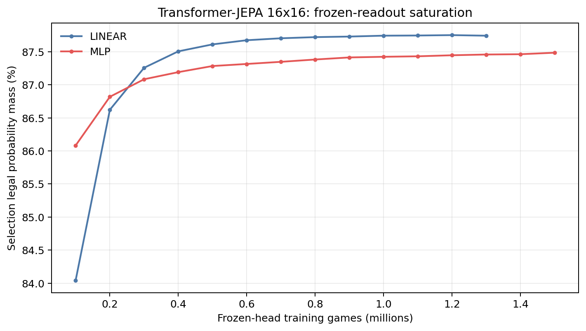
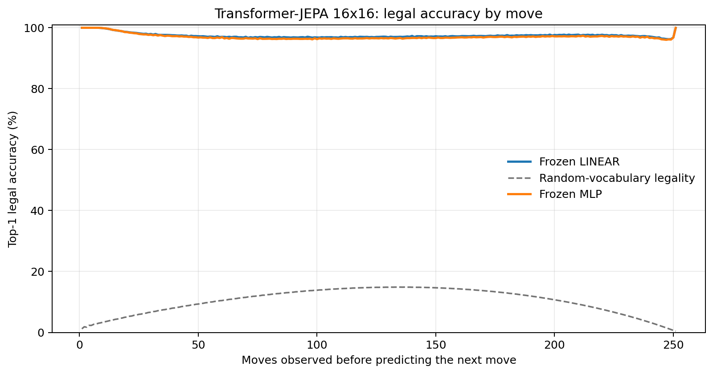
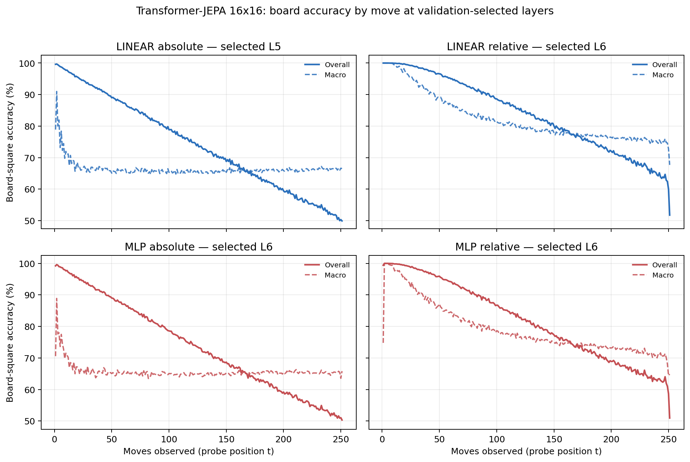

# Proposal evaluation: Transformer-JEPA 16x16

- **Suite:** `thesis_eval_suite_v1` over `unified_eval_v4`
- **Run:** `selected`
- **Checkpoint:** `final.pt` (`318065f6633a198860466a57e4fec40959b7e6ece35bd595a7a1bb66bb67e6c8`)
- **Training budget:** `20,000,000` games / `200` shards
- **Next-move readout:** frozen bf16 encoder with common fp32 Linear/MLP readouts
- **Exact continuation:** intentionally excluded because corpus continuations are stochastic legal choices

## 1. Functional legality

| Readout | Top-1 legal | Top-3 legal fraction | Top-5 legal fraction | Legal probability mass |
|---|---:|---:|---:|---:|
| Frozen LINEAR | 97.44% | 96.38% | 95.18% | 87.76% |
| Frozen MLP | 97.07% | 96.02% | 94.83% | 87.47% |

### Statistical context

| Readout | Normalized legal lift | 95% CI for top-1 legal |
|---|---:|---:|
| Frozen LINEAR | 97.14% | 97.42%–97.45% |
| Frozen MLP | 96.73% | 97.06%–97.09% |

### Frozen-head saturation

There is no minimum shard count. Training stops under the pre-registered selection legal-mass patience rule and restores the best checkpoint.

### Legal accuracy by move

### Legality by normalized game phase

| Readout | Phase | Tokens | Mean legal moves | Top-1 legal | Legal mass |
|---|---:|---:|---:|---:|---:|
| Frozen LINEAR | 0.00–0.25 | 3,148,134 | 16.93 | 98.18% | 91.74% |
| Frozen LINEAR | 0.25–0.50 | 3,097,644 | 33.66 | 96.90% | 84.31% |
| Frozen LINEAR | 0.50–0.75 | 3,147,606 | 35.65 | 97.23% | 85.39% |
| Frozen LINEAR | 0.75–1.00 | 3,147,581 | 18.01 | 97.42% | 89.55% |
| Frozen MLP | 0.00–0.25 | 3,148,134 | 16.93 | 97.99% | 91.20% |
| Frozen MLP | 0.25–0.50 | 3,097,644 | 33.66 | 96.45% | 84.19% |
| Frozen MLP | 0.50–0.75 | 3,147,606 | 35.65 | 96.78% | 85.23% |
| Frozen MLP | 0.75–1.00 | 3,147,581 | 18.01 | 97.06% | 89.21% |

## 2. Board-state representations

Layer selection uses only the selection split. Headline test values are macro-balanced accuracy, so changing empty-square prevalence across board sizes cannot dominate the comparison.

**Macro accuracy** is the unweighted mean of the three per-class recalls. Absolute labels use empty/black/white and relative labels use empty/mine/opponent. Each class therefore contributes one third even when empty squares are much more common. Overall accuracy instead weights every square equally and can be dominated by the empty class.

| Probe | Labels | Best layer | Normalized depth | Test macro | Overall | Occupied | Empty |
|---|---|---:|---:|---:|---:|---:|---:|
| LINEAR | absolute | L5 | 0.625 | 66.28% | 74.36% | 49.50% | 99.85% |
| LINEAR | relative | L6 | 0.750 | 78.67% | 83.79% | 68.17% | 99.79% |
| MLP | absolute | L6 | 0.750 | 65.90% | 74.00% | 49.06% | 99.56% |
| MLP | relative | L6 | 0.750 | 76.37% | 81.88% | 65.07% | 99.12% |

### Probe accuracy by layer

These are the untouched test-split tables in the same format as the 8x8 unified JEPA notebook. `Selected` marks the layer chosen using the separate selection split, never the test results.

#### LINEAR board-state probe

| Layer | Absolute accuracy | Absolute macro | Relative accuracy | Relative macro | Selected |
|---:|---:|---:|---:|---:|:---|
| L0 | 64.70% | 56.62% | 65.54% | 57.74% |  |
| L1 | 65.62% | 57.60% | 67.01% | 59.43% |  |
| L2 | 68.36% | 60.27% | 69.74% | 62.07% |  |
| L3 | 71.28% | 63.15% | 72.80% | 65.14% |  |
| L4 | 72.71% | 64.58% | 75.62% | 68.40% |  |
| L5 | 74.36% | 66.28% | 80.50% | 74.34% | absolute |
| L6 | 74.40% | 66.31% | 83.79% | 78.67% | relative |
| L7 | 74.11% | 66.00% | 83.46% | 78.33% |  |
| L8 | 73.69% | 65.58% | 82.52% | 77.26% |  |

#### MLP board-state probe

| Layer | Absolute accuracy | Absolute macro | Relative accuracy | Relative macro | Selected |
|---:|---:|---:|---:|---:|:---|
| L0 | 65.53% | 57.51% | 65.79% | 57.83% |  |
| L1 | 66.08% | 57.98% | 66.65% | 58.72% |  |
| L2 | 67.70% | 59.65% | 68.45% | 60.55% |  |
| L3 | 69.80% | 61.74% | 70.77% | 62.98% |  |
| L4 | 71.24% | 63.18% | 73.21% | 65.75% |  |
| L5 | 73.43% | 65.29% | 78.17% | 71.58% |  |
| L6 | 74.00% | 65.90% | 81.88% | 76.37% | absolute + relative |
| L7 | 73.61% | 65.41% | 81.57% | 75.97% |  |
| L8 | 73.12% | 64.92% | 80.32% | 74.51% |  |

### Board accuracy by move at each selected layer

### Selected board probes by game phase

| Probe | Labels | Phase | Macro accuracy | Occupied | Empty |
|---|---|---:|---:|---:|---:|
| LINEAR | absolute | 1/4 | 74.79% | 63.10% | 100.00% |
| LINEAR | absolute | 2/4 | 67.47% | 51.32% | 100.00% |
| LINEAR | absolute | 11/4 | 65.94% | 49.13% | 99.55% |
| LINEAR | absolute | 12/4 | 66.00% | 49.32% | 99.36% |
| LINEAR | absolute | 13/4 | 66.10% | 49.59% | 99.10% |
| LINEAR | absolute | 14/4 | 66.11% | 49.68% | 98.96% |
| LINEAR | absolute | 15/4 | 66.47% | 50.29% | 98.81% |
| LINEAR | absolute | 16/4 | 66.39% | 50.12% | 98.92% |
| LINEAR | absolute | 3/4 | 66.93% | 50.42% | 100.00% |
| LINEAR | absolute | 4/4 | 66.18% | 49.27% | 100.00% |
| LINEAR | absolute | 5/4 | 65.98% | 48.98% | 99.99% |
| LINEAR | absolute | 6/4 | 65.89% | 48.86% | 99.97% |
| LINEAR | absolute | 7/4 | 65.61% | 48.45% | 99.93% |
| LINEAR | absolute | 8/4 | 65.68% | 48.58% | 99.88% |
| LINEAR | absolute | 9/4 | 65.54% | 48.42% | 99.78% |
| LINEAR | absolute | 10/4 | 65.89% | 48.99% | 99.69% |
| LINEAR | relative | 1/4 | 99.46% | 99.29% | 99.99% |
| LINEAR | relative | 2/4 | 95.75% | 93.74% | 99.99% |
| LINEAR | relative | 11/4 | 77.52% | 66.65% | 99.35% |
| LINEAR | relative | 12/4 | 77.04% | 65.94% | 99.31% |
| LINEAR | relative | 13/4 | 76.54% | 65.23% | 99.24% |
| LINEAR | relative | 14/4 | 76.06% | 64.60% | 99.11% |
| LINEAR | relative | 15/4 | 75.67% | 64.02% | 99.11% |
| LINEAR | relative | 16/4 | 74.31% | 61.92% | 99.21% |
| LINEAR | relative | 3/4 | 91.17% | 86.90% | 99.99% |
| LINEAR | relative | 4/4 | 87.71% | 81.63% | 99.97% |
| LINEAR | relative | 5/4 | 84.88% | 77.40% | 99.95% |
| LINEAR | relative | 6/4 | 82.89% | 74.43% | 99.89% |
| LINEAR | relative | 7/4 | 81.15% | 71.87% | 99.82% |
| LINEAR | relative | 8/4 | 80.08% | 70.32% | 99.72% |
| LINEAR | relative | 9/4 | 78.89% | 68.59% | 99.59% |
| LINEAR | relative | 10/4 | 78.13% | 67.50% | 99.46% |
| MLP | absolute | 1/4 | 73.17% | 60.94% | 100.00% |
| MLP | absolute | 2/4 | 66.90% | 50.48% | 100.00% |
| MLP | absolute | 11/4 | 65.26% | 48.48% | 98.83% |
| MLP | absolute | 12/4 | 65.43% | 48.95% | 98.38% |
| MLP | absolute | 13/4 | 65.41% | 49.31% | 97.62% |
| MLP | absolute | 14/4 | 65.58% | 49.86% | 97.01% |
| MLP | absolute | 15/4 | 65.44% | 50.31% | 95.69% |
| MLP | absolute | 16/4 | 65.33% | 50.53% | 94.91% |
| MLP | absolute | 3/4 | 65.99% | 48.98% | 99.99% |
| MLP | absolute | 4/4 | 65.59% | 48.40% | 99.98% |
| MLP | absolute | 5/4 | 65.43% | 48.18% | 99.94% |
| MLP | absolute | 6/4 | 65.01% | 47.56% | 99.89% |
| MLP | absolute | 7/4 | 64.98% | 47.57% | 99.79% |
| MLP | absolute | 8/4 | 65.00% | 47.67% | 99.63% |
| MLP | absolute | 9/4 | 64.82% | 47.49% | 99.46% |
| MLP | absolute | 10/4 | 65.11% | 48.08% | 99.19% |
| MLP | relative | 1/4 | 98.01% | 97.20% | 100.00% |
| MLP | relative | 2/4 | 93.50% | 90.55% | 100.00% |
| MLP | relative | 11/4 | 74.42% | 62.85% | 97.68% |
| MLP | relative | 12/4 | 74.02% | 62.64% | 96.86% |
| MLP | relative | 13/4 | 73.36% | 62.26% | 95.64% |
| MLP | relative | 14/4 | 72.88% | 62.13% | 94.47% |
| MLP | relative | 15/4 | 71.86% | 62.01% | 91.66% |
| MLP | relative | 16/4 | 70.00% | 60.81% | 88.47% |
| MLP | relative | 3/4 | 88.62% | 83.21% | 99.99% |
| MLP | relative | 4/4 | 85.10% | 77.86% | 99.94% |
| MLP | relative | 5/4 | 82.13% | 73.44% | 99.85% |
| MLP | relative | 6/4 | 80.08% | 70.38% | 99.72% |
| MLP | relative | 7/4 | 78.13% | 67.54% | 99.51% |
| MLP | relative | 8/4 | 76.94% | 65.90% | 99.21% |
| MLP | relative | 9/4 | 75.92% | 64.55% | 98.81% |
| MLP | relative | 10/4 | 75.05% | 63.50% | 98.26% |

## 3. Efficiency and reproducibility

- Encoder parameters: `25,607,680`
- Total parameters: `51,478,016`
- Checkpoint bytes: `416,046,839`
- Evaluation GPU: `NVIDIA L4`
- Training hardware: `unreported`
- Training precision: `bf16`
- Python / PyTorch / CUDA: `3.13.15` / `2.11.0+cu128` / `12.8`
- Median training chunk: `156.83 s`
- Estimated training loop: `8.71 h`
- Median games/s: `637.63`
- Median supervision units/s: `159299.46`
- Timing scope: dt_seconds excludes normal checkpoint/Drive-sync time; validation is included only in observed_train_plus_validation_loop_hours

## 4. Interpretation boundary

- Board probes establish decodability, not by themselves causal use.
- Legal behavior measures rule compatibility, not strategic playing strength.
- Bootstrap legality intervals quantify test-game sampling only; they do not replace independent pretraining seeds.
- Board-probe point estimates use one deterministic probe seed; the random-encoder control is not a substitute for model-seed replication.
- Cross-board results compare separately trained scaling conditions, not zero-shot transfer.

## Artifact index

- Unified JSON: `/content/seed_evaluation_views/transformer_jepa_b16_seed000/runs/selected/thesis_eval/final/results__unified_eval_v4.json`
- Unified summary: `/content/seed_evaluation_views/transformer_jepa_b16_seed000/runs/selected/thesis_eval/final/summary__unified_eval_v4.md`
- Position manifest: `/content/seed_evaluation_views/transformer_jepa_b16_seed000/runs/selected/thesis_eval/final/position_manifest__unified_eval_v4.json`
- Legal-by-move figure: `/content/seed_evaluation_views/transformer_jepa_b16_seed000/runs/selected/thesis_eval/final/legal_accuracy_by_move__thesis_eval_suite_v1.png`
- Board-by-move figure: `/content/seed_evaluation_views/transformer_jepa_b16_seed000/runs/selected/thesis_eval/final/board_accuracy_by_move__thesis_eval_suite_v1.png`
