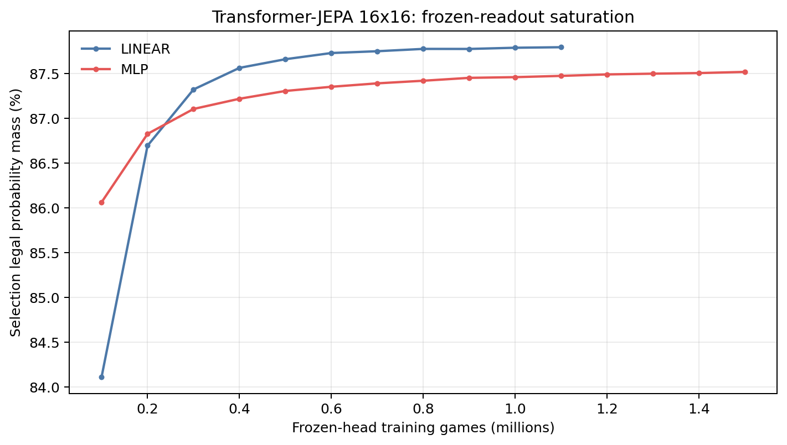
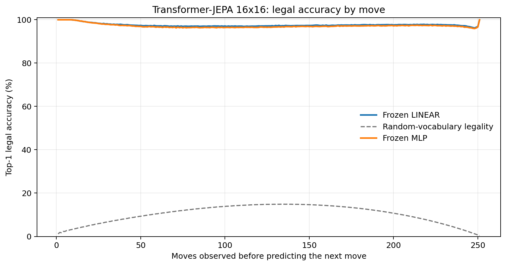
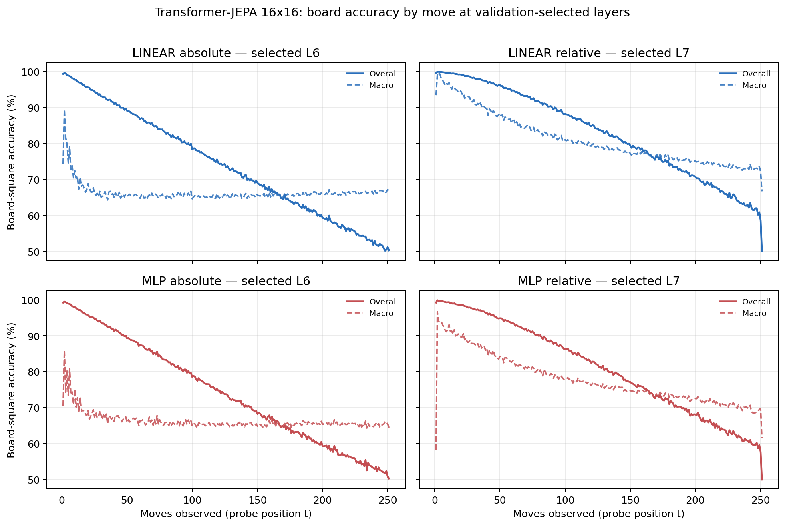

# Proposal evaluation: Transformer-JEPA 16x16

- **Suite:** `thesis_eval_suite_v1` over `unified_eval_v4`
- **Run:** `selected`
- **Checkpoint:** `final.pt` (`7046e3d2667316b7d5cdbadf2c1e586ed5a2242d528dbec09cf8802ad1010cb4`)
- **Training budget:** `20,000,000` games / `200` shards
- **Next-move readout:** frozen bf16 encoder with common fp32 Linear/MLP readouts
- **Exact continuation:** intentionally excluded because corpus continuations are stochastic legal choices

## 1. Functional legality

| Readout | Top-1 legal | Top-3 legal fraction | Top-5 legal fraction | Legal probability mass |
|---|---:|---:|---:|---:|
| Frozen LINEAR | 97.59% | 96.54% | 95.33% | 87.77% |
| Frozen MLP | 97.17% | 96.10% | 94.89% | 87.50% |

### Statistical context

| Readout | Normalized legal lift | 95% CI for top-1 legal |
|---|---:|---:|
| Frozen LINEAR | 97.32% | 97.58%–97.61% |
| Frozen MLP | 96.84% | 97.16%–97.18% |

### Frozen-head saturation

There is no minimum shard count. Training stops under the pre-registered selection legal-mass patience rule and restores the best checkpoint.

### Legal accuracy by move

### Legality by normalized game phase

| Readout | Phase | Tokens | Mean legal moves | Top-1 legal | Legal mass |
|---|---:|---:|---:|---:|---:|
| Frozen LINEAR | 0.00–0.25 | 3,148,134 | 16.93 | 98.31% | 91.68% |
| Frozen LINEAR | 0.25–0.50 | 3,097,644 | 33.66 | 97.05% | 84.14% |
| Frozen LINEAR | 0.50–0.75 | 3,147,606 | 35.65 | 97.42% | 85.39% |
| Frozen LINEAR | 0.75–1.00 | 3,147,581 | 18.01 | 97.59% | 89.82% |
| Frozen MLP | 0.00–0.25 | 3,148,134 | 16.93 | 98.08% | 91.22% |
| Frozen MLP | 0.25–0.50 | 3,097,644 | 33.66 | 96.47% | 84.02% |
| Frozen MLP | 0.50–0.75 | 3,147,606 | 35.65 | 96.95% | 85.26% |
| Frozen MLP | 0.75–1.00 | 3,147,581 | 18.01 | 97.17% | 89.46% |

## 2. Board-state representations

Layer selection uses only the selection split. Headline test values are macro-balanced accuracy, so changing empty-square prevalence across board sizes cannot dominate the comparison.

**Macro accuracy** is the unweighted mean of the three per-class recalls. Absolute labels use empty/black/white and relative labels use empty/mine/opponent. Each class therefore contributes one third even when empty squares are much more common. Overall accuracy instead weights every square equally and can be dominated by the empty class.

| Probe | Labels | Best layer | Normalized depth | Test macro | Overall | Occupied | Empty |
|---|---|---:|---:|---:|---:|---:|---:|
| LINEAR | absolute | L6 | 0.750 | 66.19% | 74.29% | 49.36% | 99.84% |
| LINEAR | relative | L7 | 0.875 | 77.80% | 83.05% | 67.06% | 99.44% |
| MLP | absolute | L6 | 0.750 | 66.43% | 74.37% | 49.93% | 99.42% |
| MLP | relative | L7 | 0.875 | 75.44% | 81.14% | 63.77% | 98.95% |

### Probe accuracy by layer

These are the untouched test-split tables in the same format as the 8x8 unified JEPA notebook. `Selected` marks the layer chosen using the separate selection split, never the test results.

#### LINEAR board-state probe

| Layer | Absolute accuracy | Absolute macro | Relative accuracy | Relative macro | Selected |
|---:|---:|---:|---:|---:|:---|
| L0 | 64.59% | 56.48% | 65.49% | 57.67% |  |
| L1 | 65.74% | 57.70% | 67.06% | 59.45% |  |
| L2 | 68.25% | 60.15% | 69.64% | 61.98% |  |
| L3 | 70.59% | 62.52% | 72.24% | 64.65% |  |
| L4 | 72.45% | 64.34% | 74.25% | 66.67% |  |
| L5 | 73.94% | 65.81% | 80.58% | 74.58% |  |
| L6 | 74.29% | 66.19% | 83.06% | 77.73% | absolute |
| L7 | 74.07% | 65.96% | 83.05% | 77.80% | relative |
| L8 | 73.67% | 65.58% | 82.06% | 76.67% |  |

#### MLP board-state probe

| Layer | Absolute accuracy | Absolute macro | Relative accuracy | Relative macro | Selected |
|---:|---:|---:|---:|---:|:---|
| L0 | 65.50% | 57.48% | 65.77% | 57.81% |  |
| L1 | 66.15% | 58.07% | 66.69% | 58.76% |  |
| L2 | 67.65% | 59.64% | 68.33% | 60.45% |  |
| L3 | 69.26% | 61.19% | 70.32% | 62.53% |  |
| L4 | 70.89% | 62.79% | 72.08% | 64.34% |  |
| L5 | 72.88% | 64.74% | 78.10% | 71.75% |  |
| L6 | 74.37% | 66.43% | 81.10% | 75.39% | absolute |
| L7 | 73.79% | 65.66% | 81.14% | 75.44% | relative |
| L8 | 73.08% | 64.89% | 79.86% | 73.93% |  |

### Board accuracy by move at each selected layer

### Selected board probes by game phase

| Probe | Labels | Phase | Macro accuracy | Occupied | Empty |
|---|---|---:|---:|---:|---:|
| LINEAR | absolute | 1/4 | 74.77% | 63.06% | 100.00% |
| LINEAR | absolute | 2/4 | 67.46% | 51.31% | 100.00% |
| LINEAR | absolute | 11/4 | 65.78% | 48.88% | 99.57% |
| LINEAR | absolute | 12/4 | 65.89% | 49.14% | 99.38% |
| LINEAR | absolute | 13/4 | 66.16% | 49.61% | 99.26% |
| LINEAR | absolute | 14/4 | 66.20% | 49.67% | 99.25% |
| LINEAR | absolute | 15/4 | 66.53% | 50.16% | 99.24% |
| LINEAR | absolute | 16/4 | 66.61% | 50.12% | 99.59% |
| LINEAR | absolute | 3/4 | 66.26% | 49.41% | 99.99% |
| LINEAR | absolute | 4/4 | 65.94% | 48.92% | 99.98% |
| LINEAR | absolute | 5/4 | 65.68% | 48.54% | 99.96% |
| LINEAR | absolute | 6/4 | 65.71% | 48.61% | 99.91% |
| LINEAR | absolute | 7/4 | 65.67% | 48.59% | 99.85% |
| LINEAR | absolute | 8/4 | 65.45% | 48.29% | 99.79% |
| LINEAR | absolute | 9/4 | 65.59% | 48.54% | 99.69% |
| LINEAR | absolute | 10/4 | 65.64% | 48.64% | 99.63% |
| LINEAR | relative | 1/4 | 96.49% | 95.03% | 99.98% |
| LINEAR | relative | 2/4 | 93.06% | 89.93% | 99.92% |
| LINEAR | relative | 11/4 | 76.87% | 66.05% | 98.64% |
| LINEAR | relative | 12/4 | 76.09% | 65.05% | 98.24% |
| LINEAR | relative | 13/4 | 75.31% | 64.04% | 97.91% |
| LINEAR | relative | 14/4 | 74.45% | 62.99% | 97.50% |
| LINEAR | relative | 15/4 | 73.62% | 61.88% | 97.22% |
| LINEAR | relative | 16/4 | 72.44% | 59.93% | 97.51% |
| LINEAR | relative | 3/4 | 89.60% | 84.71% | 99.90% |
| LINEAR | relative | 4/4 | 86.96% | 80.72% | 99.82% |
| LINEAR | relative | 5/4 | 84.52% | 77.07% | 99.73% |
| LINEAR | relative | 6/4 | 82.60% | 74.20% | 99.64% |
| LINEAR | relative | 7/4 | 80.86% | 71.66% | 99.46% |
| LINEAR | relative | 8/4 | 79.85% | 70.24% | 99.29% |
| LINEAR | relative | 9/4 | 78.66% | 68.53% | 99.10% |
| LINEAR | relative | 10/4 | 77.55% | 66.91% | 98.95% |
| MLP | absolute | 1/4 | 74.81% | 63.33% | 100.00% |
| MLP | absolute | 2/4 | 68.88% | 53.43% | 100.00% |
| MLP | absolute | 11/4 | 65.60% | 49.13% | 98.54% |
| MLP | absolute | 12/4 | 65.63% | 49.53% | 97.82% |
| MLP | absolute | 13/4 | 65.73% | 50.14% | 96.91% |
| MLP | absolute | 14/4 | 65.59% | 50.46% | 95.85% |
| MLP | absolute | 15/4 | 65.41% | 50.92% | 94.38% |
| MLP | absolute | 16/4 | 65.13% | 51.21% | 92.97% |
| MLP | absolute | 3/4 | 67.74% | 51.61% | 100.00% |
| MLP | absolute | 4/4 | 66.87% | 50.32% | 99.97% |
| MLP | absolute | 5/4 | 66.32% | 49.51% | 99.94% |
| MLP | absolute | 6/4 | 65.75% | 48.70% | 99.85% |
| MLP | absolute | 7/4 | 65.72% | 48.71% | 99.71% |
| MLP | absolute | 8/4 | 65.50% | 48.48% | 99.54% |
| MLP | absolute | 9/4 | 65.43% | 48.52% | 99.25% |
| MLP | absolute | 10/4 | 65.39% | 48.61% | 98.96% |
| MLP | relative | 1/4 | 91.40% | 87.99% | 99.94% |
| MLP | relative | 2/4 | 88.92% | 84.02% | 99.85% |
| MLP | relative | 11/4 | 74.11% | 62.46% | 97.55% |
| MLP | relative | 12/4 | 73.43% | 61.90% | 96.57% |
| MLP | relative | 13/4 | 72.71% | 61.31% | 95.56% |
| MLP | relative | 14/4 | 71.66% | 60.39% | 94.27% |
| MLP | relative | 15/4 | 70.68% | 59.74% | 92.59% |
| MLP | relative | 16/4 | 69.10% | 58.32% | 90.67% |
| MLP | relative | 3/4 | 86.05% | 79.61% | 99.80% |
| MLP | relative | 4/4 | 83.32% | 75.44% | 99.71% |
| MLP | relative | 5/4 | 81.18% | 72.25% | 99.61% |
| MLP | relative | 6/4 | 79.44% | 69.65% | 99.41% |
| MLP | relative | 7/4 | 77.92% | 67.43% | 99.23% |
| MLP | relative | 8/4 | 76.94% | 66.11% | 98.94% |
| MLP | relative | 9/4 | 75.78% | 64.52% | 98.55% |
| MLP | relative | 10/4 | 74.81% | 63.20% | 98.18% |

## 3. Efficiency and reproducibility

- Encoder parameters: `25,607,680`
- Total parameters: `51,478,016`
- Checkpoint bytes: `416,046,839`
- Evaluation GPU: `NVIDIA L4`
- Training hardware: `unreported`
- Training precision: `bf16`
- Python / PyTorch / CUDA: `3.13.15` / `2.11.0+cu128` / `12.8`
- Median training chunk: `152.54 s`
- Estimated training loop: `8.47 h`
- Median games/s: `655.57`
- Median supervision units/s: `163791.44`
- Timing scope: dt_seconds excludes normal checkpoint/Drive-sync time; validation is included only in observed_train_plus_validation_loop_hours

## 4. Interpretation boundary

- Board probes establish decodability, not by themselves causal use.
- Legal behavior measures rule compatibility, not strategic playing strength.
- Bootstrap legality intervals quantify test-game sampling only; they do not replace independent pretraining seeds.
- Board-probe point estimates use one deterministic probe seed; the random-encoder control is not a substitute for model-seed replication.
- Cross-board results compare separately trained scaling conditions, not zero-shot transfer.

## Artifact index

- Unified JSON: `/content/seed_evaluation_views/transformer_jepa_b16_seed001/runs/selected/thesis_eval/final/results__unified_eval_v4.json`
- Unified summary: `/content/seed_evaluation_views/transformer_jepa_b16_seed001/runs/selected/thesis_eval/final/summary__unified_eval_v4.md`
- Position manifest: `/content/seed_evaluation_views/transformer_jepa_b16_seed001/runs/selected/thesis_eval/final/position_manifest__unified_eval_v4.json`
- Legal-by-move figure: `/content/seed_evaluation_views/transformer_jepa_b16_seed001/runs/selected/thesis_eval/final/legal_accuracy_by_move__thesis_eval_suite_v1.png`
- Board-by-move figure: `/content/seed_evaluation_views/transformer_jepa_b16_seed001/runs/selected/thesis_eval/final/board_accuracy_by_move__thesis_eval_suite_v1.png`
