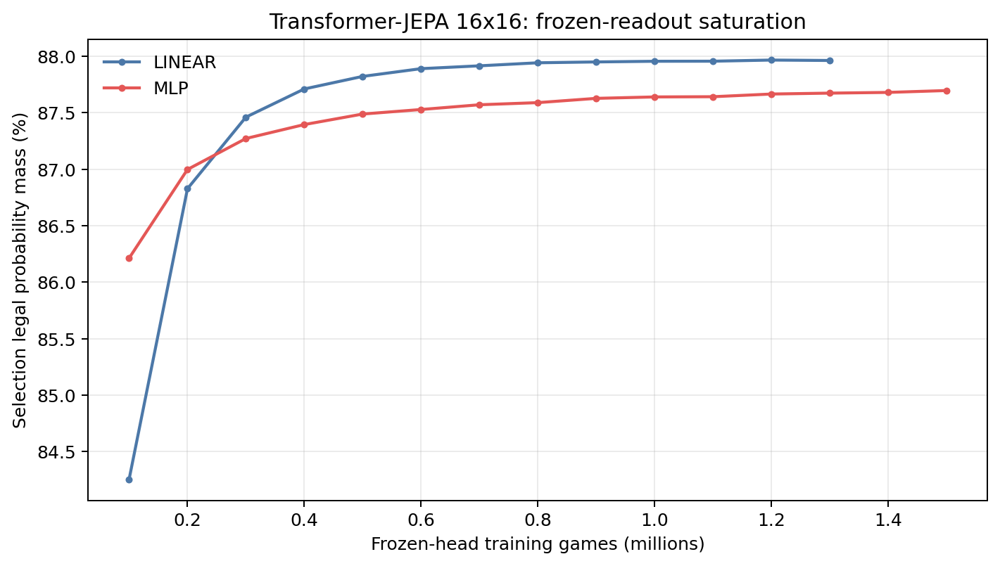
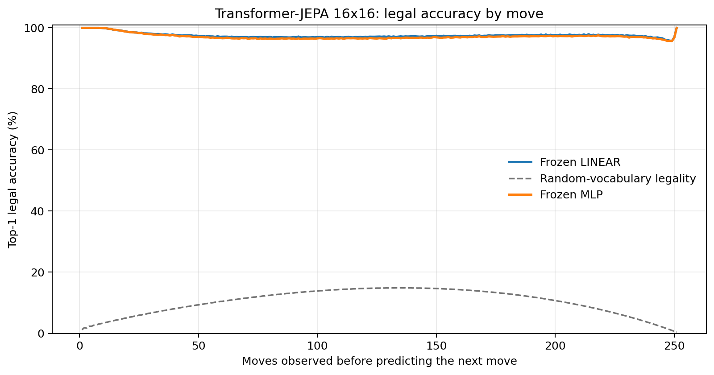
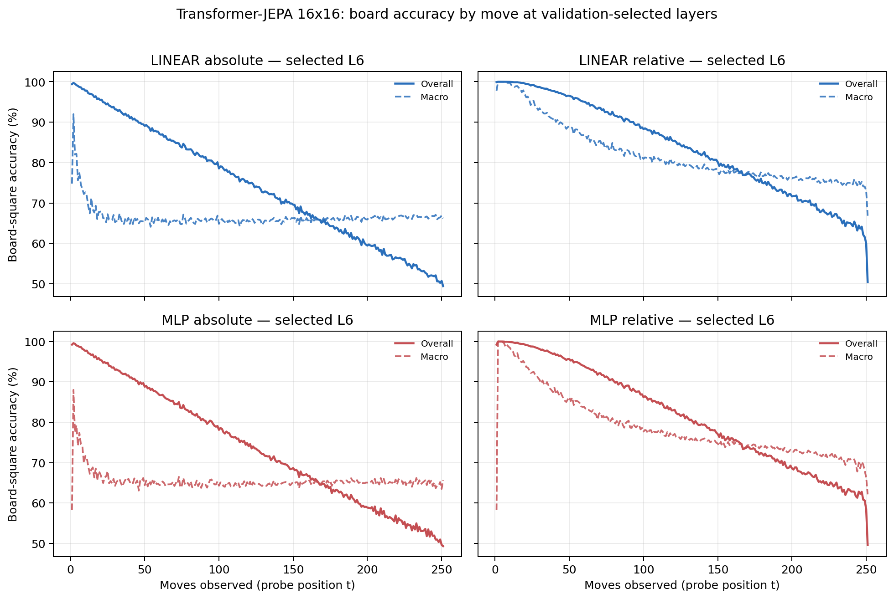

# Proposal evaluation: Transformer-JEPA 16x16

- **Suite:** `thesis_eval_suite_v1` over `unified_eval_v4`
- **Run:** `selected`
- **Checkpoint:** `final.pt` (`bbf3750b24981667030cde758d79aba5e90ca6ab74cb7c6fb253135ecfd60bf5`)
- **Training budget:** `20,000,000` games / `200` shards
- **Next-move readout:** frozen bf16 encoder with common fp32 Linear/MLP readouts
- **Exact continuation:** intentionally excluded because corpus continuations are stochastic legal choices

## 1. Functional legality

| Readout | Top-1 legal | Top-3 legal fraction | Top-5 legal fraction | Legal probability mass |
|---|---:|---:|---:|---:|
| Frozen LINEAR | 97.51% | 96.47% | 95.28% | 87.97% |
| Frozen MLP | 97.16% | 96.12% | 94.93% | 87.67% |

### Statistical context

| Readout | Normalized legal lift | 95% CI for top-1 legal |
|---|---:|---:|
| Frozen LINEAR | 97.23% | 97.50%–97.53% |
| Frozen MLP | 96.84% | 97.15%–97.18% |

### Frozen-head saturation

There is no minimum shard count. Training stops under the pre-registered selection legal-mass patience rule and restores the best checkpoint.

### Legal accuracy by move

### Legality by normalized game phase

| Readout | Phase | Tokens | Mean legal moves | Top-1 legal | Legal mass |
|---|---:|---:|---:|---:|---:|
| Frozen LINEAR | 0.00–0.25 | 3,148,134 | 16.93 | 98.30% | 92.11% |
| Frozen LINEAR | 0.25–0.50 | 3,097,644 | 33.66 | 96.97% | 84.44% |
| Frozen LINEAR | 0.50–0.75 | 3,147,606 | 35.65 | 97.35% | 85.52% |
| Frozen LINEAR | 0.75–1.00 | 3,147,581 | 18.01 | 97.42% | 89.75% |
| Frozen MLP | 0.00–0.25 | 3,148,134 | 16.93 | 98.13% | 91.51% |
| Frozen MLP | 0.25–0.50 | 3,097,644 | 33.66 | 96.50% | 84.35% |
| Frozen MLP | 0.50–0.75 | 3,147,606 | 35.65 | 96.91% | 85.39% |
| Frozen MLP | 0.75–1.00 | 3,147,581 | 18.01 | 97.10% | 89.37% |

## 2. Board-state representations

Layer selection uses only the selection split. Headline test values are macro-balanced accuracy, so changing empty-square prevalence across board sizes cannot dominate the comparison.

**Macro accuracy** is the unweighted mean of the three per-class recalls. Absolute labels use empty/black/white and relative labels use empty/mine/opponent. Each class therefore contributes one third even when empty squares are much more common. Overall accuracy instead weights every square equally and can be dominated by the empty class.

| Probe | Labels | Best layer | Normalized depth | Test macro | Overall | Occupied | Empty |
|---|---|---:|---:|---:|---:|---:|---:|
| LINEAR | absolute | L6 | 0.750 | 66.30% | 74.39% | 49.51% | 99.89% |
| LINEAR | relative | L6 | 0.750 | 78.54% | 83.69% | 68.00% | 99.77% |
| MLP | absolute | L6 | 0.750 | 65.81% | 73.92% | 48.95% | 99.51% |
| MLP | relative | L6 | 0.750 | 76.18% | 81.73% | 64.85% | 99.02% |

### Probe accuracy by layer

These are the untouched test-split tables in the same format as the 8x8 unified JEPA notebook. `Selected` marks the layer chosen using the separate selection split, never the test results.

#### LINEAR board-state probe

| Layer | Absolute accuracy | Absolute macro | Relative accuracy | Relative macro | Selected |
|---:|---:|---:|---:|---:|:---|
| L0 | 64.55% | 56.49% | 65.42% | 57.63% |  |
| L1 | 65.66% | 57.62% | 67.00% | 59.38% |  |
| L2 | 68.22% | 60.17% | 69.54% | 61.89% |  |
| L3 | 70.64% | 62.57% | 72.13% | 64.51% |  |
| L4 | 72.52% | 64.43% | 74.37% | 66.82% |  |
| L5 | 73.91% | 65.80% | 80.49% | 74.48% |  |
| L6 | 74.39% | 66.30% | 83.69% | 78.54% | absolute + relative |
| L7 | 74.03% | 65.91% | 83.43% | 78.32% |  |
| L8 | 73.69% | 65.60% | 82.44% | 77.17% |  |

#### MLP board-state probe

| Layer | Absolute accuracy | Absolute macro | Relative accuracy | Relative macro | Selected |
|---:|---:|---:|---:|---:|:---|
| L0 | 65.52% | 57.50% | 65.76% | 57.80% |  |
| L1 | 66.07% | 57.99% | 66.62% | 58.69% |  |
| L2 | 67.58% | 59.52% | 68.31% | 60.41% |  |
| L3 | 69.39% | 61.38% | 70.34% | 62.54% |  |
| L4 | 70.97% | 62.88% | 72.24% | 64.50% |  |
| L5 | 72.71% | 64.57% | 77.98% | 71.57% |  |
| L6 | 73.92% | 65.81% | 81.73% | 76.18% | absolute + relative |
| L7 | 73.56% | 65.36% | 81.49% | 75.90% |  |
| L8 | 73.08% | 64.89% | 80.14% | 74.30% |  |

### Board accuracy by move at each selected layer

### Selected board probes by game phase

| Probe | Labels | Phase | Macro accuracy | Occupied | Empty |
|---|---|---:|---:|---:|---:|
| LINEAR | absolute | 1/4 | 74.84% | 63.12% | 100.00% |
| LINEAR | absolute | 2/4 | 67.27% | 51.01% | 100.00% |
| LINEAR | absolute | 11/4 | 65.95% | 49.10% | 99.67% |
| LINEAR | absolute | 12/4 | 66.14% | 49.40% | 99.61% |
| LINEAR | absolute | 13/4 | 66.25% | 49.63% | 99.49% |
| LINEAR | absolute | 14/4 | 66.35% | 49.82% | 99.40% |
| LINEAR | absolute | 15/4 | 66.74% | 50.41% | 99.39% |
| LINEAR | absolute | 16/4 | 66.56% | 50.08% | 99.51% |
| LINEAR | absolute | 3/4 | 66.13% | 49.21% | 100.00% |
| LINEAR | absolute | 4/4 | 65.91% | 48.88% | 99.99% |
| LINEAR | absolute | 5/4 | 65.68% | 48.53% | 99.97% |
| LINEAR | absolute | 6/4 | 65.88% | 48.85% | 99.95% |
| LINEAR | absolute | 7/4 | 65.83% | 48.80% | 99.91% |
| LINEAR | absolute | 8/4 | 65.60% | 48.48% | 99.84% |
| LINEAR | absolute | 9/4 | 65.77% | 48.76% | 99.81% |
| LINEAR | absolute | 10/4 | 65.94% | 49.03% | 99.77% |
| LINEAR | relative | 1/4 | 99.33% | 99.02% | 100.00% |
| LINEAR | relative | 2/4 | 95.20% | 92.92% | 100.00% |
| LINEAR | relative | 11/4 | 77.58% | 66.77% | 99.34% |
| LINEAR | relative | 12/4 | 76.91% | 65.80% | 99.25% |
| LINEAR | relative | 13/4 | 76.31% | 64.99% | 99.04% |
| LINEAR | relative | 14/4 | 75.85% | 64.41% | 98.83% |
| LINEAR | relative | 15/4 | 75.25% | 63.55% | 98.77% |
| LINEAR | relative | 16/4 | 74.06% | 61.65% | 98.98% |
| LINEAR | relative | 3/4 | 90.71% | 86.25% | 99.99% |
| LINEAR | relative | 4/4 | 87.63% | 81.58% | 99.97% |
| LINEAR | relative | 5/4 | 84.67% | 77.15% | 99.92% |
| LINEAR | relative | 6/4 | 82.88% | 74.46% | 99.88% |
| LINEAR | relative | 7/4 | 81.14% | 71.88% | 99.79% |
| LINEAR | relative | 8/4 | 80.06% | 70.30% | 99.70% |
| LINEAR | relative | 9/4 | 78.98% | 68.73% | 99.62% |
| LINEAR | relative | 10/4 | 77.98% | 67.26% | 99.55% |
| MLP | absolute | 1/4 | 73.24% | 61.05% | 100.00% |
| MLP | absolute | 2/4 | 66.87% | 50.42% | 100.00% |
| MLP | absolute | 11/4 | 65.29% | 48.58% | 98.70% |
| MLP | absolute | 12/4 | 65.34% | 48.88% | 98.25% |
| MLP | absolute | 13/4 | 65.29% | 49.24% | 97.40% |
| MLP | absolute | 14/4 | 65.26% | 49.67% | 96.43% |
| MLP | absolute | 15/4 | 65.27% | 50.29% | 95.23% |
| MLP | absolute | 16/4 | 64.92% | 50.37% | 94.02% |
| MLP | absolute | 3/4 | 65.81% | 48.71% | 100.00% |
| MLP | absolute | 4/4 | 65.45% | 48.18% | 99.98% |
| MLP | absolute | 5/4 | 65.12% | 47.71% | 99.95% |
| MLP | absolute | 6/4 | 64.84% | 47.32% | 99.88% |
| MLP | absolute | 7/4 | 64.93% | 47.50% | 99.77% |
| MLP | absolute | 8/4 | 64.91% | 47.57% | 99.58% |
| MLP | absolute | 9/4 | 64.78% | 47.47% | 99.38% |
| MLP | absolute | 10/4 | 65.01% | 47.96% | 99.13% |
| MLP | relative | 1/4 | 97.28% | 96.24% | 100.00% |
| MLP | relative | 2/4 | 92.65% | 89.34% | 100.00% |
| MLP | relative | 11/4 | 74.47% | 63.04% | 97.47% |
| MLP | relative | 12/4 | 73.98% | 62.75% | 96.53% |
| MLP | relative | 13/4 | 73.18% | 62.26% | 95.11% |
| MLP | relative | 14/4 | 72.43% | 62.00% | 93.38% |
| MLP | relative | 15/4 | 71.40% | 61.60% | 91.11% |
| MLP | relative | 16/4 | 69.38% | 60.30% | 87.64% |
| MLP | relative | 3/4 | 87.87% | 82.17% | 99.98% |
| MLP | relative | 4/4 | 84.69% | 77.32% | 99.94% |
| MLP | relative | 5/4 | 81.72% | 72.89% | 99.83% |
| MLP | relative | 6/4 | 79.72% | 69.92% | 99.67% |
| MLP | relative | 7/4 | 78.03% | 67.47% | 99.42% |
| MLP | relative | 8/4 | 76.83% | 65.82% | 99.09% |
| MLP | relative | 9/4 | 75.84% | 64.51% | 98.70% |
| MLP | relative | 10/4 | 74.95% | 63.38% | 98.24% |

## 3. Efficiency and reproducibility

- Encoder parameters: `25,607,680`
- Total parameters: `51,478,016`
- Checkpoint bytes: `416,048,119`
- Evaluation GPU: `NVIDIA L4`
- Training hardware: `unreported`
- Training precision: `bf16`
- Python / PyTorch / CUDA: `3.13.15` / `2.11.0+cu128` / `12.8`
- Median training chunk: `153.75 s`
- Estimated training loop: `8.54 h`
- Median games/s: `650.41`
- Median supervision units/s: `162487.36`
- Timing scope: dt_seconds excludes normal checkpoint/Drive-sync time; validation is included only in observed_train_plus_validation_loop_hours

## 4. Interpretation boundary

- Board probes establish decodability, not by themselves causal use.
- Legal behavior measures rule compatibility, not strategic playing strength.
- Bootstrap legality intervals quantify test-game sampling only; they do not replace independent pretraining seeds.
- Board-probe point estimates use one deterministic probe seed; the random-encoder control is not a substitute for model-seed replication.
- Cross-board results compare separately trained scaling conditions, not zero-shot transfer.

## Artifact index

- Unified JSON: `/content/seed_evaluation_views/transformer_jepa_b16_seed002/runs/selected/thesis_eval/final/results__unified_eval_v4.json`
- Unified summary: `/content/seed_evaluation_views/transformer_jepa_b16_seed002/runs/selected/thesis_eval/final/summary__unified_eval_v4.md`
- Position manifest: `/content/seed_evaluation_views/transformer_jepa_b16_seed002/runs/selected/thesis_eval/final/position_manifest__unified_eval_v4.json`
- Legal-by-move figure: `/content/seed_evaluation_views/transformer_jepa_b16_seed002/runs/selected/thesis_eval/final/legal_accuracy_by_move__thesis_eval_suite_v1.png`
- Board-by-move figure: `/content/seed_evaluation_views/transformer_jepa_b16_seed002/runs/selected/thesis_eval/final/board_accuracy_by_move__thesis_eval_suite_v1.png`
