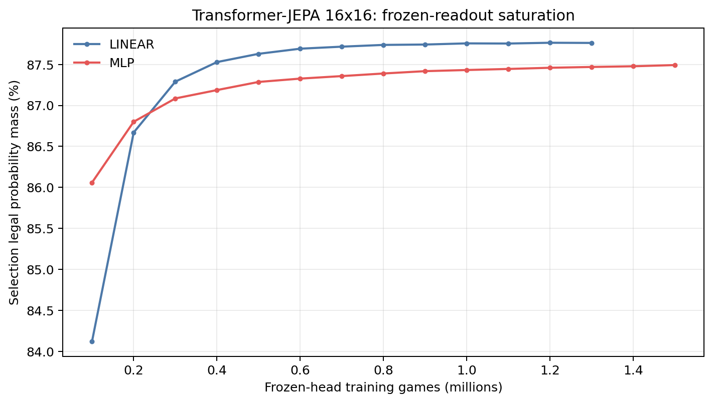
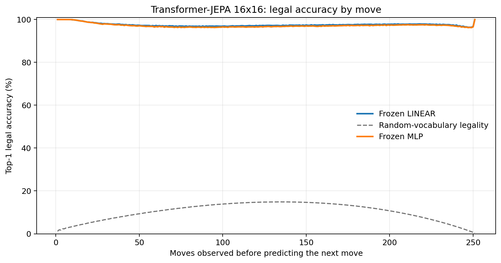
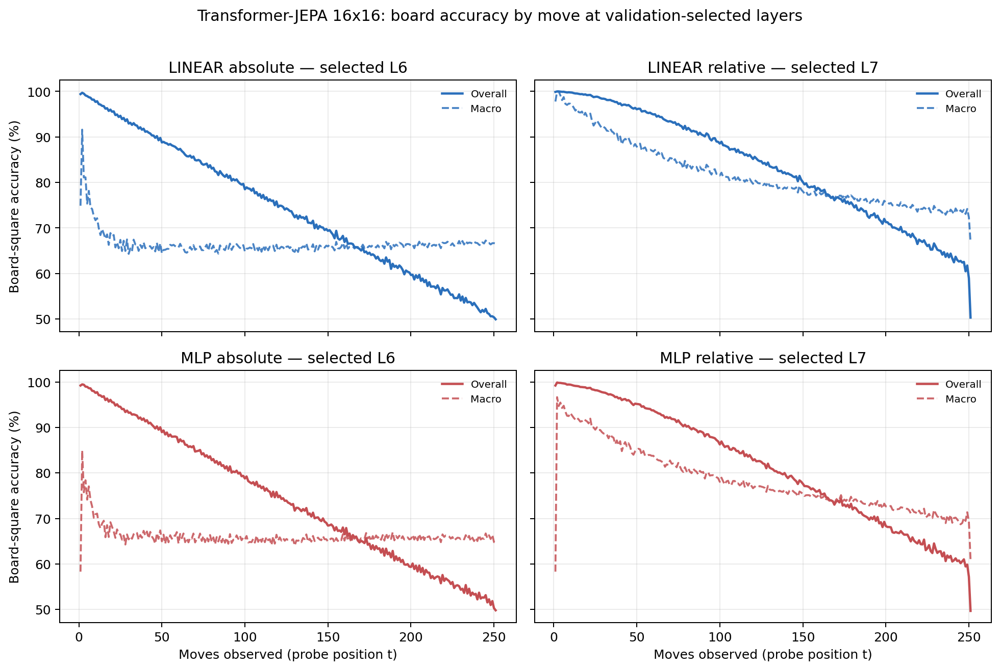

# Proposal evaluation: Transformer-JEPA 16x16

- **Suite:** `thesis_eval_suite_v1` over `unified_eval_v4`
- **Run:** `selected`
- **Checkpoint:** `final.pt` (`d27263bbcc9659b83bf42c99d630f5c49f6de85ccb5d58be10381843b0d8a39c`)
- **Training budget:** `20,000,000` games / `200` shards
- **Next-move readout:** frozen bf16 encoder with common fp32 Linear/MLP readouts
- **Exact continuation:** intentionally excluded because corpus continuations are stochastic legal choices

## 1. Functional legality

| Readout | Top-1 legal | Top-3 legal fraction | Top-5 legal fraction | Legal probability mass |
|---|---:|---:|---:|---:|
| Frozen LINEAR | 97.57% | 96.52% | 95.32% | 87.79% |
| Frozen MLP | 97.21% | 96.15% | 94.94% | 87.49% |

### Statistical context

| Readout | Normalized legal lift | 95% CI for top-1 legal |
|---|---:|---:|
| Frozen LINEAR | 97.30% | 97.56%–97.59% |
| Frozen MLP | 96.89% | 97.20%–97.23% |

### Frozen-head saturation

There is no minimum shard count. Training stops under the pre-registered selection legal-mass patience rule and restores the best checkpoint.

### Legal accuracy by move

### Legality by normalized game phase

| Readout | Phase | Tokens | Mean legal moves | Top-1 legal | Legal mass |
|---|---:|---:|---:|---:|---:|
| Frozen LINEAR | 0.00–0.25 | 3,148,134 | 16.93 | 98.28% | 91.92% |
| Frozen LINEAR | 0.25–0.50 | 3,097,644 | 33.66 | 96.96% | 84.21% |
| Frozen LINEAR | 0.50–0.75 | 3,147,606 | 35.65 | 97.44% | 85.30% |
| Frozen LINEAR | 0.75–1.00 | 3,147,581 | 18.01 | 97.61% | 89.66% |
| Frozen MLP | 0.00–0.25 | 3,148,134 | 16.93 | 98.10% | 91.31% |
| Frozen MLP | 0.25–0.50 | 3,097,644 | 33.66 | 96.47% | 84.13% |
| Frozen MLP | 0.50–0.75 | 3,147,606 | 35.65 | 96.98% | 85.17% |
| Frozen MLP | 0.75–1.00 | 3,147,581 | 18.01 | 97.28% | 89.29% |

## 2. Board-state representations

Layer selection uses only the selection split. Headline test values are macro-balanced accuracy, so changing empty-square prevalence across board sizes cannot dominate the comparison.

**Macro accuracy** is the unweighted mean of the three per-class recalls. Absolute labels use empty/black/white and relative labels use empty/mine/opponent. Each class therefore contributes one third even when empty squares are much more common. Overall accuracy instead weights every square equally and can be dominated by the empty class.

| Probe | Labels | Best layer | Normalized depth | Test macro | Overall | Occupied | Empty |
|---|---|---:|---:|---:|---:|---:|---:|
| LINEAR | absolute | L6 | 0.750 | 66.32% | 74.40% | 49.52% | 99.90% |
| LINEAR | relative | L7 | 0.875 | 78.30% | 83.42% | 67.83% | 99.39% |
| MLP | absolute | L6 | 0.750 | 66.34% | 74.34% | 49.72% | 99.58% |
| MLP | relative | L7 | 0.875 | 75.91% | 81.48% | 64.54% | 98.83% |

### Probe accuracy by layer

These are the untouched test-split tables in the same format as the 8x8 unified JEPA notebook. `Selected` marks the layer chosen using the separate selection split, never the test results.

#### LINEAR board-state probe

| Layer | Absolute accuracy | Absolute macro | Relative accuracy | Relative macro | Selected |
|---:|---:|---:|---:|---:|:---|
| L0 | 64.64% | 56.57% | 65.51% | 57.71% |  |
| L1 | 65.64% | 57.59% | 67.05% | 59.45% |  |
| L2 | 68.14% | 60.01% | 69.61% | 61.95% |  |
| L3 | 70.47% | 62.39% | 72.21% | 64.66% |  |
| L4 | 72.58% | 64.48% | 74.86% | 67.44% |  |
| L5 | 74.28% | 66.19% | 79.22% | 72.67% |  |
| L6 | 74.40% | 66.32% | 83.43% | 78.20% | absolute |
| L7 | 74.02% | 65.90% | 83.42% | 78.30% | relative |
| L8 | 73.60% | 65.48% | 82.30% | 76.97% |  |

#### MLP board-state probe

| Layer | Absolute accuracy | Absolute macro | Relative accuracy | Relative macro | Selected |
|---:|---:|---:|---:|---:|:---|
| L0 | 65.50% | 57.49% | 65.78% | 57.83% |  |
| L1 | 66.09% | 58.04% | 66.70% | 58.83% |  |
| L2 | 67.49% | 59.46% | 68.34% | 60.49% |  |
| L3 | 69.24% | 61.23% | 70.34% | 62.61% |  |
| L4 | 71.01% | 62.92% | 72.61% | 64.99% |  |
| L5 | 73.34% | 65.19% | 76.96% | 69.93% |  |
| L6 | 74.34% | 66.34% | 81.51% | 75.86% | absolute |
| L7 | 73.63% | 65.47% | 81.48% | 75.91% | relative |
| L8 | 73.06% | 64.87% | 80.01% | 74.11% |  |

### Board accuracy by move at each selected layer

### Selected board probes by game phase

| Probe | Labels | Phase | Macro accuracy | Occupied | Empty |
|---|---|---:|---:|---:|---:|
| LINEAR | absolute | 1/4 | 74.94% | 63.25% | 100.00% |
| LINEAR | absolute | 2/4 | 67.30% | 51.07% | 100.00% |
| LINEAR | absolute | 11/4 | 65.97% | 49.09% | 99.72% |
| LINEAR | absolute | 12/4 | 66.08% | 49.29% | 99.64% |
| LINEAR | absolute | 13/4 | 66.34% | 49.72% | 99.58% |
| LINEAR | absolute | 14/4 | 66.36% | 49.74% | 99.59% |
| LINEAR | absolute | 15/4 | 66.69% | 50.22% | 99.62% |
| LINEAR | absolute | 16/4 | 66.68% | 50.17% | 99.69% |
| LINEAR | absolute | 3/4 | 66.35% | 49.54% | 100.00% |
| LINEAR | absolute | 4/4 | 66.03% | 49.05% | 99.99% |
| LINEAR | absolute | 5/4 | 65.70% | 48.57% | 99.97% |
| LINEAR | absolute | 6/4 | 65.81% | 48.74% | 99.94% |
| LINEAR | absolute | 7/4 | 65.86% | 48.85% | 99.90% |
| LINEAR | absolute | 8/4 | 65.79% | 48.75% | 99.86% |
| LINEAR | absolute | 9/4 | 65.80% | 48.80% | 99.80% |
| LINEAR | absolute | 10/4 | 65.97% | 49.09% | 99.75% |
| LINEAR | relative | 1/4 | 97.11% | 96.04% | 99.98% |
| LINEAR | relative | 2/4 | 93.55% | 90.66% | 99.93% |
| LINEAR | relative | 11/4 | 77.24% | 66.74% | 98.37% |
| LINEAR | relative | 12/4 | 76.62% | 65.93% | 98.08% |
| LINEAR | relative | 13/4 | 75.71% | 64.74% | 97.73% |
| LINEAR | relative | 14/4 | 74.83% | 63.68% | 97.24% |
| LINEAR | relative | 15/4 | 74.00% | 62.62% | 96.91% |
| LINEAR | relative | 16/4 | 72.82% | 60.58% | 97.37% |
| LINEAR | relative | 3/4 | 89.96% | 85.26% | 99.89% |
| LINEAR | relative | 4/4 | 87.39% | 81.35% | 99.83% |
| LINEAR | relative | 5/4 | 85.02% | 77.83% | 99.72% |
| LINEAR | relative | 6/4 | 83.34% | 75.32% | 99.58% |
| LINEAR | relative | 7/4 | 81.49% | 72.62% | 99.46% |
| LINEAR | relative | 8/4 | 80.30% | 70.91% | 99.31% |
| LINEAR | relative | 9/4 | 79.15% | 69.31% | 99.01% |
| LINEAR | relative | 10/4 | 78.19% | 68.00% | 98.70% |
| MLP | absolute | 1/4 | 73.03% | 60.81% | 100.00% |
| MLP | absolute | 2/4 | 67.36% | 51.18% | 100.00% |
| MLP | absolute | 11/4 | 65.75% | 49.15% | 98.93% |
| MLP | absolute | 12/4 | 65.93% | 49.64% | 98.48% |
| MLP | absolute | 13/4 | 65.89% | 49.90% | 97.86% |
| MLP | absolute | 14/4 | 65.84% | 50.33% | 96.87% |
| MLP | absolute | 15/4 | 65.87% | 50.94% | 95.73% |
| MLP | absolute | 16/4 | 65.62% | 50.85% | 95.14% |
| MLP | absolute | 3/4 | 66.81% | 50.22% | 99.99% |
| MLP | absolute | 4/4 | 66.26% | 49.40% | 99.98% |
| MLP | absolute | 5/4 | 65.91% | 48.90% | 99.94% |
| MLP | absolute | 6/4 | 65.56% | 48.39% | 99.88% |
| MLP | absolute | 7/4 | 65.63% | 48.55% | 99.78% |
| MLP | absolute | 8/4 | 65.54% | 48.47% | 99.67% |
| MLP | absolute | 9/4 | 65.48% | 48.50% | 99.44% |
| MLP | absolute | 10/4 | 65.49% | 48.63% | 99.20% |
| MLP | relative | 1/4 | 92.27% | 89.36% | 99.95% |
| MLP | relative | 2/4 | 90.15% | 85.80% | 99.85% |
| MLP | relative | 11/4 | 74.41% | 63.15% | 97.08% |
| MLP | relative | 12/4 | 73.92% | 62.82% | 96.24% |
| MLP | relative | 13/4 | 73.00% | 61.98% | 95.12% |
| MLP | relative | 14/4 | 71.92% | 61.02% | 93.81% |
| MLP | relative | 15/4 | 70.79% | 60.42% | 91.62% |
| MLP | relative | 16/4 | 69.21% | 58.74% | 90.18% |
| MLP | relative | 3/4 | 86.65% | 80.50% | 99.78% |
| MLP | relative | 4/4 | 84.14% | 76.65% | 99.69% |
| MLP | relative | 5/4 | 81.87% | 73.30% | 99.56% |
| MLP | relative | 6/4 | 80.25% | 70.87% | 99.38% |
| MLP | relative | 7/4 | 78.43% | 68.21% | 99.19% |
| MLP | relative | 8/4 | 77.31% | 66.66% | 98.92% |
| MLP | relative | 9/4 | 76.17% | 65.17% | 98.39% |
| MLP | relative | 10/4 | 75.44% | 64.37% | 97.77% |

## 3. Efficiency and reproducibility

- Encoder parameters: `25,607,680`
- Total parameters: `51,478,016`
- Checkpoint bytes: `416,046,839`
- Evaluation GPU: `NVIDIA L4`
- Training hardware: `unreported`
- Training precision: `bf16`
- Python / PyTorch / CUDA: `3.13.15` / `2.11.0+cu128` / `12.8`
- Median training chunk: `153.75 s`
- Estimated training loop: `8.54 h`
- Median games/s: `650.40`
- Median supervision units/s: `162504.39`
- Timing scope: dt_seconds excludes normal checkpoint/Drive-sync time; validation is included only in observed_train_plus_validation_loop_hours

## 4. Interpretation boundary

- Board probes establish decodability, not by themselves causal use.
- Legal behavior measures rule compatibility, not strategic playing strength.
- Bootstrap legality intervals quantify test-game sampling only; they do not replace independent pretraining seeds.
- Board-probe point estimates use one deterministic probe seed; the random-encoder control is not a substitute for model-seed replication.
- Cross-board results compare separately trained scaling conditions, not zero-shot transfer.

## Artifact index

- Unified JSON: `/content/seed_evaluation_views/transformer_jepa_b16_seed003/runs/selected/thesis_eval/final/results__unified_eval_v4.json`
- Unified summary: `/content/seed_evaluation_views/transformer_jepa_b16_seed003/runs/selected/thesis_eval/final/summary__unified_eval_v4.md`
- Position manifest: `/content/seed_evaluation_views/transformer_jepa_b16_seed003/runs/selected/thesis_eval/final/position_manifest__unified_eval_v4.json`
- Legal-by-move figure: `/content/seed_evaluation_views/transformer_jepa_b16_seed003/runs/selected/thesis_eval/final/legal_accuracy_by_move__thesis_eval_suite_v1.png`
- Board-by-move figure: `/content/seed_evaluation_views/transformer_jepa_b16_seed003/runs/selected/thesis_eval/final/board_accuracy_by_move__thesis_eval_suite_v1.png`
