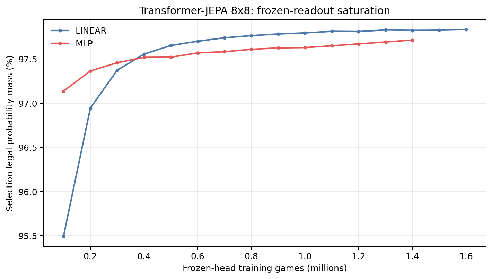
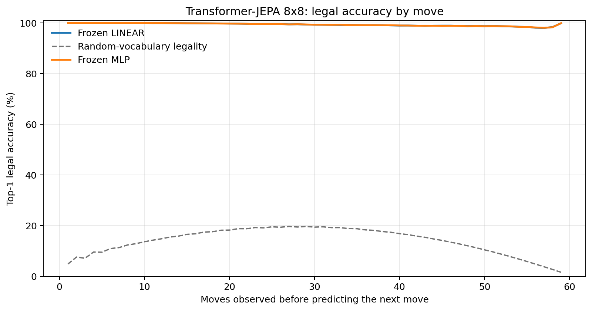
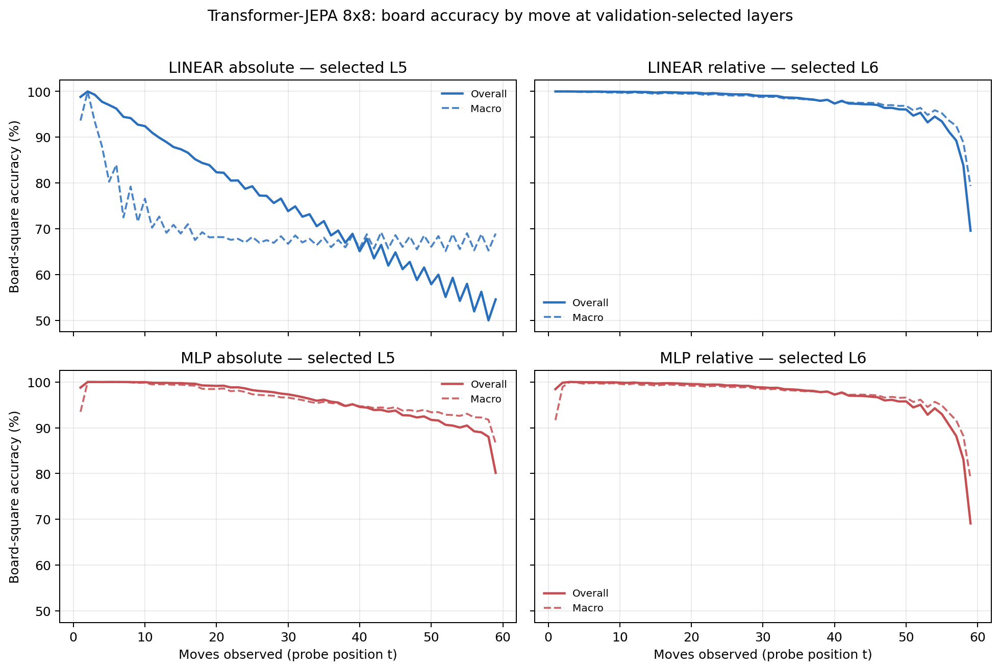

# Proposal evaluation: Transformer-JEPA 8x8

- **Suite:** `thesis_eval_suite_v1` over `unified_eval_v4`
- **Run:** `selected`
- **Checkpoint:** `final.pt` (`37d4dd61621ee4b0c1e8eace9422e22c26776978fc8279e8872e2f06f1a71351`)
- **Training budget:** `19,999,840` games / `200` shards
- **Next-move readout:** frozen bf16 encoder with common fp32 Linear/MLP readouts
- **Exact continuation:** intentionally excluded because corpus continuations are stochastic legal choices

## 1. Functional legality

| Readout | Top-1 legal | Top-3 legal fraction | Top-5 legal fraction | Legal probability mass |
|---|---:|---:|---:|---:|
| Frozen LINEAR | 99.40% | 96.54% | 92.25% | 97.76% |
| Frozen MLP | 99.39% | 96.51% | 92.22% | 97.58% |

### Statistical context

| Readout | Normalized legal lift | 95% CI for top-1 legal |
|---|---:|---:|
| Frozen LINEAR | 99.30% | 99.39%–99.41% |
| Frozen MLP | 99.29% | 99.38%–99.40% |

### Frozen-head saturation

There is no minimum shard count. Training stops under the pre-registered selection legal-mass patience rule and restores the best checkpoint.

### Legal accuracy by move

### Legality by normalized game phase

| Readout | Phase | Tokens | Mean legal moves | Top-1 legal | Legal mass |
|---|---:|---:|---:|---:|---:|
| Frozen LINEAR | 0.00–0.25 | 749,909 | 7.22 | 99.99% | 98.80% |
| Frozen LINEAR | 0.25–0.50 | 699,679 | 11.44 | 99.71% | 98.30% |
| Frozen LINEAR | 0.50–0.75 | 749,593 | 10.84 | 99.16% | 97.22% |
| Frozen LINEAR | 0.75–1.00 | 749,129 | 5.15 | 98.76% | 96.77% |
| Frozen MLP | 0.00–0.25 | 749,909 | 7.22 | 99.99% | 99.05% |
| Frozen MLP | 0.25–0.50 | 699,679 | 11.44 | 99.70% | 98.28% |
| Frozen MLP | 0.50–0.75 | 749,593 | 10.84 | 99.16% | 96.84% |
| Frozen MLP | 0.75–1.00 | 749,129 | 5.15 | 98.74% | 96.19% |

## 2. Board-state representations

Layer selection uses only the selection split. Headline test values are macro-balanced accuracy, so changing empty-square prevalence across board sizes cannot dominate the comparison.

**Macro accuracy** is the unweighted mean of the three per-class recalls. Absolute labels use empty/black/white and relative labels use empty/mine/opponent. Each class therefore contributes one third even when empty squares are much more common. Overall accuracy instead weights every square equally and can be dominated by the empty class.

| Probe | Labels | Best layer | Normalized depth | Test macro | Overall | Occupied | Empty |
|---|---|---:|---:|---:|---:|---:|---:|
| LINEAR | absolute | L5 | 0.625 | 69.01% | 75.67% | 53.56% | 100.00% |
| LINEAR | relative | L6 | 0.750 | 96.89% | 97.58% | 95.39% | 99.99% |
| MLP | absolute | L5 | 0.625 | 95.08% | 96.13% | 92.62% | 100.00% |
| MLP | relative | L6 | 0.750 | 96.56% | 97.33% | 94.92% | 99.97% |

### Probe accuracy by layer

These are the untouched test-split tables in the same format as the 8x8 unified JEPA notebook. `Selected` marks the layer chosen using the separate selection split, never the test results.

#### LINEAR board-state probe

| Layer | Absolute accuracy | Absolute macro | Relative accuracy | Relative macro | Selected |
|---:|---:|---:|---:|---:|:---|
| L0 | 62.71% | 55.80% | 64.80% | 58.18% |  |
| L1 | 75.14% | 68.44% | 87.70% | 84.34% |  |
| L2 | 75.70% | 69.04% | 91.78% | 89.44% |  |
| L3 | 75.69% | 69.02% | 94.19% | 92.55% |  |
| L4 | 75.68% | 69.02% | 96.13% | 95.03% |  |
| L5 | 75.67% | 69.01% | 97.30% | 96.53% | absolute |
| L6 | 75.62% | 68.95% | 97.58% | 96.89% | relative |
| L7 | 75.25% | 68.55% | 97.12% | 96.34% |  |
| L8 | 74.99% | 68.28% | 96.68% | 95.84% |  |

#### MLP board-state probe

| Layer | Absolute accuracy | Absolute macro | Relative accuracy | Relative macro | Selected |
|---:|---:|---:|---:|---:|:---|
| L0 | 65.11% | 58.78% | 65.24% | 58.63% |  |
| L1 | 84.78% | 80.83% | 87.02% | 83.51% |  |
| L2 | 88.84% | 85.79% | 91.53% | 89.10% |  |
| L3 | 91.79% | 89.54% | 93.94% | 92.24% |  |
| L4 | 94.33% | 92.79% | 95.96% | 94.82% |  |
| L5 | 96.13% | 95.08% | 97.13% | 96.31% | absolute |
| L6 | 95.24% | 93.95% | 97.33% | 96.56% | relative |
| L7 | 92.68% | 90.82% | 96.67% | 95.80% |  |
| L8 | 89.27% | 86.58% | 96.02% | 95.05% |  |

### Board accuracy by move at each selected layer

### Selected board probes by game phase

| Probe | Labels | Phase | Macro accuracy | Occupied | Empty |
|---|---|---:|---:|---:|---:|
| LINEAR | absolute | 1/4 | 95.79% | 93.30% | 100.00% |
| LINEAR | absolute | 2/4 | 82.77% | 75.80% | 100.00% |
| LINEAR | absolute | 11/4 | 67.59% | 51.41% | 100.00% |
| LINEAR | absolute | 12/4 | 67.83% | 51.74% | 100.00% |
| LINEAR | absolute | 13/4 | 68.32% | 52.55% | 100.00% |
| LINEAR | absolute | 14/4 | 67.76% | 51.64% | 100.00% |
| LINEAR | absolute | 15/4 | 67.88% | 51.81% | 100.00% |
| LINEAR | absolute | 16/4 | 67.55% | 51.32% | 100.00% |
| LINEAR | absolute | 3/4 | 76.02% | 65.02% | 100.00% |
| LINEAR | absolute | 4/4 | 72.09% | 58.22% | 100.00% |
| LINEAR | absolute | 5/4 | 70.51% | 56.07% | 100.00% |
| LINEAR | absolute | 6/4 | 68.99% | 53.61% | 100.00% |
| LINEAR | absolute | 7/4 | 68.56% | 53.24% | 100.00% |
| LINEAR | absolute | 8/4 | 68.43% | 52.70% | 100.00% |
| LINEAR | absolute | 9/4 | 68.27% | 52.44% | 100.00% |
| LINEAR | absolute | 10/4 | 67.45% | 51.20% | 100.00% |
| LINEAR | relative | 1/4 | 100.00% | 100.00% | 100.00% |
| LINEAR | relative | 2/4 | 99.88% | 99.85% | 100.00% |
| LINEAR | relative | 11/4 | 97.92% | 96.91% | 99.99% |
| LINEAR | relative | 12/4 | 97.64% | 96.50% | 99.99% |
| LINEAR | relative | 13/4 | 97.30% | 95.99% | 99.98% |
| LINEAR | relative | 14/4 | 96.65% | 95.02% | 99.98% |
| LINEAR | relative | 15/4 | 95.59% | 93.47% | 99.98% |
| LINEAR | relative | 16/4 | 88.55% | 82.93% | 99.96% |
| LINEAR | relative | 3/4 | 99.72% | 99.61% | 100.00% |
| LINEAR | relative | 4/4 | 99.70% | 99.56% | 100.00% |
| LINEAR | relative | 5/4 | 99.55% | 99.35% | 100.00% |
| LINEAR | relative | 6/4 | 99.40% | 99.14% | 99.99% |
| LINEAR | relative | 7/4 | 99.27% | 98.94% | 99.99% |
| LINEAR | relative | 8/4 | 99.02% | 98.57% | 99.98% |
| LINEAR | relative | 9/4 | 98.70% | 98.09% | 99.98% |
| LINEAR | relative | 10/4 | 98.37% | 97.60% | 99.97% |
| MLP | absolute | 1/4 | 97.89% | 95.75% | 100.00% |
| MLP | absolute | 2/4 | 99.98% | 99.97% | 100.00% |
| MLP | absolute | 11/4 | 94.99% | 92.49% | 100.00% |
| MLP | absolute | 12/4 | 94.44% | 91.65% | 100.00% |
| MLP | absolute | 13/4 | 94.07% | 91.10% | 100.00% |
| MLP | absolute | 14/4 | 93.63% | 90.44% | 100.00% |
| MLP | absolute | 15/4 | 92.90% | 89.34% | 100.00% |
| MLP | absolute | 16/4 | 90.72% | 86.09% | 100.00% |
| MLP | absolute | 3/4 | 99.77% | 99.67% | 100.00% |
| MLP | absolute | 4/4 | 99.47% | 99.21% | 100.00% |
| MLP | absolute | 5/4 | 99.11% | 98.66% | 100.00% |
| MLP | absolute | 6/4 | 98.41% | 97.61% | 100.00% |
| MLP | absolute | 7/4 | 97.78% | 96.69% | 100.00% |
| MLP | absolute | 8/4 | 97.00% | 95.51% | 100.00% |
| MLP | absolute | 9/4 | 96.20% | 94.30% | 100.00% |
| MLP | absolute | 10/4 | 95.53% | 93.30% | 100.00% |
| MLP | relative | 1/4 | 96.73% | 94.00% | 100.00% |
| MLP | relative | 2/4 | 99.75% | 99.68% | 100.00% |
| MLP | relative | 11/4 | 97.73% | 96.65% | 99.95% |
| MLP | relative | 12/4 | 97.36% | 96.11% | 99.94% |
| MLP | relative | 13/4 | 96.94% | 95.53% | 99.86% |
| MLP | relative | 14/4 | 96.38% | 94.67% | 99.90% |
| MLP | relative | 15/4 | 95.28% | 93.06% | 99.91% |
| MLP | relative | 16/4 | 87.96% | 82.19% | 99.76% |
| MLP | relative | 3/4 | 99.58% | 99.42% | 100.00% |
| MLP | relative | 4/4 | 99.48% | 99.26% | 100.00% |
| MLP | relative | 5/4 | 99.33% | 99.04% | 100.00% |
| MLP | relative | 6/4 | 99.12% | 98.73% | 99.99% |
| MLP | relative | 7/4 | 99.02% | 98.59% | 99.97% |
| MLP | relative | 8/4 | 98.77% | 98.21% | 99.97% |
| MLP | relative | 9/4 | 98.39% | 97.65% | 99.95% |
| MLP | relative | 10/4 | 98.07% | 97.19% | 99.93% |

## 3. Nanda-style causal intervention

- Readout: `frozen_mlp`
- Selected intervention scale: `4`
- Interpretation scope: JEPA encoder plus post-hoc frozen MLP readout

| Control | Target top-1 legal | Target legal mass | Top-N FP+FN |
|---|---:|---:|---:|
| Null | 89.80% | 88.77% | 2.418 |
| Magnitude-matched random | 90.00% | 88.44% | 2.404 |
| Relative-board direction | 95.90% | 93.31% | 0.572 |

For AR this edits the native prediction path. For JEPA it establishes causal steerability of the composed JEPA encoder plus its post-hoc frozen MLP readout; it is not evidence of a native JEPA action head.

## 4. Architecture-matched random-encoder control

### Frozen next-move readouts

| Readout | Trained top-1 legal | Random top-1 legal | Trained legal mass | Random legal mass |
|---|---:|---:|---:|---:|
| LINEAR | 99.40% | 62.13% | 97.76% | 36.09% |
| MLP | 99.39% | 74.04% | 97.58% | 50.50% |

### Board-state probes

The lift compares independently selection-chosen trained and random layers under the same probe protocol and position manifest.

| Probe | Labels | Trained macro | Random macro | Trained − random |
|---|---|---:|---:|---:|
| LINEAR | absolute | 69.01% | 63.84% | 5.17% |
| LINEAR | relative | 96.89% | 65.87% | 31.02% |
| MLP | absolute | 95.08% | 64.70% | 30.38% |
| MLP | relative | 96.56% | 65.71% | 30.85% |

## 5. Efficiency and reproducibility

- Encoder parameters: `25,312,768`
- Total parameters: `50,888,192`
- Checkpoint bytes: `408,305,335`
- Evaluation GPU: `NVIDIA L4`
- Training hardware: `unreported`
- Training precision: `bf16`
- Python / PyTorch / CUDA: `3.13.15` / `2.11.0+cu128` / `12.8`
- Median training chunk: `24.73 s`
- Estimated training loop: `1.37 h`
- Median games/s: `4043.23`
- Median supervision units/s: `234415.74`
- Timing scope: dt_seconds excludes normal checkpoint/Drive-sync time; validation is included only in observed_train_plus_validation_loop_hours

## 6. Interpretation boundary

- Board probes establish decodability, not by themselves causal use.
- Legal behavior measures rule compatibility, not strategic playing strength.
- Bootstrap legality intervals quantify test-game sampling only; they do not replace independent pretraining seeds.
- Board-probe point estimates use one deterministic probe seed; the random-encoder control is not a substitute for model-seed replication.
- Cross-board results compare separately trained scaling conditions, not zero-shot transfer.

## Artifact index

- Unified JSON: `/content/seed_evaluation_views/transformer_jepa_b8_seed000/runs/selected/thesis_eval/final/results__unified_eval_v4.json`
- Unified summary: `/content/seed_evaluation_views/transformer_jepa_b8_seed000/runs/selected/thesis_eval/final/summary__unified_eval_v4.md`
- Position manifest: `/content/seed_evaluation_views/transformer_jepa_b8_seed000/runs/selected/thesis_eval/final/position_manifest__unified_eval_v4.json`
- Legal-by-move figure: `/content/seed_evaluation_views/transformer_jepa_b8_seed000/runs/selected/thesis_eval/final/legal_accuracy_by_move__thesis_eval_suite_v1.png`
- Board-by-move figure: `/content/seed_evaluation_views/transformer_jepa_b8_seed000/runs/selected/thesis_eval/final/board_accuracy_by_move__thesis_eval_suite_v1.png`
- Random-control JSON: `/content/seed_evaluation_views/transformer_jepa_b8_seed000/runs/selected/thesis_eval/final/random_encoder_control/results__unified_eval_v4.json`
- Causal-intervention JSON: `/content/seed_evaluation_views/transformer_jepa_b8_seed000/runs/selected/thesis_eval/final/results__unified_eval_v4.json` (`causal_intervention` key)
