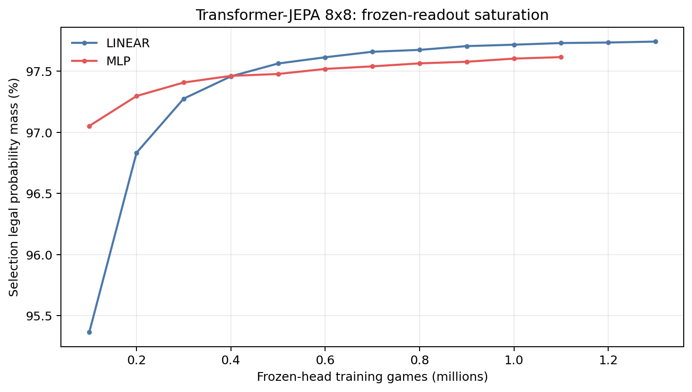
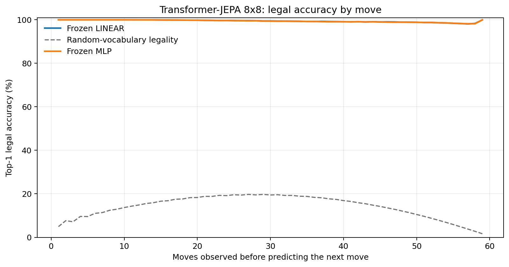
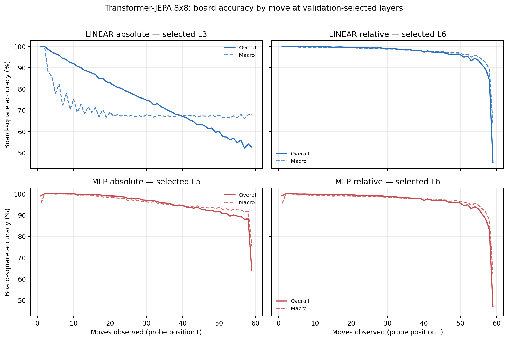

# Proposal evaluation: Transformer-JEPA 8x8

- **Suite:** `thesis_eval_suite_v1` over `unified_eval_v4`
- **Run:** `selected`
- **Checkpoint:** `final.pt` (`c75a1fc74eb33d49b0593af85c6407343bf71de7c5183d9a613e6e07bcd69043`)
- **Training budget:** `19,999,840` games / `200` shards
- **Next-move readout:** frozen bf16 encoder with common fp32 Linear/MLP readouts
- **Exact continuation:** intentionally excluded because corpus continuations are stochastic legal choices

## 1. Functional legality

| Readout | Top-1 legal | Top-3 legal fraction | Top-5 legal fraction | Legal probability mass |
|---|---:|---:|---:|---:|
| Frozen LINEAR | 99.43% | 96.56% | 92.26% | 97.66% |
| Frozen MLP | 99.41% | 96.53% | 92.23% | 97.50% |

### Statistical context

| Readout | Normalized legal lift | 95% CI for top-1 legal |
|---|---:|---:|
| Frozen LINEAR | 99.34% | 99.42%–99.44% |
| Frozen MLP | 99.32% | 99.40%–99.43% |

### Frozen-head saturation

There is no minimum shard count. Training stops under the pre-registered selection legal-mass patience rule and restores the best checkpoint.

### Legal accuracy by move

### Legality by normalized game phase

| Readout | Phase | Tokens | Mean legal moves | Top-1 legal | Legal mass |
|---|---:|---:|---:|---:|---:|
| Frozen LINEAR | 0.00–0.25 | 749,909 | 7.22 | 99.99% | 98.62% |
| Frozen LINEAR | 0.25–0.50 | 699,679 | 11.44 | 99.73% | 98.22% |
| Frozen LINEAR | 0.50–0.75 | 749,593 | 10.84 | 99.24% | 97.13% |
| Frozen LINEAR | 0.75–1.00 | 749,129 | 5.15 | 98.78% | 96.69% |
| Frozen MLP | 0.00–0.25 | 749,909 | 7.22 | 99.99% | 98.90% |
| Frozen MLP | 0.25–0.50 | 699,679 | 11.44 | 99.70% | 98.28% |
| Frozen MLP | 0.50–0.75 | 749,593 | 10.84 | 99.21% | 96.73% |
| Frozen MLP | 0.75–1.00 | 749,129 | 5.15 | 98.77% | 96.14% |

## 2. Board-state representations

Layer selection uses only the selection split. Headline test values are macro-balanced accuracy, so changing empty-square prevalence across board sizes cannot dominate the comparison.

**Macro accuracy** is the unweighted mean of the three per-class recalls. Absolute labels use empty/black/white and relative labels use empty/mine/opponent. Each class therefore contributes one third even when empty squares are much more common. Overall accuracy instead weights every square equally and can be dominated by the empty class.

| Probe | Labels | Best layer | Normalized depth | Test macro | Overall | Occupied | Empty |
|---|---|---:|---:|---:|---:|---:|---:|
| LINEAR | absolute | L3 | 0.375 | 69.03% | 75.69% | 53.59% | 100.00% |
| LINEAR | relative | L6 | 0.750 | 96.38% | 97.18% | 94.63% | 99.98% |
| MLP | absolute | L5 | 0.625 | 94.52% | 95.69% | 91.78% | 100.00% |
| MLP | relative | L6 | 0.750 | 96.07% | 96.94% | 94.21% | 99.95% |

### Probe accuracy by layer

These are the untouched test-split tables in the same format as the 8x8 unified JEPA notebook. `Selected` marks the layer chosen using the separate selection split, never the test results.

#### LINEAR board-state probe

| Layer | Absolute accuracy | Absolute macro | Relative accuracy | Relative macro | Selected |
|---:|---:|---:|---:|---:|:---|
| L0 | 62.68% | 55.77% | 64.77% | 58.14% |  |
| L1 | 75.18% | 68.47% | 87.58% | 84.15% |  |
| L2 | 75.71% | 69.06% | 92.08% | 89.83% |  |
| L3 | 75.69% | 69.03% | 94.26% | 92.63% | absolute |
| L4 | 75.67% | 69.00% | 96.03% | 94.91% |  |
| L5 | 75.68% | 69.01% | 96.98% | 96.12% |  |
| L6 | 75.54% | 68.85% | 97.18% | 96.38% | relative |
| L7 | 75.19% | 68.46% | 96.72% | 95.83% |  |
| L8 | 74.89% | 68.16% | 96.33% | 95.39% |  |

#### MLP board-state probe

| Layer | Absolute accuracy | Absolute macro | Relative accuracy | Relative macro | Selected |
|---:|---:|---:|---:|---:|:---|
| L0 | 65.11% | 58.76% | 65.25% | 58.64% |  |
| L1 | 84.37% | 80.26% | 86.94% | 83.37% |  |
| L2 | 89.05% | 86.06% | 91.84% | 89.51% |  |
| L3 | 91.62% | 89.34% | 94.03% | 92.35% |  |
| L4 | 94.34% | 92.80% | 95.86% | 94.69% |  |
| L5 | 95.69% | 94.52% | 96.84% | 95.94% | absolute |
| L6 | 94.35% | 92.83% | 96.94% | 96.07% | relative |
| L7 | 92.39% | 90.46% | 96.28% | 95.29% |  |
| L8 | 89.25% | 86.56% | 95.72% | 94.65% |  |

### Board accuracy by move at each selected layer

### Selected board probes by game phase

| Probe | Labels | Phase | Macro accuracy | Occupied | Empty |
|---|---|---:|---:|---:|---:|
| LINEAR | absolute | 1/4 | 96.04% | 95.12% | 100.00% |
| LINEAR | absolute | 2/4 | 81.16% | 73.41% | 100.00% |
| LINEAR | absolute | 11/4 | 67.91% | 51.91% | 100.00% |
| LINEAR | absolute | 12/4 | 67.80% | 51.69% | 100.00% |
| LINEAR | absolute | 13/4 | 67.98% | 52.03% | 100.00% |
| LINEAR | absolute | 14/4 | 67.90% | 51.85% | 100.00% |
| LINEAR | absolute | 15/4 | 67.55% | 51.33% | 99.98% |
| LINEAR | absolute | 16/4 | 67.89% | 51.86% | 99.96% |
| LINEAR | absolute | 3/4 | 74.80% | 63.29% | 100.00% |
| LINEAR | absolute | 4/4 | 72.30% | 58.53% | 100.00% |
| LINEAR | absolute | 5/4 | 70.80% | 56.51% | 100.00% |
| LINEAR | absolute | 6/4 | 68.90% | 53.49% | 100.00% |
| LINEAR | absolute | 7/4 | 68.38% | 52.98% | 100.00% |
| LINEAR | absolute | 8/4 | 68.30% | 52.50% | 100.00% |
| LINEAR | absolute | 9/4 | 68.35% | 52.55% | 100.00% |
| LINEAR | absolute | 10/4 | 68.10% | 52.19% | 100.00% |
| LINEAR | relative | 1/4 | 100.00% | 100.00% | 100.00% |
| LINEAR | relative | 2/4 | 99.74% | 99.67% | 100.00% |
| LINEAR | relative | 11/4 | 97.93% | 96.96% | 99.94% |
| LINEAR | relative | 12/4 | 97.63% | 96.49% | 99.97% |
| LINEAR | relative | 13/4 | 97.19% | 95.83% | 99.97% |
| LINEAR | relative | 14/4 | 96.74% | 95.15% | 99.97% |
| LINEAR | relative | 15/4 | 95.58% | 93.46% | 99.94% |
| LINEAR | relative | 16/4 | 84.48% | 76.77% | 99.96% |
| LINEAR | relative | 3/4 | 99.51% | 99.32% | 100.00% |
| LINEAR | relative | 4/4 | 99.53% | 99.32% | 99.99% |
| LINEAR | relative | 5/4 | 99.39% | 99.12% | 99.99% |
| LINEAR | relative | 6/4 | 99.29% | 98.97% | 99.99% |
| LINEAR | relative | 7/4 | 99.11% | 98.72% | 99.97% |
| LINEAR | relative | 8/4 | 98.96% | 98.49% | 99.98% |
| LINEAR | relative | 9/4 | 98.66% | 98.03% | 99.96% |
| LINEAR | relative | 10/4 | 98.31% | 97.54% | 99.96% |
| MLP | absolute | 1/4 | 98.53% | 97.03% | 100.00% |
| MLP | absolute | 2/4 | 99.96% | 99.95% | 100.00% |
| MLP | absolute | 11/4 | 94.72% | 92.09% | 99.99% |
| MLP | absolute | 12/4 | 94.16% | 91.23% | 100.00% |
| MLP | absolute | 13/4 | 93.57% | 90.35% | 100.00% |
| MLP | absolute | 14/4 | 93.27% | 89.90% | 100.00% |
| MLP | absolute | 15/4 | 92.56% | 88.86% | 99.97% |
| MLP | absolute | 16/4 | 87.80% | 81.70% | 100.00% |
| MLP | absolute | 3/4 | 99.76% | 99.64% | 100.00% |
| MLP | absolute | 4/4 | 99.43% | 99.15% | 100.00% |
| MLP | absolute | 5/4 | 98.96% | 98.44% | 100.00% |
| MLP | absolute | 6/4 | 98.24% | 97.36% | 100.00% |
| MLP | absolute | 7/4 | 97.47% | 96.22% | 100.00% |
| MLP | absolute | 8/4 | 96.80% | 95.20% | 100.00% |
| MLP | absolute | 9/4 | 96.05% | 94.08% | 100.00% |
| MLP | absolute | 10/4 | 95.31% | 92.98% | 100.00% |
| MLP | relative | 1/4 | 98.53% | 97.03% | 100.00% |
| MLP | relative | 2/4 | 99.55% | 99.44% | 100.00% |
| MLP | relative | 11/4 | 97.60% | 96.53% | 99.84% |
| MLP | relative | 12/4 | 97.35% | 96.13% | 99.87% |
| MLP | relative | 13/4 | 96.93% | 95.51% | 99.86% |
| MLP | relative | 14/4 | 96.41% | 94.71% | 99.87% |
| MLP | relative | 15/4 | 95.23% | 93.01% | 99.83% |
| MLP | relative | 16/4 | 83.74% | 76.45% | 98.65% |
| MLP | relative | 3/4 | 99.33% | 99.08% | 100.00% |
| MLP | relative | 4/4 | 99.19% | 98.86% | 99.99% |
| MLP | relative | 5/4 | 99.11% | 98.72% | 99.99% |
| MLP | relative | 6/4 | 98.95% | 98.49% | 99.97% |
| MLP | relative | 7/4 | 98.83% | 98.32% | 99.95% |
| MLP | relative | 8/4 | 98.70% | 98.14% | 99.92% |
| MLP | relative | 9/4 | 98.37% | 97.63% | 99.94% |
| MLP | relative | 10/4 | 97.98% | 97.07% | 99.90% |

## 3. Nanda-style causal intervention

- Readout: `frozen_mlp`
- Selected intervention scale: `4`
- Interpretation scope: JEPA encoder plus post-hoc frozen MLP readout

| Control | Target top-1 legal | Target legal mass | Top-N FP+FN |
|---|---:|---:|---:|
| Null | 90.20% | 88.63% | 2.420 |
| Magnitude-matched random | 90.80% | 88.28% | 2.424 |
| Relative-board direction | 95.60% | 93.12% | 0.586 |

For AR this edits the native prediction path. For JEPA it establishes causal steerability of the composed JEPA encoder plus its post-hoc frozen MLP readout; it is not evidence of a native JEPA action head.

## 4. Architecture-matched random-encoder control

### Frozen next-move readouts

| Readout | Trained top-1 legal | Random top-1 legal | Trained legal mass | Random legal mass |
|---|---:|---:|---:|---:|
| LINEAR | 99.43% | 62.13% | 97.66% | 36.09% |
| MLP | 99.41% | 74.04% | 97.50% | 50.50% |

### Board-state probes

The lift compares independently selection-chosen trained and random layers under the same probe protocol and position manifest.

| Probe | Labels | Trained macro | Random macro | Trained − random |
|---|---|---:|---:|---:|
| LINEAR | absolute | 69.03% | 63.84% | 5.19% |
| LINEAR | relative | 96.38% | 65.87% | 30.51% |
| MLP | absolute | 94.52% | 64.70% | 29.82% |
| MLP | relative | 96.07% | 65.71% | 30.36% |

## 5. Efficiency and reproducibility

- Encoder parameters: `25,312,768`
- Total parameters: `50,888,192`
- Checkpoint bytes: `408,305,335`
- Evaluation GPU: `NVIDIA L4`
- Training hardware: `unreported`
- Training precision: `bf16`
- Python / PyTorch / CUDA: `3.12.13` / `2.11.0+cu128` / `12.8`
- Median training chunk: `24.72 s`
- Estimated training loop: `1.37 h`
- Median games/s: `4044.50`
- Median supervision units/s: `234482.03`
- Timing scope: dt_seconds excludes normal checkpoint/Drive-sync time; validation is included only in observed_train_plus_validation_loop_hours

## 6. Interpretation boundary

- Board probes establish decodability, not by themselves causal use.
- Legal behavior measures rule compatibility, not strategic playing strength.
- Bootstrap legality intervals quantify test-game sampling only; they do not replace independent pretraining seeds.
- Board-probe point estimates use one deterministic probe seed; the random-encoder control is not a substitute for model-seed replication.
- Cross-board results compare separately trained scaling conditions, not zero-shot transfer.

## Artifact index

- Unified JSON: `/content/seed_evaluation_views/transformer_jepa_b8_seed001/runs/selected/thesis_eval/final/results__unified_eval_v4.json`
- Unified summary: `/content/seed_evaluation_views/transformer_jepa_b8_seed001/runs/selected/thesis_eval/final/summary__unified_eval_v4.md`
- Position manifest: `/content/seed_evaluation_views/transformer_jepa_b8_seed001/runs/selected/thesis_eval/final/position_manifest__unified_eval_v4.json`
- Legal-by-move figure: `/content/seed_evaluation_views/transformer_jepa_b8_seed001/runs/selected/thesis_eval/final/legal_accuracy_by_move__thesis_eval_suite_v1.png`
- Board-by-move figure: `/content/seed_evaluation_views/transformer_jepa_b8_seed001/runs/selected/thesis_eval/final/board_accuracy_by_move__thesis_eval_suite_v1.png`
- Random-control JSON: `/content/seed_evaluation_views/transformer_jepa_b8_seed001/runs/selected/thesis_eval/final/random_encoder_control/results__unified_eval_v4.json`
- Causal-intervention JSON: `/content/seed_evaluation_views/transformer_jepa_b8_seed001/runs/selected/thesis_eval/final/results__unified_eval_v4.json` (`causal_intervention` key)
