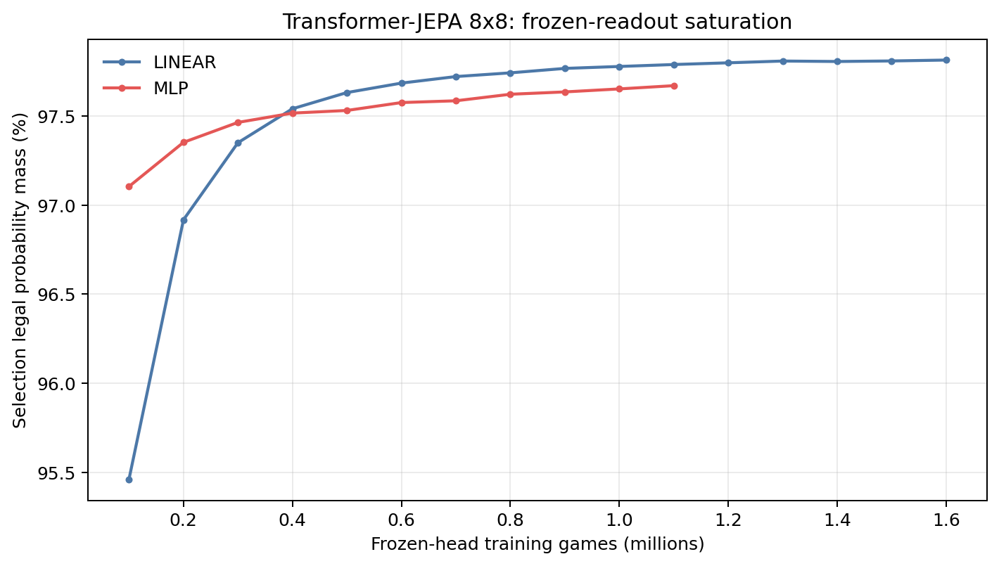
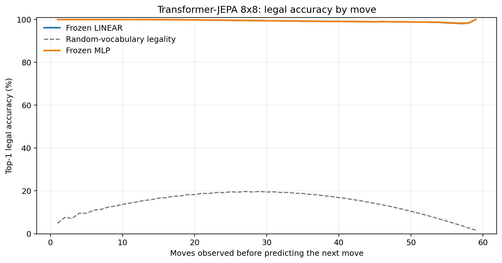
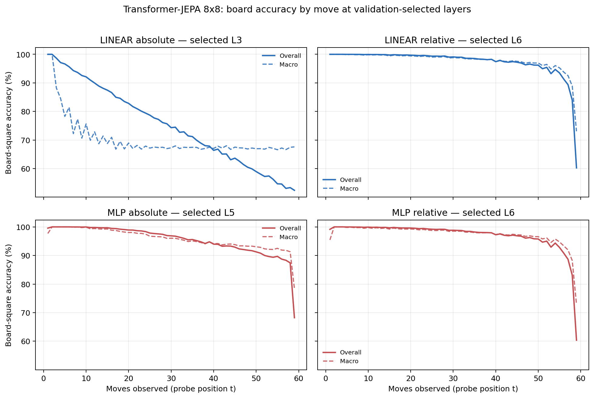

# Proposal evaluation: Transformer-JEPA 8x8

- **Suite:** `thesis_eval_suite_v1` over `unified_eval_v4`
- **Run:** `selected`
- **Checkpoint:** `final.pt` (`a7948e0bc69fdd42ab9944424a8037928d3c89a55de739f6d4a87428d3b310d1`)
- **Training budget:** `19,999,840` games / `200` shards
- **Next-move readout:** frozen bf16 encoder with common fp32 Linear/MLP readouts
- **Exact continuation:** intentionally excluded because corpus continuations are stochastic legal choices

## 1. Functional legality

| Readout | Top-1 legal | Top-3 legal fraction | Top-5 legal fraction | Legal probability mass |
|---|---:|---:|---:|---:|
| Frozen LINEAR | 99.42% | 96.56% | 92.26% | 97.76% |
| Frozen MLP | 99.43% | 96.54% | 92.24% | 97.55% |

### Statistical context

| Readout | Normalized legal lift | 95% CI for top-1 legal |
|---|---:|---:|
| Frozen LINEAR | 99.33% | 99.41%–99.44% |
| Frozen MLP | 99.34% | 99.42%–99.44% |

### Frozen-head saturation

There is no minimum shard count. Training stops under the pre-registered selection legal-mass patience rule and restores the best checkpoint.

### Legal accuracy by move

### Legality by normalized game phase

| Readout | Phase | Tokens | Mean legal moves | Top-1 legal | Legal mass |
|---|---:|---:|---:|---:|---:|
| Frozen LINEAR | 0.00–0.25 | 749,909 | 7.22 | 99.99% | 98.73% |
| Frozen LINEAR | 0.25–0.50 | 699,679 | 11.44 | 99.73% | 98.25% |
| Frozen LINEAR | 0.50–0.75 | 749,593 | 10.84 | 99.21% | 97.25% |
| Frozen LINEAR | 0.75–1.00 | 749,129 | 5.15 | 98.79% | 96.86% |
| Frozen MLP | 0.00–0.25 | 749,909 | 7.22 | 99.99% | 98.89% |
| Frozen MLP | 0.25–0.50 | 699,679 | 11.44 | 99.73% | 98.24% |
| Frozen MLP | 0.50–0.75 | 749,593 | 10.84 | 99.20% | 96.85% |
| Frozen MLP | 0.75–1.00 | 749,129 | 5.15 | 98.83% | 96.25% |

## 2. Board-state representations

Layer selection uses only the selection split. Headline test values are macro-balanced accuracy, so changing empty-square prevalence across board sizes cannot dominate the comparison.

**Macro accuracy** is the unweighted mean of the three per-class recalls. Absolute labels use empty/black/white and relative labels use empty/mine/opponent. Each class therefore contributes one third even when empty squares are much more common. Overall accuracy instead weights every square equally and can be dominated by the empty class.

| Probe | Labels | Best layer | Normalized depth | Test macro | Overall | Occupied | Empty |
|---|---|---:|---:|---:|---:|---:|---:|
| LINEAR | absolute | L3 | 0.375 | 68.97% | 75.64% | 53.50% | 100.00% |
| LINEAR | relative | L6 | 0.750 | 96.74% | 97.46% | 95.17% | 99.99% |
| MLP | absolute | L5 | 0.625 | 94.44% | 95.63% | 91.66% | 100.00% |
| MLP | relative | L6 | 0.750 | 96.44% | 97.24% | 94.75% | 99.97% |

### Probe accuracy by layer

These are the untouched test-split tables in the same format as the 8x8 unified JEPA notebook. `Selected` marks the layer chosen using the separate selection split, never the test results.

#### LINEAR board-state probe

| Layer | Absolute accuracy | Absolute macro | Relative accuracy | Relative macro | Selected |
|---:|---:|---:|---:|---:|:---|
| L0 | 62.68% | 55.79% | 64.79% | 58.17% |  |
| L1 | 75.10% | 68.39% | 87.44% | 83.98% |  |
| L2 | 75.64% | 68.97% | 92.05% | 89.78% |  |
| L3 | 75.64% | 68.97% | 94.17% | 92.52% | absolute |
| L4 | 75.71% | 69.06% | 95.95% | 94.80% |  |
| L5 | 75.68% | 69.02% | 97.11% | 96.29% |  |
| L6 | 75.56% | 68.87% | 97.46% | 96.74% | relative |
| L7 | 75.09% | 68.34% | 97.03% | 96.24% |  |
| L8 | 74.80% | 68.04% | 96.64% | 95.78% |  |

#### MLP board-state probe

| Layer | Absolute accuracy | Absolute macro | Relative accuracy | Relative macro | Selected |
|---:|---:|---:|---:|---:|:---|
| L0 | 65.11% | 58.75% | 65.24% | 58.61% |  |
| L1 | 84.25% | 80.13% | 86.70% | 83.11% |  |
| L2 | 89.12% | 86.15% | 91.77% | 89.42% |  |
| L3 | 91.36% | 89.00% | 93.98% | 92.28% |  |
| L4 | 94.06% | 92.44% | 95.77% | 94.58% |  |
| L5 | 95.63% | 94.44% | 96.95% | 96.08% | absolute |
| L6 | 95.15% | 93.84% | 97.24% | 96.44% | relative |
| L7 | 93.00% | 91.22% | 96.59% | 95.69% |  |
| L8 | 90.58% | 88.24% | 96.04% | 95.06% |  |

### Board accuracy by move at each selected layer

### Selected board probes by game phase

| Probe | Labels | Phase | Macro accuracy | Occupied | Empty |
|---|---|---:|---:|---:|---:|
| LINEAR | absolute | 1/4 | 96.16% | 95.35% | 100.00% |
| LINEAR | absolute | 2/4 | 80.68% | 72.70% | 100.00% |
| LINEAR | absolute | 11/4 | 67.67% | 51.55% | 100.00% |
| LINEAR | absolute | 12/4 | 67.92% | 51.87% | 99.99% |
| LINEAR | absolute | 13/4 | 68.03% | 52.11% | 100.00% |
| LINEAR | absolute | 14/4 | 67.61% | 51.41% | 100.00% |
| LINEAR | absolute | 15/4 | 67.66% | 51.48% | 100.00% |
| LINEAR | absolute | 16/4 | 67.64% | 51.46% | 100.00% |
| LINEAR | absolute | 3/4 | 75.09% | 63.72% | 100.00% |
| LINEAR | absolute | 4/4 | 72.29% | 58.53% | 100.00% |
| LINEAR | absolute | 5/4 | 70.53% | 56.12% | 100.00% |
| LINEAR | absolute | 6/4 | 68.98% | 53.60% | 100.00% |
| LINEAR | absolute | 7/4 | 68.35% | 52.96% | 100.00% |
| LINEAR | absolute | 8/4 | 68.40% | 52.66% | 100.00% |
| LINEAR | absolute | 9/4 | 68.24% | 52.39% | 100.00% |
| LINEAR | absolute | 10/4 | 68.11% | 52.21% | 100.00% |
| LINEAR | relative | 1/4 | 100.00% | 100.00% | 100.00% |
| LINEAR | relative | 2/4 | 99.93% | 99.90% | 100.00% |
| LINEAR | relative | 11/4 | 98.01% | 97.07% | 99.96% |
| LINEAR | relative | 12/4 | 97.69% | 96.56% | 99.98% |
| LINEAR | relative | 13/4 | 97.26% | 95.96% | 99.92% |
| LINEAR | relative | 14/4 | 96.78% | 95.22% | 99.98% |
| LINEAR | relative | 15/4 | 95.65% | 93.56% | 99.98% |
| LINEAR | relative | 16/4 | 87.03% | 80.60% | 100.00% |
| LINEAR | relative | 3/4 | 99.81% | 99.72% | 100.00% |
| LINEAR | relative | 4/4 | 99.78% | 99.67% | 100.00% |
| LINEAR | relative | 5/4 | 99.55% | 99.33% | 99.99% |
| LINEAR | relative | 6/4 | 99.40% | 99.12% | 99.99% |
| LINEAR | relative | 7/4 | 99.21% | 98.84% | 99.99% |
| LINEAR | relative | 8/4 | 99.00% | 98.54% | 99.99% |
| LINEAR | relative | 9/4 | 98.69% | 98.07% | 99.96% |
| LINEAR | relative | 10/4 | 98.33% | 97.54% | 99.98% |
| MLP | absolute | 1/4 | 99.26% | 98.50% | 100.00% |
| MLP | absolute | 2/4 | 99.98% | 99.97% | 100.00% |
| MLP | absolute | 11/4 | 94.43% | 91.65% | 100.00% |
| MLP | absolute | 12/4 | 94.00% | 91.00% | 100.00% |
| MLP | absolute | 13/4 | 93.54% | 90.31% | 100.00% |
| MLP | absolute | 14/4 | 93.15% | 89.72% | 100.00% |
| MLP | absolute | 15/4 | 92.34% | 88.52% | 100.00% |
| MLP | absolute | 16/4 | 88.36% | 82.53% | 100.00% |
| MLP | absolute | 3/4 | 99.74% | 99.62% | 100.00% |
| MLP | absolute | 4/4 | 99.33% | 98.99% | 100.00% |
| MLP | absolute | 5/4 | 98.86% | 98.29% | 100.00% |
| MLP | absolute | 6/4 | 98.05% | 97.08% | 100.00% |
| MLP | absolute | 7/4 | 97.35% | 96.03% | 100.00% |
| MLP | absolute | 8/4 | 96.47% | 94.70% | 100.00% |
| MLP | absolute | 9/4 | 95.80% | 93.70% | 100.00% |
| MLP | absolute | 10/4 | 94.98% | 92.48% | 100.00% |
| MLP | relative | 1/4 | 98.53% | 97.03% | 100.00% |
| MLP | relative | 2/4 | 99.86% | 99.82% | 100.00% |
| MLP | relative | 11/4 | 97.78% | 96.75% | 99.93% |
| MLP | relative | 12/4 | 97.38% | 96.15% | 99.91% |
| MLP | relative | 13/4 | 97.02% | 95.62% | 99.91% |
| MLP | relative | 14/4 | 96.47% | 94.82% | 99.87% |
| MLP | relative | 15/4 | 95.28% | 93.07% | 99.91% |
| MLP | relative | 16/4 | 86.57% | 80.10% | 99.80% |
| MLP | relative | 3/4 | 99.65% | 99.51% | 100.00% |
| MLP | relative | 4/4 | 99.59% | 99.41% | 100.00% |
| MLP | relative | 5/4 | 99.34% | 99.05% | 99.99% |
| MLP | relative | 6/4 | 99.16% | 98.79% | 99.99% |
| MLP | relative | 7/4 | 98.92% | 98.44% | 99.98% |
| MLP | relative | 8/4 | 98.70% | 98.13% | 99.96% |
| MLP | relative | 9/4 | 98.41% | 97.68% | 99.94% |
| MLP | relative | 10/4 | 98.04% | 97.14% | 99.95% |

## 3. Nanda-style causal intervention

- Readout: `frozen_mlp`
- Selected intervention scale: `4`
- Interpretation scope: JEPA encoder plus post-hoc frozen MLP readout

| Control | Target top-1 legal | Target legal mass | Top-N FP+FN |
|---|---:|---:|---:|
| Null | 90.00% | 88.77% | 2.406 |
| Magnitude-matched random | 90.90% | 88.50% | 2.436 |
| Relative-board direction | 94.00% | 92.72% | 0.610 |

For AR this edits the native prediction path. For JEPA it establishes causal steerability of the composed JEPA encoder plus its post-hoc frozen MLP readout; it is not evidence of a native JEPA action head.

## 4. Architecture-matched random-encoder control

### Frozen next-move readouts

| Readout | Trained top-1 legal | Random top-1 legal | Trained legal mass | Random legal mass |
|---|---:|---:|---:|---:|
| LINEAR | 99.42% | 62.13% | 97.76% | 36.09% |
| MLP | 99.43% | 74.04% | 97.55% | 50.50% |

### Board-state probes

The lift compares independently selection-chosen trained and random layers under the same probe protocol and position manifest.

| Probe | Labels | Trained macro | Random macro | Trained − random |
|---|---|---:|---:|---:|
| LINEAR | absolute | 68.97% | 63.84% | 5.13% |
| LINEAR | relative | 96.74% | 65.87% | 30.87% |
| MLP | absolute | 94.44% | 64.70% | 29.74% |
| MLP | relative | 96.44% | 65.71% | 30.73% |

## 5. Efficiency and reproducibility

- Encoder parameters: `25,312,768`
- Total parameters: `50,888,192`
- Checkpoint bytes: `408,305,335`
- Evaluation GPU: `NVIDIA L4`
- Training hardware: `unreported`
- Training precision: `bf16`
- Python / PyTorch / CUDA: `3.13.15` / `2.11.0+cu128` / `12.8`
- Median training chunk: `24.72 s`
- Estimated training loop: `1.37 h`
- Median games/s: `4044.58`
- Median supervision units/s: `234507.60`
- Timing scope: dt_seconds excludes normal checkpoint/Drive-sync time; validation is included only in observed_train_plus_validation_loop_hours

## 6. Interpretation boundary

- Board probes establish decodability, not by themselves causal use.
- Legal behavior measures rule compatibility, not strategic playing strength.
- Bootstrap legality intervals quantify test-game sampling only; they do not replace independent pretraining seeds.
- Board-probe point estimates use one deterministic probe seed; the random-encoder control is not a substitute for model-seed replication.
- Cross-board results compare separately trained scaling conditions, not zero-shot transfer.

## Artifact index

- Unified JSON: `/content/seed_evaluation_views/transformer_jepa_b8_seed002/runs/selected/thesis_eval/final/results__unified_eval_v4.json`
- Unified summary: `/content/seed_evaluation_views/transformer_jepa_b8_seed002/runs/selected/thesis_eval/final/summary__unified_eval_v4.md`
- Position manifest: `/content/seed_evaluation_views/transformer_jepa_b8_seed002/runs/selected/thesis_eval/final/position_manifest__unified_eval_v4.json`
- Legal-by-move figure: `/content/seed_evaluation_views/transformer_jepa_b8_seed002/runs/selected/thesis_eval/final/legal_accuracy_by_move__thesis_eval_suite_v1.png`
- Board-by-move figure: `/content/seed_evaluation_views/transformer_jepa_b8_seed002/runs/selected/thesis_eval/final/board_accuracy_by_move__thesis_eval_suite_v1.png`
- Random-control JSON: `/content/seed_evaluation_views/transformer_jepa_b8_seed002/runs/selected/thesis_eval/final/random_encoder_control/results__unified_eval_v4.json`
- Causal-intervention JSON: `/content/seed_evaluation_views/transformer_jepa_b8_seed002/runs/selected/thesis_eval/final/results__unified_eval_v4.json` (`causal_intervention` key)
