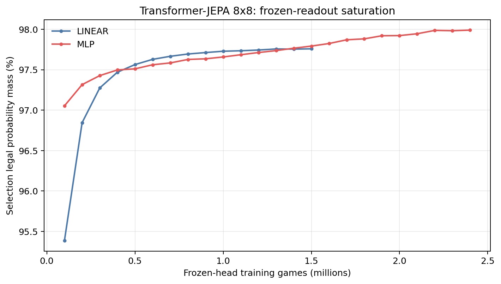
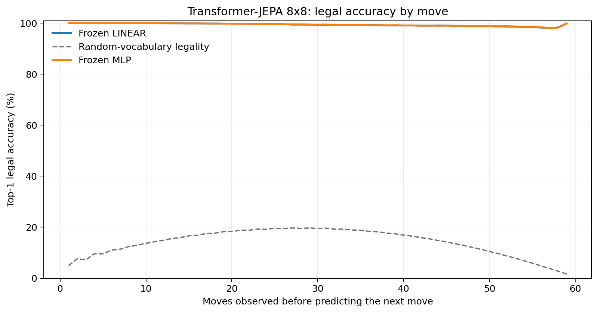
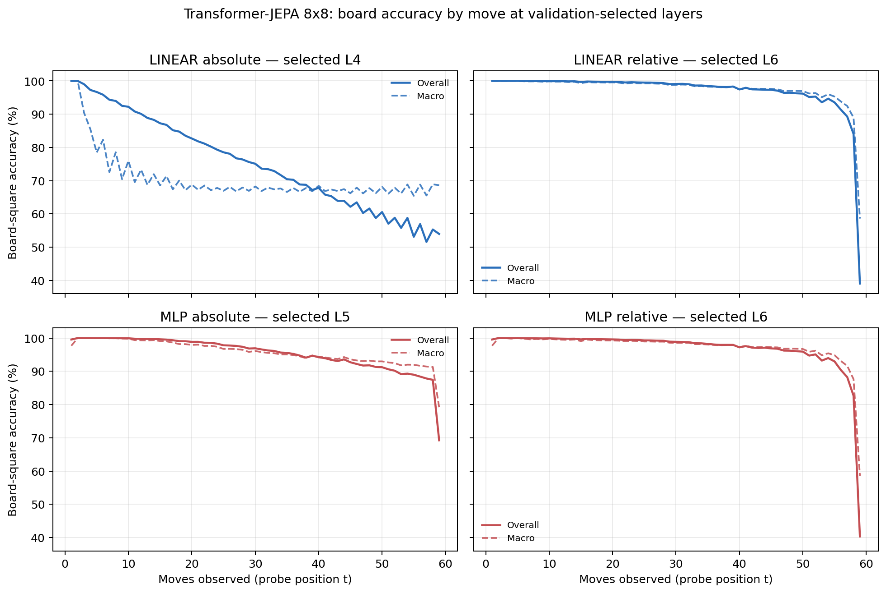

# Proposal evaluation: Transformer-JEPA 8x8

- **Suite:** `thesis_eval_suite_v1` over `unified_eval_v4`
- **Run:** `selected`
- **Checkpoint:** `final.pt` (`4a3d91e22f2ab45bbc85b58d27a15a36eaffefbeb858b43adb7ee113e73ecf8e`)
- **Training budget:** `19,999,840` games / `200` shards
- **Next-move readout:** frozen bf16 encoder with common fp32 Linear/MLP readouts
- **Exact continuation:** intentionally excluded because corpus continuations are stochastic legal choices

## 1. Functional legality

| Readout | Top-1 legal | Top-3 legal fraction | Top-5 legal fraction | Legal probability mass |
|---|---:|---:|---:|---:|
| Frozen LINEAR | 99.42% | 96.56% | 92.26% | 97.69% |
| Frozen MLP | 99.43% | 96.53% | 92.23% | 97.87% |

### Statistical context

| Readout | Normalized legal lift | 95% CI for top-1 legal |
|---|---:|---:|
| Frozen LINEAR | 99.32% | 99.40%–99.43% |
| Frozen MLP | 99.34% | 99.42%–99.44% |

### Frozen-head saturation

There is no minimum shard count. Training stops under the pre-registered selection legal-mass patience rule and restores the best checkpoint.

### Legal accuracy by move

### Legality by normalized game phase

| Readout | Phase | Tokens | Mean legal moves | Top-1 legal | Legal mass |
|---|---:|---:|---:|---:|---:|
| Frozen LINEAR | 0.00–0.25 | 749,909 | 7.22 | 99.99% | 98.53% |
| Frozen LINEAR | 0.25–0.50 | 699,679 | 11.44 | 99.72% | 98.20% |
| Frozen LINEAR | 0.50–0.75 | 749,593 | 10.84 | 99.22% | 97.16% |
| Frozen LINEAR | 0.75–1.00 | 749,129 | 5.15 | 98.76% | 96.88% |
| Frozen MLP | 0.00–0.25 | 749,909 | 7.22 | 99.99% | 99.41% |
| Frozen MLP | 0.25–0.50 | 699,679 | 11.44 | 99.72% | 98.62% |
| Frozen MLP | 0.50–0.75 | 749,593 | 10.84 | 99.23% | 97.12% |
| Frozen MLP | 0.75–1.00 | 749,129 | 5.15 | 98.80% | 96.39% |

## 2. Board-state representations

Layer selection uses only the selection split. Headline test values are macro-balanced accuracy, so changing empty-square prevalence across board sizes cannot dominate the comparison.

**Macro accuracy** is the unweighted mean of the three per-class recalls. Absolute labels use empty/black/white and relative labels use empty/mine/opponent. Each class therefore contributes one third even when empty squares are much more common. Overall accuracy instead weights every square equally and can be dominated by the empty class.

| Probe | Labels | Best layer | Normalized depth | Test macro | Overall | Occupied | Empty |
|---|---|---:|---:|---:|---:|---:|---:|
| LINEAR | absolute | L4 | 0.500 | 69.08% | 75.73% | 53.67% | 100.00% |
| LINEAR | relative | L6 | 0.750 | 96.34% | 97.16% | 94.58% | 99.99% |
| MLP | absolute | L5 | 0.625 | 94.40% | 95.60% | 91.59% | 100.00% |
| MLP | relative | L6 | 0.750 | 96.06% | 96.94% | 94.19% | 99.97% |

### Probe accuracy by layer

These are the untouched test-split tables in the same format as the 8x8 unified JEPA notebook. `Selected` marks the layer chosen using the separate selection split, never the test results.

#### LINEAR board-state probe

| Layer | Absolute accuracy | Absolute macro | Relative accuracy | Relative macro | Selected |
|---:|---:|---:|---:|---:|:---|
| L0 | 62.69% | 55.79% | 64.80% | 58.17% |  |
| L1 | 75.29% | 68.61% | 87.78% | 84.39% |  |
| L2 | 75.63% | 68.95% | 92.43% | 90.28% |  |
| L3 | 75.72% | 69.06% | 94.14% | 92.48% |  |
| L4 | 75.73% | 69.08% | 95.77% | 94.56% | absolute |
| L5 | 75.81% | 69.18% | 96.80% | 95.89% |  |
| L6 | 75.64% | 68.97% | 97.16% | 96.34% | relative |
| L7 | 75.12% | 68.37% | 96.66% | 95.75% |  |
| L8 | 74.93% | 68.20% | 96.21% | 95.22% |  |

#### MLP board-state probe

| Layer | Absolute accuracy | Absolute macro | Relative accuracy | Relative macro | Selected |
|---:|---:|---:|---:|---:|:---|
| L0 | 65.08% | 58.76% | 65.23% | 58.61% |  |
| L1 | 84.35% | 80.22% | 87.19% | 83.70% |  |
| L2 | 89.70% | 86.90% | 92.14% | 89.88% |  |
| L3 | 91.19% | 88.79% | 93.92% | 92.20% |  |
| L4 | 93.95% | 92.30% | 95.59% | 94.32% |  |
| L5 | 95.60% | 94.40% | 96.66% | 95.70% | absolute |
| L6 | 94.83% | 93.43% | 96.94% | 96.06% | relative |
| L7 | 92.51% | 90.59% | 96.27% | 95.28% |  |
| L8 | 88.28% | 85.32% | 95.64% | 94.55% |  |

### Board accuracy by move at each selected layer

### Selected board probes by game phase

| Probe | Labels | Phase | Macro accuracy | Occupied | Empty |
|---|---|---:|---:|---:|---:|
| LINEAR | absolute | 1/4 | 96.94% | 96.57% | 100.00% |
| LINEAR | absolute | 2/4 | 81.17% | 73.47% | 100.00% |
| LINEAR | absolute | 11/4 | 67.99% | 52.02% | 100.00% |
| LINEAR | absolute | 12/4 | 67.67% | 51.50% | 100.00% |
| LINEAR | absolute | 13/4 | 67.51% | 51.33% | 100.00% |
| LINEAR | absolute | 14/4 | 67.72% | 51.57% | 100.00% |
| LINEAR | absolute | 15/4 | 67.82% | 51.73% | 100.00% |
| LINEAR | absolute | 16/4 | 68.38% | 52.58% | 100.00% |
| LINEAR | absolute | 3/4 | 75.27% | 63.98% | 100.00% |
| LINEAR | absolute | 4/4 | 72.51% | 58.88% | 100.00% |
| LINEAR | absolute | 5/4 | 70.67% | 56.34% | 100.00% |
| LINEAR | absolute | 6/4 | 69.04% | 53.71% | 100.00% |
| LINEAR | absolute | 7/4 | 68.28% | 52.85% | 100.00% |
| LINEAR | absolute | 8/4 | 68.41% | 52.67% | 100.00% |
| LINEAR | absolute | 9/4 | 68.47% | 52.73% | 100.00% |
| LINEAR | absolute | 10/4 | 68.04% | 52.10% | 100.00% |
| LINEAR | relative | 1/4 | 100.00% | 100.00% | 100.00% |
| LINEAR | relative | 2/4 | 99.93% | 99.92% | 100.00% |
| LINEAR | relative | 11/4 | 98.01% | 97.06% | 99.98% |
| LINEAR | relative | 12/4 | 97.72% | 96.62% | 99.99% |
| LINEAR | relative | 13/4 | 97.36% | 96.09% | 100.00% |
| LINEAR | relative | 14/4 | 96.81% | 95.26% | 99.99% |
| LINEAR | relative | 15/4 | 95.68% | 93.61% | 100.00% |
| LINEAR | relative | 16/4 | 83.34% | 75.13% | 100.00% |
| LINEAR | relative | 3/4 | 99.82% | 99.74% | 100.00% |
| LINEAR | relative | 4/4 | 99.73% | 99.61% | 100.00% |
| LINEAR | relative | 5/4 | 99.51% | 99.28% | 99.99% |
| LINEAR | relative | 6/4 | 99.43% | 99.19% | 99.99% |
| LINEAR | relative | 7/4 | 99.31% | 99.00% | 99.99% |
| LINEAR | relative | 8/4 | 99.07% | 98.65% | 99.98% |
| LINEAR | relative | 9/4 | 98.73% | 98.12% | 99.99% |
| LINEAR | relative | 10/4 | 98.32% | 97.53% | 99.99% |
| MLP | absolute | 1/4 | 99.26% | 98.50% | 100.00% |
| MLP | absolute | 2/4 | 99.98% | 99.97% | 100.00% |
| MLP | absolute | 11/4 | 94.45% | 91.67% | 100.00% |
| MLP | absolute | 12/4 | 94.07% | 91.11% | 100.00% |
| MLP | absolute | 13/4 | 93.36% | 90.04% | 100.00% |
| MLP | absolute | 14/4 | 93.02% | 89.53% | 99.99% |
| MLP | absolute | 15/4 | 92.13% | 88.20% | 100.00% |
| MLP | absolute | 16/4 | 88.40% | 82.60% | 100.00% |
| MLP | absolute | 3/4 | 99.75% | 99.63% | 100.00% |
| MLP | absolute | 4/4 | 99.36% | 99.05% | 100.00% |
| MLP | absolute | 5/4 | 98.77% | 98.16% | 100.00% |
| MLP | absolute | 6/4 | 97.99% | 96.98% | 100.00% |
| MLP | absolute | 7/4 | 97.30% | 95.96% | 100.00% |
| MLP | absolute | 8/4 | 96.47% | 94.71% | 100.00% |
| MLP | absolute | 9/4 | 95.78% | 93.67% | 100.00% |
| MLP | absolute | 10/4 | 95.06% | 92.59% | 100.00% |
| MLP | relative | 1/4 | 99.26% | 98.50% | 100.00% |
| MLP | relative | 2/4 | 99.81% | 99.76% | 100.00% |
| MLP | relative | 11/4 | 97.75% | 96.70% | 99.91% |
| MLP | relative | 12/4 | 97.42% | 96.20% | 99.91% |
| MLP | relative | 13/4 | 97.08% | 95.72% | 99.91% |
| MLP | relative | 14/4 | 96.56% | 94.93% | 99.91% |
| MLP | relative | 15/4 | 95.31% | 93.12% | 99.89% |
| MLP | relative | 16/4 | 82.76% | 74.60% | 99.49% |
| MLP | relative | 3/4 | 99.67% | 99.54% | 100.00% |
| MLP | relative | 4/4 | 99.51% | 99.29% | 100.00% |
| MLP | relative | 5/4 | 99.33% | 99.03% | 100.00% |
| MLP | relative | 6/4 | 99.18% | 98.82% | 99.99% |
| MLP | relative | 7/4 | 99.08% | 98.66% | 99.98% |
| MLP | relative | 8/4 | 98.84% | 98.33% | 99.96% |
| MLP | relative | 9/4 | 98.46% | 97.74% | 99.96% |
| MLP | relative | 10/4 | 98.06% | 97.16% | 99.96% |

## 3. Nanda-style causal intervention

- Readout: `frozen_mlp`
- Selected intervention scale: `4`
- Interpretation scope: JEPA encoder plus post-hoc frozen MLP readout

| Control | Target top-1 legal | Target legal mass | Top-N FP+FN |
|---|---:|---:|---:|
| Null | 91.20% | 89.09% | 2.394 |
| Magnitude-matched random | 91.30% | 88.68% | 2.414 |
| Relative-board direction | 95.30% | 94.00% | 0.560 |

For AR this edits the native prediction path. For JEPA it establishes causal steerability of the composed JEPA encoder plus its post-hoc frozen MLP readout; it is not evidence of a native JEPA action head.

## 4. Architecture-matched random-encoder control

### Frozen next-move readouts

| Readout | Trained top-1 legal | Random top-1 legal | Trained legal mass | Random legal mass |
|---|---:|---:|---:|---:|
| LINEAR | 99.42% | 62.13% | 97.69% | 36.09% |
| MLP | 99.43% | 74.04% | 97.87% | 50.50% |

### Board-state probes

The lift compares independently selection-chosen trained and random layers under the same probe protocol and position manifest.

| Probe | Labels | Trained macro | Random macro | Trained − random |
|---|---|---:|---:|---:|
| LINEAR | absolute | 69.08% | 63.84% | 5.24% |
| LINEAR | relative | 96.34% | 65.87% | 30.47% |
| MLP | absolute | 94.40% | 64.70% | 29.70% |
| MLP | relative | 96.06% | 65.71% | 30.35% |

## 5. Efficiency and reproducibility

- Encoder parameters: `25,312,768`
- Total parameters: `50,888,192`
- Checkpoint bytes: `408,305,335`
- Evaluation GPU: `NVIDIA L4`
- Training hardware: `unreported`
- Training precision: `bf16`
- Python / PyTorch / CUDA: `3.13.15` / `2.11.0+cu128` / `12.8`
- Median training chunk: `24.60 s`
- Estimated training loop: `1.37 h`
- Median games/s: `4065.84`
- Median supervision units/s: `235718.65`
- Timing scope: dt_seconds excludes normal checkpoint/Drive-sync time; validation is included only in observed_train_plus_validation_loop_hours

## 6. Interpretation boundary

- Board probes establish decodability, not by themselves causal use.
- Legal behavior measures rule compatibility, not strategic playing strength.
- Bootstrap legality intervals quantify test-game sampling only; they do not replace independent pretraining seeds.
- Board-probe point estimates use one deterministic probe seed; the random-encoder control is not a substitute for model-seed replication.
- Cross-board results compare separately trained scaling conditions, not zero-shot transfer.

## Artifact index

- Unified JSON: `/content/seed_evaluation_views/transformer_jepa_b8_seed003/runs/selected/thesis_eval/final/results__unified_eval_v4.json`
- Unified summary: `/content/seed_evaluation_views/transformer_jepa_b8_seed003/runs/selected/thesis_eval/final/summary__unified_eval_v4.md`
- Position manifest: `/content/seed_evaluation_views/transformer_jepa_b8_seed003/runs/selected/thesis_eval/final/position_manifest__unified_eval_v4.json`
- Legal-by-move figure: `/content/seed_evaluation_views/transformer_jepa_b8_seed003/runs/selected/thesis_eval/final/legal_accuracy_by_move__thesis_eval_suite_v1.png`
- Board-by-move figure: `/content/seed_evaluation_views/transformer_jepa_b8_seed003/runs/selected/thesis_eval/final/board_accuracy_by_move__thesis_eval_suite_v1.png`
- Random-control JSON: `/content/seed_evaluation_views/transformer_jepa_b8_seed003/runs/selected/thesis_eval/final/random_encoder_control/results__unified_eval_v4.json`
- Causal-intervention JSON: `/content/seed_evaluation_views/transformer_jepa_b8_seed003/runs/selected/thesis_eval/final/results__unified_eval_v4.json` (`causal_intervention` key)
