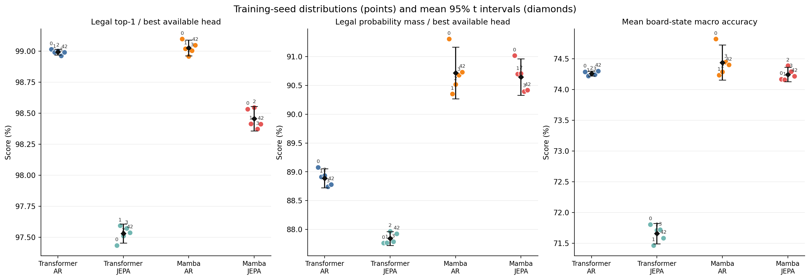
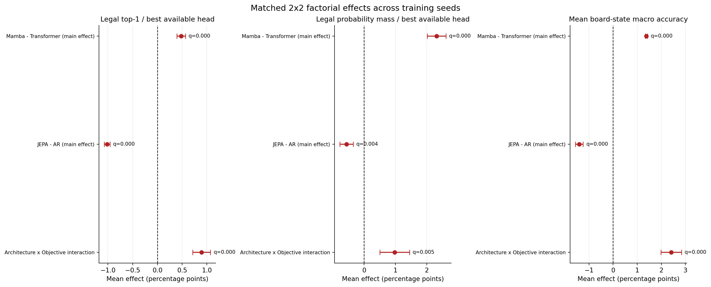
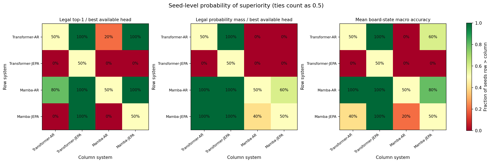

# Multi-seed Common Thesis Evaluation — 16x16

- **Report:** `thesis_seeded_evaluation_v2`
- **Common evaluation protocol:** `unified_eval_v4`
- **Training seeds:** `[0, 1, 2, 3, 42]` (`n=5` per cell)
- **Path-independent split identity:** `f9dbb24a3e996ab4997b5ccef894f762558e0aa2188bed68b56bdf4d8c4a28c0`
- **Data manifest:** `a5db6b8cde1b971c63b0afcaaea866b5d3c4b6f7a71c843883e63b0e20ee7f57`
- **Split audit:** corpus manifest plus ordered shard filenames are identical across all runs; raw absolute-path hashes may differ because every seed uses an isolated evaluation view.
- **Generated UTC:** `2026-08-24T03:00:03.868020+00:00`
- **Design:** balanced, matched 2x2 Architecture x Objective; seed is the block.
- **Uncertainty unit:** independent training runs. Per-game bootstrap intervals from the Common Evaluator are not used as substitutes for seed variance.

## Executive view

- **Legal top-1 / best available head:** highest mean is **Mamba-AR** at **99.03%** (SD 0.05%; seed-level 95% t CI 98.96%–99.09%).
- **Legal probability mass / best available head:** highest mean is **Mamba-AR** at **90.72%** (SD 0.36%; seed-level 95% t CI 90.27%–91.17%).
- **Mean board-state macro accuracy:** highest mean is **Mamba-AR** at **74.44%** (SD 0.23%; seed-level 95% t CI 74.15%–74.72%).

Primary factorial effects surviving Holm correction:
- Legal top-1 / best available head — **Mamba - Transformer (main effect)**: +0.48 pp, 95% CI [+0.39 pp, +0.57 pp], Holm q=<0.001.
- Legal top-1 / best available head — **JEPA - AR (main effect)**: -1.02 pp, 95% CI [-1.07 pp, -0.96 pp], Holm q=<0.001.
- Legal top-1 / best available head — **Architecture x Objective interaction**: +0.89 pp, 95% CI [+0.71 pp, +1.07 pp], Holm q=<0.001.
- Legal probability mass / best available head — **Mamba - Transformer (main effect)**: +2.32 pp, 95% CI [+2.02 pp, +2.62 pp], Holm q=<0.001.
- Legal probability mass / best available head — **JEPA - AR (main effect)**: -0.56 pp, 95% CI [-0.77 pp, -0.35 pp], Holm q=0.004.
- Legal probability mass / best available head — **Architecture x Objective interaction**: +0.98 pp, 95% CI [+0.50 pp, +1.45 pp], Holm q=0.005.
- Mean board-state macro accuracy — **Mamba - Transformer (main effect)**: +1.38 pp, 95% CI [+1.33 pp, +1.43 pp], Holm q=<0.001.
- Mean board-state macro accuracy — **JEPA - AR (main effect)**: -1.40 pp, 95% CI [-1.56 pp, -1.24 pp], Holm q=<0.001.
- Mean board-state macro accuracy — **Architecture x Objective interaction**: +2.41 pp, 95% CI [+1.98 pp, +2.84 pp], Holm q=<0.001.

## What is being tested

The three factorial contrasts are computed independently inside every seed and then tested against zero:

- Architecture main effect: average `(Mamba - Transformer)` across AR and JEPA.
- Objective main effect: average `(JEPA - AR)` across Transformer and Mamba.
- Interaction: `(Mamba-JEPA - Mamba-AR) - (Transformer-JEPA - Transformer-AR)`.

The paired t-test is the parametric inferential test; 95% t intervals and Hedges' `gz` report magnitude and uncertainty. The exact sign-flip p-value is a distribution-light robustness check. With `n` seeds, its smallest possible two-sided value is `2 / 2^n`; therefore it cannot cross 0.05 with four or five seeds. Holm correction is applied across the 3 metrics x 3 effects primary family and separately across the secondary family. Pairwise tests are exploratory and Holm-corrected within each metric.

## Per-seed results

### Legal top-1 / best available head

| System | seed 0 | seed 1 | seed 2 | seed 3 | seed 42 | Mean ± SD | Seed 95% CI |
|---|---:|---:|---:|---:|---:|---:|---:|
| Transformer-AR | 99.01% | 98.99% | 99.00% | 98.96% | 98.99% | 98.99% ± 0.02% | [98.97%, 99.02%] |
| Transformer-JEPA | 97.44% | 97.59% | 97.51% | 97.57% | 97.54% | 97.53% ± 0.06% | [97.45%, 97.61%] |
| Mamba-AR | 99.10% | 99.02% | 98.96% | 99.00% | 99.05% | 99.03% ± 0.05% | [98.96%, 99.09%] |
| Mamba-JEPA | 98.53% | 98.41% | 98.55% | 98.37% | 98.41% | 98.46% ± 0.08% | [98.36%, 98.55%] |

### Legal probability mass / best available head

| System | seed 0 | seed 1 | seed 2 | seed 3 | seed 42 | Mean ± SD | Seed 95% CI |
|---|---:|---:|---:|---:|---:|---:|---:|
| Transformer-AR | 89.08% | 88.91% | 88.94% | 88.74% | 88.78% | 88.89% ± 0.13% | [88.72%, 89.06%] |
| Transformer-JEPA | 87.76% | 87.77% | 87.97% | 87.79% | 87.93% | 87.84% ± 0.10% | [87.72%, 87.96%] |
| Mamba-AR | 91.31% | 90.35% | 90.52% | 90.68% | 90.73% | 90.72% ± 0.36% | [90.27%, 91.17%] |
| Mamba-JEPA | 91.02% | 90.70% | 90.71% | 90.40% | 90.42% | 90.65% ± 0.25% | [90.33%, 90.96%] |

### Mean board-state macro accuracy

| System | seed 0 | seed 1 | seed 2 | seed 3 | seed 42 | Mean ± SD | Seed 95% CI |
|---|---:|---:|---:|---:|---:|---:|---:|
| Transformer-AR | 74.29% | 74.22% | 74.25% | 74.24% | 74.30% | 74.26% ± 0.03% | [74.22%, 74.30%] |
| Transformer-JEPA | 71.80% | 71.46% | 71.71% | 71.72% | 71.58% | 71.66% ± 0.13% | [71.49%, 71.82%] |
| Mamba-AR | 74.82% | 74.24% | 74.29% | 74.45% | 74.40% | 74.44% ± 0.23% | [74.15%, 74.72%] |
| Mamba-JEPA | 74.17% | 74.16% | 74.39% | 74.29% | 74.22% | 74.24% ± 0.10% | [74.13%, 74.36%] |

### Board Linear / absolute

| System | seed 0 | seed 1 | seed 2 | seed 3 | seed 42 | Mean ± SD | Seed 95% CI |
|---|---:|---:|---:|---:|---:|---:|---:|
| Transformer-AR | 66.75% | 66.70% | 66.75% | 66.76% | 66.81% | 66.76% ± 0.04% | [66.71%, 66.80%] |
| Transformer-JEPA | 66.28% | 66.19% | 66.30% | 66.32% | 66.26% | 66.27% ± 0.05% | [66.21%, 66.33%] |
| Mamba-AR | 66.71% | 66.61% | 66.60% | 66.60% | 66.58% | 66.62% ± 0.05% | [66.56%, 66.69%] |
| Mamba-JEPA | 66.08% | 66.24% | 66.18% | 66.25% | 66.18% | 66.19% ± 0.07% | [66.10%, 66.27%] |

### Board Linear / relative

| System | seed 0 | seed 1 | seed 2 | seed 3 | seed 42 | Mean ± SD | Seed 95% CI |
|---|---:|---:|---:|---:|---:|---:|---:|
| Transformer-AR | 83.05% | 83.00% | 83.01% | 82.88% | 82.88% | 82.96% ± 0.08% | [82.86%, 83.06%] |
| Transformer-JEPA | 78.67% | 77.80% | 78.54% | 78.30% | 78.37% | 78.34% ± 0.33% | [77.92%, 78.75%] |
| Mamba-AR | 84.13% | 82.98% | 83.26% | 83.44% | 83.35% | 83.43% ± 0.43% | [82.90%, 83.96%] |
| Mamba-JEPA | 83.87% | 83.81% | 84.11% | 83.91% | 83.77% | 83.89% ± 0.13% | [83.73%, 84.06%] |

### Board MLP / absolute

| System | seed 0 | seed 1 | seed 2 | seed 3 | seed 42 | Mean ± SD | Seed 95% CI |
|---|---:|---:|---:|---:|---:|---:|---:|
| Transformer-AR | 66.75% | 66.60% | 66.67% | 66.86% | 67.03% | 66.78% ± 0.17% | [66.57%, 66.99%] |
| Transformer-JEPA | 65.90% | 66.43% | 65.81% | 66.34% | 65.70% | 66.04% ± 0.33% | [65.63%, 66.44%] |
| Mamba-AR | 66.38% | 66.25% | 66.13% | 66.26% | 66.26% | 66.25% ± 0.09% | [66.14%, 66.36%] |
| Mamba-JEPA | 65.53% | 65.55% | 65.63% | 65.69% | 65.66% | 65.61% ± 0.07% | [65.52%, 65.70%] |

### Board MLP / relative

| System | seed 0 | seed 1 | seed 2 | seed 3 | seed 42 | Mean ± SD | Seed 95% CI |
|---|---:|---:|---:|---:|---:|---:|---:|
| Transformer-AR | 80.59% | 80.57% | 80.57% | 80.47% | 80.49% | 80.54% ± 0.06% | [80.47%, 80.61%] |
| Transformer-JEPA | 76.37% | 75.44% | 76.18% | 75.91% | 75.99% | 75.98% ± 0.35% | [75.54%, 76.41%] |
| Mamba-AR | 82.06% | 81.10% | 81.17% | 81.48% | 81.41% | 81.44% ± 0.38% | [80.97%, 81.92%] |
| Mamba-JEPA | 81.20% | 81.03% | 81.62% | 81.31% | 81.26% | 81.28% ± 0.22% | [81.02%, 81.55%] |

## Matched 2x2 factorial inference

| Metric | Effect | Mean | 95% CI | Hedges gz | p (paired t) | Holm q | Exact sign-flip p | Direction wins |
|---|---|---:|---:|---:|---:|---:|---:|---:|
| Legal top-1 / best available head | Mamba - Transformer (main effect) | +0.48 pp | [+0.39 pp, +0.57 pp] | +5.48 | <0.001 | <0.001 **✓** | 0.062 | 5/0/0 |
| Legal top-1 / best available head | JEPA - AR (main effect) | -1.02 pp | [-1.07 pp, -0.96 pp] | -17.82 | <0.001 | <0.001 **✓** | 0.062 | 0/0/5 |
| Legal top-1 / best available head | Architecture x Objective interaction | +0.89 pp | [+0.71 pp, +1.07 pp] | +4.93 | <0.001 | <0.001 **✓** | 0.062 | 5/0/0 |
| Legal probability mass / best available head | Mamba - Transformer (main effect) | +2.32 pp | [+2.02 pp, +2.62 pp] | +7.66 | <0.001 | <0.001 **✓** | 0.062 | 5/0/0 |
| Legal probability mass / best available head | JEPA - AR (main effect) | -0.56 pp | [-0.77 pp, -0.35 pp] | -2.61 | 0.002 | 0.004 **✓** | 0.062 | 0/0/5 |
| Legal probability mass / best available head | Architecture x Objective interaction | +0.98 pp | [+0.50 pp, +1.45 pp] | +2.05 | 0.005 | 0.005 **✓** | 0.062 | 5/0/0 |
| Mean board-state macro accuracy | Mamba - Transformer (main effect) | +1.38 pp | [+1.33 pp, +1.43 pp] | +28.25 | <0.001 | <0.001 **✓** | 0.062 | 5/0/0 |
| Mean board-state macro accuracy | JEPA - AR (main effect) | -1.40 pp | [-1.56 pp, -1.24 pp] | -8.72 | <0.001 | <0.001 **✓** | 0.062 | 0/0/5 |
| Mean board-state macro accuracy | Architecture x Objective interaction | +2.41 pp | [+1.98 pp, +2.84 pp] | +5.58 | <0.001 | <0.001 **✓** | 0.062 | 5/0/0 |
| Board Linear / absolute | Mamba - Transformer (main effect) | -0.11 pp | [-0.17 pp, -0.04 pp] | -1.66 | 0.010 | 0.029 **✓** | 0.062 | 0/0/5 |
| Board Linear / absolute | JEPA - AR (main effect) | -0.46 pp | [-0.53 pp, -0.39 pp] | -6.43 | <0.001 | <0.001 **✓** | 0.062 | 0/0/5 |
| Board Linear / absolute | Architecture x Objective interaction | +0.05 pp | [-0.10 pp, +0.21 pp] | +0.33 | 0.407 | 0.815 | 0.438 | 4/0/1 |
| Board Linear / relative | Mamba - Transformer (main effect) | +3.01 pp | [+2.89 pp, +3.13 pp] | +24.62 | <0.001 | <0.001 **✓** | 0.062 | 5/0/0 |
| Board Linear / relative | JEPA - AR (main effect) | -2.08 pp | [-2.32 pp, -1.85 pp] | -8.73 | <0.001 | <0.001 **✓** | 0.062 | 0/0/5 |
| Board Linear / relative | Architecture x Objective interaction | +5.09 pp | [+4.23 pp, +5.95 pp] | +5.87 | <0.001 | <0.001 **✓** | 0.062 | 5/0/0 |
| Board MLP / absolute | Mamba - Transformer (main effect) | -0.48 pp | [-0.64 pp, -0.31 pp] | -2.88 | 0.001 | 0.006 **✓** | 0.062 | 0/0/5 |
| Board MLP / absolute | JEPA - AR (main effect) | -0.69 pp | [-0.96 pp, -0.42 pp] | -2.55 | 0.002 | 0.008 **✓** | 0.062 | 0/0/5 |
| Board MLP / absolute | Architecture x Objective interaction | +0.10 pp | [-0.49 pp, +0.69 pp] | +0.17 | 0.654 | 0.815 | 0.688 | 3/0/2 |
| Board MLP / relative | Mamba - Transformer (main effect) | +3.10 pp | [+3.01 pp, +3.20 pp] | +33.95 | <0.001 | <0.001 **✓** | 0.062 | 5/0/0 |
| Board MLP / relative | JEPA - AR (main effect) | -2.36 pp | [-2.67 pp, -2.05 pp] | -7.55 | <0.001 | <0.001 **✓** | 0.062 | 0/0/5 |
| Board MLP / relative | Architecture x Objective interaction | +4.40 pp | [+3.58 pp, +5.22 pp] | +5.35 | <0.001 | <0.001 **✓** | 0.062 | 5/0/0 |

## Planned paired comparisons

Positive differences favor the first named system/group. Pairwise Holm correction is performed separately for each metric.

| Metric | Contrast | Mean | 95% CI | Hedges gz | p (paired t) | Holm q | Exact p |
|---|---|---:|---:|---:|---:|---:|---:|
| Legal top-1 / best available head | Mamba - Transformer | AR | +0.03 pp | [-0.03 pp, +0.09 pp] | +0.56 | 0.195 | 0.195 | 0.250 |
| Legal top-1 / best available head | Mamba - Transformer | JEPA | +0.93 pp | [+0.76 pp, +1.09 pp] | +5.52 | <0.001 | <0.001 **✓** | 0.062 |
| Legal top-1 / best available head | JEPA - AR | Transformer | -1.46 pp | [-1.56 pp, -1.37 pp] | -15.10 | <0.001 | <0.001 **✓** | 0.062 |
| Legal top-1 / best available head | JEPA - AR | Mamba | -0.57 pp | [-0.69 pp, -0.45 pp] | -4.91 | <0.001 | <0.001 **✓** | 0.062 |
| Legal top-1 / best available head | Mamba-JEPA - Transformer-AR | -0.54 pp | [-0.62 pp, -0.46 pp] | -6.77 | <0.001 | <0.001 **✓** | 0.062 |
| Legal top-1 / best available head | Mamba-AR - Transformer-JEPA | +1.50 pp | [+1.37 pp, +1.62 pp] | +12.01 | <0.001 | <0.001 **✓** | 0.062 |
| Legal probability mass / best available head | Mamba - Transformer | AR | +1.83 pp | [+1.44 pp, +2.22 pp] | +4.62 | <0.001 | <0.001 **✓** | 0.062 |
| Legal probability mass / best available head | Mamba - Transformer | JEPA | +2.80 pp | [+2.43 pp, +3.18 pp] | +7.50 | <0.001 | <0.001 **✓** | 0.062 |
| Legal probability mass / best available head | JEPA - AR | Transformer | -1.05 pp | [-1.27 pp, -0.82 pp] | -4.60 | <0.001 | <0.001 **✓** | 0.062 |
| Legal probability mass / best available head | JEPA - AR | Mamba | -0.07 pp | [-0.46 pp, +0.32 pp] | -0.18 | 0.641 | 0.641 | 0.625 |
| Legal probability mass / best available head | Mamba-JEPA - Transformer-AR | +1.76 pp | [+1.61 pp, +1.91 pp] | +11.53 | <0.001 | <0.001 **✓** | 0.062 |
| Legal probability mass / best available head | Mamba-AR - Transformer-JEPA | +2.88 pp | [+2.38 pp, +3.37 pp] | +5.73 | <0.001 | <0.001 **✓** | 0.062 |
| Mean board-state macro accuracy | Mamba - Transformer | AR | +0.18 pp | [-0.09 pp, +0.44 pp] | +0.67 | 0.134 | 0.402 | 0.062 |
| Mean board-state macro accuracy | Mamba - Transformer | JEPA | +2.59 pp | [+2.42 pp, +2.75 pp] | +15.49 | <0.001 | <0.001 **✓** | 0.062 |
| Mean board-state macro accuracy | JEPA - AR | Transformer | -2.60 pp | [-2.76 pp, -2.45 pp] | -16.90 | <0.001 | <0.001 **✓** | 0.062 |
| Mean board-state macro accuracy | JEPA - AR | Mamba | -0.19 pp | [-0.54 pp, +0.15 pp] | -0.56 | 0.195 | 0.402 | 0.188 |
| Mean board-state macro accuracy | Mamba-JEPA - Transformer-AR | -0.02 pp | [-0.15 pp, +0.11 pp] | -0.12 | 0.751 | 0.751 | 0.750 |
| Mean board-state macro accuracy | Mamba-AR - Transformer-JEPA | +2.78 pp | [+2.59 pp, +2.98 pp] | +14.06 | <0.001 | <0.001 **✓** | 0.062 |
| Board Linear / absolute | Mamba - Transformer | AR | -0.13 pp | [-0.22 pp, -0.05 pp] | -1.50 | 0.014 | 0.027 **✓** | 0.062 |
| Board Linear / absolute | Mamba - Transformer | JEPA | -0.08 pp | [-0.19 pp, +0.03 pp] | -0.72 | 0.113 | 0.113 | 0.125 |
| Board Linear / absolute | JEPA - AR | Transformer | -0.49 pp | [-0.54 pp, -0.43 pp] | -9.17 | <0.001 | <0.001 **✓** | 0.062 |
| Board Linear / absolute | JEPA - AR | Mamba | -0.43 pp | [-0.57 pp, -0.30 pp] | -3.10 | <0.001 | 0.003 **✓** | 0.062 |
| Board Linear / absolute | Mamba-JEPA - Transformer-AR | -0.57 pp | [-0.67 pp, -0.47 pp] | -5.50 | <0.001 | <0.001 **✓** | 0.062 |
| Board Linear / absolute | Mamba-AR - Transformer-JEPA | +0.35 pp | [+0.26 pp, +0.44 pp] | +3.94 | <0.001 | 0.002 **✓** | 0.062 |
| Board Linear / relative | Mamba - Transformer | AR | +0.47 pp | [-0.04 pp, +0.98 pp] | +0.92 | 0.062 | 0.125 | 0.125 |
| Board Linear / relative | Mamba - Transformer | JEPA | +5.56 pp | [+5.18 pp, +5.94 pp] | +14.60 | <0.001 | <0.001 **✓** | 0.062 |
| Board Linear / relative | JEPA - AR | Transformer | -4.63 pp | [-5.04 pp, -4.22 pp] | -11.19 | <0.001 | <0.001 **✓** | 0.062 |
| Board Linear / relative | JEPA - AR | Mamba | +0.46 pp | [-0.10 pp, +1.02 pp] | +0.82 | 0.084 | 0.125 | 0.125 |
| Board Linear / relative | Mamba-JEPA - Transformer-AR | +0.93 pp | [+0.77 pp, +1.09 pp] | +5.66 | <0.001 | <0.001 **✓** | 0.062 |
| Board Linear / relative | Mamba-AR - Transformer-JEPA | +5.10 pp | [+4.76 pp, +5.43 pp] | +14.91 | <0.001 | <0.001 **✓** | 0.062 |
| Board MLP / absolute | Mamba - Transformer | AR | -0.53 pp | [-0.74 pp, -0.31 pp] | -2.43 | 0.002 | 0.010 **✓** | 0.062 |
| Board MLP / absolute | Mamba - Transformer | JEPA | -0.43 pp | [-0.85 pp, -0.00 pp] | -0.99 | 0.050 | 0.100 | 0.062 |
| Board MLP / absolute | JEPA - AR | Transformer | -0.74 pp | [-1.28 pp, -0.21 pp] | -1.37 | 0.018 | 0.055 | 0.062 |
| Board MLP / absolute | JEPA - AR | Mamba | -0.64 pp | [-0.81 pp, -0.47 pp] | -3.79 | <0.001 | 0.002 **✓** | 0.062 |
| Board MLP / absolute | Mamba-JEPA - Transformer-AR | -1.17 pp | [-1.34 pp, -1.00 pp] | -6.82 | <0.001 | <0.001 **✓** | 0.062 |
| Board MLP / absolute | Mamba-AR - Transformer-JEPA | +0.22 pp | [-0.20 pp, +0.63 pp] | +0.52 | 0.219 | 0.219 | 0.250 |
| Board MLP / relative | Mamba - Transformer | AR | +0.90 pp | [+0.44 pp, +1.37 pp] | +1.92 | 0.006 | 0.012 **✓** | 0.062 |
| Board MLP / relative | Mamba - Transformer | JEPA | +5.30 pp | [+4.94 pp, +5.67 pp] | +14.58 | <0.001 | <0.001 **✓** | 0.062 |
| Board MLP / relative | JEPA - AR | Transformer | -4.56 pp | [-4.99 pp, -4.13 pp] | -10.56 | <0.001 | <0.001 **✓** | 0.062 |
| Board MLP / relative | JEPA - AR | Mamba | -0.16 pp | [-0.75 pp, +0.43 pp] | -0.27 | 0.491 | 0.491 | 0.562 |
| Board MLP / relative | Mamba-JEPA - Transformer-AR | +0.74 pp | [+0.46 pp, +1.03 pp] | +2.63 | 0.002 | 0.005 **✓** | 0.062 |
| Board MLP / relative | Mamba-AR - Transformer-JEPA | +5.46 pp | [+5.10 pp, +5.83 pp] | +15.04 | <0.001 | <0.001 **✓** | 0.062 |

## Visual diagnostics

## Interpretation boundaries

- AR legality uses its native co-trained next-move head; JEPA legality uses the validation-selected frozen Linear/MLP readout. Those are system-level comparisons, not encoder-matched readout comparisons.
- Board-state probes compare frozen encoder representations under common probe budgets and are the cleaner encoder-state comparison.
- All runs share one fixed test split. More test games reduce test-set noise but do not increase the number of independent training replicates.
- A non-significant result does not establish equivalence. Equivalence requires a predeclared smallest effect size of interest and a dedicated equivalence test, preferably with more seeds.
- Statistical significance is reported together with effect size and interval; it is not used as a substitute for scientific importance.

## Artifact index

- Machine-readable report: `/content/drive/MyDrive/Master_Thesis_Artifacts/reports/thesis_eval/multiseed/b16/seeded_evaluation_b16.json`
- Raw per-seed metrics: `/content/drive/MyDrive/Master_Thesis_Artifacts/reports/thesis_eval/multiseed/b16/raw_per_seed_b16.csv`
- Cell summaries: `/content/drive/MyDrive/Master_Thesis_Artifacts/reports/thesis_eval/multiseed/b16/cell_summaries_b16.csv`
- Factorial effects: `/content/drive/MyDrive/Master_Thesis_Artifacts/reports/thesis_eval/multiseed/b16/factorial_effects_b16.csv`
- Pairwise effects: `/content/drive/MyDrive/Master_Thesis_Artifacts/reports/thesis_eval/multiseed/b16/pairwise_effects_b16.csv`
- Replication protocol: `/content/drive/Othercomputers/MyLaptop/Master_Thesis_Code/configs/seeded_replication_protocol.yml`

