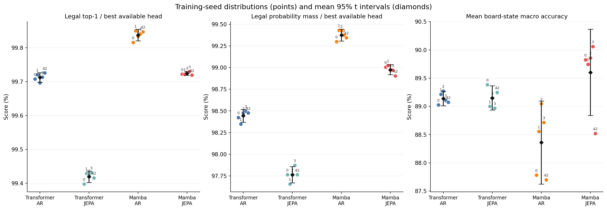
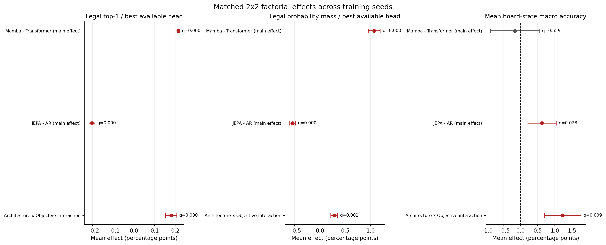
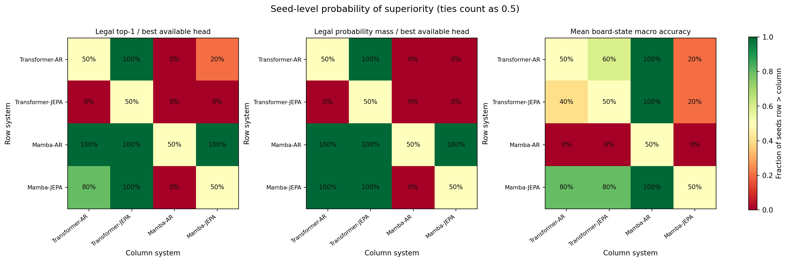

# Multi-seed Common Thesis Evaluation — 8x8

- **Report:** `thesis_seeded_evaluation_v2`
- **Common evaluation protocol:** `unified_eval_v4`
- **Training seeds:** `[0, 1, 2, 3, 42]` (`n=5` per cell)
- **Path-independent split identity:** `7b95882e8f84aa12e078ef4723e59bb64fe29debf4a07f85d4102d991e875833`
- **Data manifest:** `a0994e3e27b032e593894e0fc9f2626094b4b75e91179f4803fd0f23939b1325`
- **Split audit:** corpus manifest plus ordered shard filenames are identical across all runs; raw absolute-path hashes may differ because every seed uses an isolated evaluation view.
- **Generated UTC:** `2026-09-07T16:59:35.902288+00:00`
- **Design:** balanced, matched 2x2 Architecture x Objective; seed is the block.
- **Uncertainty unit:** independent training runs. Per-game bootstrap intervals from the Common Evaluator are not used as substitutes for seed variance.

## Executive view

- **Legal top-1 / best available head:** highest mean is **Mamba-AR** at **99.84%** (SD 0.01%; seed-level 95% t CI 99.82%–99.85%).
- **Legal probability mass / best available head:** highest mean is **Mamba-AR** at **99.37%** (SD 0.05%; seed-level 95% t CI 99.31%–99.44%).
- **Mean board-state macro accuracy:** highest mean is **Mamba-JEPA** at **89.60%** (SD 0.62%; seed-level 95% t CI 88.84%–90.37%).

Primary factorial effects surviving Holm correction:
- Legal top-1 / best available head — **Mamba - Transformer (main effect)**: +0.21 pp, 95% CI [+0.21 pp, +0.22 pp], Holm q=<0.001.
- Legal top-1 / best available head — **JEPA - AR (main effect)**: -0.20 pp, 95% CI [-0.22 pp, -0.19 pp], Holm q=<0.001.
- Legal top-1 / best available head — **Architecture x Objective interaction**: +0.18 pp, 95% CI [+0.15 pp, +0.21 pp], Holm q=<0.001.
- Legal probability mass / best available head — **Mamba - Transformer (main effect)**: +1.07 pp, 95% CI [+0.95 pp, +1.19 pp], Holm q=<0.001.
- Legal probability mass / best available head — **JEPA - AR (main effect)**: -0.54 pp, 95% CI [-0.59 pp, -0.48 pp], Holm q=<0.001.
- Legal probability mass / best available head — **Architecture x Objective interaction**: +0.28 pp, 95% CI [+0.22 pp, +0.35 pp], Holm q=0.001.
- Mean board-state macro accuracy — **JEPA - AR (main effect)**: +0.63 pp, 95% CI [+0.21 pp, +1.04 pp], Holm q=0.028.
- Mean board-state macro accuracy — **Architecture x Objective interaction**: +1.23 pp, 95% CI [+0.70 pp, +1.76 pp], Holm q=0.009.

## What is being tested

The three factorial contrasts are computed independently inside every seed and then tested against zero:

- Architecture main effect: average `(Mamba - Transformer)` across AR and JEPA.
- Objective main effect: average `(JEPA - AR)` across Transformer and Mamba.
- Interaction: `(Mamba-JEPA - Mamba-AR) - (Transformer-JEPA - Transformer-AR)`.

The paired t-test is the parametric inferential test; 95% t intervals and Hedges' `gz` report magnitude and uncertainty. The exact sign-flip p-value is a distribution-light robustness check. With `n` seeds, its smallest possible two-sided value is `2 / 2^n`; therefore it cannot cross 0.05 with four or five seeds. Holm correction is applied across the 3 metrics x 3 effects primary family and separately across the secondary family. Pairwise tests are exploratory and Holm-corrected within each metric.

## Per-seed results

### Legal top-1 / best available head

| System | seed 0 | seed 1 | seed 2 | seed 3 | seed 42 | Mean ± SD | Seed 95% CI |
|---|---:|---:|---:|---:|---:|---:|---:|
| Transformer-AR | 99.71% | 99.72% | 99.70% | 99.71% | 99.73% | 99.71% ± 0.01% | [99.70%, 99.73%] |
| Transformer-JEPA | 99.40% | 99.43% | 99.42% | 99.43% | 99.42% | 99.42% ± 0.01% | [99.40%, 99.44%] |
| Mamba-AR | 99.82% | 99.85% | 99.83% | 99.84% | 99.85% | 99.84% ± 0.01% | [99.82%, 99.85%] |
| Mamba-JEPA | 99.72% | 99.72% | 99.73% | 99.73% | 99.72% | 99.72% ± 0.00% | [99.72%, 99.73%] |

### Legal probability mass / best available head

| System | seed 0 | seed 1 | seed 2 | seed 3 | seed 42 | Mean ± SD | Seed 95% CI |
|---|---:|---:|---:|---:|---:|---:|---:|
| Transformer-AR | 98.42% | 98.35% | 98.47% | 98.50% | 98.48% | 98.44% ± 0.06% | [98.37%, 98.52%] |
| Transformer-JEPA | 97.76% | 97.66% | 97.76% | 97.87% | 97.76% | 97.76% ± 0.08% | [97.67%, 97.86%] |
| Mamba-AR | 99.30% | 99.43% | 99.42% | 99.37% | 99.34% | 99.37% ± 0.05% | [99.31%, 99.44%] |
| Mamba-JEPA | 99.01% | 99.03% | 98.97% | 98.97% | 98.90% | 98.98% ± 0.05% | [98.92%, 99.03%] |

### Mean board-state macro accuracy

| System | seed 0 | seed 1 | seed 2 | seed 3 | seed 42 | Mean ± SD | Seed 95% CI |
|---|---:|---:|---:|---:|---:|---:|---:|
| Transformer-AR | 89.03% | 89.21% | 89.27% | 89.11% | 89.07% | 89.14% ± 0.10% | [89.01%, 89.27%] |
| Transformer-JEPA | 89.38% | 89.00% | 89.15% | 88.97% | 89.25% | 89.15% ± 0.17% | [88.93%, 89.36%] |
| Mamba-AR | 87.78% | 88.55% | 89.05% | 88.72% | 87.70% | 88.36% ± 0.59% | [87.62%, 89.10%] |
| Mamba-JEPA | 89.83% | 89.75% | 89.86% | 90.06% | 88.52% | 89.60% ± 0.62% | [88.84%, 90.37%] |

### Board Linear / absolute

| System | seed 0 | seed 1 | seed 2 | seed 3 | seed 42 | Mean ± SD | Seed 95% CI |
|---|---:|---:|---:|---:|---:|---:|---:|
| Transformer-AR | 68.94% | 68.90% | 68.91% | 68.89% | 68.88% | 68.90% ± 0.02% | [68.88%, 68.93%] |
| Transformer-JEPA | 69.01% | 69.03% | 68.97% | 69.08% | 69.02% | 69.02% ± 0.04% | [68.97%, 69.07%] |
| Mamba-AR | 68.68% | 68.74% | 68.71% | 68.81% | 68.78% | 68.75% ± 0.05% | [68.68%, 68.81%] |
| Mamba-JEPA | 68.93% | 68.96% | 69.09% | 69.06% | 68.92% | 68.99% ± 0.08% | [68.89%, 69.09%] |

### Board Linear / relative

| System | seed 0 | seed 1 | seed 2 | seed 3 | seed 42 | Mean ± SD | Seed 95% CI |
|---|---:|---:|---:|---:|---:|---:|---:|
| Transformer-AR | 96.88% | 96.94% | 97.05% | 96.98% | 96.91% | 96.95% ± 0.07% | [96.87%, 97.03%] |
| Transformer-JEPA | 96.89% | 96.38% | 96.74% | 96.34% | 96.72% | 96.62% ± 0.24% | [96.32%, 96.92%] |
| Mamba-AR | 97.96% | 98.02% | 98.05% | 97.71% | 97.85% | 97.92% ± 0.14% | [97.74%, 98.09%] |
| Mamba-JEPA | 98.21% | 98.22% | 98.19% | 98.21% | 98.04% | 98.17% ± 0.08% | [98.08%, 98.27%] |

### Board MLP / absolute

| System | seed 0 | seed 1 | seed 2 | seed 3 | seed 42 | Mean ± SD | Seed 95% CI |
|---|---:|---:|---:|---:|---:|---:|---:|
| Transformer-AR | 93.74% | 94.43% | 94.36% | 93.85% | 93.88% | 94.06% ± 0.32% | [93.66%, 94.45%] |
| Transformer-JEPA | 95.08% | 94.52% | 94.44% | 94.40% | 94.83% | 94.65% ± 0.29% | [94.29%, 95.02%] |
| Mamba-AR | 86.71% | 89.64% | 91.54% | 90.79% | 86.55% | 89.05% ± 2.31% | [86.18%, 91.91%] |
| Mamba-JEPA | 94.12% | 93.75% | 94.16% | 94.94% | 89.31% | 93.26% ± 2.25% | [90.46%, 96.05%] |

### Board MLP / relative

| System | seed 0 | seed 1 | seed 2 | seed 3 | seed 42 | Mean ± SD | Seed 95% CI |
|---|---:|---:|---:|---:|---:|---:|---:|
| Transformer-AR | 96.55% | 96.58% | 96.77% | 96.70% | 96.61% | 96.64% ± 0.09% | [96.53%, 96.75%] |
| Transformer-JEPA | 96.56% | 96.07% | 96.44% | 96.06% | 96.41% | 96.31% ± 0.23% | [96.02%, 96.59%] |
| Mamba-AR | 97.77% | 97.81% | 97.88% | 97.56% | 97.62% | 97.73% ± 0.14% | [97.56%, 97.90%] |
| Mamba-JEPA | 98.05% | 98.04% | 97.99% | 98.03% | 97.82% | 97.99% ± 0.10% | [97.86%, 98.11%] |

## Matched 2x2 factorial inference

| Metric | Effect | Mean | 95% CI | Hedges gz | p (paired t) | Holm q | Exact sign-flip p | Direction wins |
|---|---|---:|---:|---:|---:|---:|---:|---:|
| Legal top-1 / best available head | Mamba - Transformer (main effect) | +0.21 pp | [+0.21 pp, +0.22 pp] | +45.15 | <0.001 | <0.001 **✓** | 0.062 | 5/0/0 |
| Legal top-1 / best available head | JEPA - AR (main effect) | -0.20 pp | [-0.22 pp, -0.19 pp] | -14.40 | <0.001 | <0.001 **✓** | 0.062 | 0/0/5 |
| Legal top-1 / best available head | Architecture x Objective interaction | +0.18 pp | [+0.15 pp, +0.21 pp] | +6.62 | <0.001 | <0.001 **✓** | 0.062 | 5/0/0 |
| Legal probability mass / best available head | Mamba - Transformer (main effect) | +1.07 pp | [+0.95 pp, +1.19 pp] | +9.08 | <0.001 | <0.001 **✓** | 0.062 | 5/0/0 |
| Legal probability mass / best available head | JEPA - AR (main effect) | -0.54 pp | [-0.59 pp, -0.48 pp] | -9.71 | <0.001 | <0.001 **✓** | 0.062 | 0/0/5 |
| Legal probability mass / best available head | Architecture x Objective interaction | +0.28 pp | [+0.22 pp, +0.35 pp] | +4.27 | <0.001 | 0.001 **✓** | 0.062 | 5/0/0 |
| Mean board-state macro accuracy | Mamba - Transformer (main effect) | -0.16 pp | [-0.87 pp, +0.55 pp] | -0.23 | 0.559 | 0.559 | 0.625 | 3/0/2 |
| Mean board-state macro accuracy | JEPA - AR (main effect) | +0.63 pp | [+0.21 pp, +1.04 pp] | +1.50 | 0.014 | 0.028 **✓** | 0.062 | 5/0/0 |
| Mean board-state macro accuracy | Architecture x Objective interaction | +1.23 pp | [+0.70 pp, +1.76 pp] | +2.30 | 0.003 | 0.009 **✓** | 0.062 | 5/0/0 |
| Board Linear / absolute | Mamba - Transformer (main effect) | -0.09 pp | [-0.16 pp, -0.03 pp] | -1.42 | 0.016 | 0.115 | 0.062 | 0/0/5 |
| Board Linear / absolute | JEPA - AR (main effect) | +0.18 pp | [+0.14 pp, +0.23 pp] | +4.07 | <0.001 | 0.003 **✓** | 0.062 | 5/0/0 |
| Board Linear / absolute | Architecture x Objective interaction | +0.13 pp | [-0.03 pp, +0.28 pp] | +0.82 | 0.085 | 0.254 | 0.125 | 4/0/1 |
| Board Linear / relative | Mamba - Transformer (main effect) | +1.26 pp | [+1.10 pp, +1.42 pp] | +7.88 | <0.001 | <0.001 **✓** | 0.062 | 5/0/0 |
| Board Linear / relative | JEPA - AR (main effect) | -0.04 pp | [-0.18 pp, +0.10 pp] | -0.28 | 0.474 | 0.948 | 0.500 | 2/0/3 |
| Board Linear / relative | Architecture x Objective interaction | +0.59 pp | [+0.14 pp, +1.04 pp] | +1.31 | 0.021 | 0.115 | 0.062 | 5/0/0 |
| Board MLP / absolute | Mamba - Transformer (main effect) | -3.20 pp | [-5.81 pp, -0.59 pp] | -1.22 | 0.027 | 0.115 | 0.062 | 0/0/5 |
| Board MLP / absolute | JEPA - AR (main effect) | +2.40 pp | [+0.96 pp, +3.85 pp] | +1.65 | 0.010 | 0.079 | 0.062 | 5/0/0 |
| Board MLP / absolute | Architecture x Objective interaction | +3.61 pp | [+1.59 pp, +5.63 pp] | +1.77 | 0.008 | 0.070 | 0.062 | 5/0/0 |
| Board MLP / relative | Mamba - Transformer (main effect) | +1.38 pp | [+1.20 pp, +1.56 pp] | +7.58 | <0.001 | <0.001 **✓** | 0.062 | 5/0/0 |
| Board MLP / relative | JEPA - AR (main effect) | -0.04 pp | [-0.18 pp, +0.10 pp] | -0.28 | 0.483 | 0.948 | 0.562 | 1/0/4 |
| Board MLP / relative | Architecture x Objective interaction | +0.59 pp | [+0.17 pp, +1.01 pp] | +1.39 | 0.018 | 0.115 | 0.062 | 5/0/0 |

## Planned paired comparisons

Positive differences favor the first named system/group. Pairwise Holm correction is performed separately for each metric.

| Metric | Contrast | Mean | 95% CI | Hedges gz | p (paired t) | Holm q | Exact p |
|---|---|---:|---:|---:|---:|---:|---:|
| Legal top-1 / best available head | Mamba - Transformer | AR | +0.13 pp | [+0.11 pp, +0.14 pp] | +9.05 | <0.001 | <0.001 **✓** | 0.062 |
| Legal top-1 / best available head | Mamba - Transformer | JEPA | +0.30 pp | [+0.29 pp, +0.32 pp] | +20.39 | <0.001 | <0.001 **✓** | 0.062 |
| Legal top-1 / best available head | JEPA - AR | Transformer | -0.29 pp | [-0.31 pp, -0.27 pp] | -14.15 | <0.001 | <0.001 **✓** | 0.062 |
| Legal top-1 / best available head | JEPA - AR | Mamba | -0.11 pp | [-0.13 pp, -0.10 pp] | -6.17 | <0.001 | <0.001 **✓** | 0.062 |
| Legal top-1 / best available head | Mamba-JEPA - Transformer-AR | +0.01 pp | [-0.01 pp, +0.03 pp] | +0.63 | 0.151 | 0.151 | 0.188 |
| Legal top-1 / best available head | Mamba-AR - Transformer-JEPA | +0.42 pp | [+0.41 pp, +0.43 pp] | +38.49 | <0.001 | <0.001 **✓** | 0.062 |
| Legal probability mass / best available head | Mamba - Transformer | AR | +0.93 pp | [+0.82 pp, +1.04 pp] | +8.18 | <0.001 | <0.001 **✓** | 0.062 |
| Legal probability mass / best available head | Mamba - Transformer | JEPA | +1.21 pp | [+1.08 pp, +1.34 pp] | +9.27 | <0.001 | <0.001 **✓** | 0.062 |
| Legal probability mass / best available head | JEPA - AR | Transformer | -0.68 pp | [-0.73 pp, -0.63 pp] | -14.08 | <0.001 | <0.001 **✓** | 0.062 |
| Legal probability mass / best available head | JEPA - AR | Mamba | -0.40 pp | [-0.48 pp, -0.32 pp] | -5.15 | <0.001 | <0.001 **✓** | 0.062 |
| Legal probability mass / best available head | Mamba-JEPA - Transformer-AR | +0.53 pp | [+0.41 pp, +0.66 pp] | +4.28 | <0.001 | <0.001 **✓** | 0.062 |
| Legal probability mass / best available head | Mamba-AR - Transformer-JEPA | +1.61 pp | [+1.48 pp, +1.75 pp] | +11.81 | <0.001 | <0.001 **✓** | 0.062 |
| Mean board-state macro accuracy | Mamba - Transformer | AR | -0.78 pp | [-1.41 pp, -0.15 pp] | -1.22 | 0.027 | 0.135 | 0.062 |
| Mean board-state macro accuracy | Mamba - Transformer | JEPA | +0.45 pp | [-0.42 pp, +1.32 pp] | +0.52 | 0.221 | 0.466 | 0.250 |
| Mean board-state macro accuracy | JEPA - AR | Transformer | +0.01 pp | [-0.29 pp, +0.31 pp] | +0.04 | 0.926 | 0.926 | 0.875 |
| Mean board-state macro accuracy | JEPA - AR | Mamba | +1.24 pp | [+0.61 pp, +1.87 pp] | +1.97 | 0.005 | 0.032 **✓** | 0.062 |
| Mean board-state macro accuracy | Mamba-JEPA - Transformer-AR | +0.46 pp | [-0.27 pp, +1.20 pp] | +0.63 | 0.155 | 0.466 | 0.188 |
| Mean board-state macro accuracy | Mamba-AR - Transformer-JEPA | -0.79 pp | [-1.69 pp, +0.11 pp] | -0.87 | 0.072 | 0.290 | 0.062 |
| Board Linear / absolute | Mamba - Transformer | AR | -0.16 pp | [-0.24 pp, -0.07 pp] | -1.83 | 0.007 | 0.027 **✓** | 0.062 |
| Board Linear / absolute | Mamba - Transformer | JEPA | -0.03 pp | [-0.15 pp, +0.09 pp] | -0.26 | 0.509 | 0.509 | 0.562 |
| Board Linear / absolute | JEPA - AR | Transformer | +0.12 pp | [+0.05 pp, +0.18 pp] | +1.84 | 0.007 | 0.027 **✓** | 0.062 |
| Board Linear / absolute | JEPA - AR | Mamba | +0.25 pp | [+0.14 pp, +0.35 pp] | +2.23 | 0.003 | 0.017 **✓** | 0.062 |
| Board Linear / absolute | Mamba-JEPA - Transformer-AR | +0.09 pp | [-0.02 pp, +0.19 pp] | +0.84 | 0.078 | 0.157 | 0.125 |
| Board Linear / absolute | Mamba-AR - Transformer-JEPA | -0.28 pp | [-0.32 pp, -0.23 pp] | -6.58 | <0.001 | <0.001 **✓** | 0.062 |
| Board Linear / relative | Mamba - Transformer | AR | +0.96 pp | [+0.78 pp, +1.14 pp] | +5.30 | <0.001 | <0.001 **✓** | 0.062 |
| Board Linear / relative | Mamba - Transformer | JEPA | +1.56 pp | [+1.21 pp, +1.90 pp] | +4.49 | <0.001 | <0.001 **✓** | 0.062 |
| Board Linear / relative | JEPA - AR | Transformer | -0.34 pp | [-0.66 pp, -0.01 pp] | -1.02 | 0.046 | 0.046 **✓** | 0.125 |
| Board Linear / relative | JEPA - AR | Mamba | +0.26 pp | [+0.08 pp, +0.44 pp] | +1.42 | 0.016 | 0.033 **✓** | 0.062 |
| Board Linear / relative | Mamba-JEPA - Transformer-AR | +1.22 pp | [+1.11 pp, +1.33 pp] | +10.88 | <0.001 | <0.001 **✓** | 0.062 |
| Board Linear / relative | Mamba-AR - Transformer-JEPA | +1.30 pp | [+1.02 pp, +1.58 pp] | +4.67 | <0.001 | <0.001 **✓** | 0.062 |
| Board MLP / absolute | Mamba - Transformer | AR | -5.01 pp | [-7.65 pp, -2.37 pp] | -1.88 | 0.006 | 0.037 **✓** | 0.062 |
| Board MLP / absolute | Mamba - Transformer | JEPA | -1.40 pp | [-4.35 pp, +1.56 pp] | -0.47 | 0.260 | 0.519 | 0.188 |
| Board MLP / absolute | JEPA - AR | Transformer | +0.60 pp | [-0.09 pp, +1.28 pp] | +0.87 | 0.072 | 0.216 | 0.062 |
| Board MLP / absolute | JEPA - AR | Mamba | +4.21 pp | [+1.81 pp, +6.61 pp] | +1.74 | 0.008 | 0.041 **✓** | 0.062 |
| Board MLP / absolute | Mamba-JEPA - Transformer-AR | -0.80 pp | [-3.55 pp, +1.95 pp] | -0.29 | 0.464 | 0.519 | 0.688 |
| Board MLP / absolute | Mamba-AR - Transformer-JEPA | -5.60 pp | [-8.81 pp, -2.40 pp] | -1.74 | 0.008 | 0.041 **✓** | 0.062 |
| Board MLP / relative | Mamba - Transformer | AR | +1.09 pp | [+0.89 pp, +1.28 pp] | +5.62 | <0.001 | <0.001 **✓** | 0.062 |
| Board MLP / relative | Mamba - Transformer | JEPA | +1.68 pp | [+1.33 pp, +2.02 pp] | +4.86 | <0.001 | <0.001 **✓** | 0.062 |
| Board MLP / relative | JEPA - AR | Transformer | -0.34 pp | [-0.65 pp, -0.02 pp] | -1.05 | 0.043 | 0.043 **✓** | 0.125 |
| Board MLP / relative | JEPA - AR | Mamba | +0.26 pp | [+0.09 pp, +0.42 pp] | +1.51 | 0.014 | 0.027 **✓** | 0.062 |
| Board MLP / relative | Mamba-JEPA - Transformer-AR | +1.34 pp | [+1.17 pp, +1.51 pp] | +7.90 | <0.001 | <0.001 **✓** | 0.062 |
| Board MLP / relative | Mamba-AR - Transformer-JEPA | +1.42 pp | [+1.14 pp, +1.70 pp] | +5.06 | <0.001 | <0.001 **✓** | 0.062 |

## Visual diagnostics

## Interpretation boundaries

- AR legality uses its native co-trained next-move head; JEPA legality uses the validation-selected frozen Linear/MLP readout. Those are system-level comparisons, not encoder-matched readout comparisons.
- Board-state probes compare frozen encoder representations under common probe budgets and are the cleaner encoder-state comparison.
- All runs share one fixed test split. More test games reduce test-set noise but do not increase the number of independent training replicates.
- A non-significant result does not establish equivalence. Equivalence requires a predeclared smallest effect size of interest and a dedicated equivalence test, preferably with more seeds.
- Statistical significance is reported together with effect size and interval; it is not used as a substitute for scientific importance.

## Artifact index

- Machine-readable report: `/content/drive/MyDrive/Master_Thesis_Artifacts/reports/thesis_eval/multiseed/b8/seeded_evaluation_b8.json`
- Raw per-seed metrics: `/content/drive/MyDrive/Master_Thesis_Artifacts/reports/thesis_eval/multiseed/b8/raw_per_seed_b8.csv`
- Cell summaries: `/content/drive/MyDrive/Master_Thesis_Artifacts/reports/thesis_eval/multiseed/b8/cell_summaries_b8.csv`
- Factorial effects: `/content/drive/MyDrive/Master_Thesis_Artifacts/reports/thesis_eval/multiseed/b8/factorial_effects_b8.csv`
- Pairwise effects: `/content/drive/MyDrive/Master_Thesis_Artifacts/reports/thesis_eval/multiseed/b8/pairwise_effects_b8.csv`
- Replication protocol: `/content/drive/Othercomputers/MyLaptop/Master_Thesis_Code/configs/seeded_replication_protocol.yml`

